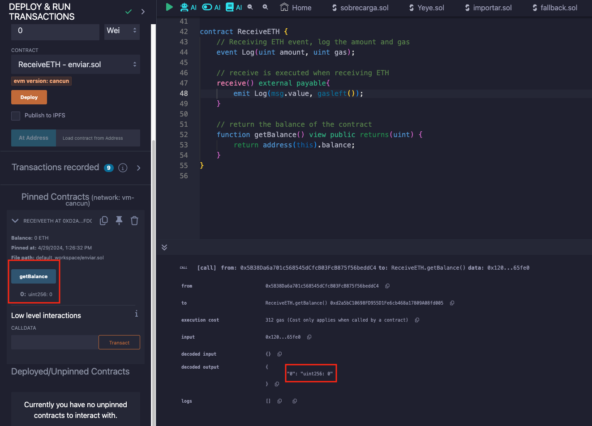
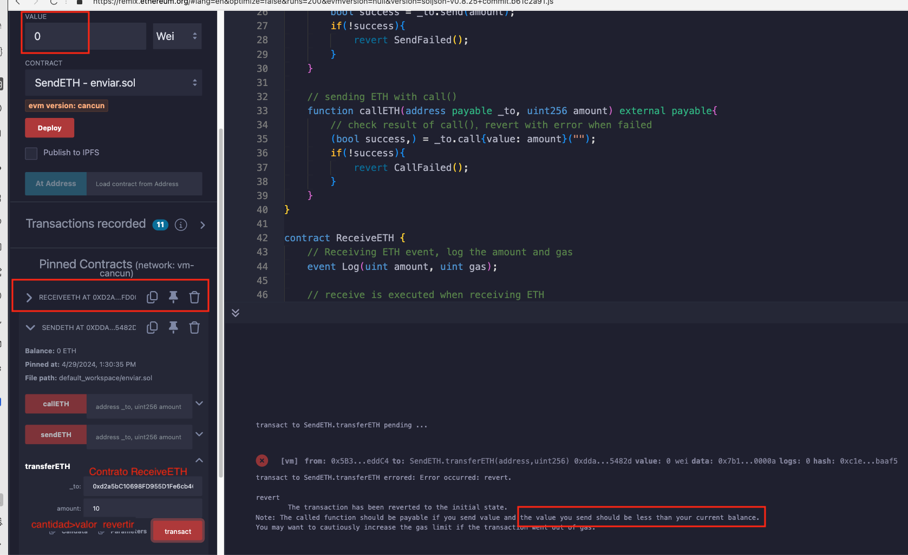
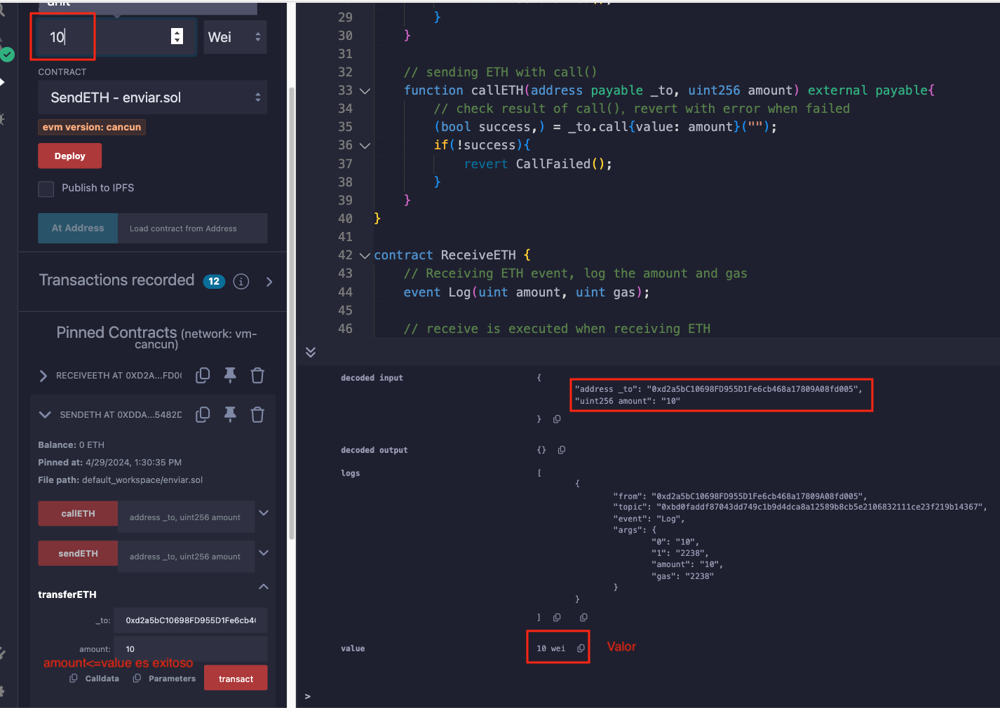
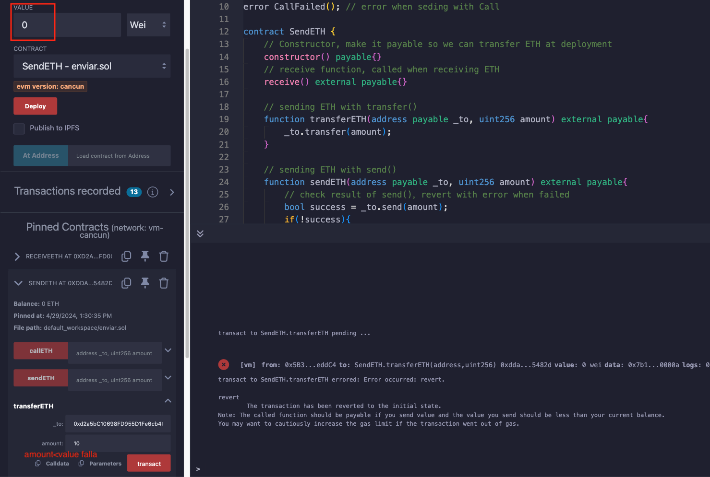
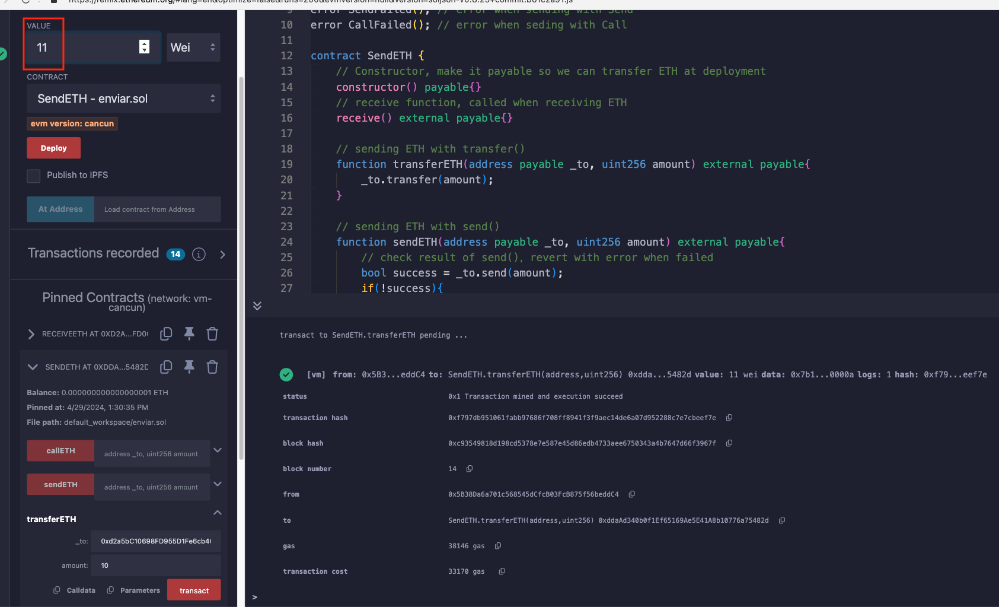
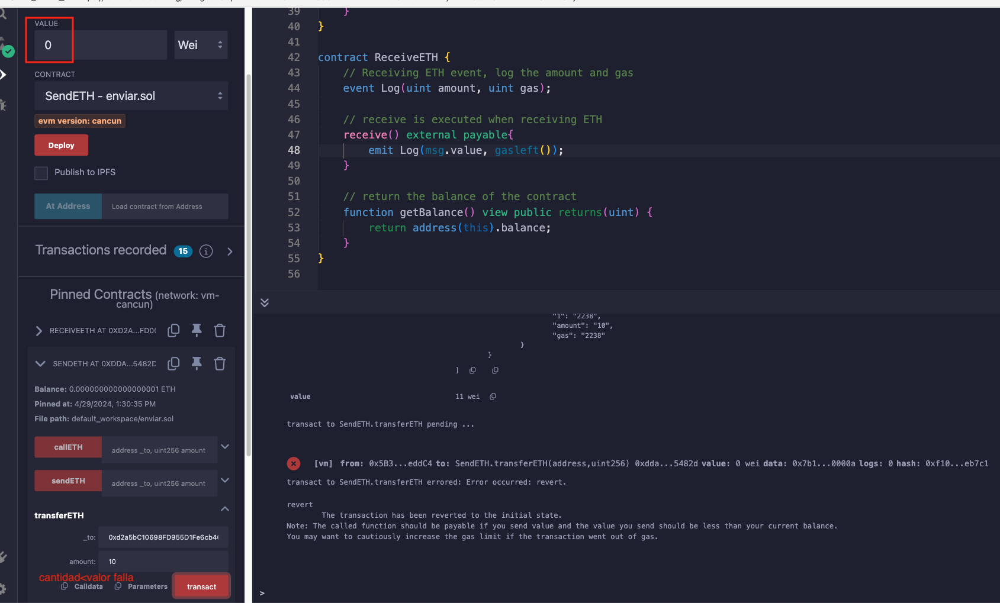

# Tutorial WTF Solidity: 20. Enviar ETH

Recientemente, he estado revisando Solidity y escribiendo tutoriales en "WTF Solidity" para principiantes.

Twitter: [@0xAA_Science](https://twitter.com/0xAA_Science) | [@WTFAcademy_](https://twitter.com/WTFAcademy_)

Comunidad: [Discord](https://discord.gg/5akcruXrsk)｜[Wechat](https://docs.google.com/forms/d/e/1FAIpQLSe4KGT8Sh6sJ7hedQRuIYirOoZK_85miz3dw7vA1-YjodgJ-A/viewform?usp=sf_link)｜[Sitio web wtf.academy](https://wtf.academy)

La traducción al español ha sido realizada por Jonathan Díaz con el objetivo de hacer estos recursos accesibles a la comunidad de habla hispana.

Twitter: [@jonthdiaz](https://twitter.com/jonthdiaz)

Los códigos y tutoriales están como código abierto en GitHub: [github.com/AmazingAng/WTFSolidity](https://github.com/AmazingAng/WTFSolidity)

-----
Hay tres formas de enviar `ETH` en `Solidity`: `transfer()`, `send()` y `call()`, de las cuales `call()` es la recomendada.

## Contrato para recibir ETH
Primero, se despliega un contrato `ReceiveETH` para recibir `ETH`. `ReceiveETH` tiene un evento `Log`, que registra la cantidad de `ETH` recibida y el `gas` restante. 
Junto con otras dos funciones, una es la función `receive()`, que se ejecuta al recibir `ETH`, y emite el evento `Log`; la otra es la función `getBalance()` que se utiliza para obtener el balance del contrato.

```solidity
contract ReceiveETH {
    // Recibir evento ETH, registrar la cantidad y el gas
    event Log(uint amount,  uint gas);
    
    // receive() se ejecuta al recibir ETH
    receive() external payable{
        emit Log(msg.value,  gasleft());
    }
    
    // obtener el balance del contrato
    function getBalance() view public returns(uint) {
        return address(this).balance;
    }
}
```

Después de desplegar `ReceiveETH`, se llama a la función `getBalance()`, se puede ver que el balance es `0 Ether`.


## Contrato para enviar ETH
Se implementaran tres formas de enviar `ETH` al contrato `ReceiveETH`. Primero, se crea el `constructor` del contrato `SendETH` `payable`, y se agrega la función `receive()`,
para poder transferir `ETH` al contrato luego de desplegarlo.

```solidity
contract SendETH {
    // constructor pagable para poder transferir ETH al desplegar
    constructor() payable{}
    // recieve() se ejecuta al recibir ETH
    receive() external payable{}
}
```
### Transferir (transfer)
- Uso: `receiverAddress.transfer(value in Wei)`.
- El límite de `gas` de `transfer()` es `2300`, que es suficiente para hacer la transferencia, pero no si el contrato receptor tiene un `fallback()` o `receive()` que consume `gas`.
- Si `transfer()` falla, la transacción se `revertirá`.

Ejemplo de código: tenga en cuenta que `_to` es la dirección del contrato `ReceiveETH`, y `amount` es el valor que desea enviar.
```solidity
// Enviar ETH con transfer()
function transferETH(address payable _to,  uint256 amount) external payable{
	_to.transfer(amount);
}
```

Después de desplegar el contrato `SendETH`, se puede enviar `ETH` al contrato `ReceiveETH`. Si `amount` es 10, y `value` es 0, `amount`>`value`, la transacción falla y se `revertirá`.



Si `amount` es 10, y `value` es 10, `amount`<=`value`, entonces la transacción se realizará.



En el contrato `ReceiveETH`, cuando se llama a `getBalance()`, se puede ver que el balance del contrato es `10` Wei.


### Enviar (send)

- Uso: `receiverAddress.send(value in Wei)`.
- El límite de `gas` de `send()` es `2300`, es suficiente para hacer la transferencia, pero no si el contrato receptor tiene un `fallback()` o `receive()` que consume `gas`.
- Si `send()` falla, la transacción no se `revertirá`.
- El valor de retorno de `send()` es `bool`, que es el estado de la transacción, se puede elegir actuar en consecuencia.

Código de ejemplo:
```solidity
// Enviar ETH con send()
function sendETH(address payable _to,  uint256 amount) external payable{
    // Verificar el resultado de send(), revertir con error si falla
    bool success = _to.send(amount);
    if(!success){
    	revert SendFailed();
    }
}
```

Ahora se envia `ETH` al contrato `ReceiveETH`, si `amount` es 10, y `value` es 0, `amount`>`value`, la transacción falla, ya que se maneja el valor, la transacción se `revertirá`.



Si `amount` es 10, y `value` es 11, `amount`<=`value`, la transacción se realizará.



### Función `call`

- Uso: `receiverAddress.call{value: value in Wei}("")`.
- No hay límite de `gas` para `call()`, por lo que admite más operaciones en `fallback()` o `receive()` del contrato receptor.
- Si `call()` falla, la transacción no se `revertirá`.
- El valor de retorno de `call()` es `(bool,  data)`, en el que `bool` es el estado de la transacción, se puede elegir actuar en consecuencia.

Código de ejemplo:
```solidity
// Envio de ETH con call()
function callETH(address payable _to,  uint256 amount) external payable{
    // Verificar el resultado de call(), revertir con error si falla
    (bool success, ) = _to.call{value: amount}("");
    if(!success){
    	revert CallFailed();
    }
}
```

Ahora se envia  `ETH` al contrato `ReceiveETH`, si `amount` es 10, y `value` es 0, `amount`>`value`, la transacción falla, ya que se maneja el valor, la transacción se `revertirá`.



Si `amount` es 10, y `value` es 11, `amount`<=`value`, la transacción se realizará.


Con cualquiera de estos tres métodos, se puede enviar `ETH` al contrato `ReceiveETH` con éxito.


## Resumen
En este tutorial, se habla sobre tres formas de enviar `ETH` en `solidity`: `transfer`, `send` y `call`.
- No hay límite de `gas` para `call`, que es la forma más flexible y recomendada;
- El límite de `gas` de `transfer` es `2300`, la transacción se `revertirá` si falla, lo que lo convierte en la segunda opción;
- El límite de `gas` de `send` es `2300`, la transacción no se `revertirá` si falla, lo que lo convierte en la peor opción.
