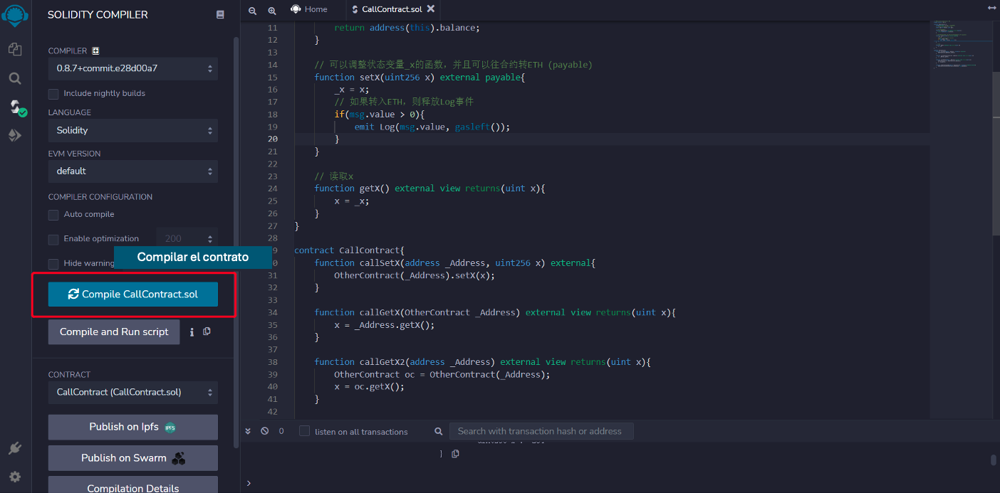
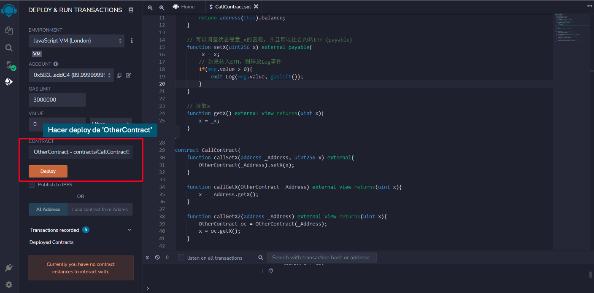
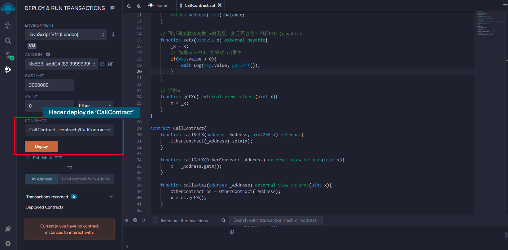
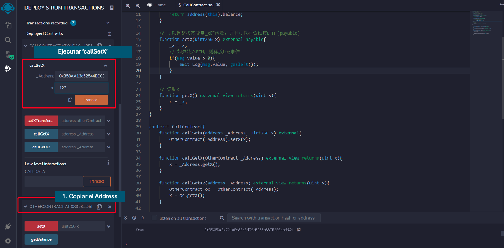
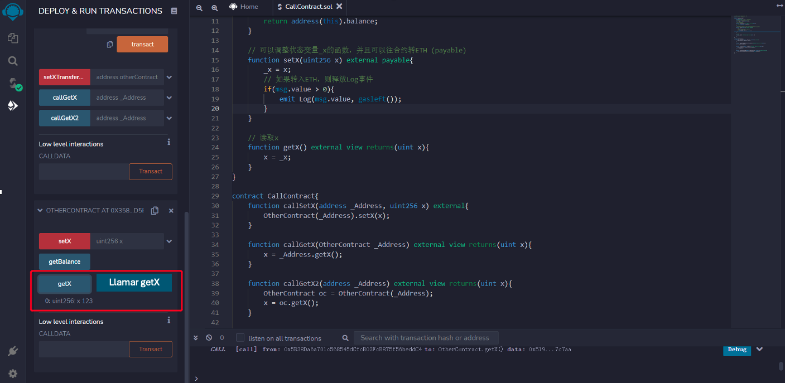
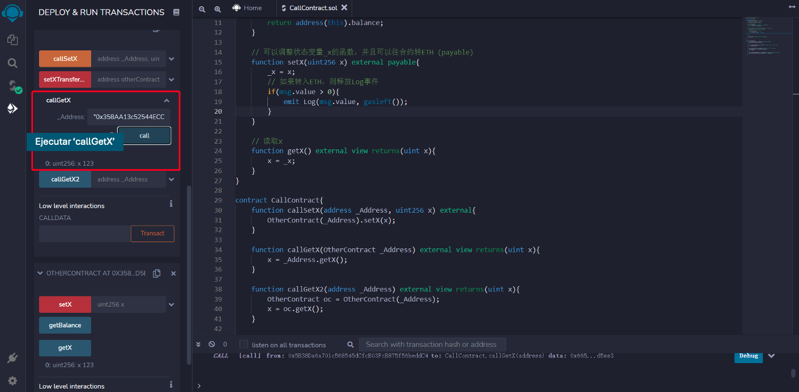
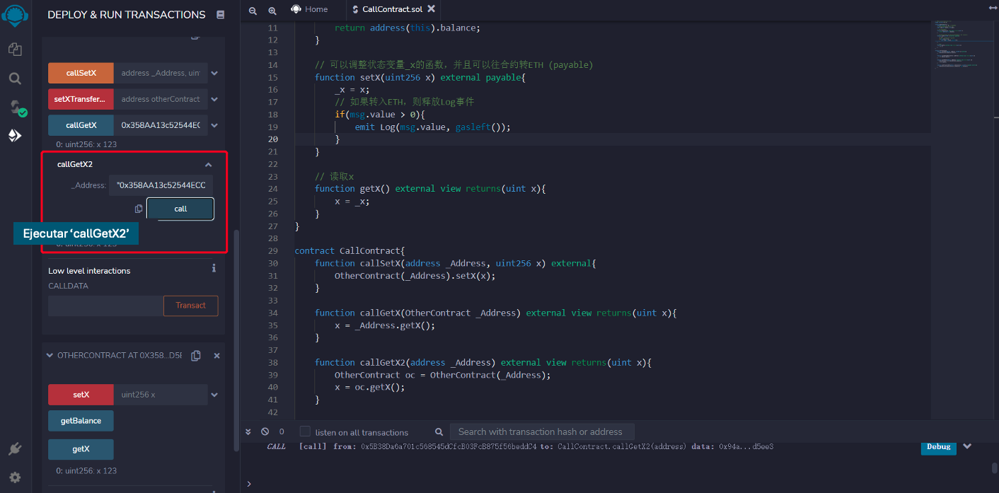
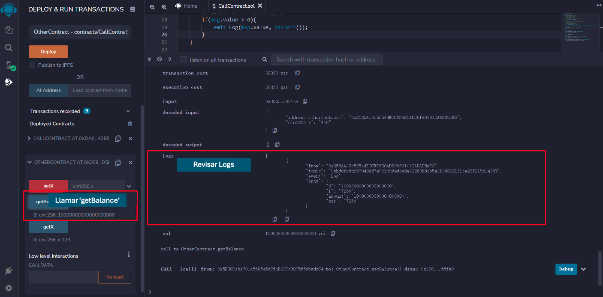

# Tutorial WTF Solidity: 21. Interactuar con Contrato

Recientemente, he estado revisando Solidity, consolidando detalles y escribiendo tutoriales "WTF Solidity" para principiantes.

Twitter: [@0xAA_Science](https://twitter.com/0xAA_Science) | [@WTFAcademy_](https://twitter.com/WTFAcademy_)

Comunidad: [Discord](https://discord.gg/5akcruXrsk)｜[Wechat](https://docs.google.com/forms/d/e/1FAIpQLSe4KGT8Sh6sJ7hedQRuIYirOoZK_85miz3dw7vA1-YjodgJ-A/viewform?usp=sf_link)｜[Website wtf.academy](https://wtf.academy)

La traducción al español ha sido realizada por Sebas G con el objetivo de hacer estos recursos accesibles a la comunidad de habla hispana.

Twitter: [@scguaquetam](https://twitter.com/scguaquetam)

Los códigos y tutoriales están como código abierto en GitHub: [github.com/AmazingAng/WTFSolidity](https://github.com/AmazingAng/WTFSolidity)

-----

## Interactuar con un contrato desplegado

Las interacciones entre contratos no solo hacen que los programas sean reutilizables en la cadena de bloques, sino que también enriquecen el ecosistema de Ethereum. Muchas Dapps de `web3` dependen de otro contrato para funcionar, por ejemplo, `yield farming`. En este tutorial, se hablará sobre cómo interactuar con contratos cuyo código fuente (o ABI) y dirección están disponibles.

## Contrato Objetivo
Se escribe un contrato simple `OtherContract` para trabajar con él.

```solidity
contract OtherContract {
    uint256 private _x = 0; // variable de estado x
    // Evento de recepción de ETH, registrar la cantidad y el gas
    event Log(uint amount, uint gas);
    
    // obtener el saldo del contrato
    function getBalance() view public returns(uint) {
        return address(this).balance;
    }

    // establecer el valor de x, así como recibir ETH (payable)
    function setX(uint256 x) external payable{
        _x = x;
        // emitir evento Log al recibir ETH
        if(msg.value > 0){
            emit Log(msg.value, gasleft());
        }
    }

    // leer el valor de x
    function getX() external view returns(uint x){
        x = _x;
    }
}
```

Este contrato incluye una variable de estado `_x`, un evento `Log` que se emitirá al recibir ETH, y tres funciones:
- `getBalance()`: devuelve el saldo del contrato.
- `setX()`: función `external payable`, establece el valor de _x, además de recibir ETH.
- `getX()`: lee el valor de `_x`

## Interactuar con `OtherContract`
Se puede crear una referencia al contrato con la dirección del contrato y el código fuente (o ABI): `_Name(_Address)`, `_Name` es el nombre del contrato que debe ser consistente con el código fuente del contrato (o ABI), `_Address` es la dirección del contrato. Luego se pueden llamar a las funciones en el contrato de esta manera: `_Name(_Address).f()`, `f()` es la función que se desea llamar.

Se muestran cuatro ejemplos de interacción con contratos, se compilan y despliegan estos dos contratos: `OtherContract` y `CallContract`:







### 1. Pasar la dirección del contrato
Se puede pasar la dirección del contrato como parámetro y crear una referencia de `OtherContract`, luego llamar a la función de `OtherContract`. Por ejemplo, aquí se crea una función `callSetX` que llamará a `setX` de `OtherContract`, se pasa la dirección del contrato desplegado `_Address` y el valor `x` como parámetro:

```solidity
    function callSetX(address _Address, uint256 x) external{
        OtherContract(_Address).setX(x);
    }
```

Copiar la dirección de `OtherContract` y pásarla como primer parámetro de `callSetX`, después de que la transacción haya tenido éxito, se puede llamar a `getX` desde `OtherContract` y el valor de `x` es 123.





### 2. Pasar la variable del contrato
Se puede pasar la referencia del contrato como parámetro, solo cambie el tipo de `address` al nombre del contrato, es decir, `OtherContract`. El siguiente ejemplo muestra cómo llamar a `getX()` desde `OtherContract`.

**Nota:** El parámetro `OtherContract _Address` sigue siendo de tipo `address` detrás de escena. Encontrará que es de tipo `address` en el `ABI` generado y al pasar el parámetro a `callGetX`.

```solidity
    function callGetX(OtherContract _Address) external view returns(uint x){
        x = _Address.getX();
    }
```
Copiar la dirección de `OtherContract`, y pasarla como parámetro de `callGetX`, después de que la transacción haya tenido éxito, se puede obtener el valor de `x`.



### 3. Crear variable de contrato
Se puede crear una variable de contrato y llamar a sus funciones. El siguiente ejemplo muestra cómo crear una referencia de `OtherContract` y guardarla en la variable `oc`:

```solidity
    function callGetX2(address _Address) external view returns(uint x){
        OtherContract oc = OtherContract(_Address);
        x = oc.getX();
    }
```

Copiar la dirección de `OtherContract`, y pasarla como parámetro de `callGetX2`, después de que la transacción haya tenido éxito, se puede obtener el valor de `x`.



### 4. Interactuar con contrato y enviar `ETH`
Si la función de destino es `payable`, entonces también se puede enviar `ETH` a ese contrato: `_Name(_Address).f{value: _Value}()`, `_Name` es el nombre del contrato, `_Address` es la dirección del contrato, `f` es la función a llamar, y `_Value` es el valor de `ETH` a enviar (en `wei`).

`OtherContract` tiene una función `payable` `setX`, en el siguiente ejemplo se enviará `ETH` al contrato llamando a `setX`.

```solidity
    function setXTransferETH(address otherContract, uint256 x) payable external{
        OtherContract(otherContract).setX{value: msg.value}(x);
    }
```

Copiar la dirección de `OtherContract`, y pasarla como parámetro de `setXTransferETH`, además de enviar 10ETH.


Luego de que la transacción sea confirmada, se puede verificar el saldo del contrato leyendo el evento `Log` o llamando a `getBalance()`.



## Resumen
En este tutorial, se habló sobre cómo crear una referencia de contrato con su código fuente (o ABI) y dirección, luego cómo llamar a sus funciones.
