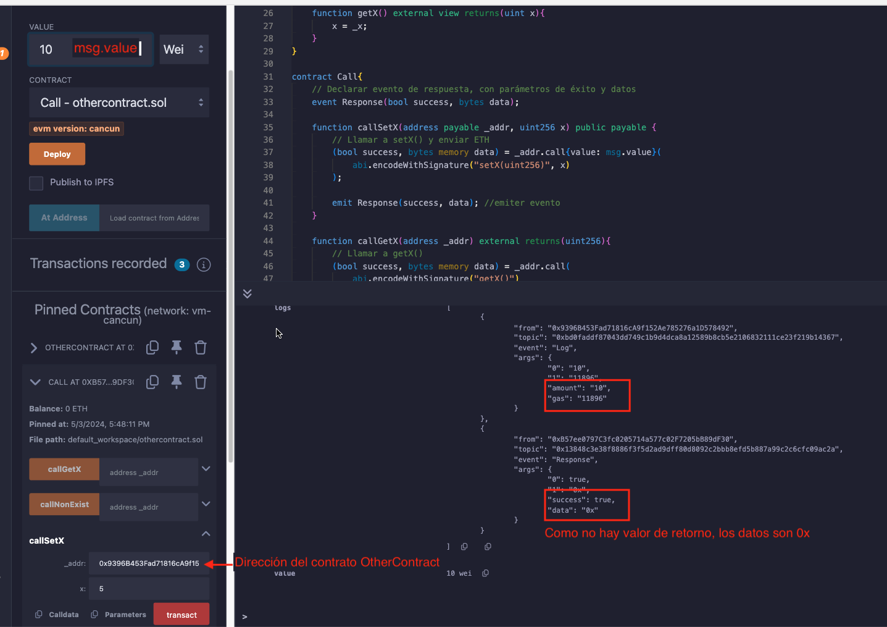
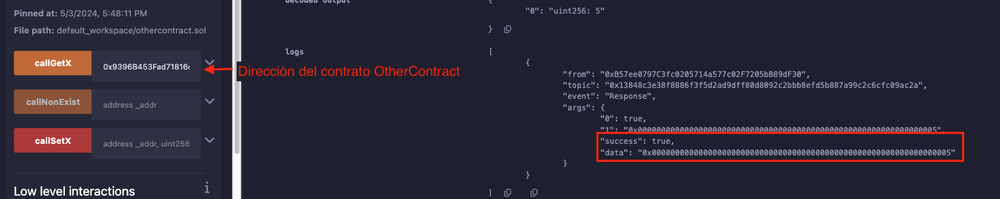
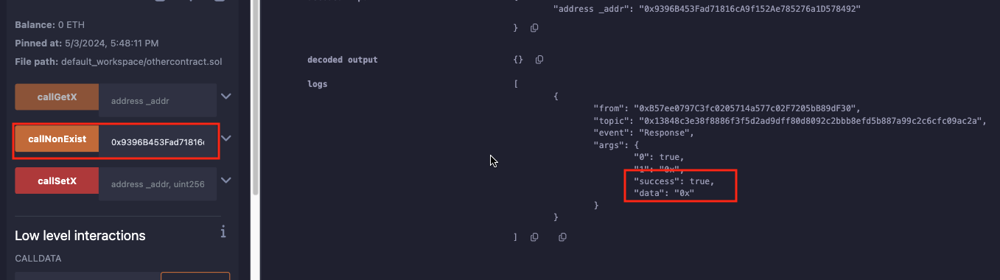

# TUtorial WTF Solidity: 22. Metodo Call

Recientemente, he estado revisando Solidity y escribiendo tutoriales en "WTF Solidity" para principiantes.

Twitter: [@0xAA_Science](https://twitter.com/0xAA_Science) | [@WTFAcademy_](https://twitter.com/WTFAcademy_)

Comunidad: [Discord](https://discord.gg/5akcruXrsk)｜[Wechat](https://docs.google.com/forms/d/e/1FAIpQLSe4KGT8Sh6sJ7hedQRuIYirOoZK_85miz3dw7vA1-YjodgJ-A/viewform?usp=sf_link)｜[Sitio web wtf.academy](https://wtf.academy)

La traducción al español ha sido realizada por Jonathan Díaz con el objetivo de hacer estos recursos accesibles a la comunidad de habla hispana.

Twitter: [@jonthdiaz](https://twitter.com/jonthdiaz)

Los códigos y tutoriales están como código abierto en GitHub: [github.com/AmazingAng/WTFSolidity](https://github.com/AmazingAng/WTFSolidity)

-----

Anteriormente en [20: Enviar ETH](https://github.com/AmazingAng/WTF-Solidity/tree/main/Languages/es/20_EnviarETH_es) se habló sobre cómo enviar `ETH` con `call`, en este tutorial se profundizará sobre ello.

## Metodo Call
`call` es una de las funciones de bajo nivel de `address` que se utiliza para interactuar con otros contratos. Devuelve la condición de éxito y los datos devueltos: `(bool, data)`.

- Oficialmente recomendado por `solidity`, `call` se utiliza para enviar `ETH` al activar funciones `fallback` o `receive`.
- `call` no es recomendado para interactuar con otros contratos, porque cede el control al llamar a un contrato malicioso. La forma recomendada es crear una referencia de contrato y llamar a sus funciones. Ver [21: Interactuar con otro Contrato](https://github.com/AmazingAng/WTF-Solidity/tree/main/Languages/en/21_LamarContrato_es)
- Si el código fuente o `ABI` no está disponible, no podemos crear una variable de contrato; sin embargo, aún podemos interactuar con otros contratos utilizando la función `call`.

### Reglas de uso de `call`
Reglas de uso de `call`:
```
targetContractAddress.call(binary code);
```
el `código binario` se genera con `abi.encodeWithSignature`:
```
abi.encodeWithSignature("function signature", parameters separated by comma)
```
`function signature` es `"functionName(parameters separated by comma)"`. Por ejemplo, `abi.encodeWithSignature("f(uint256,address)", _x, _addr)`.

Además, se puede especificar el valor de `ETH` y `gas` para la transacción al usar `call`:

```
contractAdress.call{value:ETH value, gas:gas limit}(binary code);
```

Parece un poco complicado, se revisa cómo usar `call` en ejemplos.

#### Contrato Objetivo
Se escribe y despliega un contrato objetivo simple `OtherContract`, el código es casi el mismo que en el capítulo 19, solo con una función `fallback` adicional.

```solidity
contract OtherContract {
    uint256 private _x = 0; // state variable x
    // Recibe evento, registra la cantidad y el gas
    event Log(uint amount, uint gas);

    fallback() external payable{}

    // Obtener el saldo del contrato
    function getBalance() view public returns(uint) {
        return address(this).balance;
    }

    // Asigna el valor de _x, así como recibir ETH (pagable)
    function setX(uint256 x) external payable{
        _x = x;
        // Emite el evento Log al recibir ETH
        if(msg.value > 0){
            emit Log(msg.value, gasleft());
        }
    }

    // Lee el valor de x
    function getX() external view returns(uint x){
        x = _x;
    }
}
```

Este contrato incluye una variable de estado `x`, un evento `Log`, y tres funciones:
- `getBalance()`: devuelve el saldo del contrato.
- `setX()`: función `external payable`, se utiliza para establecer el valor de `x` y recibir `ETH`.
- `getX()`: obtener el valor de `x`.

### Interactuar usando `call`
**1. Evento de Respuesta**

Se escribe un contrato `Call` para interactuar con las funciones objetivo en `OtherContract`. Primero, se declara el evento `Response`, que toma `success` y `data` devueltos de `call` como parámetros. Así se pueden verificar los valores de retorno.

```solidity
// Declarar evento Response, con parámetros success y data
event Response(bool success, bytes data);
```

**2. Llamar a la función setX**

Ahora se declara la función `callSetX` para llamar a la función objetivo `setX()` en `OtherContract`. Mientras tanto, se envía `msg.value` de `ETH`, luego se emite el evento `Response`, con `success` y `data` como parámetros:

```solidity
function callSetX(address payable _addr, uint256 x) public payable {
    // Lamar a setX(), y enviar ETH
	(bool success, bytes memory data) = _addr.call{value: msg.value}(
		abi.encodeWithSignature("setX(uint256)", x)
	);

	emit Response(success, data); //emiter evento
}
```

Ahora se llama a `callSetX` para cambiar la variable de estado `_x` a 5, se pasa la dirección de `OtherContract` y `5` como parámetros, ya que `setX()` no tiene un valor de retorno, entonces `data` es `0x` (es decir, Nulo) en el evento `Response`.




**3. Llamar a la función getX**

A continuación, se llama a la función `getX()`, y devolverá el valor de `_x` en `OtherContract`, el tipo es `uint256`. Se puede decodificar el valor de retorno de la función `call`, y obtener su valor.

```solidity
function callGetX(address _addr) external returns(uint256){
    // Lammar getX()
	(bool success, bytes memory data) = _addr.call(
		abi.encodeWithSignature("getX()")
	);

	emit Response(success, data); //emiter evento
	return abi.decode(data, (uint256));
}
```

Desde el registro del evento `Response`, se puede ver que `data` es `0x0000000000000000000000000000000000000000000000000000000000000005`. Después de decodificar con `abi.decode`, el valor de retorno final es `5`.



**4. Llamar a una función no declarada** 

Si se intenta llamar a funciones que no están presentes en `OtherContract` con `call`, se ejecutará la función `fallback`.

```solidity
function callNonExist(address _addr) external{
	// Llamar getX()
	(bool success, bytes memory data) = _addr.call(
		abi.encodeWithSignature("foo(uint256)")
	);

	emit Response(success, data); //emiter Evento
}
```

En este ejemplo, se intento llamar a `foo` que no está declaro con `call`, la transacción seguirá teniendo éxito y devolverá `success`, pero la función ejecutada fue la función `fallback`.



## Resumen

En este tutorial, se habló sobre cómo interactuar con otros contratos utilizando la función de bajo nivel `call`. Por razones de seguridad, `call` no es un método recomendado, pero es útil cuando no se conoce el código fuente y el `ABI` del contrato objetivo.

