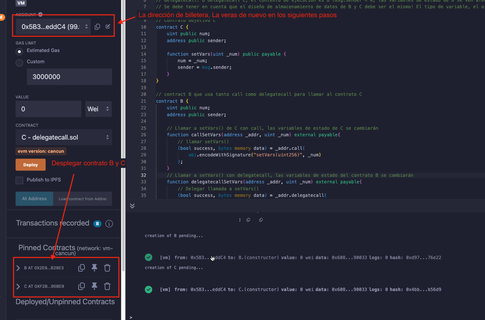
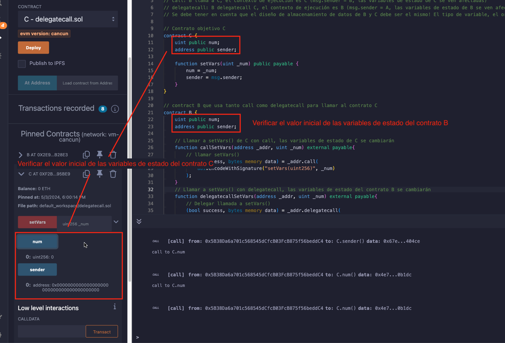
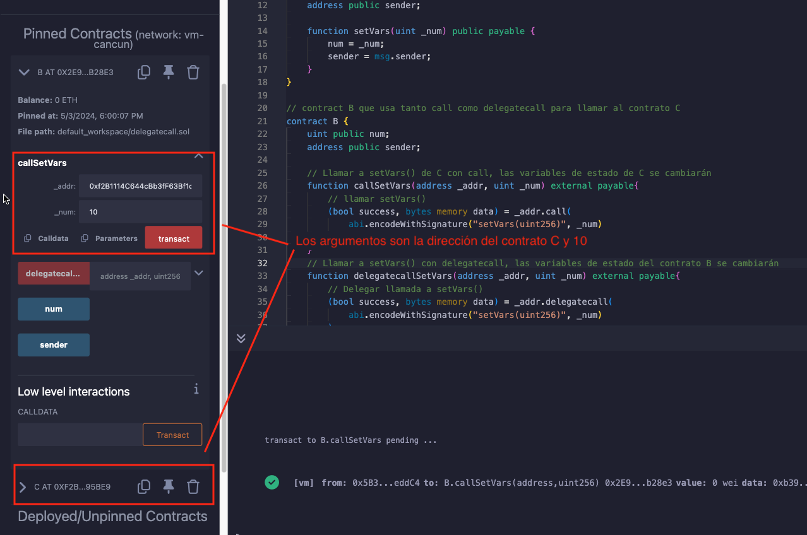
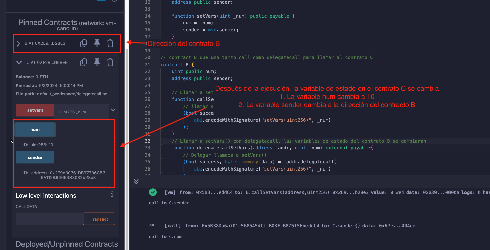
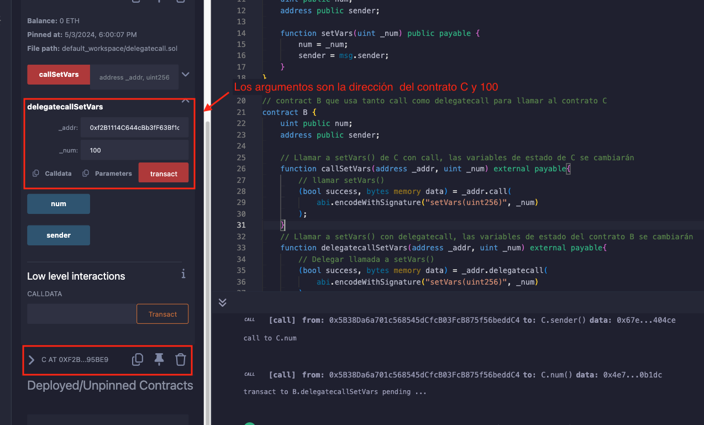
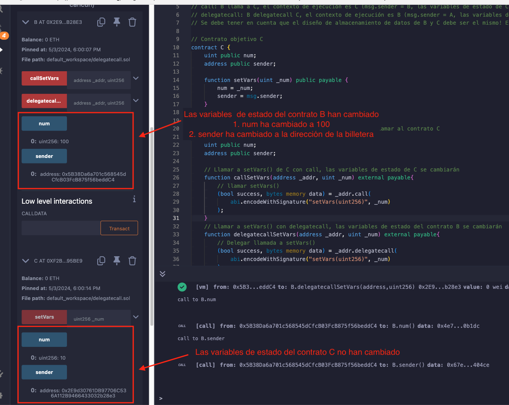

# Tutorial WTF Solidity: 23. Delegar llamada

Recientemente, he estado revisando Solidity y escribiendo tutoriales en "WTF Solidity" para principiantes.

Twitter: [@0xAA_Science](https://twitter.com/0xAA_Science) | [@WTFAcademy_](https://twitter.com/WTFAcademy_)

Comunidad: [Discord](https://discord.gg/5akcruXrsk)｜[Wechat](https://docs.google.com/forms/d/e/1FAIpQLSe4KGT8Sh6sJ7hedQRuIYirOoZK_85miz3dw7vA1-YjodgJ-A/viewform?usp=sf_link)｜[Sitio web wtf.academy](https://wtf.academy)

La traducción al español ha sido realizada por Jonathan Díaz con el objetivo de hacer estos recursos accesibles a la comunidad de habla hispana.

Twitter: [@jonthdiaz](https://twitter.com/jonthdiaz)

Los códigos y tutoriales están como código abierto en GitHub: [github.com/AmazingAng/WTFSolidity](https://github.com/AmazingAng/WTFSolidity)
-----

## Delegar llamada
`delegatecall` es similar a `call`, es una función de bajo nivel en `Solidity`. `delegate` significa delegar/representar, entonces ¿qué delega `delegatecall`?

Cuando el usuario `A` `llama` al contrato `C` a través del contrato `B`, las funciones ejecutadas son del contrato `C`, y el `contexto de ejecución` (el entorno que incluye el estado y las variables) está en el contrato `C`: `msg.sender` es la dirección del contrato `B`, y si las variables de estado se cambian debido a la llamada de función, las variables de estado afectadas están en el contrato `C`.


y cuando el usuario `A` `delegatecall` al contrato `C` a través del contrato `B`, las funciones ejecutadas son del contrato `C`, el `contexto de ejecución` está en el contrato `B`: `msg.sender` es la dirección del usuario `A`, y si las variables de estado se cambian debido a la llamada de función, las variables de estado afectadas están en el contrato `B`.


Se puede entender de la siguiente manera: un `empresario rico` confía sus activos (`variables de estado`) a un `VC` (funciones del contrato objetivo) para su gestión. Las funciones ejecutadas son del `VC`, pero las variables de estado se cambian desde el `empresario`.

La sintaxis de `delegatecall` es similar a `call`:

```
targetContractAddress.delegatecall(binary code);
```

El `código binario` se genera con `abi.encodeWithSignature`:

```solidity
abi.encodeWithSignature("función firma", parámetros separados por coma)
```

`firma de función` es `"nombre de la función (parámetros separados por coma)"`. Por ejemplo, `abi.encodeWithSignature("f(uint256,address)", _x, _addr)`.

Al igual que `call`, `delegatecall` puede especificar el valor de `gas` al llamar a un contrato inteligente, pero no se puede especificar el valor de `ETH`.

> **Atención**: el uso de delegatecall podría conllevar riesgos, asegúrese de que el diseño de almacenamiento de las variables de estado del contrato actual y del contrato objetivo sea el mismo, y de que el contrato objetivo sea seguro, de lo contrario podría causar la pérdida de fondos.

## `delegatecall` ¿para qué se usa?
Actualmente, hay 2 casos de uso principales para `delegatecall`:

1. `Contrato Proxy`: separar la parte de almacenamiento y la parte lógica del contrato inteligente: el `contrato proxy` se utiliza para almacenar todas las variables relacionadas, y también almacenar la dirección del contrato lógico; todas las funciones se almacenan en el `contrato lógico`, y se llaman mediante `delegatecall`. Al actualizar, solo necesita redirigir el `contrato proxy` a un nuevo `contrato lógico`.
2. EIP-2535 Diamonds: Diamond es un estándar que admite la construcción de sistemas de contratos inteligentes modulares que pueden escalar en producción. Diamond es un contrato proxy con múltiples contratos de implementación. Para obtener más información, consulte [Introducción a los Diamantes EIP-2535](https://eip2535diamonds.substack.com/p/introduction-to-the-diamond-standard).

## `delegatecall` ejemplo
Llamada mecanismo: usted (`A`) llama al contrato `C` a través del contrato `B`.

### Contrato Objetivo C
Primero, se crea un contrato objetivo `C` con 2 variables `públicas`: `num` y `sender` que son `uint256` y `address` respectivamente; y una función que establece `num` basado en `_num`, y establece `sender` como `msg.sender`.

```solidity
// Contrato objetivo C
contract C {
    uint public num;
    address public sender;

    function setVars(uint _num) public payable {
        num = _num;
        sender = msg.sender;
    }
}
```
### Llamada al contrato de inicialización B
Primero, el contrato `B` debe tener el mismo diseño de variables de estado que el contrato objetivo `C`, 2 variables y el orden es `num` y `sender`.

```solidity
contract B {
    uint public num;
    address public sender;
```

El siguiente paso es usar `call` y `delegatecall` respectivamente para llamar a `setVars` desde el contrato `C`, para que se pueda entender mejor la diferencia.

La función `callSetVars` llama a `setVars` a través de `call`, la función `delegatecallSetVars` llama a `setVars` a través de `delegatecall`.

```solidity
    // Llamando a setVars() del contrato C con call, las variables de estado del contrato C cambiarán
    function callSetVars(address _addr, uint _num) external payable{
        // llamar a setVars()
        (bool success, bytes memory data) = _addr.call(
            abi.encodeWithSignature("setVars(uint256)", _num)
        );
    }
```

Mientras que la función `delegatecallSetVars` llama a `setVars` a través de `delegatecall`. Similar a `callSetVars`, `delegatecallSetVars` tiene 2 parámetros, `_addr` y `_num`, que corresponden a la dirección del contrato `C` y el parámetro de `setVars`.

```solidity
    // Llamando a setVars() del contrato C con delegatecall, las variables de estado del contrato B cambiarán
    function delegatecallSetVars(address _addr, uint _num) external payable{
        // delegatecall setVars()
        (bool success, bytes memory data) = _addr.delegatecall(
            abi.encodeWithSignature("setVars(uint256)", _num)
        );
    }
}
```

### Verificar en Remix
1. Primero se despliega el contrato B y el contrato C



2. Después del despliegue, se verifica el valor inicial de las variables de estado en el contrato `C`, también el valor inicial de las variables de estado en el contrato `B`.



3. A continuación, se llama a `callSetVars` en el contrato `B` con los argumentos de la dirección del contrato `C` y `10`



4. Después de la ejecución, las variables de estado en el contrato `C` cambian: `num` cambia a 10, `sender` cambia a la dirección del contrato B



5. A continuación, se llama a `delegatecallSetVars` en el contrato `B` con los argumentos de la dirección del contrato `C` y `100`



6. Debido a `delegatecall`, el contexto de ejecución es el contrato `B`. Después de la ejecución, las variables de estado del contrato `B` cambian: `num` cambia a 100, `sender` cambia a la dirección de su billetera. Las variables de estado del contrato `C` no cambian.



## Resumen
En esta lección, se presento otra función de bajo nivel en `Solidity`, `delegatecall`. Al igual que `call`, `delegatecall` se puede utilizar para llamar a otro contrato; la diferencia entre `delegatecall` y `call` es el `contexto de ejecución`, el `contexto de ejecución` es `C` si `B` `call` `C`; pero el `contexto de ejecución` es `B` si `B` `delegatecall` `C`. Los principales casos de uso de `delegatecall` son `contrato proxy` y `Diamantes EIP-2535`.
