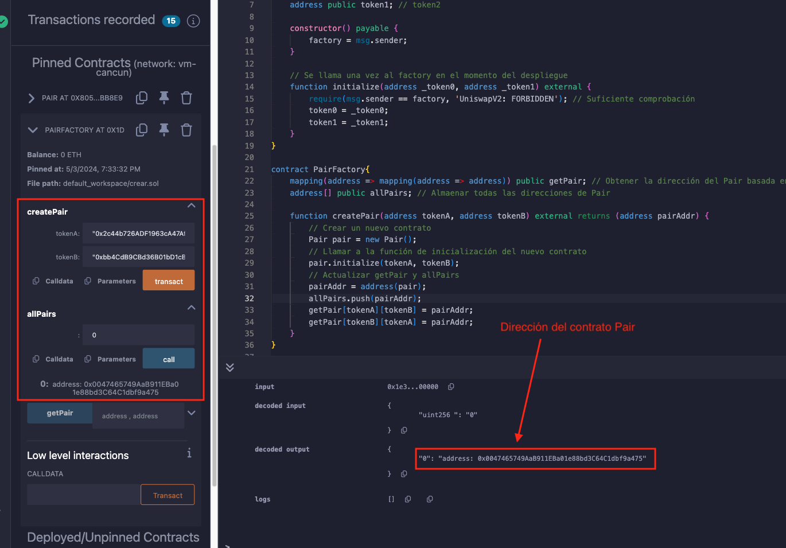

# Tutorial WTF Solidity: 24. Crear un nuevo contrato inteligente en un contrato inteligente existente

Recientemente, he estado revisando Solidity y escribiendo tutoriales en "WTF Solidity" para principiantes.

Twitter: [@0xAA_Science](https://twitter.com/0xAA_Science) | [@WTFAcademy_](https://twitter.com/WTFAcademy_)

Comunidad: [Discord](https://discord.gg/5akcruXrsk)｜[Wechat](https://docs.google.com/forms/d/e/1FAIpQLSe4KGT8Sh6sJ7hedQRuIYirOoZK_85miz3dw7vA1-YjodgJ-A/viewform?usp=sf_link)｜[Sitio web wtf.academy](https://wtf.academy)

La traducción al español ha sido realizada por Jonathan Díaz con el objetivo de hacer estos recursos accesibles a la comunidad de habla hispana.

Twitter: [@jonthdiaz](https://twitter.com/jonthdiaz)

Los códigos y tutoriales están como código abierto en GitHub: [github.com/AmazingAng/WTFSolidity](https://github.com/AmazingAng/WTFSolidity)
-----

En Ethereum, el usuario (cuenta externa, `EOA`) puede crear contratos inteligentes, y un contrato inteligente también puede crear nuevos contratos inteligentes. El intercambio descentralizado `Uniswap` crea un número infinito de contratos `Pair` con su contrato `Factory`. En esta lección se explica cómo crear nuevos contratos inteligentes en un contrato inteligente existente utilizando una versión simplificada de `Uniswap`.

## `create` y `create2`
Hay dos formas de crear un nuevo contrato en un contrato existente, `create` y `create2`, esta lección presentará `create`, la siguiente lección presentará `create2`.

El uso de `create` es muy simple, creando un contrato con la palabra clave `new`, y pasando los argumentos requeridos por el constructor del nuevo contrato inteligente:

```solidity
Contract x = new Contract{value: _value}(params)
```

`Contract` es el nombre del contrato inteligente a crear, `x` es el objeto del contrato inteligente (dirección), y si el constructor es `payable`, el creador puede transferir `_value` `ETH` al nuevo contrato inteligente, `params` son los parámetros del constructor del nuevo contrato inteligente.

## Uniswap simplificado
El contrato inteligente principal de `Uniswap V2` incluye 2 contratos inteligentes:

1. UniswapV2Pair: Contrato Pair, utilizado para gestionar las direcciones de los tokens, la liquidez y el intercambio.
2. UniswapV2Factory: Contrato Factory, utilizado para crear nuevos contratos Pair, y gestionar las direcciones de Pair.

A continuación, se implementará un `Uniswap` simplificado con `create`, el contrato `Pair` se utiliza para gestionar las direcciones de los tokens, el contrato `PairFactory` se utiliza para crear nuevos contratos Pair y gestionar las direcciones de Pair.

### Contrato `Pair`

```solidity
contract Pair{
    address public factory; // Dirección del contrato Factory 
    address public token0; // token1
    address public token1; // token2

    constructor() payable {
        factory = msg.sender;
    }

    // Se llama una vez al factory en el momento del despliegue
    function initialize(address _token0, address _token1) external {
        require(msg.sender == factory, 'UniswapV2: FORBIDDEN'); // Suficiente comprobación
        token0 = _token0;
        token1 = _token1;
    }
}
```
`Pair` es un contrato muy simple, que incluye 3 variables de estado `factory`, `token0` y `token1`.

El `constructor` asigna la dirección del contrato Factory a `factory` en el momento del despliegue. La función `initialize` se llamará una vez por el contrato `Factory` cuando se cree el contrato `Pair`, y actualizará `token0` y `token1` con las direcciones de los 2 tokens en el par de tokens.

> **Pregunta**: ¿Por qué `Uniswap` no establece las direcciones de `token0` y `token
>
> **Respuesta**: Porque `Uniswap` utiliza `create2` para crear nuevos contratos inteligentes, no se permiten parámetros en el constructor al usar `create2`. Al usar `create`, se permite tener parámetros en el contrato `Pair`, y se pueden establecer las direcciones de `token0` y `token1` en el `constructor`.

### `PairFactory`
```solidity
contract PairFactory{
    mapping(address => mapping(address => address)) public getPair; // Obtener la dirección del Pair basada en las direcciones de 2 tokens
    address[] public allPairs; // Almaenar todas las direcciones de Pair

    function createPair(address tokenA, address tokenB) external returns (address pairAddr) {
        // Crear un nuevo contrato
        Pair pair = new Pair(); 
        // Llamar a la función de inicialización del nuevo contrato
        pair.initialize(tokenA, tokenB);
        // Actualizar getPair y allPairs
        pairAddr = address(pair);
        allPairs.push(pairAddr);
        getPair[tokenA][tokenB] = pairAddr;
        getPair[tokenB][tokenA] = pairAddr;
    }
}
```
El contrato `PairFactory` tiene 2 variables de estado, `getPair` es un mapa de 2 direcciones de tokens y la dirección del contrato Pair, y se utiliza para encontrar la dirección del contrato `Pair` basada en 2 direcciones de tokens. `allPairs` es una matriz de direcciones de contratos `Pair`, que se utiliza para almacenar todas las direcciones de contratos `Pair`.

Solo hay una función en `PairFactory`, `createPair`, que crea un nuevo contrato `Pair` basado en 2 direcciones de tokens `tokenA` y `tokenB`.

```solidity
Pair pair = new Pair(); 
```
El código anterior se utiliza para crear un nueevo contrato, muy sencillo. Puede desplegar el contrato `PairFactory` primero, luego llamar a `createPair` con las siguientes 2 direcciones como argumentos, y averiguar cuál es la dirección del nuevo contrato `Pair`.

```solidity
WBNB address: 0x2c44b726ADF1963cA47Af88B284C06f30380fC78
PEOPLE address on BSC: 0xbb4CdB9CBd36B01bD1cBaEBF2De08d9173bc095c
```

### Verificar en Remix

1. Llamar a `createPair` con los argumentos de las direcciones de `WBNB` y `PEOPLE`, se obtendra la dirección del contrato `Pair`: 0x5C9eb5D6a6C2c1B3EFc52255C0b356f116f6f66D



2. Verificar las variables de estado del contrato `Pair`


3. Usar `debug` para verificar el `opcode` de `create`


## Resumen
En esta lección, se presento cómo crear un nuevo contrato inteligente en un contrato inteligente existente con `create`. En la próxima lección, se presentara cómo implementar un `Uniswap` simplificado con `create2`.
