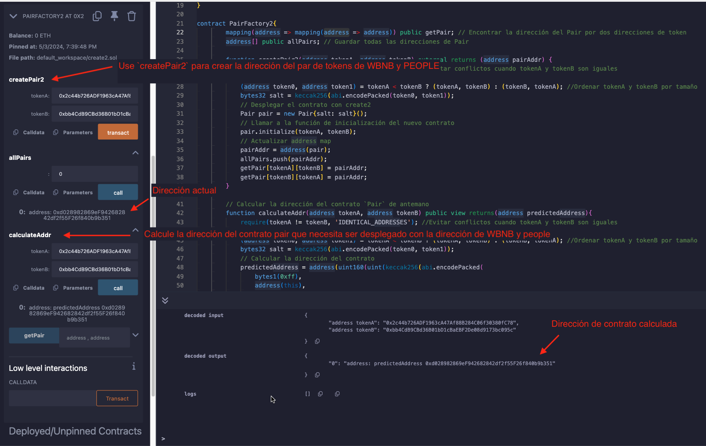

# Tutorial WTF Solidity: 25. Crear contrato inteligente con CREATE2

Recientemente, he estado revisando Solidity y escribiendo tutoriales en "WTF Solidity" para principiantes.

Twitter: [@0xAA_Science](https://twitter.com/0xAA_Science) | [@WTFAcademy_](https://twitter.com/WTFAcademy_)

Comunidad: [Discord](https://discord.gg/5akcruXrsk)｜[Wechat](https://docs.google.com/forms/d/e/1FAIpQLSe4KGT8Sh6sJ7hedQRuIYirOoZK_85miz3dw7vA1-YjodgJ-A/viewform?usp=sf_link)｜[Sitio web wtf.academy](https://wtf.academy)

La traducción al español ha sido realizada por Jonathan Díaz con el objetivo de hacer estos recursos accesibles a la comunidad de habla hispana.

Twitter: [@jonthdiaz](https://twitter.com/jonthdiaz)

Los códigos y tutoriales están como código abierto en GitHub: [github.com/AmazingAng/WTFSolidity](https://github.com/AmazingAng/WTFSolidity)
-----

`CREATE2` es un opcode que nos ayuda a predecir la dirección del contrato inteligente antes de que se despliegue en la red de Ethereum, y `Uniswap` creó el contrato `Pair` con `CREATE2` en lugar de `CREATE`.

En este capítulo, se presentara el uso de `CREATE2`.

## Como `CREATE` calcula la dirección
Los contratos inteligentes pueden ser creados por otros contratos y cuentas regulares utilizando el opcode `CREATE`.

En ambos casos, la dirección del nuevo contrato se calcula de la misma manera: el hash de la dirección del creador (generalmente la dirección de la billetera que desplegara o la dirección del contrato) y el nonce (el número total de transacciones enviadas desde esta dirección o, para la cuenta de contrato, el número total de contratos creados. Cada vez que se crea un contrato, el nonce se incrementara en uno).

```
new address = hash(dirección del creador, nonce)
```
Contrato creador de la dirección no cambiará, pero el nonce puede cambiar con el tiempo, por lo que es difícil predecir la dirección del contrato creado con `CREATE`.

## Como `CREATE2` calcula la dirección
El propósito de `CREATE2` es hacer que las direcciones de los contratos sean independientes de eventos futuros. No importa lo que suceda en la cadena de bloques en el futuro, puedes desplegar el contrato en una dirección precalculada.

La dirección del contrato creado con `CREATE2` se determina por cuatro partes:
- `0xFF`: una constante para evitar conflictos con `CREATE
- dirección del creador
- salt: un valor dado por el creador
- El bytecode del contrato a desplegar

```
new address = hash("0xFF", dirección del creador, salt, bytecode)
```
`CREATE2` asegura que si el creador despliega un determinado bytecode de contrato con `CREATE2` y se le da `salt`, se almacenará en `new address`.

## Como usar `CREATE2`
`CREATE2` es utilizado de la misma manera que `CREATE`. También crea un contrato nuevo y pasa los parámetros necesarios para el constructor del nuevo contrato, excepto con un parámetro adicional `salt`.
```
Contract x = new Contract{salt: _salt, value: _value}(params)
```
`Contract` es el nombre del contrato a crear, `x` es el objeto del contrato (dirección), y `_salt` es el salt especificado; si el constructor es `payable`, se puede transferir una cantidad de `ETH` (`_value`) al contrato al desplegar, y `params` es el parámetro del constructor del nuevo contrato.

## Uniswap2 Minimalista

Similar al [capítulo anterior](https://github.com/AmazingAng/WTF-Solidity/tree/main/Languages/es/24_Crear_es), se usa `CREATE2` para implementar un `Uniswap` minimalista.

### `Pair`
```solidity
contract Pair{
    address public factory; // Dirección del contrato Factory
    address public token0; // token1
    address public token1; // token2

    constructor() payable {
        factory = msg.sender;
    }

    // Llamar una vez por el factory en el momento del despliegue
    function initialize(address _token0, address _token1) external {
        require(msg.sender == factory, 'UniswapV2: FORBIDDEN'); // Suficiente comprobación
        token0 = _token0;
        token1 = _token1;
    }
}
```
`Pair` es un contrato simple que incluye 3 variables de estado `factory`, `token0` y `token1`.

El constructor asigna la dirección del contrato Factory a `factory` en el momento del despliegue. La función `initialize` se llama una vez por el contrato Factory cuando se crea el contrato Pair, y actualiza `token0` y `token1` con las direcciones de los 2 tokens en el par de tokens.

### `PairFactory2`
```solidity
contract PairFactory2{
        mapping(address => mapping(address => address)) public getPair; // Encontrar la dirección del Pair por dos direcciones de token
        address[] public allPairs; // Save all Pair addresses

        function createPair2(address tokenA, address tokenB) external returns (address pairAddr) {
            require(tokenA != tokenB, 'IDENTICAL_ADDRESSES'); //Evitar conflictos cuando tokenA y tokenB son iguales
            // Calcular salt con las direcciones de tokenA y tokenB
            (address token0, address token1) = tokenA < tokenB ? (tokenA, tokenB) : (tokenB, tokenA); //Ordenar tokenA y tokenB por tamaño
            bytes32 salt = keccak256(abi.encodePacked(token0, token1));
            // Desplegar un nuevo contrato con create2
            Pair pair = new Pair{salt: salt}(); 
            // Llamar a la función de inicialización del nuevo contrato
            pair.initialize(tokenA, tokenB);
            // Actualizar el mapa de direcciones
            pairAddr = address(pair);
            allPairs.push(pairAddr);
            getPair[tokenA][tokenB] = pairAddr;
            getPair[tokenB][tokenA] = pairAddr;
        }
```
El contrato `PairFactory2` tiene dos variables de estado. `getPair` es un mapa de dos direcciones de token y la dirección del contrato Pair. Es conveniente encontrar la dirección del contrato Pair según los tokens. `allPairs` es una matriz de direcciones de contrato Pair, que almacena todas las direcciones de contrato Pair.

`PairFactory2` tiene solo una función `createPair2`, que utiliza `CREATE2` para crear un nuevo contrato `Pair` basado en las dos direcciones de token `tokenA` y `tokenB` ingresadas. Dentro
```solidity
    Pair pair = new Pair{salt: salt}(); 
```
Es el código anterior el que utiliza `CREATE2` para crear un contrato, que es muy simple, y `salt` es el hash de `token1 y `token2`.
```solidity
    bytes32 salt = keccak256(abi.encodePacked(token0, token1));
```

### Calcular la dirección del contrato `Pair` de antemano
```solidity
        // Calcular la dirección del contrato Pair de antemano
        function calculateAddr(address tokenA, address tokenB) public view returns(address predictedAddress){
            require(tokenA != tokenB, 'IDENTICAL_ADDRESSES'); //Evitar conflictos cuando tokenA y tokenB son iguales
            // Calcular salt con las direcciones de tokenA y tokenB
            (address token0, address token1) = tokenA < tokenB ? (tokenA, tokenB) : (tokenB, tokenA); //Ordenar tokenA y tokenB por tamaño
            bytes32 salt = keccak256(abi.encodePacked(token0, token1));
            // Calcular la dirección del contrato
            predictedAddress = address(uint160(uint(keccak256(abi.encodePacked(
                bytes1(0xff),
                address(this),
                salt,
                keccak256(type(Pair).creationCode)
            )))));
        }
```
`calculateAddr` es una función que precalcula la dirección del contrato `Pair` que `tokenA` y `tokenB` generarán. Con ella, se puede verificar si la dirección que se cálculo anteriormente es la misma que la dirección real.

Para verificar si la dirección del par de tokens creada coincide con la dirección precalculada, se puede desplegar el contrato `PairFactory2` y llamar a `createPair2` con las siguientes dos direcciones como parámetros. Luego, observar la dirección resultante del contrato de par de tokens creado.
```solidity
WBNB address: 0x2c44b726ADF1963cA47Af88B284C06f30380fC78
PEOPLE address on BSC: 0xbb4CdB9CBd36B01bD1cBaEBF2De08d9173bc095c
```

#### Si hay parámetros en el constructor de despliegue

Por ejemplo cuando se despliega el contrato `create2`:
> Pair pair = new Pair{salt: salt}(address(this)); 

Cuando se calcula, se necesita empaquetar los parámetros y el bytecode juntos:

> ~~keccak256(type(Pair).creationCode)~~
> => keccak256(abi.encodePacked(type(Pair).creationCode, abi.encode(address(this))))
```solidity
predictedAddress = address(uint160(uint(keccak256(abi.encodePacked(
                bytes1(0xff),
                address(this),
                salt,
                keccak256(abi.encodePacked(type(Pair).creationCode, abi.encode(address(this))))
            )))));
```

### Verificar en remix

1. Primero, la dirección hash de `WBNB` y `PEOPLE` se utiliza como `salt` para calcular la dirección del contrato `Pair`
2. Llamar a `PairFactory2.createPair2` y pasar la dirección de `WBNB` y `PEOPLE` como parámetros para obtener la dirección del contrato `pair` creado.
3. Comparar la dirección del contrato.



## Escenario de aplicación de `CREATE2`

1. Las reservas de intercambio de direcciones para que los nuevos usuarios creen contratos de billetera.
2. `Factory` contrato impulsado por `CREATE2`. La creación de pares de intercambio en `UniswapV2` se realiza llamando a `create2` en `Factory`. La ventaja es que puede obtener una cierta dirección de `pair` para que el Router pueda calcular la dirección de `pair` a través de `(tokenA, tokenB)`, y ya no necesita realizar una llamada cruzada a `Factory.getPair(tokenA, tokenB)`.

## Resumen
En este capítulo, se presentó el principio del opcode `CREATE2` y cómo usarlo. Además, se utilizó para crear una versión minimalista de `Uniswap` y calcular la dirección del contrato de par de tokens de antemano. `CREATE2` nos ayuda a determinar la dirección del contrato antes de desplegar el contrato, lo que es la base para algunos proyectos de `layer2`.
