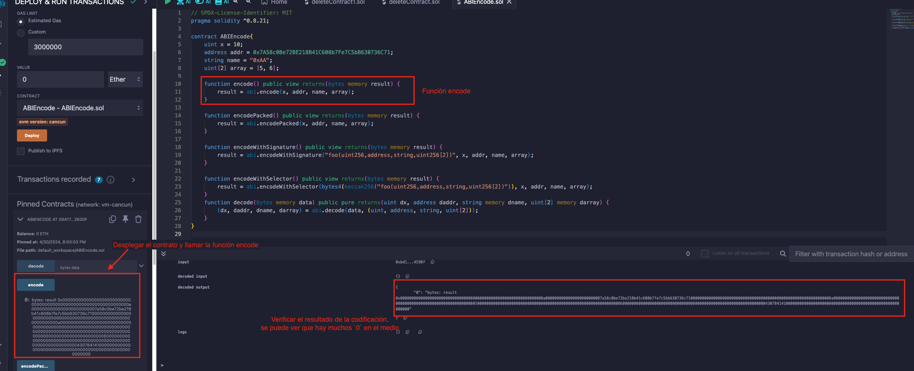
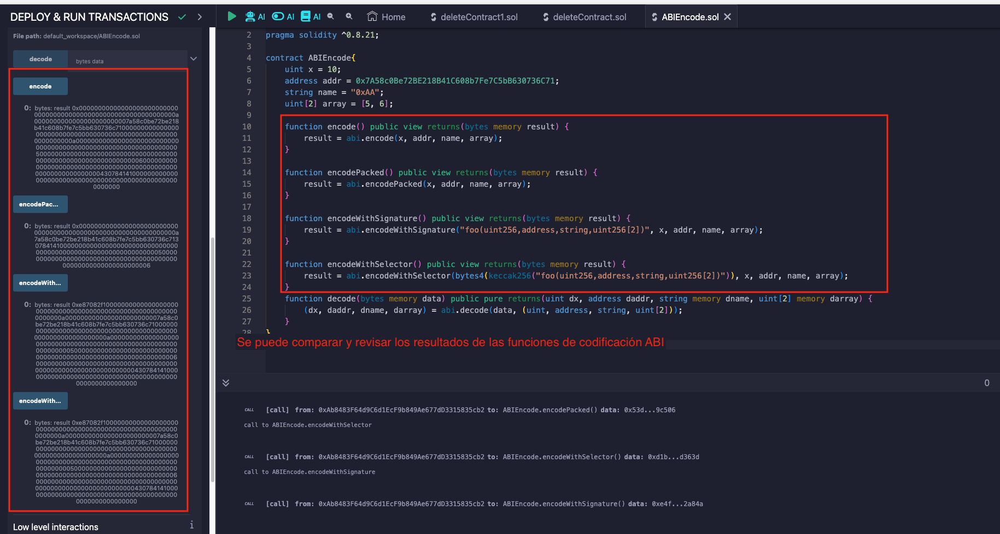
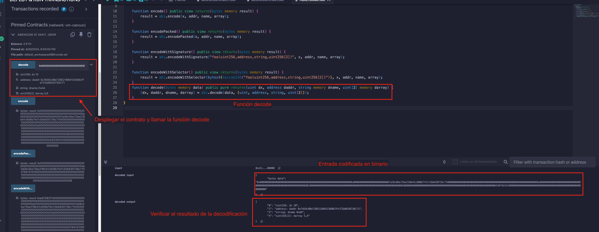
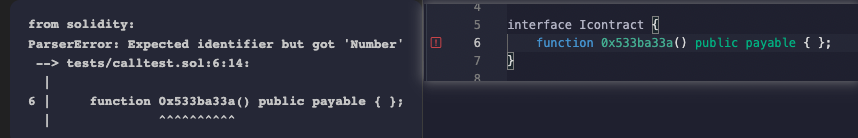

# Tutorial WTF Solidity: 27. Codificación y Decodificación ABI

Recientemente, he estado revisando Solidity y escribiendo tutoriales en "WTF Solidity" para principiantes.

Twitter: [@0xAA_Science](https://twitter.com/0xAA_Science) | [@WTFAcademy_](https://twitter.com/WTFAcademy_)

Comunidad: [Discord](https://discord.gg/5akcruXrsk)｜[Wechat](https://docs.google.com/forms/d/e/1FAIpQLSe4KGT8Sh6sJ7hedQRuIYirOoZK_85miz3dw7vA1-YjodgJ-A/viewform?usp=sf_link)｜[Sitio web wtf.academy](https://wtf.academy)

La traducción al español ha sido realizada por Jonathan Díaz con el objetivo de hacer estos recursos accesibles a la comunidad de habla hispana.

Twitter: [@jonthdiaz](https://twitter.com/jonthdiaz)

Los códigos y tutoriales están como código abierto en GitHub: [github.com/AmazingAng/WTFSolidity](https://github.com/AmazingAng/WTFSolidity)

-----

El `ABI` (Application Binary Interface) es el estándar utilizado para la interacción entre aplicaciones externas y contratos inteligentes en Ethereum. Define cómo se deben codificar y decodificar los datos según su tipo para asegurar una comunicación efectiva. Dado que los datos codificados no incluyen información sobre su tipo, es imprescindible especificar estos tipos al momento de decodificar los datos para interpretarlos correctamente.

En Solidity, `ABI encode` tiene cuatro funciones: `abi.encode`, `abi.encodePacked`, `abi.encodeWithSignature`, `abi.encodeWithSelector`. Mientras que `ABI decode` tiene una función: `abi.decode`, que se utiliza para decodificar los datos de `abi.encode`.

En este capítulo, aprenderemos cómo usar estas funciones.

## Codificación ABI
Se codificaran cuatro variables, sus tipos son `uint256` (alias `uint`), `address`, `string`, `uint256[2]`:
```solidity
    uint x = 10;
    address addr = 0x7A58c0Be72BE218B41C608b7Fe7C5bB630736C71;
    string name = "0xAA";
    uint[2] array = [5, 6]; 
```
### `abi.encode`
Se utiliza las [reglas ABI](https://learnblockchain.cn/docs/solidity/abi-spec.html) para codificar los parámetros dados. `ABI` está diseñado para interactuar con contratos inteligentes llenando cada parámetro con datos de 32 bytes y concatenándolos. Si se desea interactuar con contratos, se debe usar `abi.encode`.
```solidity
    function encode() public view returns(bytes memory result) {
        result = abi.encode(x, addr, name, array);
    }
```
El resultado de la codificación es `0x000000000000000000000000000000000000000000000000000000000000000a0000000000000000000000007a58c0be72be218b41c608b7fe7c5bb630736c7100000000000000000000000000000000000000000000000000000000000000a00000000000000000000000000000000000000000000000000000000000000005000000000000000000000000000000000000000000000000000000000000000600000000000000000000000000000000000000000000000000000000000000043078414100000000000000000000000000000000000000000000000000000000`. Dado que `abi.encode` llena cada dato con 32 bytes de datos, hay muchos `0` en el medio.

### `abi.encodePacked`

Codifica los parámetros dados de acuerdo con el espacio mínimo requerido. Es similar a `abi.encode`, pero omite muchos `0` rellenados. Por ejemplo, solo se usa 1 byte para codificar el tipo `uint`. Puedes usar `abi.encodePacked` cuando deseas ahorrar espacio y no interactuar con contratos. Por ejemplo, al calcular el `hash` de algunos datos.
```solidity
    function encodePacked() public view returns(bytes memory result) {
        result = abi.encodePacked(x, addr, name, array);
    }
```
El resultado de la codificación es `0x000000000000000000000000000000000000000000000000000000000000000a7a58c0be72be218b41c608b7fe7c5bb630736c713078414100000000000000000000000000000000000000000000000000000000000000050000000000000000000000000000000000000000000000000000000000000006`. Debido a que `abi.encodePacked` compacta la codificación, la longitud del resultado es mucho más corta que `abi.encode`.

### `abi.encodeWithSignature`
Similar a la función `abi.encode`, el primer parámetro es `firmas de función`, como `"foo(uint256, address, string, uint256[2])"`. Se puede usar al llamar a otros contratos.
```solidity
    function encodeWithSignature() public view returns(bytes memory result) {
        result = abi.encodeWithSignature("foo(uint256,address,string,uint256[2])", x, addr, name, array);
    }
```
El resultado de la codificación es `0xe87082f1000000000000000000000000000000000000000000000000000000000000000a0000000000000000000000007a58c0be72be218b41c608b7fe7c5bb630736c7100000000000000000000000000000000000000000000000000000000000000a00000000000000000000000000000000000000000000000000000000000000005000000000000000000000000000000000000000000000000000000000000000600000000000000000000000000000000000000000000000000000000000000043078414100000000000000000000000000000000000000000000000000000000`. Esto es equivalente a agregar 4 bytes `selector de función` al frente del resultado de `abi.encode`[^nota].
[^nota]: Los selectores de función identifican funciones por su firma procesada (Keccak–Sha3) usando nombres de funciones y argumentos, que se pueden utilizar para llamadas de función entre diferentes contratos.

### `abi.encodeWithSelector`
Similar a `abi.encodeWithSignature`, excepto que el primer argumento es un `selector de función`, los primeros 4 bytes del `hash Keccak` de la `firma de función`.
```solidity
    function encodeWithSelector() public view returns(bytes memory result) {
        result = abi.encodeWithSelector(bytes4(keccak256("foo(uint256,address,string,uint256[2])")), x, addr, name, array);
    }
```

El resultado de la codificación es `0xe87082f1000000000000000000000000000000000000000000000000000000000000000a0000000000000000000000007a58c0be72be218b41c608b7fe7c5bb630736c7100000000000000000000000000000000000000000000000000000000000000a00000000000000000000000000000000000000000000000000000000000000005000000000000000000000000000000000000000000000000000000000000000600000000000000000000000000000000000000000000000000000000000000043078414100000000000000000000000000000000000000000000000000000000`. El resultado es el mismo que `abi.encodeWithSignature`.

## Decodificación ABI
### `abi.decode`
`abi.decode` se utiliza para decodificar el código binario generado por `abi.encode` y restaurarlo a sus parámetros originales.
```solidity
    function decode(bytes memory data) public pure returns(uint dx, address daddr, string memory dname, uint[2] memory darray) {
        (dx, daddr, dname, darray) = abi.decode(data, (uint, address, string, uint[2]));
    }
```
Se ingresa la codificación binaria de `abi.encode` en `decode`, que decodificará los parámetros originales:


## Verificación en Remix
- Desplegar el contrato para verificar el resultado de la codificación de `abi.encode` 


- comparar y verificar las similitudes y diferencias de las cuatro funciones de codificación


- verificar el resultado de decodificación de `abi.decode`


## Escenario de uso de ABI 
1. En el desarrollo de contratos, `ABI` a menudo se combina con una llamada para implementar una llamada de bajo nivel al contrato.
```solidity  
    bytes4 selector = contract.getValue.selector;

    bytes memory data = abi.encodeWithSelector(selector, _x);
    (bool success, bytes memory returnedData) = address(contract).staticcall(data);
    require(success);

    return abi.decode(returnedData, (uint256));
``
2. ABI se usa a menudo en ethers.js para implementar la importación de contratos y llamadas de funciones.
```solidity
    const wavePortalContract = new ethers.Contract(contractAddress, contractABI, signer);
    /*
        * Llama al método getAllWaves de tu contrato inteligente
        */
    const waves = await wavePortalContract.getAllWaves();
```
3. Después de descompilar un contrato que no es de código abierto, algunas funciones no pueden encontrar firmas de función, pero se pueden llamar a través de `ABI`.
- 0x533ba33a() es una función que se muestra después de descompilar, solo se pueden obtener resultados codificados de funciones, y no se puede encontrar la firma de la función.


- En este caso no se puede llamar a través de la construcción de una interfaz o contrato


En este caso, se puede llamar a través del selector de función ABI.
```solidity
    bytes memory data = abi.encodeWithSelector(bytes4(0x533ba33a));

    (bool success, bytes memory returnedData) = address(contract).staticcall(data);
    require(success);

    return abi.decode(returnedData, (uint256));
```

## Resumen
En Ethereum, los datos deben codificarse en bytecode para interactuar con contratos inteligentes. En este capítulo, se presentaron cuatro funciones de `codificación ABI` y una función de `decodificación ABI`.
