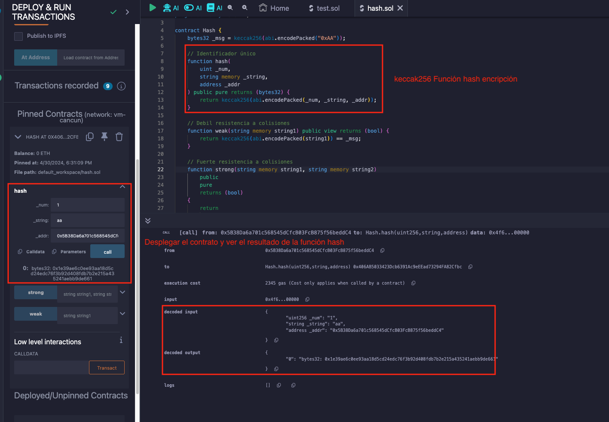
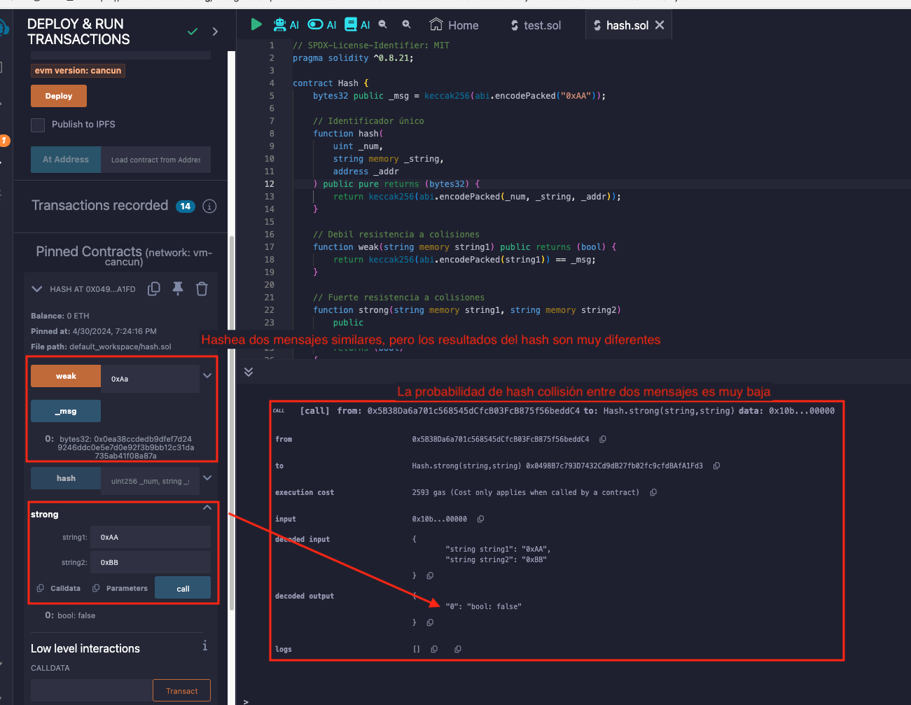

# Tutorial WTF Solidity: 28. Funcion Hash

Recientemente, he estado revisando Solidity y escribiendo tutoriales en "WTF Solidity" para principiantes.

Twitter: [@0xAA_Science](https://twitter.com/0xAA_Science) | [@WTFAcademy_](https://twitter.com/WTFAcademy_)

Comunidad: [Discord](https://discord.gg/5akcruXrsk)｜[Wechat](https://docs.google.com/forms/d/e/1FAIpQLSe4KGT8Sh6sJ7hedQRuIYirOoZK_85miz3dw7vA1-YjodgJ-A/viewform?usp=sf_link)｜[Sitio web wtf.academy](https://wtf.academy)

La traducción al español ha sido realizada por Jonathan Díaz con el objetivo de hacer estos recursos accesibles a la comunidad de habla hispana.

Twitter: [@jonthdiaz](https://twitter.com/jonthdiaz)

Los códigos y tutoriales están como código abierto en GitHub: [github.com/AmazingAng/WTFSolidity](https://github.com/AmazingAng/WTFSolidity)
---

La función hash es un concepto criptográfico. Puede convertir un mensaje de longitud arbitraria en un valor de longitud fija. Este valor también se llama hash. En esta lección, se presentará brevemente la función hash y su aplicación en solidity.

## Propiedades de Hash


Una buena función hash debe tener las siguientes propiedades:

- Unidireccional: La operación hacia adelante desde el mensaje de entrada hasta su hash es simple y está determinada de forma única, mientras que la inversa es muy difícil y solo se puede enumerar por fuerza bruta.
- Sensibilidad: Un pequeño cambio en el mensaje de entrada cambia en gran medida el hash.
- Eficiencia: La operación desde el mensaje de entrada hasta el hash es eficiente.
- Uniformidad: La probabilidad de que se tome cada valor hash debe ser igual.
- Resistencia a colisiones:
  - Resistencia débil a colisiones: dado un mensaje `x`, es difícil encontrar otro mensaje `x` tal que `hash(x) = hash(x')`.
  - Resistencia fuerte a colisiones: es difícil encontrar arbitrariamente `x` y `x` tal que `hash(x) = hash(x')`.

## Aplicación de Hash

- Identificador único para datos generados
- Firmas criptográficas
- Encrypción segura

## Keccak256

La función `Keccak256` es la función hash más comúnmente utilizada en `solidity`, y su uso es muy simple:

```solidity
hash = keccak256(data);
```

### Keccak256 y sha3

Aquí hay algo interesante:

1. sha3 está estandarizado por keccak. Keccak y SHA3 son sinónimos en muchas ocasiones. Pero cuando SHA3 finalmente se estandarizó en agosto de 2015, NIST ajustó el algoritmo de relleno.
   Por lo tanto, SHA3 es diferente del resultado calculado por keccak. Se debe prestar atención a este punto en el desarrollo real.
2. sha3 todavía se estaba estandarizando cuando Ethereum se estaba desarrollando, por lo que Ethereum usó keccak. En otras palabras, SHA3 en Ethereum y el código de contrato inteligente de Solidity se refiere a Keccak256, no a SHA3 estándar de NIST. Para evitar confusiones, es claro que se usará Keccak256 directamente en el código del contrato.

### Generar un identificador único de los datos

Se puede usar `keccak256` para generar un identificador único para los datos. Por ejemplo, se tienen varios tipos de datos diferentes: `uint`, `string`, `address`. Se puede usar primero el método `abi.encodePacked` para empaquetar y codificarlos, y luego usar `keccak256` para generar un identificador único.

### Colisión débil de resistencia

Se usa `keccak256` para mostrar la resistencia débil a colisiones, que dado un mensaje `x`, es difícil encontrar otro mensaje `x' tal que `hash(x) = hash(x')`.

Se define un mensaje llamado `0xAA` y se tratará de encontrar otro mensaje cuyo valor hash sea igual al mensaje `0xAA`.

```solidity
    // Resistencia débil a colisiones
    function weak(
        string memory string1
    )public view returns (bool){
        return keccak256(abi.encodePacked(string1)) == _msg;
    }
```

Puedes intentarlo 10 veces y ver si tienes suerte.

### Resistencia fuerte a colisiones

Por otro lado, se usará `keccak256` para mostrar la resistencia fuerte a colisiones, que es difícil encontrar arbitrariamente `x` y `x'` tal que `hash(x) = hash(x')`.

Se define una función llamada `strong` que recibe dos parámetros de tipo string llamados `string1` y `string2`. Luego, se comprueba si sus hash son iguales.

```solidity
    // Resistencia fuerte a colisiones
    function strong(
        string memory string1,
        string memory string2
    )public pure returns (bool){
        return keccak256(abi.encodePacked(string1)) == keccak256(abi.encodePacked(string2));
    }
```

Se puede intentar 10 veces y ver si se tiene suerte.

## Ejemplo de Remix

- Desplegar el contrato y ver el resultado generado del identificador único.
  
- Verificar la sensibilidad de la función hash, así como la resistencia fuerte y débil a colisiones
  

## Resumen
En esta sección, se presentó qué es una función hash y cómo usar `keccak256`, la función hash más comúnmente utilizada en `solidity`.
