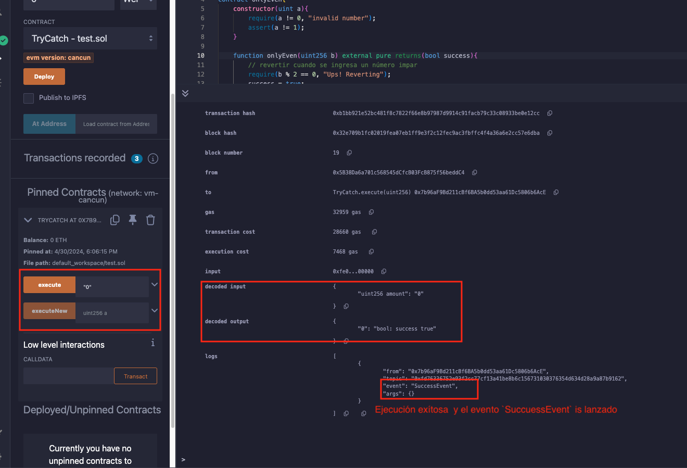
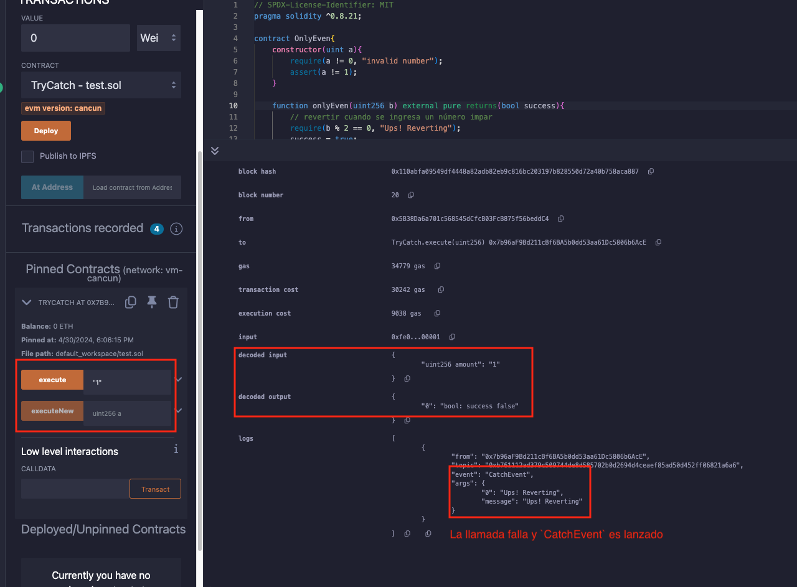
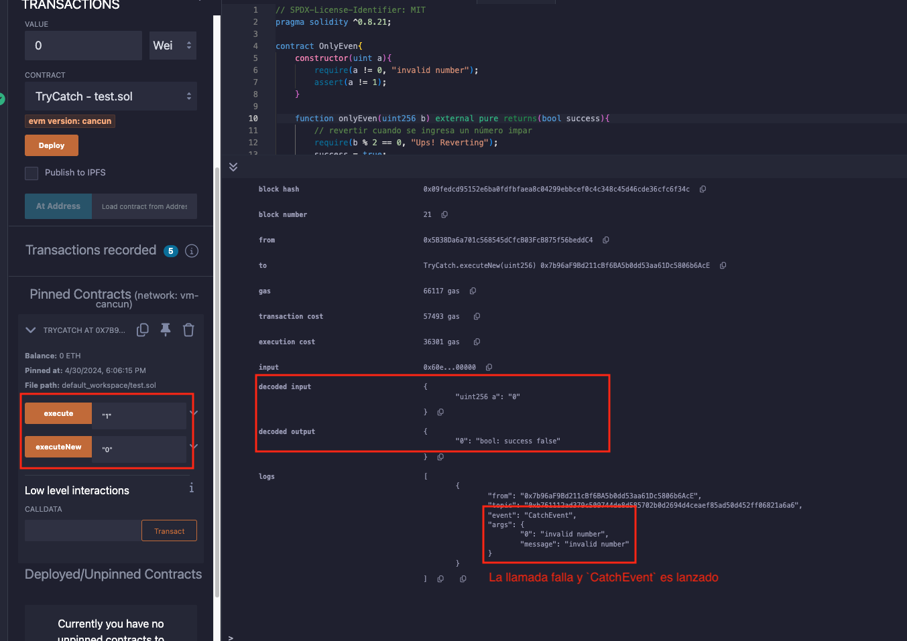
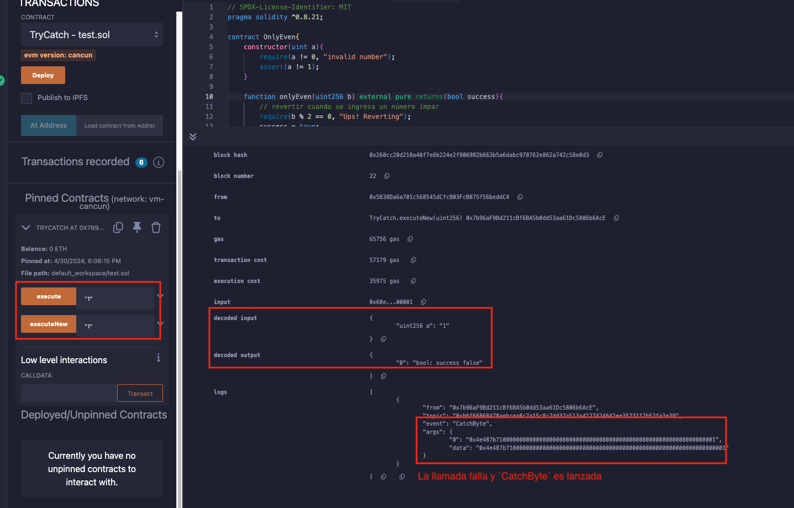
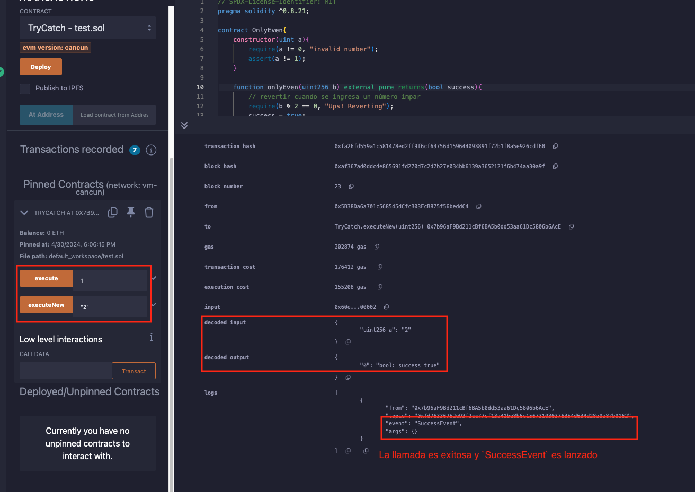

# Tutorial WTF Solidity: 30. Intentar Capturar

Recientemente, he estado revisando Solidity y escribiendo tutoriales en "WTF Solidity" para principiantes.

Twitter: [@0xAA_Science](https://twitter.com/0xAA_Science) | [@WTFAcademy_](https://twitter.com/WTFAcademy_)

Comunidad: [Discord](https://discord.gg/5akcruXrsk)｜[Wechat](https://docs.google.com/forms/d/e/1FAIpQLSe4KGT8Sh6sJ7hedQRuIYirOoZK_85miz3dw7vA1-YjodgJ-A/viewform?usp=sf_link)｜[Sitio web wtf.academy](https://wtf.academy)

La traducción al español ha sido realizada por Jonathan Díaz con el objetivo de hacer estos recursos accesibles a la comunidad de habla hispana.

Twitter: [@jonthdiaz](https://twitter.com/jonthdiaz)

Los códigos y tutoriales están como código abierto en GitHub: [github.com/AmazingAng/WTFSolidity](https://github.com/AmazingAng/WTFSolidity)

-----

`try-catch` es una forma estándar de manejar excepciones que es casi ubicua en los lenguajes de programación modernos. Además, se agregó a `solidity`0.6.

En este capítulo, se presentará cómo usar `try-catch` para manejar excepciones en contratos inteligentes.

## `try-catch`
En `solidity`, `try-catch` solo se puede usar en una función `external` o llamar al `constructor` (considerado como una función `external`) al crear contratos. La sintaxis básica es la siguiente:
```solidity
        try externalContract.f() {
            // si la llamada tiene éxito, ejecutar algunos códigos
        } catch {
            // si la llamada falla, ejecutar algunos códigos
        }
```

`externalContract.f()` es una llamada a una función de un contrato externo, el módulo `try` se ejecuta si la llamada tiene éxito, mientras que el módulo `catch` se ejecuta si la llamada falla.
También se puede usar `this.f()` en lugar de `externalContract.f()`. `this.f()` también se considera una llamada externa, pero no se puede usar en el constructor porque el contrato no se ha creado en ese momento.

Si la función llamada tiene un valor de retorno, entonces `returns(returnType val)` debe declararse después de `try`, y la variable devuelta se puede usar en el módulo `try`. En el caso de la creación de contratos, el valor devuelto es una nueva variable de contrato.
```solidity
        try externalContract.f() returns(returnType val){
            // si la llamada tiene éxito, ejecutar algunos códigos
        } catch {
            // si la llamada falla, ejecutar algunos códigos
        }
```

Además, el módulo `catch` admite capturar causas especiales de excepciones:

```solidity
        try externalContract.f() returns(returnType){
            // si la llamada tiene éxito, ejecutar algunos códigos
        } catch Error(string memory /*reason*/) {
            // capturar revert("reasonString") y require(false, "reasonString")
        } catch Panic(uint /*errorCode*/) {
            // Capturar errores causados por Panic, como fallas de assert, desbordamientos, división por cero, acceso a un array fuera de límites
        } catch (bytes memory /*lowLevelData*/) {
            // Si se produce un revert y los dos tipos de excepción anteriores no coinciden, se irá a esta rama
            // como revert(), require(false), revert de un tipo de error personalizado
        }
```

## `try-catch` combate actual
### `OnlyEven`
### `OnlyEven`
Se crea un contrato externo `OnlyEven` y se usa `try-catch` para el manejo de excepciones:
```solidity
contract OnlyEven{
    constructor(uint a){
        require(a != 0, "invalid number");
        assert(a != 1);
    }

    function onlyEven(uint256 b) external pure returns(bool success){
        // revertir cuando se ingresa un número impar
        require(b % 2 == 0, "Ups! Reverting");
        success = true;
    }
}
```
`OnlyEven` contiene un constructor y una función `onlyEven`.

- El constructor tiene un argumento `a`, cuando `a=0`, `require` lanzará una excepción; Cuando `a=1`, `assert` lanzará una excepción. Todas las demás condiciones son normales.
- La función `onlyEven` tiene un argumento `b`, cuando `b` es impar, `require` lanzará una excepción.

### Manejar excepciones de llamadas a funciones externas
Primero, se definen algunos eventos y variables de estado en el contrato `TryCatch`:
```solidity
    // evento de éxito
    event SuccessEvent();

    // evento de fallo
    event CatchEvent(string message);
    event CatchByte(bytes data);

    // declarar la variable de contrato OnlyEven
    OnlyEven even;

    constructor() {
        even = new OnlyEven(2);
    }
```
`SuccessEvent` es el evento que se lanzará cuando la llamada tenga éxito, mientras que `CatchEvent` y `CatchByte` son los eventos que se lanzarán cuando se lance una excepción, correspondiente a excepciones `require/revert` y `assert` respectivamente. `even` es una variable de estado de tipo contrato `OnlyEven`.
por último, se crea una función `execute` para llamar a la función `onlyEven` en el contrato `OnlyEven`. Luego se usa `try-catch` en la función `execute` para manejar excepciones en la llamada a la función externa `onlyEven`:
```solidity
    // usar try-catch en la llamada externa
    function execute(uint amount) external returns (bool success) {
        try even.onlyEven(amount) returns(bool _success){
            // si la llamada tiene éxito
            emit SuccessEvent();
            return _success;
        } catch Error(string memory reason){
            // si la llamada falla
            emit CatchEvent(reason);
        }
    }
```
### Verificar en Remix

Cuando se ejecuta `execute(0)`, como `0` es par, satisface `require(b % 2 == 0, "Ups! Reverting");`, por lo que no se lanza ninguna excepción. La llamada tiene éxito y se lanza `SuccessEvent`.



Cuando se ejecuta `execute(1)`, como `1` es impar, no satisface `require(b % 2 == 0, "Ups! Reverting");`, por lo que se lanza la excepción. La llamada falla y se lanza `CatchEvent`.



### Manejar excepciones de creación de contratos

Aquí se usa `try-catch` para manejar excepciones cuando se crea un contrato. Solo se necesita reescribir el módulo `try` para la creación del contrato `OnlyEven`:
```solidity
    // usar try-catch al crear un nuevo contrato(La creación de contratos se considera una llamada externa)
    // executeNew(0) fallará y emitirá `CatchEvent`
    // executeNew(1) fallará y emitirá `CatchByte`
    // executeNew(2) tendrá éxito y emitirá `SuccessEvent`
    function executeNew(uint a) external returns (bool success) {
        try new OnlyEven(a) returns(OnlyEven _even){
            // si la llamada tiene éxito
            emit SuccessEvent();
            success = _even.onlyEven(a);
        } catch Error(string memory reason) {
            // capturar revert("reasonString") y require(false, "reasonString")
            emit CatchEvent(reason);
        } catch (bytes memory reason) {
            // capturar assert() de falla, el tipo de error de assert es Panic(uint256) en lugar de Error(string), por lo que irá a esta rama
            emit CatchByte(reason);
        }
    }
```

### Verificar en remix
Cuando se ejecuta `executeNew(0)`, como `0` no satisface `require(a != 0, "invalid number");`, la llamada fallará y se lanzará `CatchEvent`.



Cuando se ejecuta `executeNew(1)`, como `1` no satisface `assert(a != 1);`, la llamada fallará y se lanzará `CatchByte`.



Cuando se ejecuta `executeNew(2)`, como `2` satisface `require(a != 0, "invalid number");` y `assert(a != 1);`, la llamada tiene éxito y se lanza `SuccessEvent`.



## Resumen
En este capítulo, se presenta cómo usar `try-catch` en `solidity` para manejar excepciones en la operación de contratos inteligentes.
