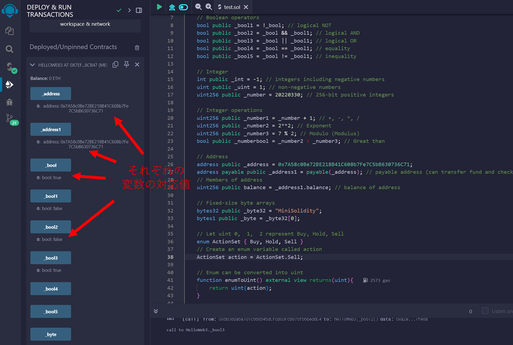
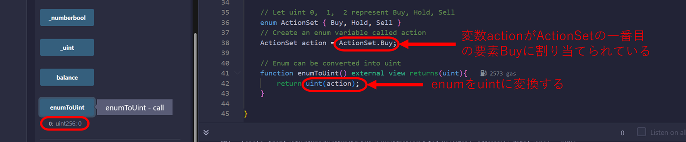
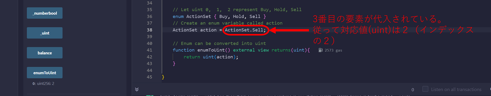

# WTF Solidity 超シンプル入門: 2. Value Type（値型）

最近、Solidity の学習を再開し、詳細を確認しながら「Solidity 超シンプル入門」を作っています。これは初心者向けのガイドで、プログラミングの達人向けの教材ではありません。毎週 1〜3 レッスンのペースで更新していきます。

僕のツイッター：[@0xAA_Science](https://twitter.com/0xAA_Science)｜[@WTFAcademy\_](https://twitter.com/WTFAcademy_)

コミュニティ：[Discord](https://discord.gg/5akcruXrsk)｜[Wechat](https://docs.google.com/forms/d/e/1FAIpQLSe4KGT8Sh6sJ7hedQRuIYirOoZK_85miz3dw7vA1-YjodgJ-A/viewform?usp=sf_link)｜[公式サイト wtf.academy](https://wtf.academy)

すべてのソースコードやレッスンは github にて公開: [github.com/AmazingAng/WTFSolidity](https://github.com/AmazingAng/WTFSolidity)

-----

## 変数の型

1. **値型**：boolean型、integer型などを含みます。 これらの変数は代入時には、直接的に値を渡します。

2. **参照型**：配列と構造体があります。これらの変数はより多くのスペースを取り、代入された際には直接アドレスを渡し（ポインタに似ている）、複数の変数名で変更出来る。

3. **マッピング型**: Solidityにおけるハッシュテーブル。

4. **関数型**：Solidityのドキュメントでは関数は値型に分類されている。しかし、他の型とは全くことなっており、別のカテゴリーに分類した。

ここではよく使われる型のみ紹介する予定です。この章では、値型について見ていきましょう。

## 値型

### 1. Boolean（真偽値型）

Booleanはバイナリ変数で、その値は`true`か`false`です。

```solidity
    // Boolean（真偽値型）
    bool public _bool = true;
```

Boolean型の演算子には次のものがあります:

- `!`   (logical NOT)「論理否定」
- `&&`  (logical AND)「論理積」
- `||`  (logical OR) 「論理和」
- `==`  (equality)　 「等価」
- `!=`  (inequality) 「不等式」

ソースコード：

```solidity
    // Boolean operators（論理演算子）                    
    bool public _bool1 = !_bool;          // logical NOT（否定）
    bool public _bool2 = _bool && _bool1; // logical AND（論理積）
    bool public _bool3 = _bool || _bool1; // logical OR （論理和）
    bool public _bool4 = _bool == _bool1; // equality   （等価）
    bool public _bool5 = _bool != _bool1; // inequality （不等価）
```

上記のソースコードより: 変数`_bool`の値は`true`; `_bool1`は`_bool`じゃないので、`false`となる; `_bool && _bool1`は`false`; `_bool || _bool1`は`true`; `_bool == _bool1`は`false`; そして`_bool != _bool1`は`true`となります。

**重要なノート：** `&&`と`||`演算子は短絡評価(short-circuit evaluation)のルールに従います。これはすなわち、例えば`f(x) || g(y)`のような表記があった場合、もし`f(x)`が`true`だったなら、`g(y)`が評価されないということです。

### 2. Integers（整数型）
SolidityのInteger型には符号付き整数`int`と符号なし整数`uint`があります。 最大256ビット型の整数やデータユニットを格納出来ます。

```solidity
    // Integer（整数型）
    int public _int = -1; // integers including negative numbers（負の数を含む整数型）
    uint public _uint = 1; // non-negative numbers（非負の数）
    uint256 public _number = 20220330; // 256-bit positive integers（256ビットの正の数）
```
よく使われる整数向け演算子には次のものがあります:

- 不等式演算子（Booleanを返します）: `<=`, `<`, `==`, `!=`, `>=`, `>`
- 算術演算子: `+`, `-`, `*`, `/`, `%`
- Arithmetic operator： `+`,  `-`,  `*`,  `/`,  `%` (modulo[モジュロ、剰余]), `**` (指数)

ソースコード：

```solidity
    // Integer operations（整数演算）
    uint256 public _number1 = _number + 1; // +, -, *, /
    uint256 public _number2 = 2**2; // Exponent         （べき乗）
    uint256 public _number3 = 7 % 2; // Modulo (Modulus)（剰余(モジュロ)）
    bool public _numberbool = _number2 > _number3; // Great than（大なり）
```

上記のソースコードを実行し、各変数の値をチェックすることが出来ます。

### 3. Addresses（アドレス型）

アドレスは次の2つの種類があります:
- `address`: 20バイトの値を保持します（イーサリアムアドレスのサイズです）。

- `address payable`: `address`と同じですが、`transfer`と`send`というメンバを付与することによって、ETHの転送を可能にします。
  （メンバ：あるオブジェクトが持つ属性や関数のことで、ここではメンバ関数のこと。）

ソースコード:

```solidity
    // Address（アドレス型）
    address public _address = 0x7A58c0Be72BE218B41C608b7Fe7C5bB630736C71;
    address payable public _address1 = payable(_address); // payable address (can transfer fund and check balance)
                                                          //（ペイアブルなアドレス(資金の移動と残高の確認が可能)）
    // Members of address（アドレスのメンバ）
    uint256 public balance = _address1.balance; // balance of address（アドレスの残高）
```

### 4. Fixed-size byte arrays（固定サイズのバイト配列(固定長配列)型）

Solidityのバイト配列には2つの種類があります:

- 固定長のバイト配列(固定長配列): それぞれの要素のサイズ（最大32バイト）によって`byte`や`bytes8`, `bytes32`などを含む値型に属しています。配列の長さは宣言された後で変更されることは出来ません。

- 可変長バイト配列(可変長配列): `bytes`などを含み、参照型に属しています。配列の長さは宣言された後で変更することが可能です。後の章で詳しく学んでいきます。

ソースコード:

```solidity
    // Fixed-size byte arrays（固定長配列）
    bytes32 public _byte32 = "MiniSolidity"; 
    bytes1 public _byte = _byte32[0]; 
```

上記のソースコードでは、`MiniSolidity`という値を変数`_byte32`に代入しました。即ち、16進数では: `0x4d696e69536f6c69646974790000000000000000000000000000000000000000`

そして変数`_byte`は`_byte32`の最初のバイトの値を取ります。そして、その値とは`0x4d`です。

### 5. Enumeration（列挙型）

列挙 (`enum`) はSolidityの中でユーザー定義型データです。主に`uint`に名前を割り当てる為に使われ、プログラムを読みやすくしています。

ソースコード:

```solidity
    // Let uint 0,  1,  2 represent Buy, Hold, Sell（uint型の0,1,2がBuy,Hold,Sellを表すとする）
    enum ActionSet { Buy, Hold, Sell }
    // Create an enum variable called action（actionという列挙型変数を作成）
    ActionSet action = ActionSet.Buy;
```

`uint`に容易に変換出来ます。

```solidity
    // Enum can be converted into uint（列挙型はuint型に変換出来る）
    function enumToUint() external view returns(uint){
        return uint(action);
    }
```

`enum`はそこまでSolidityではポピュラーな型ではありません。

## Remixでのデモ

- コントラクトをデプロイした後、各変数の値をチェック出来ます。

   
  
- enumとuintの間の変換は次の通りです:

   

   

## まとめ 

この章では、Solidityにおける変数型を紹介しました。値型、参照型、マッピング型、関数型です。次によく使われる値型にある型を紹介しました: 真偽値型、整数型、アドレス型、固定長型バイト配列型、列挙型です。この後のチュートリアルで他の型について取り上げます。
