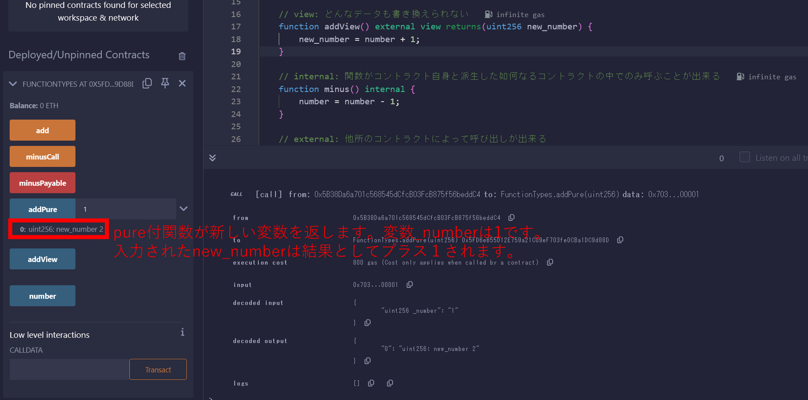
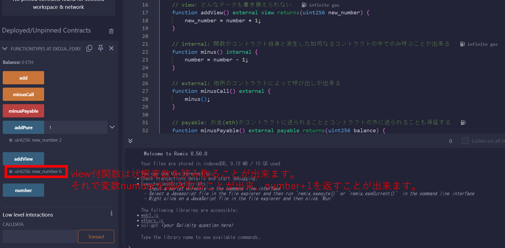
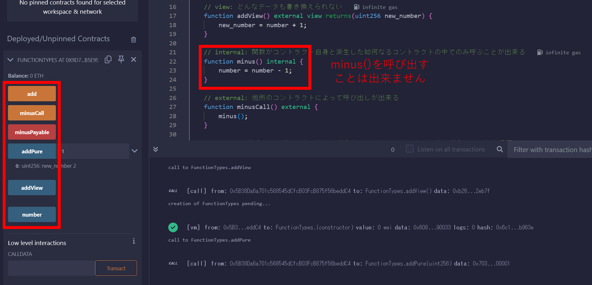
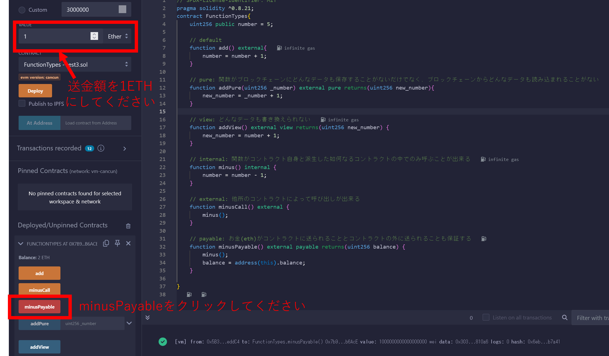

# WTF Solidity 超シンプル入門: 3. Function（関数）

最近、Solidity の学習を再開し、詳細を確認しながら「Solidity 超シンプル入門」を作っています。これは初心者向けのガイドで、プログラミングの達人向けの教材ではありません。毎週 1〜3 レッスンのペースで更新していきます。

僕のツイッター：[@0xAA_Science](https://twitter.com/0xAA_Science)｜[@WTFAcademy\_](https://twitter.com/WTFAcademy_)

コミュニティ：[Discord](https://discord.gg/5akcruXrsk)｜[Wechat](https://docs.google.com/forms/d/e/1FAIpQLSe4KGT8Sh6sJ7hedQRuIYirOoZK_85miz3dw7vA1-YjodgJ-A/viewform?usp=sf_link)｜[公式サイト wtf.academy](https://wtf.academy)

すべてのソースコードやレッスンは github にて公開: [github.com/AmazingAng/WTFSolidity](https://github.com/AmazingAng/WTFSolidity)

-----

## 関数型

Solidityにおける関数の書式を示します:

```solidity
    function <function name>(<parameter types>) [internal|external] [pure|view|payable] [returns (<return types>)]
```

複雑に見えるかもしれませんが、１つ１つ分解して見てみましょう（角括弧はオプションのキーワードを示します）:


1. `function`: 関数を記述する為に、`function`というキーワードで始める必要があります。

2. `<function name>`: 関数名です。

3. `(<parameter types>)`: 引数の型と名前です。

4. `[internal|external|public|private]`: 関数の可視性（ビジビリティ）の修飾子です。デフォルトのビジビリティはありませんので、それぞれの関数に対してビジビリティを指定する必要があります。そしてビジビリティは4種類あるのです:

   - `public`: 全てにおいて可視的です。

   - `private`: このコントラクト内でのみアクセス出来ますが、派生したコントラクトでは使用出来ません。

   - `external`: 別の他のコントラクトからのみ呼び出せます。しかし、コントラクト内で`f`は関数名だとすると、コントラクト内で`this.f()`で呼び出せます。 

   - `internal`: コントラクト内部およびそのコントラクトから派生するコントラクトからのみアクセス出来る。

    **Note 1**: `public`はデフォルトで関数のビジビリティとなっています。
    
    **Note 2**: `public|private|internal`は状態変数でも使用されます。パブリックな変数は値を照会する為の`getter`関数を自動的に生成します。
    
    **Note 3**: デフォルトでは状態変数のビジビリティは`internal`となります。

5. `[pure|view|payable]`: Solidityの関数のふるまいを示すキーワードです。`payable`は理解しやすいです。`payable`関数を通して`ETH`をコントラクトに送ることが出来ます。`pure`と`view`は次の節で紹介します。

6. `[returns (<return types>)]`: 変数の型と名前を返します。※返り値の名前は省略可能です。

## `Pure` と `View`って一体何なんだ?

私が`solidity`を学び始めた時、まったく`pure`と`view`について理解出来ませんでした。というのも、他のプログラミング言語では馴染みがないからです。`solidity`は`gas fee`があるが故に、これら2つのキーワードを追加しました。コントラクトの状態変数はブロックチェーンに保管されていて、`gas fee`はとても値段が高いです。もしこれらの状態変数を書き換えない場合、`gas`を支払う必要はありません。すなわち、`pure`と`view`の関数を呼び出す際には`gas`を支払う必要はありません。

次の記述は状態（ステート）を変更することと見なされます:

1. 状態変数への書き込む。

2. イベントを発生させる。

3. 他のコントラクトを作成する。

4. selfdestructを使用する。

5. callメソッドを通してイーサリアムを送金する。

6. viewやpureが記されていないあらゆるタイプの関数を呼び出すこと。

7. 低レベルなcallメソッド（low-level calls）を使用する。

8. 特定のオペコードを含むインライン・アセンブリを使用する。


`pure`と`view`をビジュアライズするためにマリオの漫画を描いてみました。この画像では、状態変数はピーチ姫で表現されていて、キーワードは3つの異なるキャラクターで描かれています。


- `pure`: `pure`キーワードを含んでいる関数はオンチェーンで状態変数を読み込むことも書き込むことも出来ません。ちょうど小さなモンスターのようにピーチ姫を見ることも出来なければ触れることも出来ません。
  
- `view`: `view`キーワードを含んでいる関数はオンチェーンで状態変数を読み込むことは出来ますが、状態変数に書き込むことは出来ません。マリオに似ていて、お姫様を見ることは出来ますが、触れることは出来ないのです。

- `pure`と`view`が無い場合: 関数は状態変数を読み込むことも書き込むことも出来る訳です。`boss`が望むことは何でも出来るように🐶。

## ソースコード

### 1. pure v.s. view

状態変数を`number = 5`と定義します。

```solidity
    // SPDX-License-Identifier: MIT
    pragma solidity ^0.8.21;
    contract FunctionTypes{
        uint256 public number = 5;
```

`add()`関数を定義し、呼び出すたびに`number`に1を足します。

```solidity
    // default
    function add() external{
        number = number + 1;
    }
```

もし`add()`が`pure`キーワードを含む場合、つまり`function add() pure external`となっていた場合、結果としてエラーになります。なぜならば、`pure`はコントラクトの状態変数を読み込むことは出来ませんし、状態変数に書き込むことも出来ないからです。それでは`pure`は何が出来るというのでしょうか？それは`_number`という仮引数を関数に渡して、関数に`_number + 1`を返させることが出来ます。

```solidity
    // pure
    function addPure(uint256 _number) external pure returns(uint256 new_number){
        new_number = _number + 1;
    }
```

**Example:**


もし`add()`が`view`を含んでいた場合、つまり`function add() view external`となっていた場合もまた、結果としてエラーになるでしょう。なぜならば、`view`というのは状態変数を読み込むことが出来ますが、状態変数に書き込むことが出来ないからです。次のように関数を編集することが出来ます:

```solidity
    // view
    function addView() external view returns(uint256 new_number) {
        new_number = number + 1;
    }
```

**Example:**


### 2. internal v.s. external

```solidity
    // internal
    function minus() internal {
        number = number - 1;
    }

    // external
    function minusCall() external {
        minus();
    }
```

ここでは`internal minus()`関数を定義しました。`number`は関数が呼ばれるたびに1減算されます。`internal`関数はコントラクトそのものからのみ呼び出されるので、文字通り`minus()`を呼ぶ為に、`external` `minusCall()`関数を定義する必要があります。

**Example:**


### 3. payable

```solidity
    // payable: money (ETH) can be sent to the contract via this function
    //（payable: 関数を経由してお金（イーサリアム）をコントラクトに送金することが出来る）
    function minusPayable() external payable returns(uint256 balance) {
        minus();
        balance = address(this).balance;
    }
```

`external payable minusPayable()`関数を定義しました。そしてそれは`minus()`を呼び出し、現在のコントラクトの`ETH`残高を返します（`this`キーワードは現在のコントラクトアドレスを照会させてくれます）。関数が`payable`なので、`minusPayable()`を呼び出した時にコントラクトに1`ETH`送ることができるのです。


返されるメッセージでコントラクトの残高が1`ETH`であることが確認できます。


**Example:**


## まとめ

この章では、`solidity`の関数型について紹介しました。`pure`と`view`キーワードは他のプログラミング言語ではあまり馴染みがありませんので、理解するのは難しいことでしょう。`pure`と`view`関数はオンチェーンのデータを編集することはありませんので、呼び出す際にはガス代を払う必要がありません。
