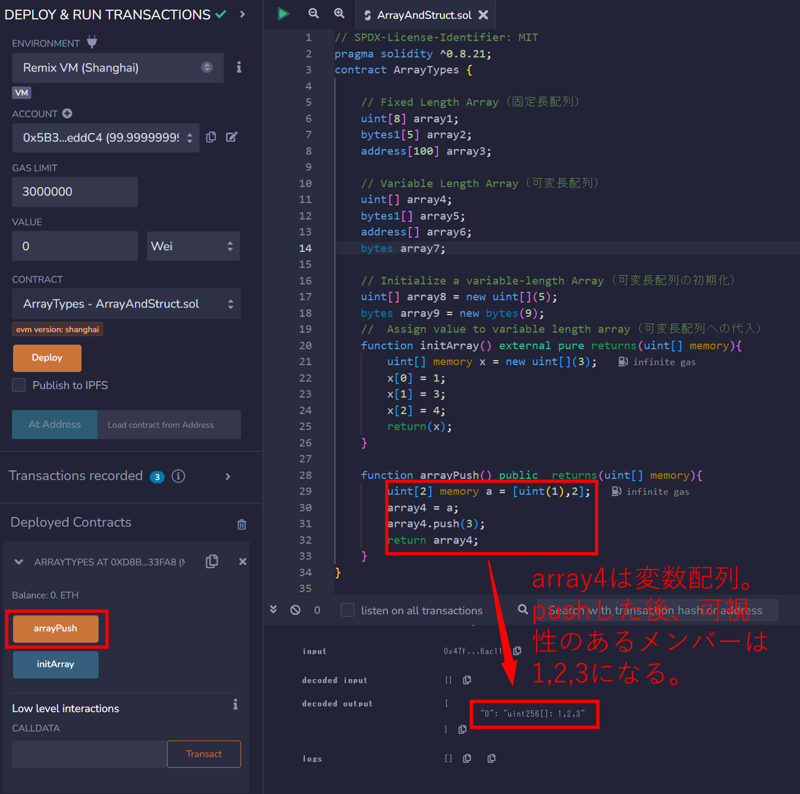
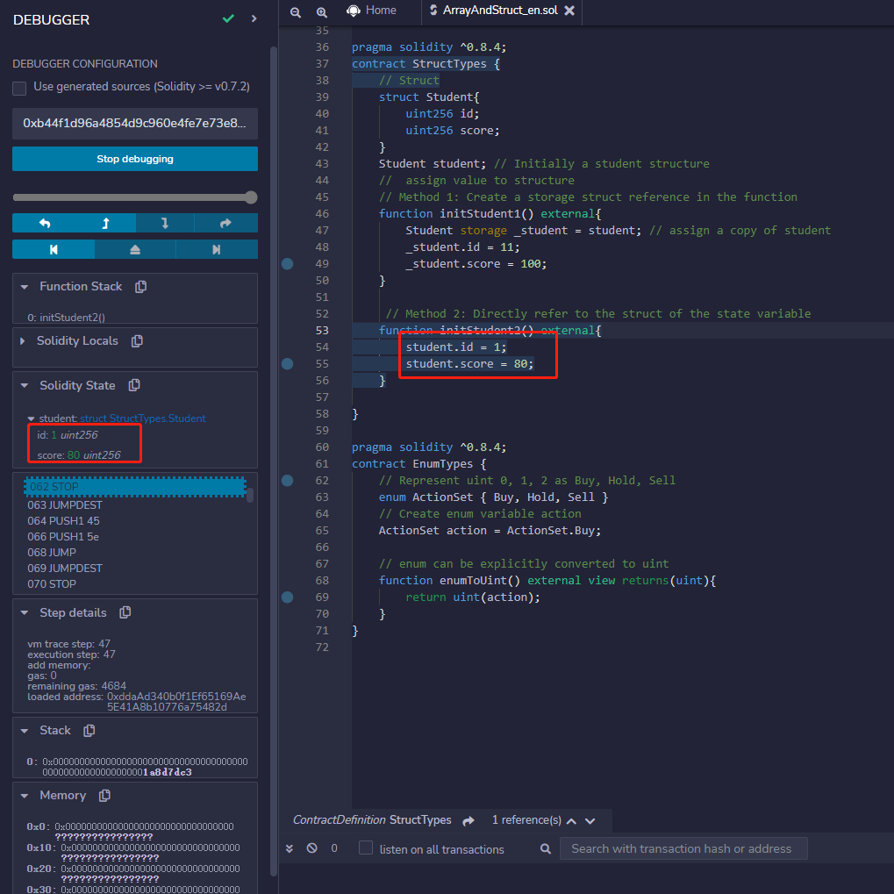

# WTF Solidity 超シンプル入門: 6. Array & Struct （配列と構造体）

最近、Solidity の学習を再開し、詳細を確認しながら「Solidity 超シンプル入門」を作っています。これは初心者向けのガイドで、プログラミングの達人向けの教材ではありません。毎週 1〜3 レッスンのペースで更新していきます。

僕のツイッター：[@0xAA_Science](https://twitter.com/0xAA_Science)｜[@WTFAcademy\_](https://twitter.com/WTFAcademy_)

コミュニティ：[Discord](https://discord.gg/5akcruXrsk)｜[Wechat](https://docs.google.com/forms/d/e/1FAIpQLSe4KGT8Sh6sJ7hedQRuIYirOoZK_85miz3dw7vA1-YjodgJ-A/viewform?usp=sf_link)｜[公式サイト wtf.academy](https://wtf.academy)

すべてのソースコードやレッスンは github にて公開: [github.com/AmazingAng/WTFSolidity](https://github.com/AmazingAng/WTFSolidity)

-----

このレクチャーでは、Solidityにおいて２つの重要な変数型を紹介します: `array`と`struct`です。

## Array

`array`はSolidityにおいてデータ（integer, bytes, addressesなど）のセットを格納する為によく使われる変数型です。

配列には２つの種類があります: 固定長配列と可変長配列です。:

    - 固定長配列: 宣言時に配列の長さが指定されます。`array`は`T[k]`というフォーマットで宣言され、そこで`T`というのは要素の型であり、`k`は長さです。

```solidity
    // fixed-length array（固定長配列）
    uint[8] array1;
    byte[5] array2;
    address[100] array3;
```

- 可変長配列（動的配列）: 配列の長さは宣言時に指定されません。`T[]`というフォーマットを使用し、そこで`T`というのは要素の型です。

```solidity
    // variable-length array（可変長配列）
    uint[] array4;
    byte[] array5;
    address[] array6;
    bytes array7;
```

**Notice**: `bytes`は特別なケースであり、動的配列ですが`[]`をそれに付け加える必要がありません。byte配列を宣言する際に`bytes`か`bytes1[]`を使用することが出来ますが、`byte[]`は使用できません。`bytes`は推奨され、`bytes1[]`よりも少ないガスを消費します。

### Rules for creating arrays （配列を作成する際の決まり）

Solidityでは、配列を作成する為にいくつかの決まりがあります:

- `memory`の動的配列は`new`演算子によって作成することが出来ますが、長さは宣言される必要があり、宣言した後でその長さを変更することは出来ません。使用例を見てみましょう:

```solidity
    // memory dynamic array（memoryによる動的配列）
    uint[] memory array8 = new uint[](5);
    bytes memory array9 = new bytes(9);
```

- 配列リテラルは１つまたは複数の式の形をした配列であって、すぐに変数に代入されることはありません; 例えば、`[uint(1),2,3]`のようなものです（最初の要素の型は宣言されなければなりません。さもなければデフォルトで一番小さい格納容量の型が使用されます。）。

- 動的配列を作成する時には、要素ごとの代入を行う必要があります。

```solidity
    uint[] memory x = new uint[](3);
    x[0] = 1;
    x[1] = 3;
    x[2] = 4;
```

### Members of Array （配列のメンバー）

- `length`: 配列は要素の数を保有する`length`メンバーを持っており、`memory`配列の長さは作成された後、固定されます。
- `push()`: 動的配列は`push()`メンバー関数を持っています。要素`0`を配列末尾に付与します。
- `push(x)`: 動的配列は`push(x)`メンバー関数を持っています。そしてそれは要素`x`を配列末尾に付与することが出来ます。
- `pop()`: 動的配列は`pop`メンバーを持っています。配列末尾の要素を取り除くことが出来ます。

**Example:**



## Struct

Solidityにおいて、`struct`というフォーマットによって新しい型を定義できます。`struct`の要素はプリミティブ型か参照型でも構いません。そして`struct`は`array`か`mapping`の要素となり得ます。

```solidity
    // struct（構造体）
    struct Student{
        uint256 id;
        uint256 score; 
    }

    Student student; // Initially a student structure（構造体studentの初期化）
```

`struct`に値を代入する４つの方法があります:

```solidity
    // assign value to structure（構造体に値を代入）
    // Method 1: Create a storage struct reference in the function
    //（方法1: 関数にてstorage型構造体の参照を作成する）
    function initStudent1() external{
        Student storage _student = student; // assign a copy of student
        _student.id = 11;
        _student.score = 100;
    }
```

**Example:**


```solidity
     // Method 2: Directly refer to the struct of the state variable
     //（方法2: 状態変数の構造体を直接参照する）
    function initStudent2() external{
        student.id = 1;
        student.score = 80;
    }
```

**Example:**



```solidity
    // Method 3: struct constructor
    //（方法3: 構造体のコンストラクターによる）
    function initStudent3() external {
        student = Student(3, 90);
    }
    
    // Method 4: key value
    //（方法4: キーと値による）
    function initStudent4() external {
        student = Student({id: 4, score: 60});
    }
```


## まとめ

このレクチャーでは、Solidityにおける`array`と`struct`のベーシックな使用方法を紹介しました。次のレクチャーでは、Solidityのハッシュテーブルを紹介します。- `mapping`

