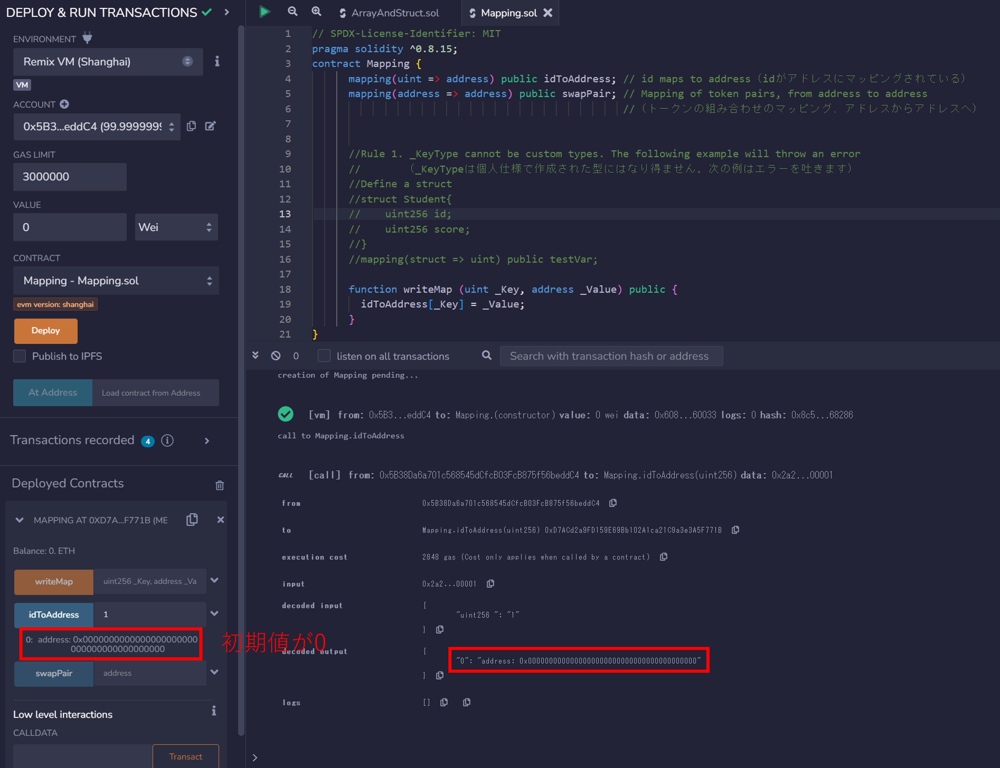
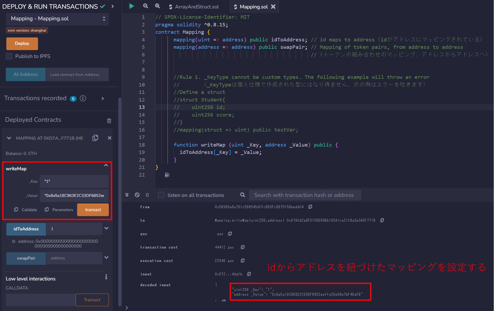

# WTF Solidity 超シンプル入門: 7. Mapping

最近、Solidity の学習を再開し、詳細を確認しながら「Solidity 超シンプル入門」を作っています。これは初心者向けのガイドで、プログラミングの達人向けの教材ではありません。毎週 1〜3 レッスンのペースで更新していきます。

僕のツイッター：[@0xAA_Science](https://twitter.com/0xAA_Science)｜[@WTFAcademy\_](https://twitter.com/WTFAcademy_)

コミュニティ：[Discord](https://discord.gg/5akcruXrsk)｜[Wechat](https://docs.google.com/forms/d/e/1FAIpQLSe4KGT8Sh6sJ7hedQRuIYirOoZK_85miz3dw7vA1-YjodgJ-A/viewform?usp=sf_link)｜[公式サイト wtf.academy](https://wtf.academy)

すべてのソースコードやレッスンは github にて公開: [github.com/AmazingAng/WTFSolidity](https://github.com/AmazingAng/WTFSolidity)

-----

このレクチャーでは、Solidityにおけるハッシュテーブルを紹介します: `mapping`型です。

## Mapping

`mapping`型を使えば、人々は`Key`を使用することによって対応する`Value`を照会することが出来ます。例えば、誰かのウォレットアドレスは`id`によって紹介できます。

`mapping`の宣言フォーマットは`mapping(_KeyType => _ValueType)`となります。そしてそこで`_KeyType`と`_ValueType`というのは、それぞれ`Key`と`Value`の変数型のことです。使用例を見てみましょう:

```solidity
    mapping(uint => address) public idToAddress; // id maps to address（idがアドレスにマッピングされている）
    mapping(address => address) public swapPair; // mapping of token pairs, from address to address
                                                 //（トークンの組み合わせのマッピング、アドレスからアドレスへ）
```

## Rules of `mapping`　（`mapping`の決まり）

- **Rule 1**: `_KeyType`は、例えば` uint `や`address`などのような`solidity`のデフォルトの型の間で選択されます。個人仕様で作成された`struct`は使用できません。しかしながら、`_ValueType`はどんな個人仕様で作成された型でも良いです。次のような例はエラーを吐きます。`_KeyType`が個人仕様で作成されたstruct（構造体）を使用しているからです:

```solidity
      // define a struct（構造体を定義）
      struct Student{
          uint256 id;
          uint256 score;
      }
      mapping(Student => uint) public testVar;
```

- **Rule 2**: mapping（マッピング）の格納場所は`storage`でなければなりません: 関数の中で状態変数か`storage`変数として動作します。しかし引数や`public`関数の返す結果としては使用できません。

- **Rule 3**: もしmapping（マッピング）が`public`として宣言されるのならば、Solidityは自動的に`Key`によって`Value`が照会できるように自動的に`getter`関数を作成することになります。

- **Rule 4**：mapping（マッピング）にキーと値のペアを追加する文法は`_Var[_Key] = _Value`です。そしてそこで`_Var`はmapping（マッピング）変数の名前であり、`_Key`と`_Value`は新しいキーと値の組み合わせに対応しています。使用例を見てみましょう:

```solidity
    function writeMap (uint _Key, address _Value) public {
        idToAddress[_Key] = _Value;
      }
```

## Principle of `mapping` （`mapping`の原則）

- **Principle 1**: mapping（マッピング）は`Key`情報や長さの情報を保有していません。

- **Principle 2**: mapping（マッピング）は`keccak256(key)`をvalueにアクセスするオフセットとして使用します。（即ち、mapping（マッピング）がキーをkeccak256ハッシュ関数に通すことで、対応する値へのオフセット（値が保存されている場所）を計算し、そのオフセットを使用して値にアクセスするという意味です）

- **Principle 3**: Ethereumが全ての未使用のスペースを0と定義している為、`value`が代入されていない全ての`key`は0という初期値を持つことになります。

## Verify on Remix (use `Mapping.sol` as an example)　（Remixによる検証　（`Mapping.sol`を例に使用してみましょう））

- `Mapping.sol`をデプロイする

    

- マッピングである`idToAddress`の初期値をチェックする

    

- 新たらしいキーと値の組み合わせを書き込む

    


## まとめ

この章では、Solidityの`mapping`型を紹介しました。ここまでで、一般的な変数型の全ての種類について学んできましたよ。
