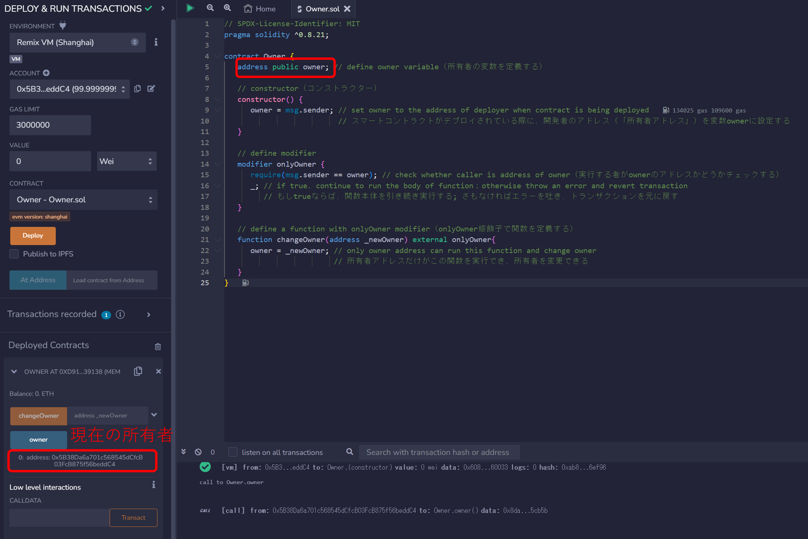
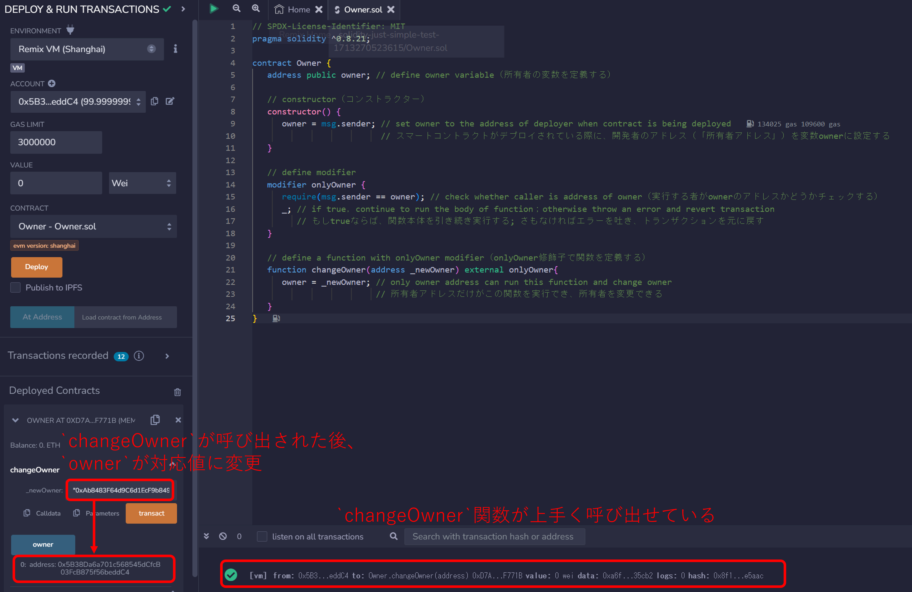
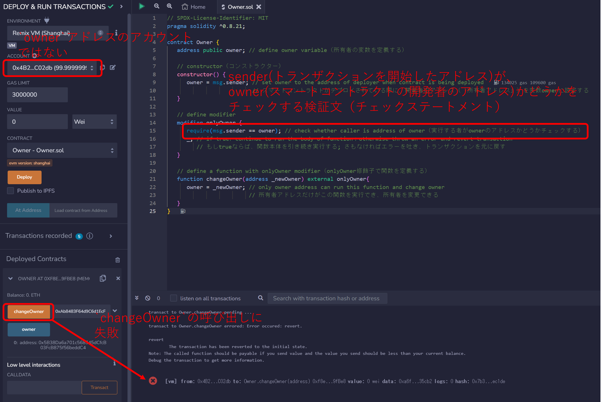

# WTF Solidity 超シンプル入門: 11. Constructor & Modifier
# <code>&nbsp;&nbsp;&nbsp;&nbsp;&nbsp;&nbsp;&nbsp;&nbsp;&nbsp;&nbsp;&nbsp;&nbsp;&nbsp;&nbsp;&nbsp;&nbsp;&nbsp;&nbsp;&nbsp;&nbsp;&nbsp;&nbsp;&nbsp;&nbsp;</code>（コンストラクターと修飾子）

最近、Solidity の学習を再開し、詳細を確認しながら「Solidity 超シンプル入門」を作っています。これは初心者向けのガイドで、プログラミングの達人向けの教材ではありません。毎週 1〜3 レッスンのペースで更新していきます。

僕のツイッター：[@0xAA_Science](https://twitter.com/0xAA_Science)｜[@WTFAcademy\_](https://twitter.com/WTFAcademy_)

コミュニティ：[Discord](https://discord.gg/5akcruXrsk)｜[Wechat](https://docs.google.com/forms/d/e/1FAIpQLSe4KGT8Sh6sJ7hedQRuIYirOoZK_85miz3dw7vA1-YjodgJ-A/viewform?usp=sf_link)｜[公式サイト wtf.academy](https://wtf.academy)

すべてのソースコードやレッスンは github にて公開: [github.com/AmazingAng/WTFSolidity](https://github.com/AmazingAng/WTFSolidity)

-----

この章では、アクセス制御のスマートコントラクト（`Ownable`）を例として使いながら、Solidityの`constructor`と`modifier`を紹介します。

## Constructor（コンストラクター）
`constructor`はスマートコントラクト開発の最中に一度だけ自動的に実行する特別な関数のことです。スマートコントラクト一つに対し、一つだけ`constructor`を伴わせることが出来ます。例えば`owner`アドレスのように、スマートコントラクトのパラメーターを初期化する為に使うことが出来ます:

```solidity
   address owner; // define owner variable（所有者の変数を定義する）

   // constructor（コンストラクター）
   constructor() {
      owner = msg.sender; //  set owner to the deployer address
                          //（スマートコントラクトがデプロイされている際に、開発者のアドレス（「所有者アドレス」）を変数ownerに設定する）
   }
```

**注記**: Solidityのコンストラクターの構文はバージョンによって一貫性がありません: `solidity 0.4.22`の前のバージョンでは、コンストラクターは`constructor`キーワードを使用していませんでした。その代わり、コンストラクターはコントラクト名と同じ名前を持っていました。この古い構文はミスを引き起こしやすいものとなっています: 開発者は誤ってコントラクトには`Parents`と名付けたにも関わらず、コンストラクターを`parents`と名付けるかもしれません。そこで、`0.4.22`以降のバージョンにおいては、新しい`constructor`キーワードが使用されるようになりました。`solidity 0.4.22`より前のコンストラクターの例:

```solidity
pragma solidity = 0.4.21;
contract Parents {
    // The function with the same name as the contract name(Parents) is constructor
    //（コントラクト名(Parents)と同じ名前の関数がコンストラクター
    function Parents () public {
    }
}
```

## Modifier（修飾子）
`modifier`はオブジェクト指向プログラミングにおける`decorator`に似ていて、関数の専用のプロパティを宣言する為に使用し、ソースコードの冗長性を削減できます。`modifier`はMarvelに例えると、関数にとってアイアンマンのアーマー（鎧）です: `modifier`付き関数は何らかの魔法のような特性を持つことになります。`modifier`のポピュラーなユースケースは関数へのアクセスを制限するなどです。


`onlyOwner`と呼ばれる修飾子を定義してみましょう。`onlyOwner`付きの関数は`owner`からのみ呼び出せます:
```solidity
   // define modifier
   modifier onlyOwner {
      require(msg.sender == owner); // check whether caller is address of owner（実行する者がownerのアドレスかどうかチェックする）
      _; // execute the function body（関数本体を実行）
   }
```

次に、`changeOwner`付き関数を定義してみましょう。それはコントラクトの`owner`を変更することが出来ます。しかしながら、`onlyOwner`修飾子により、元の`owner`だけが`changeOwner`付き関数を呼び出すことが出来ます。これはスマートコントラクトにおいて、アクセス制御を行う最も一般的な方法です。

```solidity
   function changeOwner(address _newOwner) external onlyOwner{
      owner = _newOwner; // only the owner address can run this function and change the owner
                         //（所有者アドレスだけがこの関数を実行でき、所有者を変更できる）
   }
```

### OpenZeppelin's implementation of Ownable（OpenZeppelinでのOwnableの実装）：
`OpenZeppelin`は`Solidity`の為の標準化されたコードベースを維持する組織です（安全で効率的なスマートコントラクト開発のための一連のコードとライブラリを提供している）。彼らの`Ownable`の標準的な実装は[this link](https://github.com/OpenZeppelin/openzeppelin-contracts/blob/master/contracts/access/Ownable.sol)にあります。

## Remix Demo example
さて、例として`Owner.sol`を挙げます。
1. Remixでソースコードをコンパイルしてデプロイしてください。
2. 現在の所有者（owner、オーナー）を見るために`owner`ボタンをクリックしてください。
    
3. `changeOwner`関数がオーナーアドレス（スマートコントラクト開発者のアドレス）のユーザーに呼び出された際に、トランザクションは成功します。
    
4. `changeOwner`関数が他人のアドレスによって呼び出された際には、トランザクションが失敗します。
    


## まとめ
このレクチャーでは、Solidityの`constructor`と`modifier`を紹介し、スマートコントラクトへのアクセスを制御する`Ownable`スマートコントラクトを書きました。
