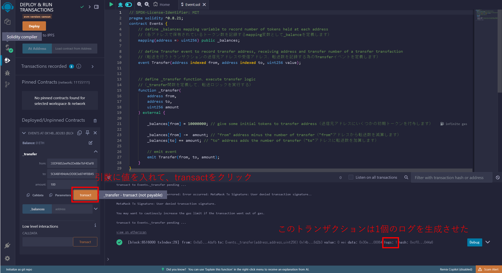
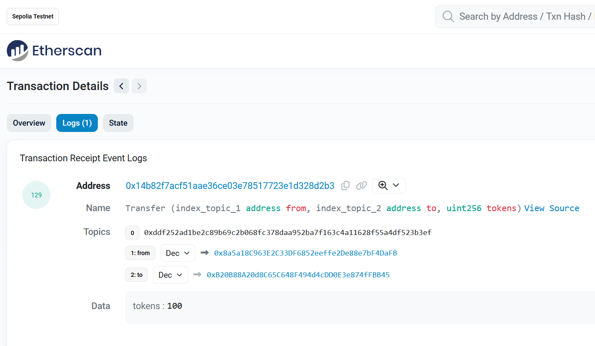

# WTF Solidity 超シンプル入門: 12. Events（イベント）

最近、Solidity の学習を再開し、詳細を確認しながら「Solidity 超シンプル入門」を作っています。これは初心者向けのガイドで、プログラミングの達人向けの教材ではありません。毎週 1〜3 レッスンのペースで更新していきます。

僕のツイッター：[@0xAA_Science](https://twitter.com/0xAA_Science)｜[@WTFAcademy\_](https://twitter.com/WTFAcademy_)

コミュニティ：[Discord](https://discord.gg/5akcruXrsk)｜[Wechat](https://docs.google.com/forms/d/e/1FAIpQLSe4KGT8Sh6sJ7hedQRuIYirOoZK_85miz3dw7vA1-YjodgJ-A/viewform?usp=sf_link)｜[公式サイト wtf.academy](https://wtf.academy)

すべてのソースコードやレッスンは github にて公開: [github.com/AmazingAng/WTFSolidity](https://github.com/AmazingAng/WTFSolidity)

-----

この章では、ERC20のトークンを例として使い、Solidityにおける`event`を紹介します。

## Events（イベント）
`solidity`におけるイベントは`EVM`(Ethereum Virtual Machine)に格納されるトランザクションログです。それらは関数が呼び出される際に発生し、コントラクトアドレスでアクセスできます。イベントは2つの性質を持っています :

- 即応性がある: アプリケーション（例えば[`ether.js`](https://learnblockchain.cn/docs/ethers.js/api-contract.html#id18)）は`RPC`インターフェースを通して、購読し（検知）し監視（追跡）することができ、フロントエンドで応答することができる。
- 経済的である: イベントにデータを格納するのは安く、大体一度に2,000`gas`位掛かります。それに比べて、オンチェーンに新しい変数を格納するのは少なくとも20,000`gas`かかります。

### Declare events（イベントを宣言する）
イベントは`event`キーワードで宣言され、イベントの名前、そして記録されるそれぞれのパラメーターの型と名前が続きます。例として`ERC20`トークンのコントラクトから`Transfer`イベントを取り上げてみましょう。
```solidity
event Transfer(address indexed from, address indexed to, uint256 value);
```
`Transfer`イベントは３つのパラメーターを記録します: `from`と`to`、そして`value`です。それぞれ、それらはトークンが送信される元のアドレス、受信アドレス、そして送金されるトークンの数に相当しています。パラメーターの`from`と`to`は`indexed`キーワードで印が付けられており、`topics`として知られている特別なデータ構造に格納され、プログラムによって容易に照会されます。

### Emit events（イベントを発生させる）

関数の中でイベントを発生させることが出来ます。次に続く例において、`_transfer()`関数が呼び出される度に、`Transfer`イベントは発生させられ、対応するパラメーターが記録されます。
```solidity
    // define _transfer function， execute transfer logic（_transfer関数を定義し、転送ロジックを実行する）
    function _transfer(
        address from,
        address to,
        uint256 amount
    ) external {

        _balances[from] = 10000000; // give some initial tokens to transfer address（転送元アドレスに幾らかの初期トークンを付与する）

        _balances[from] -=  amount; // "from" address minus the number of transfer（"from"アドレスは転送させる数を減算する）
        _balances[to] += amount; // "to" address adds the number of transfer（"to"アドレスは転送させる数を加算する）

        // emit event（イベントを発生させる）
        emit Transfer(from, to, amount);
    }
```

## EVM Log

EVMはSolidityのイベントを保管する為に`Log`を使用します。各ログは2つの部品を含んでいます: `topics`と`data`です。


### `Topics`

`Topics`はイベントを記述する為に使用されます。各イベントは最大で4つのtopicsを含めることが可能です。典型的に、最初の`topic`はイベントハッシュです: イベントシグネチャのハッシュです。`Transfer`イベントのイベントハッシュは次のように計算されます:

```solidity
keccak256("Transfer(addrses,address,uint256)")

//0xddf252ad1be2c89b69c2b068fc378daa952ba7f163c4a11628f55a4df523b3ef
```

イベントハッシュに加えて、`topics`は最大で3つのindex`indexed`パラメーターを含めることが可能です。例えば、`Transfer`イベントにおける`from`と`to`パラメーターのようなものです。匿名イベント（イベントの記述に"anonymous"を付与）は特別です: イベント名を持ちませんし、最大で4つの`indexed`パラメーターを持つことが出来ます。

`indexed`パラメーターはイベントの索引付けされた"key"として理解することが出来ます。そしてそれは容易にプログラムによって照会されることが出来ます。各`indexed`パラメーターのサイズは32バイトです。`array`や`string`のような32バイトよりも大きなパラメーターに関しては、基礎となるデータのハッシュが格納されます。（非基本型（例：配列や構造体）の場合、そのデータ自体ではなく、そのデータのKeccak-256ハッシュが格納される）

### `Data`

索引付けされていないパラメーターはログの`data`セクションに格納されます。それらはイベントの"value"として解釈され、直接取得することは出来ません。しかしそれらはより大きいサイズのデータを格納することが出来ます。それゆえに、`data`セクションは、`array`や`string`と言った複雑なデータ構造を格納する為に使用されます。これらのデータは256ビットを超えるため、イベントのtopics部分に格納される場合でも、ハッシュ化された形で保存されます。その上、`data`は`topic`に較べてより少ないガスを消費します。

## Remix Demo
`Event.sol`コントラクトを例として見てみましょう。

1. `Event`コントラクトをデプロイします。

2. `Transfer`イベントを発生させる為に、`_transfer`関数を呼び出します。



3. 発生させられたイベントをチェックする為に、トランザクションの詳細情報を確認します。


### Etherscanでイベントを照会する

イーサスキャン（Etherscan）はイーサリアムのブロックチェーン上にあるトランザクションやスマートコントラクト、それ以上のことを見ることが出来るブロックエクスプローラーです。先ず、私はRinkebyやGoerliなどのイーサリアムテストネットにコントラクトをデプロイしました。次に、私は100トークン送金する為に`_transfer`関数を呼び出しました。その後で、トランザクションの詳細情報を`etherscan`で確認することが出来ます：[URL](https://rinkeby.etherscan.io/tx/0x8cf87215b23055896d93004112bbd8ab754f081b4491cb48c37592ca8f8a36c7)

イベントの詳細情報を確認する為に`Logs`ボタンをクリックします：  



`Topics`には3つの要素があります: `[0]`はイベントのハッシュであり、`[1]`と`[2]`は`Transfer`イベントで定義されている`indexed`パラメーターです（即ち、`from`と`to`です）。`Data`にある要素は索引付けされていないパラメーター`amount`です。

## まとめ
このレクチャーでは、`Solidity`におけるイベントを使用し、照会する方法について紹介しました。`Dune Analytics`のような、多くのオンチェーンの分析ツールは、solidityのイベントに基いています。
