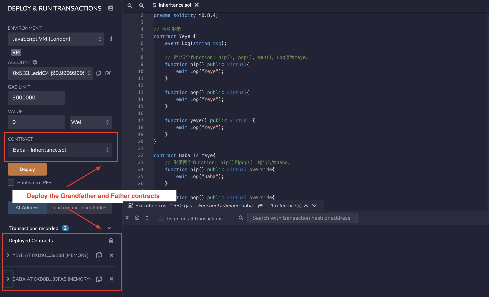
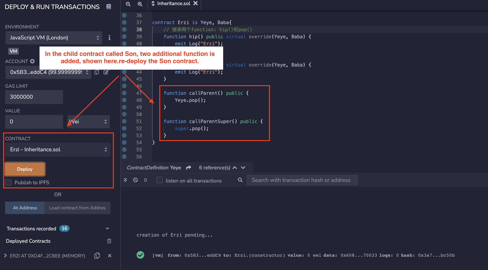
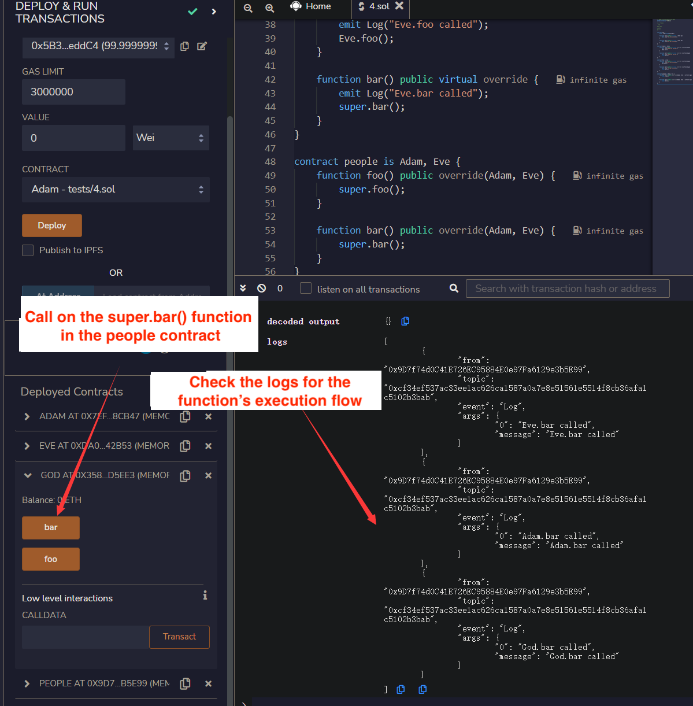

# WTF Solidity Tutorial: 13. Inheritance

最近、Solidity の学習を再開し、詳細を確認しながら「Solidity 超シンプル入門」を作っています。これは初心者向けのガイドで、プログラミングの達人向けの教材ではありません。毎週 1〜3 レッスンのペースで更新していきます。

僕のツイッター：[@0xAA_Science](https://twitter.com/0xAA_Science)｜[@WTFAcademy\_](https://twitter.com/WTFAcademy_)

コミュニティ：[Discord](https://discord.gg/5akcruXrsk)｜[Wechat](https://docs.google.com/forms/d/e/1FAIpQLSe4KGT8Sh6sJ7hedQRuIYirOoZK_85miz3dw7vA1-YjodgJ-A/viewform?usp=sf_link)｜[公式サイト wtf.academy](https://wtf.academy)

すべてのソースコードやレッスンは github にて公開: [github.com/AmazingAng/WTFSolidity](https://github.com/AmazingAng/WTFSolidity)

-----

この章では、単純継承、多重継承、そして修飾子とコンストラクターの継承を含むSolidityの`inheritance`を紹介します。

## Inheritance（継承）
継承はオブジェクト指向プログラミングの核となるコンセプトの一つであり、コードの冗長性を大幅に削減することができます。属性とメソッドのセットを共有するクラスの階層によって、他のクラスからあるクラスを派生させることが出来る仕組みです。Solidityでは、スマートコントラクトは継承をサポートするオブジェクトとして見做すことが出来ます。

### Rules（決まり）

Solidityでは、継承の為に２つの重要なキーワードがあります:

- `virtual`: もし、親コントラクトにある関数がその子コントラクトでオーバーライドされることが予期されるのであれば、その関数は`virtual`として宣言されるべきである。

- `override`：もし、子コントラクトにある関数がその親コントラクトにある関数をオーバーライドするのであれば、`override`として宣言されるべきである。

**注記 1**: もし、関数が他の関数をオーバーライドし、またオーバーライドされることが予期される場合、`virtual override`としてラベル付けされるべきである。

**注記 2**: もし、`public`の状態変数が`override`としてラベル付けされている場合、その`getter`関数はオーバーライドされるでしょう。例えば次の通りです:

```solidity
mapping(address => uint256) public override balanceOf;
```

### Simple inheritance（単純継承）

1つの`Log`イベントと３つの関数を含む1つの単純な`Grandfather`コントラクトを書くことで始めてみましょう:string型の`"Grandfather"`を出力する`hip()`と`pop()`、そして`Grandfather()`です。

```solidity
contract Grandfather {
    event Log(string msg);

    // Apply inheritance to the following 3 functions: hip(), pop(), man()，then log "Grandfather".
    function hip() public virtual{
        emit Log("Grandfather");
    }

    function pop() public virtual{
        emit Log("Grandfather");
    }

    function Grandfather() public virtual {
        emit Log("Grandfather");
    }
}
```

`Grandfather`コントラクトを継承する`Father`と呼ばれるもう1つのコントラクトを定義しましょう。継承の構文は`contract Father is Grandfather`であり、とても直感的です。`Father`コントラクトでは、`override`キーワードを用いて関数`hip()`と`pop()`を書き直します。その結果、それらの出力を`"Father"`へと変更します。string型の`"Father"`を出力する`father`と呼ばれる新しい関数も追加します。
Let's define another contract called `Father`, which inherits the `Grandfather` contract. The syntax for inheritance is `contract Father is Grandfather`, which is very intuitive. In the `Father` contract, we rewrote the functions `hip()` and `pop()` with the `override` keyword, changing their output to `"Father"`. We also added a new function called `father`, which outputs a string `"Father"`.


```solidity
contract Father is Grandfather{
    // Apply inheritance to the following 2 functions: hip() and pop()， then change the log value to "Father".
    function hip() public virtual override{
        emit Log("Father");
    }

    function pop() public virtual override{
        emit Log("Father");
    }

    function father() public virtual{
        emit Log("Father");
    }
}
```

After deploying the contract, we can see that `Father` contract contains 4 functions. The outputs of `hip()` and `pop()` are successfully rewritten with output `"Father"`, while the output of the inherited `grandfather()` function is still `"Grandfather"`.


### Multiple inheritance

A solidity contract can inherit multiple contracts. The rules are:

1. For multiple inheritance, parent contracts should be ordered by seniority, from the highest to the lowest. For example: `contract Son is Grandfather, Father`. A error will be thrown if the order is not correct.

2. If a function exists in multiple parent contracts, it must be overridden in the child contract, otherwise an error will occur.

3. When a function exists in multiple parent contracts, you need to put all parent contract names after the `override` keyword. For example: `override(Grandfather, Father)`.

Example：
```solidity
contract Son is Grandfather, Father{
    // Apply inheritance to the following 2 functions: hip() and pop()， then change the log value to "Son".
    function hip() public virtual override(Grandfather, Father){
        emit Log("Son");
    }

    function pop() public virtual override(Grandfather, Father) {
        emit Log("Son");
    }
```

After deploying the contract, we can see that we successfully rewrote the `hip()` and `pop()` functions in the `Son` contract, changing the output to `"Son"`. While the `Grandfather()` and `father()` functions inherited from its parent contracts remain unchanged.

### Inheritance of modifiers

Likewise, modifiers in Solidity can be inherited as well. Rules for modifier inheritance are similar to the function inheritance, using the `virtual` and `override` keywords.

```solidity
contract Base1 {
    modifier exactDividedBy2And3(uint _a) virtual {
        require(_a % 2 == 0 && _a % 3 == 0);
        _;
    }
}

contract Identifier is Base1 {
    // Calculate _dividend/2 and _dividend/3, but the _dividend must be a multiple of 2 and 3
    function getExactDividedBy2And3(uint _dividend) public exactDividedBy2And3(_dividend) pure returns(uint, uint) {
        return getExactDividedBy2And3WithoutModifier(_dividend);
    }

    // Calculate _dividend/2 and _dividend/3
    function getExactDividedBy2And3WithoutModifier(uint _dividend) public pure returns(uint, uint){
        uint div2 = _dividend / 2;
        uint div3 = _dividend / 3;
        return (div2, div3);
    }
}
```

`Identifier` contract can directly use the `exactDividedBy2And3` modifier because it inherits the `Base1` contract. We can also rewrite the modifier in the contract:

```solidity
    modifier exactDividedBy2And3(uint _a) override {
        _;
        require(_a % 2 == 0 && _a % 3 == 0);
    }
```

### Inheritance of constructors

Constructors can also be inherited. Let first consider a parent contract `A` with a state variable `a`, which is initialized in its constructor:

```solidity
// Applying inheritance to the constructor functions
abstract contract A {
    uint public a;

    constructor(uint _a) {
        a = _a;
    }
}
```

There are two ways for a child contract to inherit the constructor from its parent `A`: 
1. Declare the parameters of the parent constructor at inheritance: 

    ```solidity
    contract B is A(1){}
    ```

2. Declare the parameter of the parent constructor in the constructor of the child contract:

    ```solidity
    contract C is A {
        constructor(uint _c) A(_c * _c) {}
    }
    ```

### Calling the functions from the parent contracts

There are two ways for a child contract to call the functions of the parent contract:

1. Direct calling：The child contract can directly call the parent's function with `parentContractName.functionName()`. For example:

    ```solidity
        function callParent() public{
            Grandfather.pop();
        }
    ```

2. `super` keyword：The child contract can use the `super.functionName()` to call the function in the neareast parent contract in the inheritance hierarchy. Solidity inheritance is declared in a right-to-left order: for `contract Son is Grandfather, Father`, the `Father` contract is closer than the `Grandfather` contract. Thus, `super.pop()` in the `Son` contract will call `Father.pop()` but not `Grandfather.pop()`.

    ```solidity
        function callParentSuper() public{
            // call the function one level higher up in the inheritance hierarchy
            super.pop();
        }
    ```

### Diamond inheritance 

In Object-Oriented Programming, diamond inheritance refers to the scenario in which a derived class has two or more base classes.

When using the `super` keyword on a diamond inheritance chain, it should be noted that it will call the relevant function of each contract in the inheritance chain, not just the nearest parent contract.

First, we write a base contract called `God`. Then we write two contracts `Adam` and `Eve` inheriting from the `God` contract. Lastly, we write another contract `people` inheriting from `Adam` and `Eve`. Each contract has two functions, `foo()` and `bar()`:

```solidity
// SPDX-License-Identifier: MIT
pragma solidity ^0.8.13;

/* Inheritance tree visualized：
  God
 /  \
Adam Eve
 \  /
people
*/
contract God {
    event Log(string message);
    function foo() public virtual {
        emit Log("God.foo called");
    }
    function bar() public virtual {
        emit Log("God.bar called");
    }
}
contract Adam is God {
    function foo() public virtual override {
        emit Log("Adam.foo called");
        Adam.foo();
    }
    function bar() public virtual override {
        emit Log("Adam.bar called");
        super.bar();
    }
}
contract Eve is God {
    function foo() public virtual override {
        emit Log("Eve.foo called");
        Eve.foo();
    }
    function bar() public virtual override {
        emit Log("Eve.bar called");
        super.bar();
    }
}
contract people is Adam, Eve {
    function foo() public override(Adam, Eve) {
        super.foo();
    }
    function bar() public override(Adam, Eve) {
        super.bar();
    }
}
```

In this example, calling the `super.bar()` function in the `people` contract will call the `Eve`, `Adam`, and `God` contract's `bar()` function, which is different from ordinary multiple inheritance.

Although `Eve` and `Adam` are both child contracts of the `God` parent contract, the `God` contract will only be called once in the whole process. This is because Solidity borrows the paradigm from Python, forcing a DAG (directed acyclic graph) composed of base classes to guarantee a specific order based on C3 Linearization. For more information on inheritance and linearization, read the official [Solidity docs here](https://docs.soliditylang.org/en/v0.8.17/contracts.html#multiple-inheritance-and-linearization).

## Verify on Remix
1. After deploying example contract in Simple Inheritance session, we can see that the `Father` contract has `Grandfather` functions:

  

  

2. Modifier inheritance examples:

  
  
  
  
  
  
3. Inheritance of constructors:

  
  
  
  
4. Calling the functions from parent contracts:

  
  
  
  
5. Diamond inheritance:

   

## Summary
In this tutorial, we introduced the basic uses of inheritance in Solidity, including simple inheritance, multiple inheritance, inheritance of modifiers and constructors, and calling functions from parent contracts.
