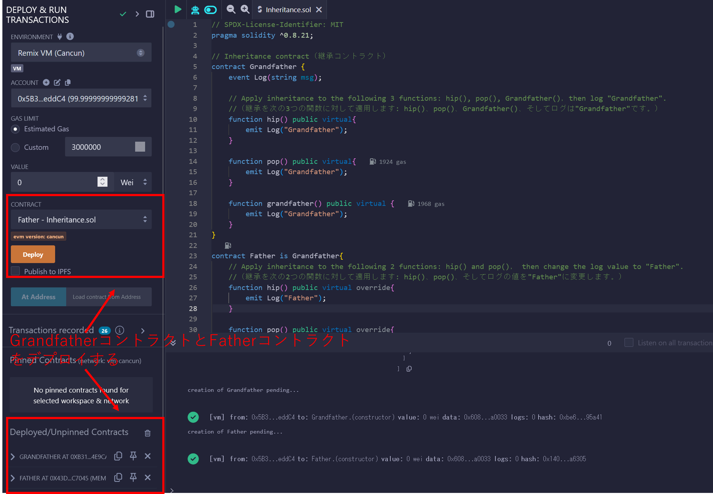
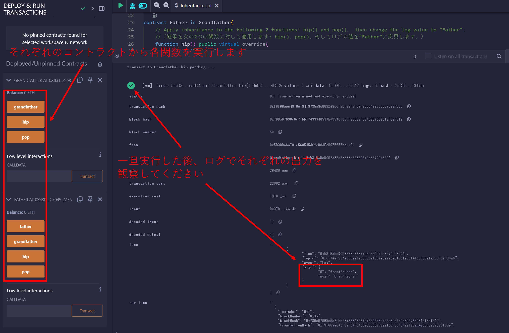
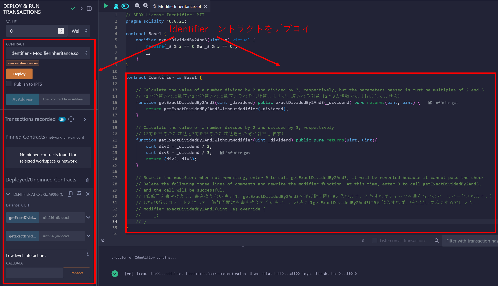
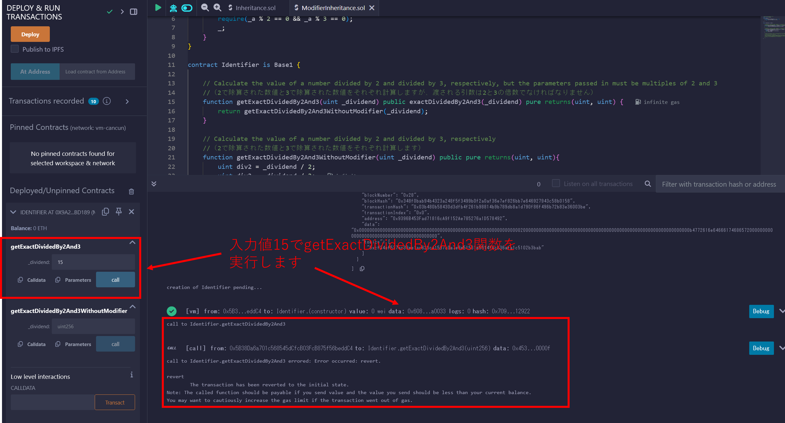
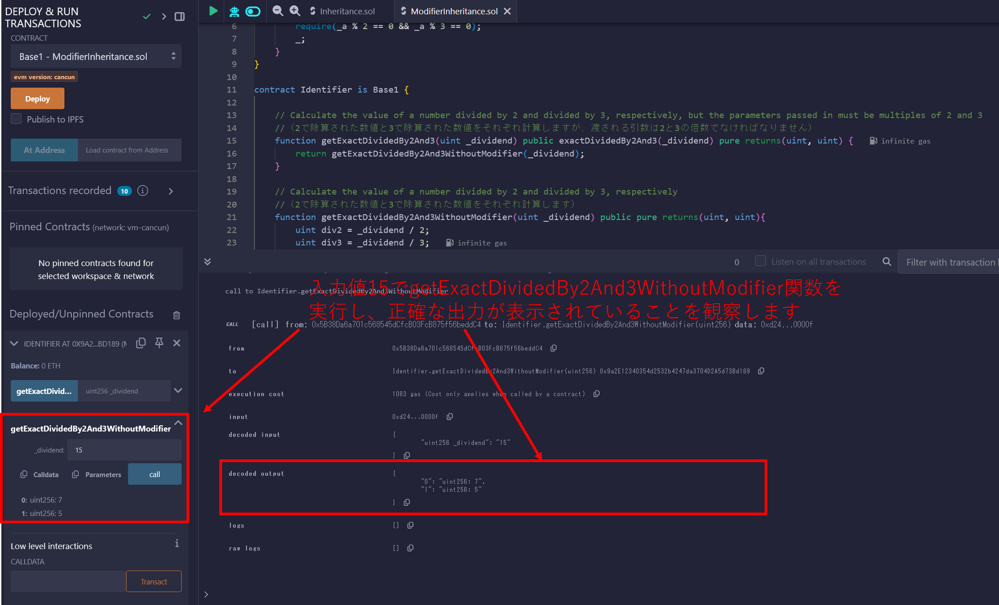
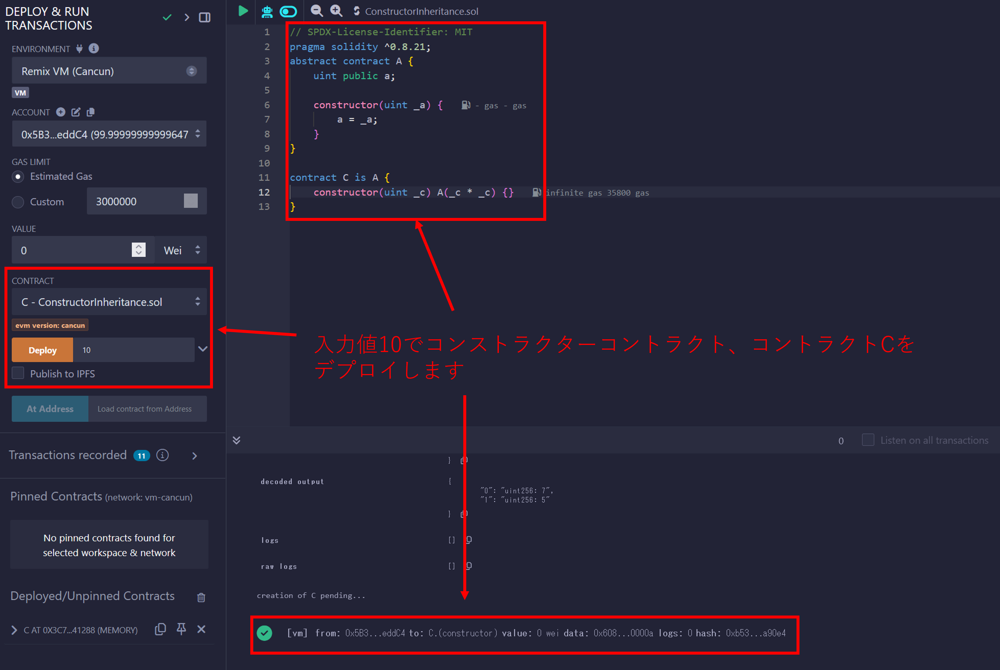
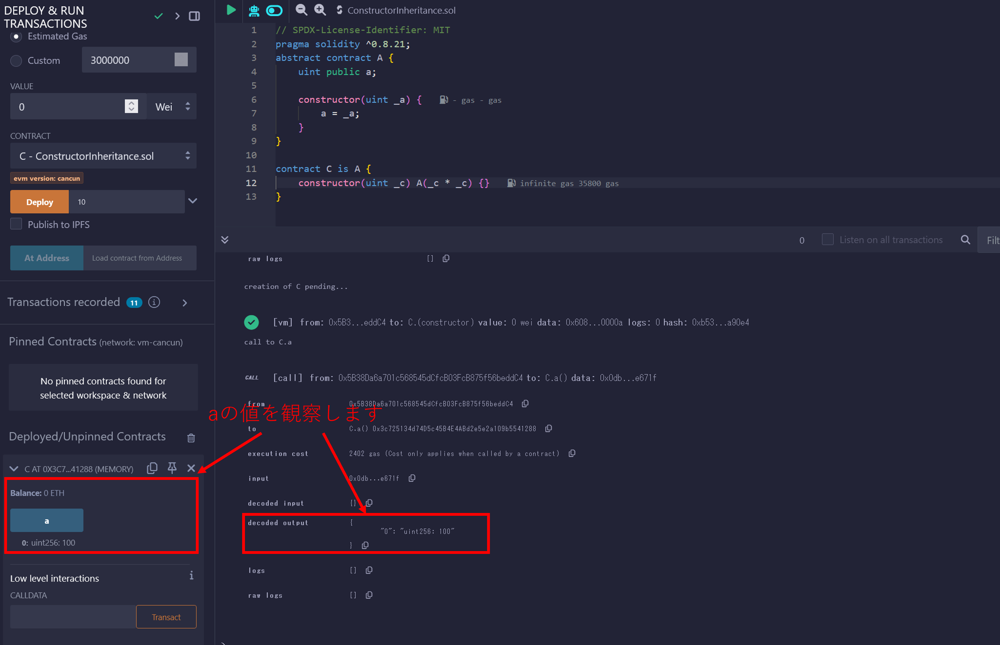
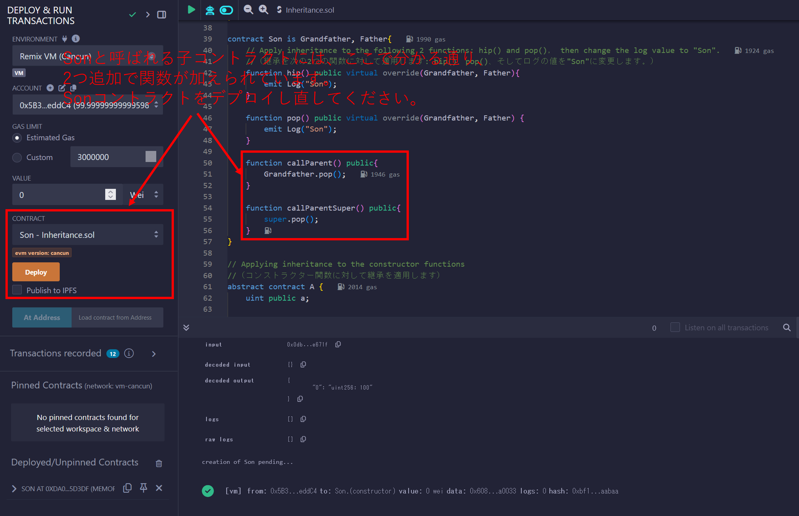
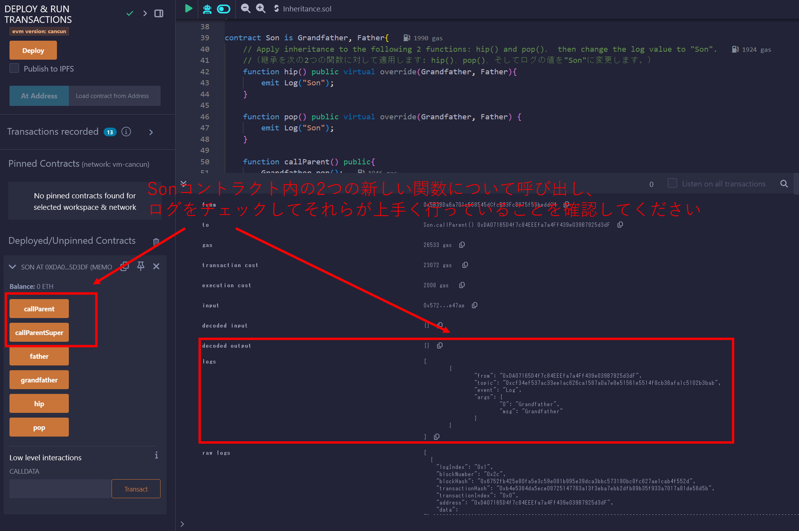
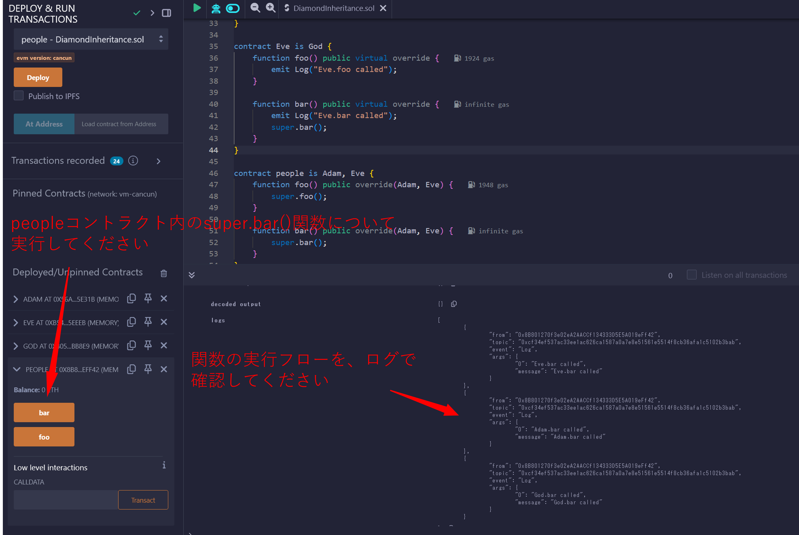

# WTF Solidity 超シンプル入門: 13. Inheritance（インターフェース）

最近、Solidity の学習を再開し、詳細を確認しながら「Solidity 超シンプル入門」を作っています。これは初心者向けのガイドで、プログラミングの達人向けの教材ではありません。毎週 1〜3 レッスンのペースで更新していきます。

僕のツイッター：[@0xAA_Science](https://twitter.com/0xAA_Science)｜[@WTFAcademy\_](https://twitter.com/WTFAcademy_)

コミュニティ：[Discord](https://discord.gg/5akcruXrsk)｜[Wechat](https://docs.google.com/forms/d/e/1FAIpQLSe4KGT8Sh6sJ7hedQRuIYirOoZK_85miz3dw7vA1-YjodgJ-A/viewform?usp=sf_link)｜[公式サイト wtf.academy](https://wtf.academy)

すべてのソースコードやレッスンは github にて公開: [github.com/AmazingAng/WTFSolidity](https://github.com/AmazingAng/WTFSolidity)

-----

この章では、単純継承、多重継承、そして修飾子とコンストラクターの継承を含むSolidityの`inheritance`を紹介します。

## Inheritance（継承）
継承はオブジェクト指向プログラミングの核となるコンセプトの一つであり、コードの冗長性を大幅に削減することができます。属性とメソッドのセットを共有するクラスの階層によって、他のクラスからあるクラスを派生させることが出来る仕組みです。Solidityでは、スマートコントラクトは継承をサポートするオブジェクトとして見做すことが出来ます。

### Rules（決まり）

Solidityでは、継承の為に２つの重要なキーワードがあります:

- `virtual`: もし、親コントラクトにある関数がその子コントラクトでオーバーライドされることが予期されるのであれば、その関数は`virtual`として宣言されるべきである。

- `override`：もし、子コントラクトにある関数がその親コントラクトにある関数をオーバーライドするのであれば、`override`として宣言されるべきである。

**注記 1**: もし、関数が他の関数をオーバーライドし、またオーバーライドされることが予期される場合、`virtual override`としてラベル付けされるべきである。

**注記 2**: もし、`public`の状態変数が`override`としてラベル付けされている場合、その`getter`関数はオーバーライドされるでしょう。例えば次の通りです:

```solidity
mapping(address => uint256) public override balanceOf;
```

### Simple inheritance（単純継承）

1つの`Log`イベントと３つの関数を含む1つの単純な`Grandfather`コントラクトを書くことで始めてみましょう:string型の`"Grandfather"`を出力する`hip()`と`pop()`、そして`Grandfather()`です。

```solidity
contract Grandfather {
    event Log(string msg);

    // Apply inheritance to the following 3 functions: hip(), pop(), Grandfather()，then log "Grandfather".
    //（継承を次の3つの関数に対して適用します: hip()、pop()、Grandfather()、そしてログは"Grandfather"です。）
    function hip() public virtual{
        emit Log("Grandfather");
    }

    function pop() public virtual{
        emit Log("Grandfather");
    }

    function Grandfather() public virtual {
        emit Log("Grandfather");
    }
}
```

`Grandfather`コントラクトを継承する`Father`と呼ばれるもう1つのコントラクトを定義しましょう。継承の構文は`contract Father is Grandfather`であり、とても直感的です。`Father`コントラクトでは、`override`キーワードを用いて関数`hip()`と`pop()`を書き直します。その結果、それらの出力を`"Father"`へと変更します。string型の`"Father"`を出力する`father`と呼ばれる新しい関数も追加します。


```solidity
contract Father is Grandfather{
    // Apply inheritance to the following 2 functions: hip() and pop()， then change the log value to "Father".
    //（継承を次の2つの関数に対して適用します: hip()、pop()、そしてログの値を"Father"に変更します。）
    function hip() public virtual override{
        emit Log("Father");
    }

    function pop() public virtual override{
        emit Log("Father");
    }

    function father() public virtual{
        emit Log("Father");
    }
}
```

コントラクトをデプロイした後で、`Father`コントラクトが4つの関数を含んでいることが分かります。継承された`grandfather()`関数の出力が`"Grandfather"`のままである一方で、`hip()`と`pop()`の出力は`"Father"`の出力で上手く書き換えられています。


### 多重継承

Solidityのコントラクトは複数のコントラクトを継承することが出来ます。ルールは次の通りです:

1. 多重継承の場合、親コントラクトは先行度の高いものから低いものへと順序付けられるべきです。例えば: `contract Son is Grandfather, Father`。順序が不正確の場合、エラーが出ます。

2. もし、多重の親コントラクトに関数が存在している場合、子コントラクトでオーバーライドされるべきです。さもなければ、エラーが発生してしまいます。

3. 多重の親コントラクトに関数が存在している時、`override`キーワードの後に全ての親コントラクトの名前を付加する必要があります。例えば: `override(Grandfather, Father)`。

Example：
```solidity
contract Son is Grandfather, Father{
    // Apply inheritance to the following 2 functions: hip() and pop()， then change the log value to "Son".
    //（継承を次の2つの関数に対して適用します: hip()、pop()、そしてログの値を"Son"に変更します。）
    function hip() public virtual override(Grandfather, Father){
        emit Log("Son");
    }

    function pop() public virtual override(Grandfather, Father) {
        emit Log("Son");
    }
```

コントラクトをデプロイした後、`hip()`と`pop()`関数の出力が`"Son"`に変わっており、`Son`コントラクトのそれらの関数を上手く書き換えられていることが分かります。ところが一方で、その親コントラクトから継承された`Grandfather()`と`father()`関数は変更されないままです。

### 修飾子の継承

同じように、Solidityの修飾子もまた継承することが出来ます。`virtual`と`override`キーワードを使用しますので、修飾子の継承ルールは関数の継承に似ています。

```solidity
contract Base1 {
    modifier exactDividedBy2And3(uint _a) virtual {
        require(_a % 2 == 0 && _a % 3 == 0);
        _;
    }
}

contract Identifier is Base1 {
    // Calculate _dividend/2 and _dividend/3, but the _dividend must be a multiple of 2 and 3
    //（_dividend/2と_dividend/3を計算しますが、_dividendは2と3の倍数でなければなりません）
    function getExactDividedBy2And3(uint _dividend) public exactDividedBy2And3(_dividend) pure returns(uint, uint) {
        return getExactDividedBy2And3WithoutModifier(_dividend);
    }

    // Calculate _dividend/2 and _dividend/3
    //（_dividend/2と_dividend/3を計算します）
    function getExactDividedBy2And3WithoutModifier(uint _dividend) public pure returns(uint, uint){
        uint div2 = _dividend / 2;
        uint div3 = _dividend / 3;
        return (div2, div3);
    }
}
```

`Base1`コントラクトを継承しているので、`Identifier`コントラクトは`exactDividedBy2And3`修飾子を直接使用することが出来ます。コントラクト内で修飾子を書き換えることも出来ます:

```solidity
    modifier exactDividedBy2And3(uint _a) override {
        _;
        require(_a % 2 == 0 && _a % 3 == 0);
    }
```

### コンストラクターの継承

コンストラクターもまた継承されます。まず初めに、状態変数`a`を持つ親コントラクト`A`について考えてみましょう。そのコンストラクターにおいて初期化されています:

```solidity
// Applying inheritance to the constructor functions
//（コンストラクター関数に対して継承を適用します）
abstract contract A {
    uint public a;

    constructor(uint _a) {
        a = _a;
    }
}
```

子コントラクトにはその親コントラクト`A`からコンストラクターを継承する2つの方法があります。
1. 継承時に親コンストラクターのパラメーターを宣言する:

    ```solidity
    contract B is A(1){}
    ```

2. 子コントラクタのコンストラクターにおいて親コンストラクターのパラメーターを宣言する:

    ```solidity
    contract C is A {
        constructor(uint _c) A(_c * _c) {}
    }
    ```

### 親コントラクトから関数を呼び出す

子コントラクトには、親コントラクトの関数を呼び出す2つの方法があります。

1. 直接呼び出す：子コントラクトは`parentContractName.functionName()`によって直接親コントラクトの関数を呼び出すことが出来ます。例えば:

    ```solidity
        function callParent() public{
            Grandfather.pop();
        }
    ```

2. `super`キーワード: 子コントラクトは継承ヒエラルキーで最も近い親コントラクトの関数を呼び出すために`super.functionName()`を用いることが出来ます。Solidityの継承は右から左へという形で宣言されます: `contract Son is Grandfather, Father`という記述方法の場合、`Father`コントラクトは`Grandfather`コントラクトよりも近いです。このようにして、`Son`コントラクトにおける`super.pop()`は`GrandFather.pop()`ではなくて、`Father.pop()`を呼び出すことが出来ます。

    ```solidity
        function callParentSuper() public{
            // call the function one level higher up in the inheritance hierarchy
            //（継承ヒエラルキーにおいて1階層上の関数を呼び出します）
            super.pop();
        }
    ```

### ダイアモンド継承 

オブジェクト指向のプログラミングにおいて、ダイアモンド継承は派生クラスが2つかそれ以上の基底クラスを所有しているというシナリオを指します。

ダイアモンド継承チェーンにおいて`super`キーワードを使用する時、ただ単に最も近い親コントラクトだけではなくて、継承チェーンにある各コントラクトの関連性のある関数を呼び出すということに注意しなければなりません。

最初に、`God`と呼ばれる基底コントラクトを書きます。それから`God`コントラクトから継承している`Adam`と`Eve`という2つのコントラクトを書きます。最後に、`Adam`と`Eve`から継承しているもう一つのコントラクト`people`を書きます。それぞれのコントラクトは、`foo()`と`bar()`という2つの関数を持っています:

```solidity
// SPDX-License-Identifier: MIT
pragma solidity ^0.8.13;

/* Inheritance tree visualized（可視化された継承ツリー）：
  God
 /  \
Adam Eve
 \  /
people
*/
contract God {
    event Log(string message);
    function foo() public virtual {
        emit Log("God.foo called");
    }
    function bar() public virtual {
        emit Log("God.bar called");
    }
}
contract Adam is God {
    function foo() public virtual override {
        emit Log("Adam.foo called");
        Adam.foo();
    }
    function bar() public virtual override {
        emit Log("Adam.bar called");
        super.bar();
    }
}
contract Eve is God {
    function foo() public virtual override {
        emit Log("Eve.foo called");
        Eve.foo();
    }
    function bar() public virtual override {
        emit Log("Eve.bar called");
        super.bar();
    }
}
contract people is Adam, Eve {
    function foo() public override(Adam, Eve) {
        super.foo();
    }
    function bar() public override(Adam, Eve) {
        super.bar();
    }
}
```

この例では、`people`コントラクト内で`super.bar()`関数を呼ぶことは`Eve`そして`Adam`、`God`コントラクトの`bar()`関数を呼び出すことになります。そしてそれは普通の多重継承とは異なります。

`Eve`と`Adam`はどちらも`God`親コントラクトの子コントラクトですが、`God`コントラクトは全体のプロセスにおいて一度だけしか呼ばれません。これは何故ならば、SolidityがPythonからパラダイムを借りているからであり、基底クラスで構成されるDAG（有効非巡回グラフ）にC3 Linearizationに基づく特定の順序を保証させる為です。継承と線形化についてのより多くの情報が欲しければ、次のオフィシャルを読んでください[Solidity docs here](https://docs.soliditylang.org/en/v0.8.17/contracts.html#multiple-inheritance-and-linearization)。

## Verify on Remix（Remixによる検証）
1. 単純継承セッションにおける例となるコントラクトをデプロイした後、`Father`コントラクトが`Grandfather`関数を持っていることが分かります:

  

  

2. 修飾子の継承の例:

  
  
  
  
  
  
3. コンストラクターの継承:

  
  
  
  
4. 親コントラクトから関数を呼ぶ:

  
  
  
  
5. ダイアモンド継承:

   

## まとめ
このチュートリアルでは、単純継承や多重継承、修飾子とコンストラクターの継承と言ったSolidityにおける継承の基礎と親コントラクトから関数の呼び出しについて紹介しました。
