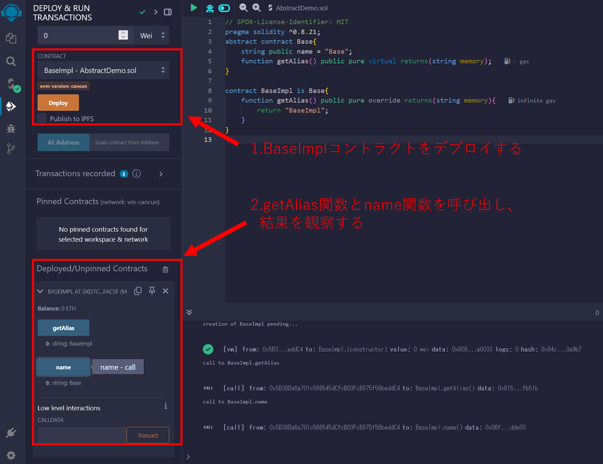
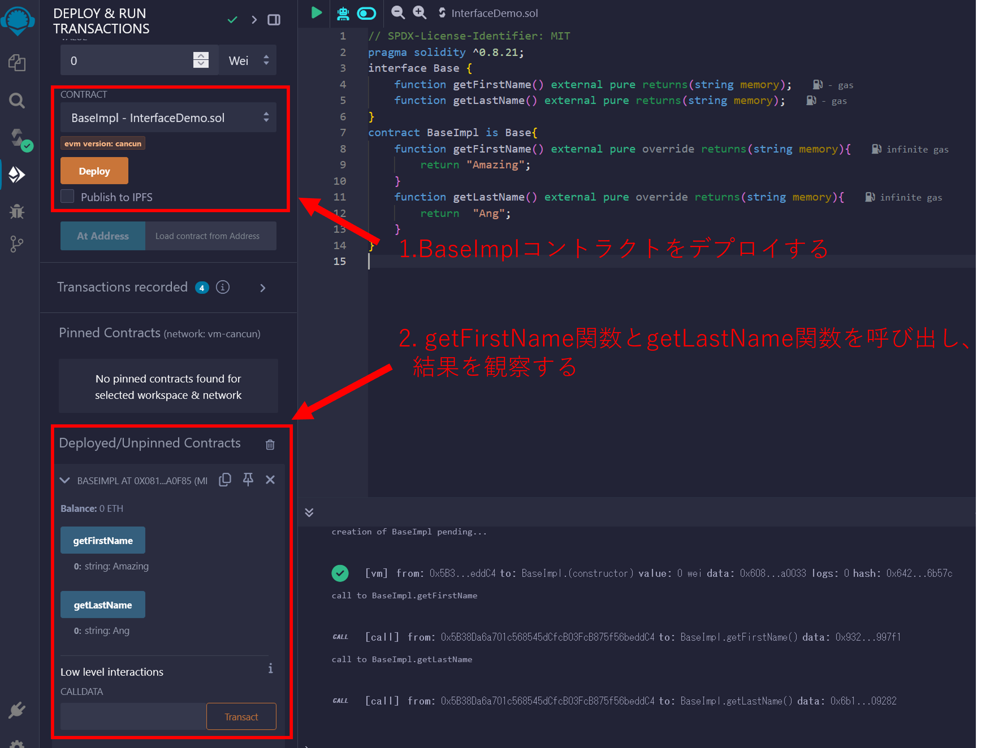

# WTF Solidity 超シンプル入門: 14. Abstract and Interface
# <code>&nbsp;&nbsp;&nbsp;&nbsp;&nbsp;&nbsp;&nbsp;&nbsp;&nbsp;&nbsp;&nbsp;&nbsp;&nbsp;&nbsp;&nbsp;&nbsp;&nbsp;&nbsp;&nbsp;&nbsp;</code>（抽象コントラクトとインターフェース）

最近、Solidity の学習を再開し、詳細を確認しながら「Solidity 超シンプル入門」を作っています。これは初心者向けのガイドで、プログラミングの達人向けの教材ではありません。毎週 1〜3 レッスンのペースで更新していきます。

僕のツイッター：[@0xAA_Science](https://twitter.com/0xAA_Science)｜[@WTFAcademy\_](https://twitter.com/WTFAcademy_)

コミュニティ：[Discord](https://discord.gg/5akcruXrsk)｜[Wechat](https://docs.google.com/forms/d/e/1FAIpQLSe4KGT8Sh6sJ7hedQRuIYirOoZK_85miz3dw7vA1-YjodgJ-A/viewform?usp=sf_link)｜[公式サイト wtf.academy](https://wtf.academy)

すべてのソースコードやレッスンは github にて公開: [github.com/AmazingAng/WTFSolidity](https://github.com/AmazingAng/WTFSolidity)

-----

このセクションでは、例として`ERC721`のインターフェースを用いて、Solidityにおける`abstract`と`interface`のコントラクトを紹介します。コントラクトのテンプレートを書き、コードの冗長性を減らす為に使用されます。


## Abstract contract（抽象コントラクト）

もし、コントラクトが少なくとも一つの未実装関数（関数本体`{}`に何も内容が無い）を含む場合、`abstract`としてラベルをされなければなりません; さもなければそのコントラクトはコンパイルされません。付け加えると、未実装関数は`virtual`としてラベルされる必要があります。
例として我々の以前の[Insertion Sort Contract](https://github.com/AmazingAng/WTFSolidity/tree/main/07_InsertionSort)を取ってみると、挿入ソート関数の実装方法が未だ分かっていないのならば、コントラクトに`abstract`として印をつけることが出来、将来的に他のコントラクトに上書きさせることが出来ます。

```solidity
abstract contract InsertionSort{
    function insertionSort(uint[] memory a) public pure virtual returns(uint[] memory);
}
```

## Interface（インターフェース）

`interface`コントラクトは`abstract`コントラクトに類似していますが、関数を何も実装しないようにする必要があります。インターフェースのルールは次のようなものです:

1. 状態変数を含むことが出来ません。
2. コンストラクターを含むことが出来ません。
3. インターフェースでないコントラクトを継承することが出来ません。
4. 全ての関数はexternalでなければならず、関数本体に内容を持っていてはいけません。
5. インターフェースのコントラクトを継承するコントラクトは継承したコントラクト内で定義されている関数全てを実装しなければなりません。

インターフェースは何も実際の機能を実装していませんが、スマートコントラクトの骨格となっています。インターフェースはコントラクトが何をするのか、また如何にしてそれらと相互作用するのか？ということを定義します: もしスマートコントラクトがインターフェース(`ERC20`や`ERC721`のような)を実装していれば、他のDappsとスマートコントラクトは如何にしてそれと相互作用するのか？ということを知ることが出来ます。なぜならば2つの重要な情報を提供するからです:

1. コントラクト内の各関数の`bytes4`セレクターと関数シグネチャ`function name (parameter type)`。
2. Interface id (次を見てください [EIP165](https://eips.ethereum.org/EIPS/eip-165) for more information)

付け加えて、インターフェースは`ABI` (Application Binary Interface)コントラクトと等しく、お互いに変換されることが出来ます: インターフェースコントラクトをコンパイルすると`ABI`コントラクトが得られ、[abi-to-sol tool](https://gnidan.github.io/abi-to-sol/)を使用すると`ABI`をインターフェースコントラクトに変換し戻すことが出来ます。

例として、`ERC721`トークンスタンダードのインターフェースである`IERC721`コントラクトを見てみましょう。3つのイベントと9つの関数を持っており、全ての`ERC721`コントラクトは実装する必要があります。インターフェース内では、各関数は関数本体の`{ }`の代わりに`;`で終了します。それに加えて、全てのインターフェースコントラクト内の関数はデフォルトで`virtual`であり、従って明示的に`virtual`としてラベル付けする必要はありません。

```solidity
interface IERC721 is IERC165 {
    event Transfer(address indexed from, address indexed to, uint256 indexed tokenId);
    event Approval(address indexed owner, address indexed approved, uint256 indexed tokenId);
    event ApprovalForAll(address indexed owner, address indexed operator, bool approved);
    
    function balanceOf(address owner) external view returns (uint256 balance);

    function ownerOf(uint256 tokenId) external view returns (address owner);

    function safeTransferFrom(address from, address to, uint256 tokenId) external;

    function transferFrom(address from, address to, uint256 tokenId) external;

    function approve(address to, uint256 tokenId) external;

    function getApproved(uint256 tokenId) external view returns (address operator);

    function setApprovalForAll(address operator, bool _approved) external;

    function isApprovedForAll(address owner, address operator) external view returns (bool);

    function safeTransferFrom( address from, address to, uint256 tokenId, bytes calldata data) external;
}
```

### IERC721 Event（IERC721のイベント）
`IERC721`は3つのイベントを持っています。
- `Transfer` event: 転送の最中に発生させられるものであり、送信元アドレス`from`と受信アドレス`to`、そして`tokenid`を記録します。
- `Approval` event: 承認の最中に発生させられるものであり、トークン所有者のアドレス`owner`と承認されるアドレス`approved`、そして`tokenid`を記録します。
- `ApprovalForAll` event: バッチ承認の最中に発生させられるものであり、バッチ承認の所有者アドレス`owner`と承認されるアドレス`operator`、そして承認が有効か否かを示す`approved`を記録します。

### IERC721 Function（IERC721の関数）
- `balanceOf`: 所有者によって保有されている全てのNFTをカウントする。
- `ownerOf`: NFTの所有者を見つける(`tokenId`)。
- `transferFrom`: `tokenId`を持つNFTの所有権を`from`から`to`に移す。
- `safeTransferFrom`: `tokenId`を持つNFTの所有権を`from`から`to`に移す。追加チェック: もし受信者がコントラクトアドレスの場合、`ERC721Receiver`インターフェースを実装している必要があります。
- `approve`: 他のアドレスにNFTを管理できるようにしたり、管理できないようにしたりする。
- `getApproved`: 単一のNFTに対する承認されたアドレスを取得する。
- `setApprovalForAll`: このコントラクト内の全てのNFTを管理する権限をサードパーティーに対して有効化したり無効化したりする。
- `isApprovedForAll`: あるアドレスが他のアドレスの認可された操作者であるかどうかを照会する。
- `safeTransferFrom`: パラメーターに`data`を含む、安全な転送の為のオーバーロードされた関数。
- 

### When to use an interface?（いつインターフェースを使用するのか？）
もし、`IERC721`インターフェースをコントラクトが実装していることが分かっているならば、詳細な実装を知ることなく、そのコントラクトと相互作用することが出来ます。

「The Bored Ape Yacht Club」`BAYC`は`ERC721`のNFTですが、`IERC721`インターフェース内にあるすべての関数を実装しています。そのソースコードを知ることなく、`IERC721`インターフェースとそのコントラクトアドレスを用いることによって`BAYC`コントラクトと相互作用することが出来ます。
例えば、`BAYC`のアドレス残高を照会する為に`balanceOf()`を使用することが出来たり、`BAYC`NFTを転送する為に`safeTransferFrom()`を使用することが出来たりします。


```solidity
contract interactBAYC {
    // Use BAYC address to create interface contract variables (ETH Mainnet)
    //（インターフェースコントラクト変数を作成する為にBAYCアドレスを使用します(ETH Mainnet)）
    IERC721 BAYC = IERC721(0xBC4CA0EdA7647A8aB7C2061c2E118A18a936f13D);

    // Call BAYC's balanceOf() to query the open interest through the interface
    //（インターフェースを通してopen interest"所有者の残高(保有数)"を照会する為にBAYCのbalanceOf()を呼び出します）
    function balanceOfBAYC(address owner) external view returns (uint256 balance){
        return BAYC.balanceOf(owner);
    }

    // Safe transfer by calling BAYC's safeTransferFrom() through the interface
    //（インターフェースを通してBAYCのsafeTransferFrom()を呼び出すことによって安全な転送を実現します）
    function safeTransferFromBAYC(address from, address to, uint256 tokenId) external{
        BAYC.safeTransferFrom(from, to, tokenId);
    }
}
```

## Remix demo
1. Abstract example:
  
2. Interface example:
  

## まとめ
この章では、Solidityの`abstract`と`interface`コントラクトを紹介しましたが、それらはコントラクトテンプレートを記述し、ソースコードの冗長性を低減する為に使用されています。
`ERC721`トークンスタンダードのインターフェース、そしてインターフェースを使用して`BAYC`コントラクトと相互作用する方法についても学びました。
