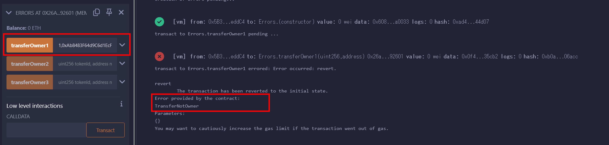

# WTF Solidity 超シンプル入門: 15. Errors

最近、Solidity の学習を再開し、詳細を確認しながら「Solidity 超シンプル入門」を作っています。これは初心者向けのガイドで、プログラミングの達人向けの教材ではありません。毎週 1〜3 レッスンのペースで更新していきます。

僕のツイッター：[@0xAA_Science](https://twitter.com/0xAA_Science)｜[@WTFAcademy\_](https://twitter.com/WTFAcademy_)

コミュニティ：[Discord](https://discord.gg/5akcruXrsk)｜[Wechat](https://docs.google.com/forms/d/e/1FAIpQLSe4KGT8Sh6sJ7hedQRuIYirOoZK_85miz3dw7vA1-YjodgJ-A/viewform?usp=sf_link)｜[公式サイト wtf.academy](https://wtf.academy)

すべてのソースコードやレッスンは github にて公開: [github.com/AmazingAng/WTFSolidity](https://github.com/AmazingAng/WTFSolidity)

-----

この章では、solidityにおいて例外をスローする3つの方法を紹介します: `error`、`require`、そして`assert`です。

## Errors
Solidityはエラーハンドリングの為の多くの関数を持っています。エラーはコンパイル時やランタイム（実行時）に発生します。

### Error
`error`ステートメントはsolidity`0.8`における新機能です。gasを節約し、ユーザーに何故操作が失敗したのか？を教えてくれます。solidityにおいてエラーをスローする推奨方法です。
カスタムエラーはエラーステートメントを用いることによって定義され、コントラクトの内側と外側で使用することが出来ます。以下の通り、我々は`TransferNotOwner`エラーを作成します。そうすることで、転送時に呼び出し元がトークン`owner`でない時にエラーをスローすることが出来ます。

```solidity
error TransferNotOwner(); // custom error
```

関数に於いて、`error`は`revert`ステートメントと一緒に使用されなければなりません。

```solidity
function transferOwner1(uint256 tokenId, address newOwner) public {
    if(_owners[tokenId] != msg.sender){
        revert TransferNotOwner();
    }
    _owners[tokenId] = newOwner;
}
```
`transferOwner1()`関数は呼び出し元がトークンの所有者かどうかをチェックします; もしそうでなければ、`TransferNotOwner`エラーをスローし、トランザクションをリバート（取り消し）します。

### Require
`require`ステートメントはsolidity`0.8`以前でエラーハンドリングにおいて最も一般的に使用されたメソッドです。開発者の間で未だにポピュラーです。

`require`の文法:
```
require(condition, "error message");
```

条件が満たされない場合、例外がスローされます。

その簡潔さにも関わらず、gasの消費量は`error`ステートメントよりも高いものとなっています: gas消費量はエラーメッセージが増えるに従って線形的に増えていきます。

それでは、`require`ステートメントで上記の`transferOwner`関数を書き換えてみましょう:
```solidity
function transferOwner2(uint256 tokenId, address newOwner) public {
    require(_owners[tokenId] == msg.sender, "Transfer Not Owner");
    _owners[tokenId] = newOwner;
}
```

### Assert
`assert`ステートメントはユーザーに知らせる為のエラーメッセージを含んでいないので、一般的にデバッグ目的で使用されます。
`assert`の文法:
```solidity
assert(condition);
```
条件が満たされていない場合、エラーがスローされます。

`assert`ステートメントを用いて`transferOwner`関数を書き換えてみましょう:
```solidity
    function transferOwner3(uint256 tokenId, address newOwner) public {
        assert(_owners[tokenId] == msg.sender);
        _owners[tokenId] = newOwner;
    }
```

## Remix Demo
`Error`コントラクトをデプロイした後。

1. `error`: `uint256`型の数値とゼロアドレスでないアドレスを入力し、`transferOwner1()`関数を呼び出します。コンソールがカスタムエラーである`TransferNotOwner`エラーをスローします。

    
   
2. `require`: `uint256`型の数値とゼロアドレスでないアドレスを入力し、`tranferOwner2()`関数を呼び出します。コンソールがエラーをスローしエラーメッセージ`"Transfer Not Owner"`というエラーメッセージを出力します。

    
   
3. `assert`: `uint256`型の数値とゼロアドレスでないアドレスを入力し、`transferOwner3()`関数を呼び出します。コンソールがエラーメッセージ無しでエラーをスローします。

    
   

## ガス代比較
`error`、`require`、`assert`のガス消費量を比較してみましょう。
remixコンソールのDebugボタンを押すことで、各関数のガス消費量を確認することが出来ます。

1. **gas for `error`**：24457 `wei`
2. **gas for `require`**：24755 `wei`
3. **gas for `assert`**：24473 `wei`

`require`が最も多くのガスを消費するのに対して、`error`が最も少ないガスを消費し、続いて`assert`がガスの消費量が少ないということが分かります。
それ故に、`error`はエラーメッセージをユーザーに知らせてくれるだけでなく、ガスを節約することが出来るのです。

## まとめ
この章では、Solidityにおいてエラーを処理する3つのステートメントについて紹介しました: `error`、`require`、そして`assert`です。それらのガス消費量を比較した後で、`require`ステートメントが最も高いガスの消費量である一方で、`error`ステートメントが最もコストがかからないということが分かりました。

