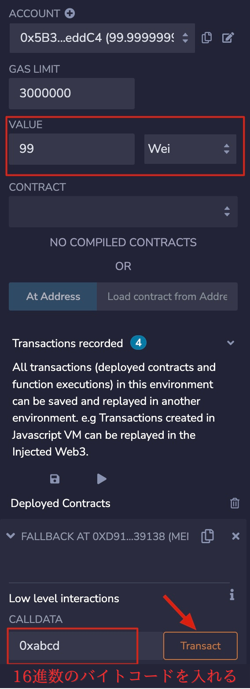

# WTF Solidity 超シンプル入門: 19. ETH の受け取り receive と fallback

最近、Solidity の学習を再開し、詳細を確認しながら「Solidity 超シンプル入門」を作っています。これは初心者向けのガイドで、プログラミングの達人向けの教材ではありません。毎週 1〜3 レッスンのペースで更新していきます。

僕のツイッター：[@0xAA_Science](https://twitter.com/0xAA_Science)｜[@WTFAcademy\_](https://twitter.com/WTFAcademy_)

コミュニティ：[Discord](https://discord.gg/5akcruXrsk)｜[Wechat](https://docs.google.com/forms/d/e/1FAIpQLSe4KGT8Sh6sJ7hedQRuIYirOoZK_85miz3dw7vA1-YjodgJ-A/viewform?usp=sf_link)｜[公式サイト wtf.academy](https://wtf.academy)

すべてのソースコードやレッスンは github にて公開: [github.com/AmazingAng/WTF-Solidity](https://github.com/AmazingAng/WTF-Solidity)

---

`Solidity`は 2 つの特別なコールバック関数、`receive()`と`fallback()`をサポートしており、主に 2 つのケースで使用されます：

1. ETH を受け取る
2. コントラクト内に存在しない関数呼び出しを処理する（プロキシコントラクト proxy contract）

注 ⚠️：Solidity 0.6.x 以前のバージョンでは、構文上 `fallback()` 関数のみが存在し、ユーザーから送信された ETH を受け取るときに呼び出され、呼び出される関数のシグネチャがマッチする関数が存在しない場合に呼び出されます。0.6 以降、`fallback()`関数は`receive()`と`fallback()`に分割されました。

今回のレッスンは主に ETH の受け取りについてです。

## ETH を受け取る関数 receive

`receive()`関数は、コントラクトが ETH を受け取るときに呼び出されます。コントラクトには 多くて 1 つの `receive()` 関数しか存在できません。宣言方法は通常の関数とは異なり、`function` キーワードは不要です。

```solidity
receive() external payable { ... }
```

`receive()` 関数は引数を持つことができず、戻り値もありません。ただし、`external` と `payable` を含めなければなりません。

コントラクトが`ETH`を受け取ると、`receive()`関数が呼び出されます。`receive()`関数は、`send`や`transfer`メソッドで`ETH`を送信するときに、`gas`が`2300`に制限されるため、複雑なロジックを実行すると`Out of Gas`エラーが発生する可能性があるため、複雑なロジックを実行することは避けるべきです。`call`を使用すると、`gas`をカスタマイズしてより複雑なロジックを実行できます。

私たちは`receive()`関数内で`event`を送信することができます。例えば：

```solidity
// イベントを定義
event Received(address Sender, uint Value);
// ETHを受け取るとイベントを放出
receive() external payable {
    emit Received(msg.sender, msg.value);
}
```

悪意のコントラクトの場合、`receive()`関数（古いバージョンの場合は`fallback()`関数）に、`gas`を消費する悪意のあるコードや意図的に失敗するコードが埋め込まれていることがあります。これにより、返金や送金ロジックを含む一部のコントラクトが正常に動作しなくなる可能性があります。そのため、返金などのロジックを含むコントラクトを書く場合は、このような状況に注意する必要があります。

## フォールバック関数`fallback()`

`fallback()`関数は、呼び出される関数が存在しない場合に呼び出されます。ETH を受け取るために使用することもできますし、プロキシコントラクト`proxy contract`に使うこともできます。

`fallback()`関数は、宣言時に`function`キーワードを必要とせず、`external`で修飾され、通常は`payable`で修飾されます。ETH の受取に使えます。

```solidity
fallback() external payable { ... }
```

````solidity

私たちは`fallback()`関数を定義し、それがトリガーされると`fallbackCalled`イベントを発生させ、`msg.sender`、`msg.value`、`msg.data`を出力します：

```solidity
event fallbackCalled(address Sender, uint Value, bytes Data);

// fallback
fallback() external payable{
    emit fallbackCalled(msg.sender, msg.value, msg.data);
}
````

## receive と fallback の違い

`receive`と`fallback`はどちらも`ETH`を受け取るために使用できますが、それらのトリガーされる規則は次のとおりです：

```text
fallback() or receive()?
           ETHを受け取る
              |
         msg.dataがemptyか？
            /  \
         はい   いいえ
          /      \
receive()あるか?   fallback()
        / \
      はい いいえ
      /     \
     /       \
receive()   fallback()
```

簡単にいうと、コントラクトが`ETH`を受け取るとき、`msg.data`が空で`receive()`が存在する場合は`receive()`がトリガーされます。`msg.data`が空で`receive()`が存在しない場合は、`fallback()`がトリガーされます。この場合、`fallback()`は`payable`である必要があります。

`receive()`と`payable fallback()`が存在しない場合、コントラクトに直接`ETH`を送信するとエラーが発生します（`payable`関数を使ってコントラクトに`ETH`を送信することはできます）。

## Remix 演示

1. まず、`Fallback.sol`をデプロイします。

2. "VALUE"欄に送信する金額（単位は Wei）を入力し、"Transact"をクリックします。


トランザクションが成功し、`receivedCalled`イベントが放出されました。


"VALUE"欄に送信する金額（単位は Wei）を入力し、"CALLDATA"欄に任意の`msg.data`を入力し、"Transact"をクリックします。



5. トランザクションが成功し、`fallbackCalled`イベントが放出されました。

   

## まとめ

今回は、`Solidity`にある二種類の特殊の関数について紹介しました。`receive()`と`fallback()`は、主に ETH の受け取りの処理やプロキシコントラクトに使用されます。
