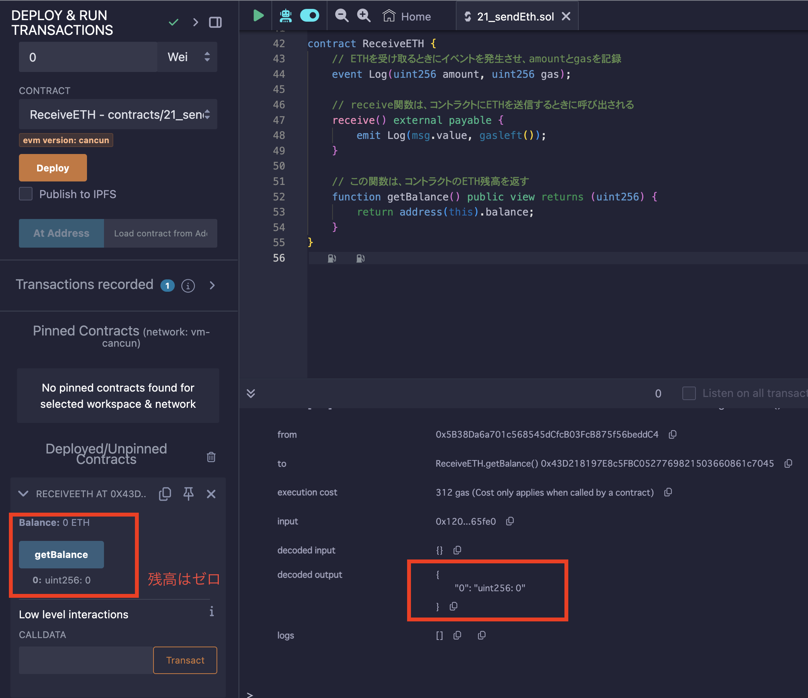
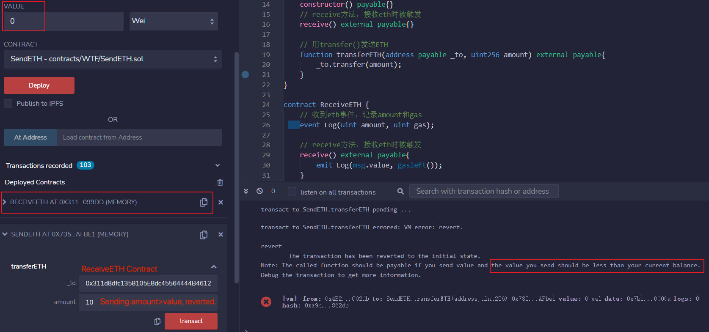
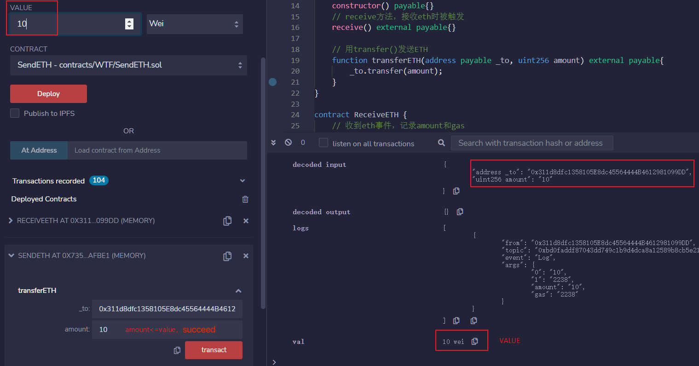
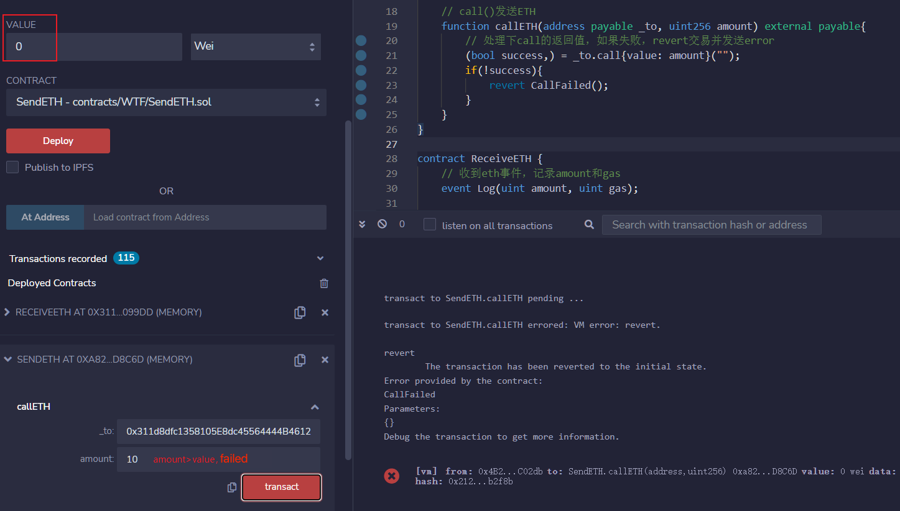

# WTF Solidity 超シンプル入門: 20. ETH の 送金

最近、Solidity の学習を再開し、詳細を確認しながら「Solidity 超シンプル入門」を作っています。これは初心者向けのガイドで、プログラミングの達人向けの教材ではありません。毎週 1〜3 レッスンのペースで更新していきます。

僕のツイッター：[@0xAA_Science](https://twitter.com/0xAA_Science)｜[@WTFAcademy\_](https://twitter.com/WTFAcademy_)

コミュニティ：[Discord](https://discord.gg/5akcruXrsk)｜[Wechat](https://docs.google.com/forms/d/e/1FAIpQLSe4KGT8Sh6sJ7hedQRuIYirOoZK_85miz3dw7vA1-YjodgJ-A/viewform?usp=sf_link)｜[公式サイト wtf.academy](https://wtf.academy)

すべてのソースコードやレッスンは github にて公開: [github.com/AmazingAng/WTFSolidity](https://github.com/AmazingAng/WTFSolidity)

---

`Solidity`有三种方法向其他合约发送`ETH`，他们是：`transfer()`，`send()`和`call()`，其中`call()`是被鼓励的用法。

## ETH を受け取るコントラクト

我们先部署一个接收`ETH`合约`ReceiveETH`。`ReceiveETH`合约里有一个事件`Log`，记录收到的`ETH`数量和`gas`剩余。还有两个函数，一个是`receive()`函数，收到`ETH`被触发，并发送`Log`事件；另一个是查询合约`ETH`余额的`getBalance()`函数。
まず、私たちは ETH を受け取る用のコントラクトをデプロイします。
このコントラクトは以下となっています。

1. `ReceiveETH`コントラクトには、受け取った ETH の量と残りの gas を記録する`Log`イベントがあります。
2. また、２つの関数があります。
   - `receive()`は、ETH を受け取ると呼び出され、`Log`イベントを放出します。
   - もう一つの関数は、コントラクトの ETH 残高を取得する`getBalance()`です。

```solidity
contract ReceiveETH {
    // ETHを受け取るイベントで、amountやgasを記録します
    event Log(uint amount, uint gas);

    // この関数はETHを受け取ると呼び出されます
    receive() external payable{
        emit Log(msg.value, gasleft());
    }

    // この関数はコントラクトのETH残高を返します
    function getBalance() view public returns(uint) {
        return address(this).balance;
    }
}
```

`ReceiveETH`コントラクトをデプロイした後、`getBalance()`関数を実行すると、現在のコントラクトの ETH 残高が`0`であることがわかります。



## ETH を送金するコントラクト

我们将实现三种方法向`ReceiveETH`合约发送`ETH`。首先，先在发送 ETH 合约`SendETH`中实现`payable`的`构造函数`和`receive()`，让我们能够在部署时和部署后向合约转账。
私たちは３つの方法を使って`ReceiveETH`コントラクトに ETH を送ります。まず、`SendETH`コントラクトをデプロイします。

```solidity
contract SendETH {
    // コンストラクターです。
    // payableを使ってデプロイ時にETHを送金できるようにします
    constructor() payable{}
    // receive関数、ETHを受け取ると呼び出されます
    receive() external payable{}
}
```

### transfer

- 使い方は`受取アドレス.transfer(送るETHの量)`。
- `transfer()`の`gas`の制限は`2300`で、送金には十分ですが、相手のコントラクトの`fallback()`や`receive()`関数には複雑なロジックを実装できません。
- もし`transfer()`が失敗すると、自動的に`revert`（ロールバック）します。

サンプルコードです。`_to`には`ReceiveETH`コントラクトのアドレスを入力し、`amount`には送金する`ETH`の量を入力します。

```solidity
// transfer関数を使ってETHを送る
function transferETH(address payable _to, uint256 amount) external payable{
    _to.transfer(amount);
}
```

`SendEth`コントラクトをデプロイした後、`ReceiveETH`コントラクトに ETH を送ります。この時、`amount`は 10、`value`は 0、`amount`>`value`なので、送金は失敗して`revert`されます。



ここでは、`amount`は 10，`value`は 10，`amount`<=`value`なので，送金が成功するでしょう。



`ReceiveETH`コントラクトでは、`getBalance()`関数を実行すると、現在のコントラクトの ETH 残高が`10`であることがわかります。


### send

- 使い方は`受取アドレス.send(送るETHの量)`。
- `send()`の`gas`の制限は`2300`で、送金には十分ですが、相手のコントラクトの`fallback()`や`receive()`関数には複雑なロジックを実装できません。
- `send()`がもし失敗したら、`revert`されることはない。
- `send()`的返回值是`bool`，代表着转账成功或失败，需要额外代码处理一下。
- `send()`の返り値は`bool`で、送金が成功したあるいは失敗したを表します。送金が失敗した場合、処理するコードの追加が必要です。

サンプルコード：

```solidity
error SendFailed(); // sendでETHを送る際に失敗した場合のエラー

// send()関数を使ってETHを送ります
function sendETH(address payable _to, uint256 amount) external payable{
    // send()でETHを送る時に、失敗した場合、revertしてerrorを放出します
    bool success = _to.send(amount);
    if(!success){
        revert SendFailed();
    }
}
```

`ReceiveETH`コントラクトに対して ETH を送ります。この時、`amount`は 10、`value`は 0、`amount`>`value`なので、送金は失敗して`revert`されます。


ここでは、`amount`は 10，`value`は 10，`amount`<=`value`なので、送金は成功します。


### call

- 使い方は`受取アドレス.call{value: 送るETHの量}("")`。
- ｀ call()`は`gas`の制限がなく、相手のコントラクトの`fallback()`や`receive()`関数に複雑なロジックを実装できます。
- `call()`如果转账失败，不会`revert`。
- `call()`がもし失敗したら、`revert`されることはない。
- `call()`の返り値は`(bool, bytes)`で、送金が成功したあるいは失敗したを表します。送金が失敗した場合、処理するコードの追加が必要です。

サンプルコード：

```solidity
error CallFailed(); // 用call发送ETH失败error

// call()関数を使ってETHを送ります
function callETH(address payable _to, uint256 amount) external payable{
    // call()の返り値を処理し、失敗した場合、revertしてerrorを放出します
    (bool success,) = _to.call{value: amount}("");
    if(!success){
        revert CallFailed();
    }
}
```

`ReceiveETH`コントラクトに対して ETH を送ります。この時、`amount`は 10、`value`は 0、`amount`>`value`なので、送金は失敗して`revert`されます。



ここでは、`amount`は 10，`value`は 10，`amount`<=`value`なので、送金は成功します。


运行三种方法，可以看到，他们都可以成功地向`ReceiveETH`合约发送`ETH`。
３つの方法を使って`ReceiveETH`コントラクトに ETH を送ります。

すべての方法で送金ができることがわかりましたね。

## まとめ

今回は、`Solidity`の３つの方法で`ETH`を送る方法を紹介しました：`transfer`、`send`、`call`。

- `call`は`gas`の制限がなく、最も柔軟であり、一番推奨される方法です。
- `transfer`有`2300 gas`限制，但是发送失败会自动`revert`交易，是次优选择。
- `transfer`は`2300 gas`の制限があり、送金が失敗した場合、自動的に`revert`されるため、`call`に次ぐ選択肢です。
- `send`は`2300 gas`の制限があり、送金が失敗した場合、自動的に`revert`されないため、ほとんど使用されません。
