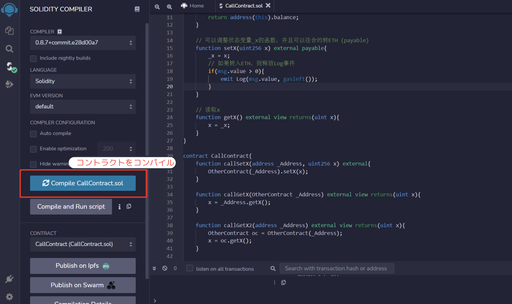
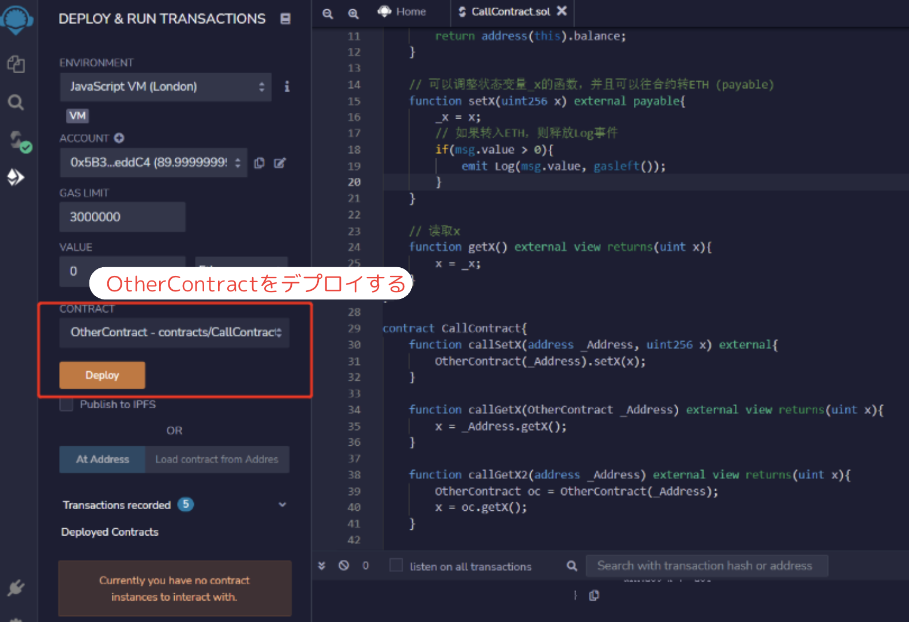
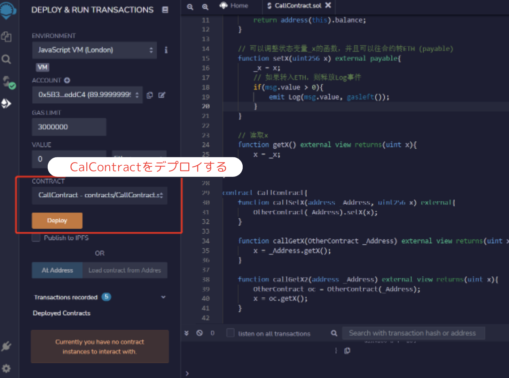
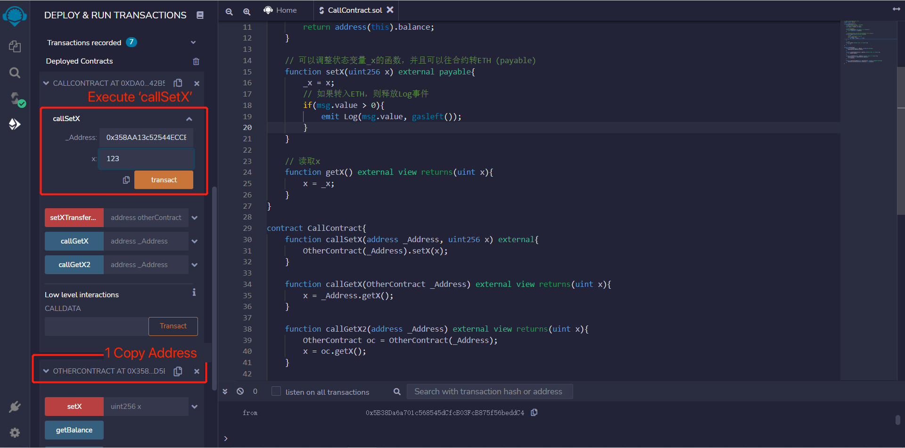
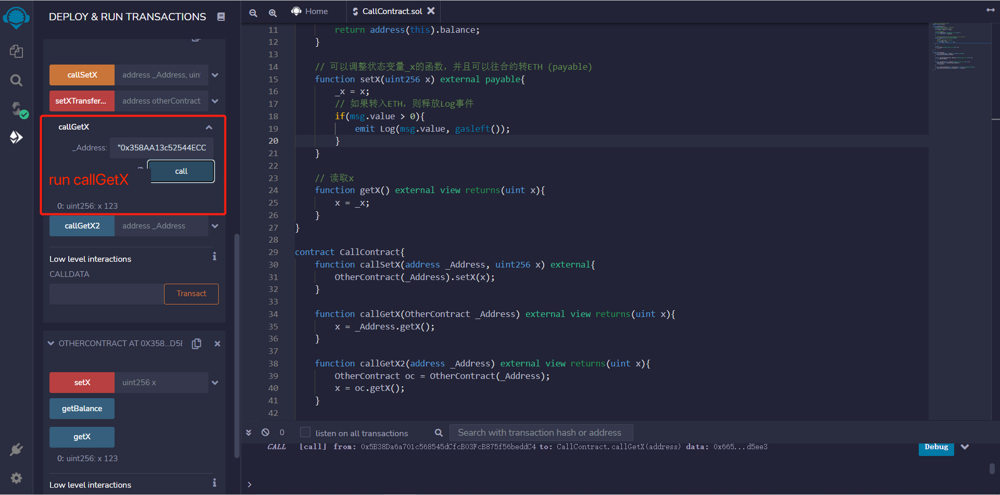
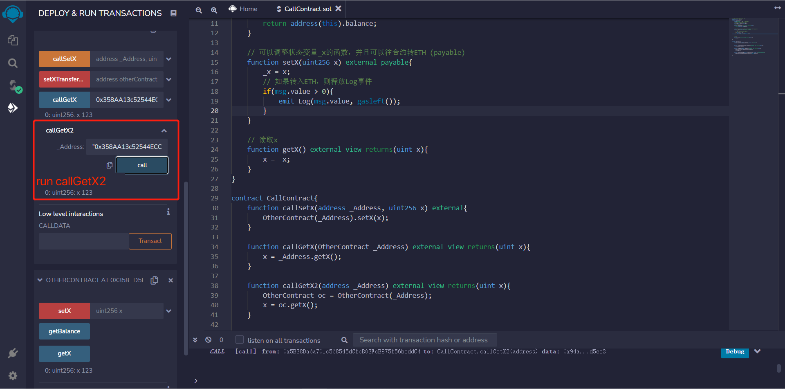
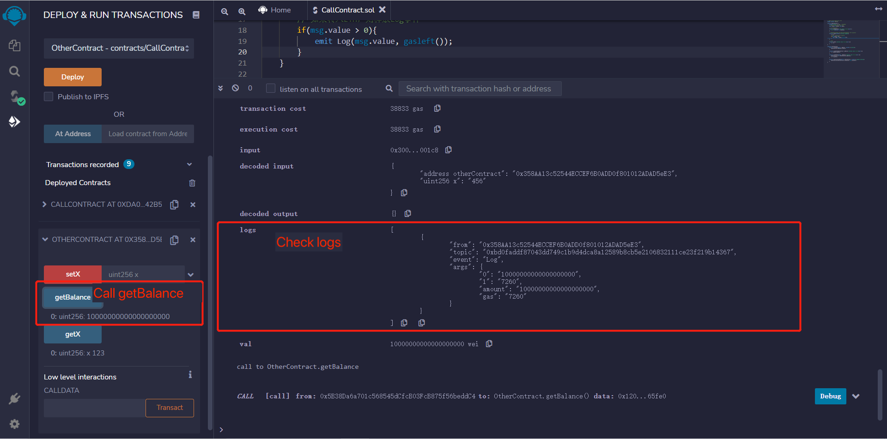

# WTF Solidity 超シンプル入門: 21. コントラクトの呼び出し

最近、Solidity の学習を再開し、詳細を確認しながら「Solidity 超シンプル入門」を作っています。これは初心者向けのガイドで、プログラミングの達人向けの教材ではありません。毎週 1〜3 レッスンのペースで更新していきます。

僕のツイッター：[@0xAA_Science](https://twitter.com/0xAA_Science)｜[@WTFAcademy\_](https://twitter.com/WTFAcademy_)

コミュニティ：[Discord](https://discord.gg/5akcruXrsk)｜[Wechat](https://docs.google.com/forms/d/e/1FAIpQLSe4KGT8Sh6sJ7hedQRuIYirOoZK_85miz3dw7vA1-YjodgJ-A/viewform?usp=sf_link)｜[公式サイト wtf.academy](https://wtf.academy)

すべてのソースコードやレッスンは github にて公開: [github.com/AmazingAng/WTFSolidity](https://github.com/AmazingAng/WTFSolidity)

---

## デプロイ済みのコントラクトの呼び出し

`Solidity`において、コントラクトは他のコントラクトの関数を呼び出すことができます。これは複雑な DApps を構築する際に非常に便利です。このチュートリアルでは、既知のコントラクトコード（またはインターフェース）とアドレスがわかっている場合に、デプロイ済みのコントラクトを呼び出す方法について説明します。

## ターゲットコントラクト

まず、私たちは他のコントラクトを呼び出すためのコントラクト`OtherContract`を作成します。

```solidity
contract OtherContract {
    uint256 private _x = 0; // 状態変数_x
    // LogイベントはETHの受け取りを記録します
    event Log(uint amount, uint gas);

    // ETHの残高を示す関数
    function getBalance() view public returns(uint) {
        return address(this).balance;
    }

    // 状態変数を設定できる関数で、ETHを送信する場合はLogイベントを放出します
    function setX(uint256 x) external payable{
        _x = x;
        // ETHが0より大きい場合はLogイベントを放出します
        if(msg.value > 0){
            emit Log(msg.value, gasleft());
        }
    }

    // _xの値を取得する関数
    function getX() external view returns(uint x){
        x = _x;
    }
}
```

このコントラクトは、状態変数`_x`、`Log`イベント、3 つの関数を含んでいます。

- `getBalance()`: コントラクトの ETH 残高を返します。
- `setX()`: `external payable`関数で、`_x`の値を設定し、ETH を送信します。
- `getX()`: `_x`の値を取得します。

## `OtherContract`コントラクトの呼び出し

私たちはコントラクトのアドレスとコントラクトコード（またはインターフェース）を使用して、コントラクトの参照を作成できます。即ち、`_Name(_Address)`です。

ここで、`_Name`はコントラクト名であり、コントラクトコード（またはインターフェース）で指定されたコントラクト名と一致している必要があります。`_Address`はコントラクトのアドレスです。その後、コントラクトの参照を使用して、その関数を呼び出します：`_Name(_Address).f()`。ここで、`f()`は呼び出す関数です。

以下の 4 つのコントラクト呼び出しの例を紹介します。remix でコントラクトをコンパイルした後、`OtherContract`と`CallContract`をそれぞれデプロイします。







### 1. コントラクトのアドレスを渡す

私たちは、関数内でターゲットコントラクトのアドレスを渡すことができ、ターゲットコントラクトの参照を生成し、その関数を呼び出すことができます。例として、`OtherContract`コントラクトの`setX`関数を呼び出すために、新しいコントラクトに`callSetX`関数を記述します。すでにデプロイ済みの`OtherContract`コントラクトのアドレス`_Address`と`setX`のパラメータ`x`を渡します。

```solidity
function callSetX(address _Address, uint256 x) external{
    OtherContract(_Address).setX(x);
}
```

`otherContract`のアドレスをコピーし、`callSetX`関数のパラメータに入力し、成功した後、`OtherContract`の`getX`を呼び出して`x`が 123 になっていることを確認します。




### 2. コントラクト変数を渡す

私たちは、関数内でターゲットコントラクトの参照を渡すことができます。上記の例の引数を`address`から目標コントラクト名にすればよいのです。

以下の例では、`OtherContract`コントラクトの`getX()`関数を呼び出します。

**注意**: この関数のパラメータ`OtherContract _Address`の基本型は`address`であり、生成された`ABI`では、`callGetX`を呼び出す際に渡されるパラメータはすべて`address`型です。

```solidity
function callGetX(OtherContract _Address) external view returns(uint x){
    x = _Address.getX();
}
```

`otherContract`コントラクトのアドレスをコピーし、`callGetX`関数のパラメータとして入力し、成功した後、`OtherContract`の`getX`を呼び出して`x`が 123 になっていることを確認できるでしょう。



### 3. コントラクト変数を作成

私たちは、コントラクト変数を作成し、それを使用してターゲット関数を呼び出すことができます。以下の例では、変数`oc`に`OtherContract`コントラクトの参照を保存し、その後、`getX()`関数を呼び出します。

```solidity
function callGetX2(address _Address) external view returns(uint x){
    OtherContract oc = OtherContract(_Address);
    x = oc.getX();
}
```

`OtherContract`のコントラクトアドレスをコピーし、`callGetX2`関数のパラメータとして入力し、`x`の値の取得に成功します。



### 4. コントラクトを呼び出して ETH を送金

もしターゲットコントラクトは`payable`だったら、それを使ってコントラクトへ ETH を送金することができます。その中で`_Name`はコントラクト名であり、`_Address`はコントラクトアドレスです。`f`はターゲット関数名であり、`_Value`は送金する ETH の量（`wei`単位）です。

`OtherContract`コントラクトの`setX`関数は`payable`であるため、次の例では`setX`を呼び出して目標コントラクトに ETH を送金します。

```solidity
function setXTransferETH(address otherContract, uint256 x) payable external{
    OtherContract(otherContract).setX{value: msg.value}(x);
}
```

`OtherContract`のコントラクトアドレスをコピーし、`setXTransferETH`関数のパラメータとして入力し、10ETH を送金します。


---

送金後、`Log`イベントと`getBalance()`関数を使用して、ターゲットコントラクトの`ETH`残高の変化を確認できます。



## まとめ

今回は、ターゲットコントラクトのコード（またはインターフェース）とアドレスを使用して、コントラクトの参照オブジェクトを作成し、ターゲットコントラクトの関数を呼び出す方法について説明しました。
