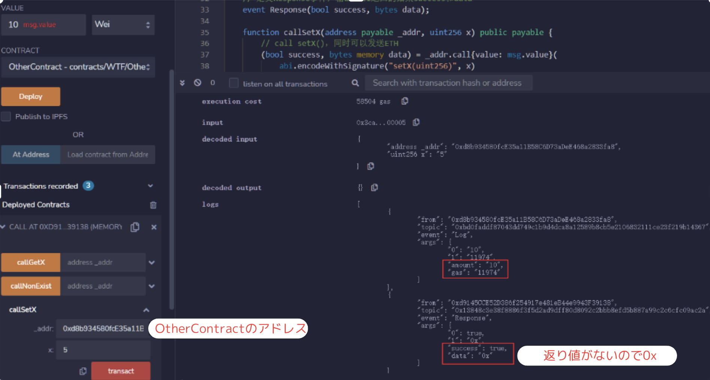

# WTF Solidity 超シンプル入門: 22. Call

最近、Solidity の学習を再開し、詳細を確認しながら「Solidity 超シンプル入門」を作っています。これは初心者向けのガイドで、プログラミングの達人向けの教材ではありません。毎週 1〜3 レッスンのペースで更新していきます。

僕のツイッター：[@0xAA_Science](https://twitter.com/0xAA_Science)｜[@WTFAcademy\_](https://twitter.com/WTFAcademy_)

コミュニティ：[Discord](https://discord.gg/5akcruXrsk)｜[Wechat](https://docs.google.com/forms/d/e/1FAIpQLSe4KGT8Sh6sJ7hedQRuIYirOoZK_85miz3dw7vA1-YjodgJ-A/viewform?usp=sf_link)｜[公式サイト wtf.academy](https://wtf.academy)

すべてのソースコードやレッスンは github にて公開: [github.com/AmazingAng/WTFSolidity](https://github.com/AmazingAng/WTFSolidity)

---

以前、私たちは[第 20 回：ETH の送金](https://github.com/AmazingAng/WTFSolidity/tree/main/20_SendETH)にて`call`を使って ETH を送金する方法を紹介しました。今回は、`call`を使って他のコントラクトを呼び出す方法について説明します。

## Call

`call`は`address`型の低レベルのメンバー関数です。他のコントラクトとのやり取りに使用されます。返り値は`(bool, bytes memory)`で、それぞれ`call`が成功したかどうかと、対象関数の返り値を表します。

- `call`は`fallback`関数または`receive`関数をトリガーして`ETH`を送信するための`Solidity`の推奨方法です。

- `call`を使って他のコントラクトを呼び出すのをおすすめしません。なぜなら、セキュアでないコントラクトを呼び出すとき、コントロール権を渡すことになるからです。他のコントラクトを呼び出す場合は、コントラクト変数を宣言して関数を呼び出すことがおすすめです。[第 21 回：コントラクトの呼び出し](https://github.com/AmazingAng/WTFSolidity/tree/main/21_CallContract)を参照してほしいです。
- 他のコントラクトのソースコードや`ABI`がわからない場合、コントラクト変数を作成するには難があるので、`call`を使って他のコントラクトの関数を呼び出すことができます。

### `call`を使うときのルール

`call`を使うときのルールは以下：

```text
ターゲットコントラクトのアドレス.call(バイトコード);
```

その中で`バイトコード`は`abi.encodeWithSignature("関数名(パラメータの型)", パラメータ)`を使って取得可能です。

```text
abi.encodeWithSignature("関数シグネチャ", 半角カンマ区切りの具体的な引数)
```

`関数シグネチャ`は`"関数名（コンマで繋いだ引数）"`です。例えば`abi.encodeWithSignature("f(uint256,address)", _x, _addr)`。

それに`call`はコントラクトを呼び出すとき、送信する`ETH`量と`gas`量を指定することができます。`value`と`gas`を指定する場合、`call`の構文は以下のようになります：

```text
ターゲットのコントラクトアドレス.call{value:送金額, gas:ガス量}(バイトコード);
```

複雑そうかもしれません。次に、理解を深めるため、`call`を使ったコードサンプルを見ましょう。

### ターゲットコントラクト

まずは、シンプルな`OtherContract`コントラクトを作成・デプロイしましょう。コードは第 21 回とほぼ同じです。唯一の違いは`fallback`関数が追加されています。

```solidity
contract OtherContract {
    uint256 private _x = 0; // 状態変数_x
    // ethを受け取るイベント、amountとgasを記録
    event Log(uint amount, uint gas);

    fallback() external payable{}

    // コントラクトのETH残高を返す関数
    function getBalance() view public returns(uint) {
        return address(this).balance;
    }

    // _xの値を設定できる関数。同時にコントラクトへETHを送信することもできる(payable)
    function setX(uint256 x) external payable{
        _x = x;
        // もしETHの送信がある場合のみLogイベントを放出
        if(msg.value > 0){
            emit Log(msg.value, gasleft());
        }
    }

    // xの値を取得する関数
    function getX() external view returns(uint x){
        x = _x;
    }
}
```

このコントラクトは一つの状態変数`x`、`Log`イベント、3 つの関数を含んでいます。

- `getBalance()`: コントラクトの`ETH`残高を返す
- `setX()`: `external payable`関数で、`x`の値を設定し、コントラクトへ`ETH`も送金できる
- `getX()`: `x`の値を取得する

### `call`を使って他のコントラクトを呼び出す

#### 1. Response イベント

私たちは`Call`のコントラクトを作成し、ターゲットコントラクトの関数を呼び出します。まずは Response ベントを定義しました。このイベントは呼び出しに際しての結果 success と data を出力して、便利に debug できるように準備しました。

```solidity
// Response イベントは`call`の結果`success`と`data`を出力します
event Response(bool success, bytes data);
```

#### 2. setX 関数を呼び出す

私たちは`callSetX`関数を作成してターゲットコントラクトの`setX()`を呼び出します。同時に`msg.value`の`ETH`を送信し、`Response`イベントを放出して`success`と`data`を出力します。

```solidity
function callSetX(address payable _addr, uint256 x) public payable {
    // setX()をcallし、ETHを送信
    (bool success, bytes memory data) = _addr.call{value: msg.value}(
        abi.encodeWithSignature("setX(uint256)", x)
    );

    emit Response(success, data); // イベントを放出
}
```

次に私たちは`callSetX`を呼び出して`_x`を`5`に変更します。パラメータに`OtherContract`のアドレスと`5`を入力します。目標関数`setX()`は返り値がないため、`Response`イベントの`data`は`0x`となります。



#### 3. getX 関数を呼び出す

続いて`getX()`関すを呼び出しましょう。これによって`_x`の値を返されます。型は`uint256`、`abi.decode`を使って`data`を解読し、数値を取得します。

```solidity
function callGetX(address _addr) external returns(uint256){
    // call getX()
    (bool success, bytes memory data) = _addr.call(
        abi.encodeWithSignature("getX()")
    );

    emit Response(success, data); //释放事件
    return abi.decode(data, (uint256));
}
```

`Response`イベントの出力から、`data`が`0xとなり、`abi.decode`を通じて最終的な返り値は`5`になっていることがわかります。


#### 4. 存在しない関数を呼び出す

もし`call`に存在しない関数を入力した場合、ターゲットコントラクトの`fallback`関数がトリガーされます。

```solidity
function callNonExist(address _addr) external{
    // 存在しない関数を呼び出す
    (bool success, bytes memory data) = _addr.call(
        abi.encodeWithSignature("foo(uint256)")
    );

    emit Response(success, data); // イベントを放出
}
```

上記のサンプルでは、私たちは存在しない`foo`関数を呼び出し、`call`は成功して`success`を返しますが、実際にはターゲットコントラクトの`fallback`関数がトリガーされます。


## まとめ

今回は、私たちは`call`を使って他のコントラクトを呼び出す方法について説明しました。

`call`は他のコントラクトを呼び出すのに使われますが、セキュリティ上のリスクがあるため、他のコントラクトを呼び出す際はコントラクト変数を宣言して関数を呼び出すことが推奨されます。

しかし、この`call`の呼び出し方はコントラクトのソースコードや`ABI`がわからない場合にも使えるので、非常に有用な方法です。次回は、`delegatecall`について説明します。
