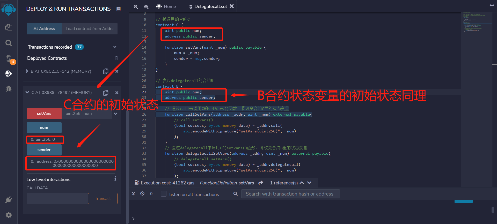

# WTF Solidity 超シンプル入門: 23. Delegate

最近、Solidity の学習を再開し、詳細を確認しながら「Solidity 超シンプル入門」を作っています。これは初心者向けのガイドで、プログラミングの達人向けの教材ではありません。毎週 1〜3 レッスンのペースで更新していきます。

僕のツイッター：[@0xAA_Science](https://twitter.com/0xAA_Science)｜[@WTFAcademy\_](https://twitter.com/WTFAcademy_)

コミュニティ：[Discord](https://discord.gg/5akcruXrsk)｜[Wechat](https://docs.google.com/forms/d/e/1FAIpQLSe4KGT8Sh6sJ7hedQRuIYirOoZK_85miz3dw7vA1-YjodgJ-A/viewform?usp=sf_link)｜[公式サイト wtf.academy](https://wtf.academy)

すべてのソースコードやレッスンは github にて公開: [github.com/AmazingAng/WTFSolidity](https://github.com/AmazingAng/WTFSolidity)

---

## `Delegatecall`

`delegatecall`は`call`と似ており、`Solidity`におけるアドレス型の低いレベルのメンバー関数です。`delegate`は「委任・プロキシ」を意味していますが、一体`delegatecall`は何を委任しているのでしょうか？

### `call`の場合

ユーザー`A`がコントラクト`B`を通してコントラクト`C`を`call`すると、コントラクト`C`の関数が実行され、`Context`(コンテキスト：状態変数のストレージ、msg.sender など)もコントラクト`C`になります。この場合、`msg.sender`は`B`のアドレスであり、関数がいくつかの状態変数を変更する場合、その効果はコントラクト`C`の変数に影響を与えます。


### `delegatecall`の場合

ユーザー`A`がコントラクト`B`を通してコントラクト`C`を`delegatecall`すると、コントラクト`C`の関数が実行されますが、`Context`(コンテキスト：状態変数のストレージ、msg.sender など)はコントラクト`B`になります。この場合、`msg.sender`は`A`のアドレスであり、関数がいくつかの状態変数を変更する場合、その効果はコントラクト`B`の変数に影響を与えます。


皆さんはこのように理解するとよいです。投資家（ユーザー`A`）は彼の資産（`B`コントラクトの`状態変数`）をリスク投資代理（`C`コントラクト）に管理させます。実行されるのはリスク投資代理の関数ですが、変更されるのは資産の状態です。

`delegatecall`语法和`call`类似，也是：
`delegatecall`の文法は`call`と似ています。

このようになります：

```solidity
ターゲットコントラクト.delegatecall(バイトコード);
```

その中で、`バイトコード`は`abi.encodeWithSignature`を使って取得されます。

```solidity
abi.encodeWithSignature("関数シグネチャ", カンマ区切りの引数);
```

`関数シグネチャ`は`"関数名（カンマ区切りの引数型）"`です。例えば`abi.encodeWithSignature("f(uint256,address)", _x, _addr)`。

`call`との違いとしては、`delegatecall`は`gas`を指定できますが、`ETH`の量を指定できません。

````solidity

> ***注意***: `delegatecall`を使うにはセキュリティリスクがあります。ときにはターゲットコントラクトがコントラクトとのストレージストラクチャが同じであることが求められます。そうでない場合、資産がなくされる可能性があります。

## どのような場合に`delegatecall`を使用するのか？

現在、主に2つの`delegatecall`を使用する場面があります。

1. プロキシコントラクトのケース：スマートコントラクトのストレージコントラクトとロジックコントラクトを分離する。プロキシコントラクトはすべての関連する変数を保存し、ロジックコントラクトのアドレスを保存する。すべての関数はロジックコントラクト（`Logic Contract`）に存在し、`delegatecall`を使用して実行します。アップグレード時には、プロキシコントラクトを新しいロジックコントラクトに向けるだけです。

2. EIP-2535 Diamonds（ダイヤモンド）：ダイヤモンドは、生産環境で拡張可能なモジュラーなスマートコントラクトシステムを構築するための標準です。ダイヤモンドは複数の実装コントラクトを持つプロキシコントラクトです。詳細はこちら：[ダイヤモンドスタンダードの紹介](https://eip2535diamonds.substack.com/p/introduction-to-the-diamond-standard)。


## `delegatecall`のサンプルコード

呼び出し方：あなた（`A`）はコントラクト`B`を介してターゲットコントラクト`C`を呼び出します。

### 呼び出されるコントラクト`C`

我们先写一个简单的目标合约`C`：有两个`public`变量：`num`和`sender`，分别是`uint256`和`address`类型；有一个函数，可以将`num`设定为传入的`_num`，并且将`sender`设为`msg.sender`。
私たちはまず簡単なターゲットコントラクト`C`を作成します。`num`と`sender`の2つの`public`変数があります。それぞれ`uint256`と`address`の型です。`setVars`関数があり、`num`を渡された`_num`に設定し、`sender`を`msg.sender`に設定します。

```solidity
// 呼び出されるコントラクトC
contract C {
    uint public num;
    address public sender;

    function setVars(uint _num) public payable {
        num = _num;
        sender = msg.sender;
    }
}
````

### 发起调用的合约 B

首先，合约`B`必须和目标合约`C`的变量存储布局必须相同，两个变量，并且顺序为`num`和`sender`

```solidity
contract B {
    uint public num;
    address public sender;
}
```

接下来，我们分别用`call`和`delegatecall`来调用合约`C`的`setVars`函数，更好的理解它们的区别。

`callSetVars`函数通过`call`来调用`setVars`。它有两个参数`_addr`和`_num`，分别对应合约`C`的地址和`setVars`的参数。

```solidity
// 通过call来调用C的setVars()函数，将改变合约C里的状态变量
function callSetVars(address _addr, uint _num) external payable{
    // call setVars()
    (bool success, bytes memory data) = _addr.call(
        abi.encodeWithSignature("setVars(uint256)", _num)
    );
}
```

而`delegatecallSetVars`函数通过`delegatecall`来调用`setVars`。与上面的`callSetVars`函数相同，有两个参数`_addr`和`_num`，分别对应合约`C`的地址和`setVars`的参数。

```solidity
// 通过delegatecall来调用C的setVars()函数，将改变合约B里的状态变量
function delegatecallSetVars(address _addr, uint _num) external payable{
    // delegatecall setVars()
    (bool success, bytes memory data) = _addr.delegatecall(
        abi.encodeWithSignature("setVars(uint256)", _num)
    );
}
```

### 在 remix 上验证

1. 首先，我们把合约`B`和`C`都部署好

   

2. 部署之后，查看`C`合约状态变量的初始值，`B`合约的状态变量也是一样。

   

3. 此时，调用合约`B`中的`callSetVars`，传入参数为合约`C`地址和`10`

   

4. 运行后，合约`C`中的状态变量将被修改：`num`被改为`10`，`sender`变为合约`B`的地址

   

5. 接下来，我们调用合约`B`中的`delegatecallSetVars`，传入参数为合约`C`地址和`100`

   

6. 由于是`delegatecall`，上下文为合约`B`。在运行后，合约`B`中的状态变量将被修改：`num`被改为`100`，`sender`变为你的钱包地址。合约`C`中的状态变量不会被修改。

   

## 总结

这一讲我们介绍了`Solidity`中的另一个低级函数`delegatecall`。与`call`类似，它可以用来调用其他合约；不同点在于运行的上下文，`B call C`，上下文为`C`；而`B delegatecall C`，上下文为`B`。目前`delegatecall`最大的应用是代理合约和`EIP-2535 Diamonds`（钻石）。
