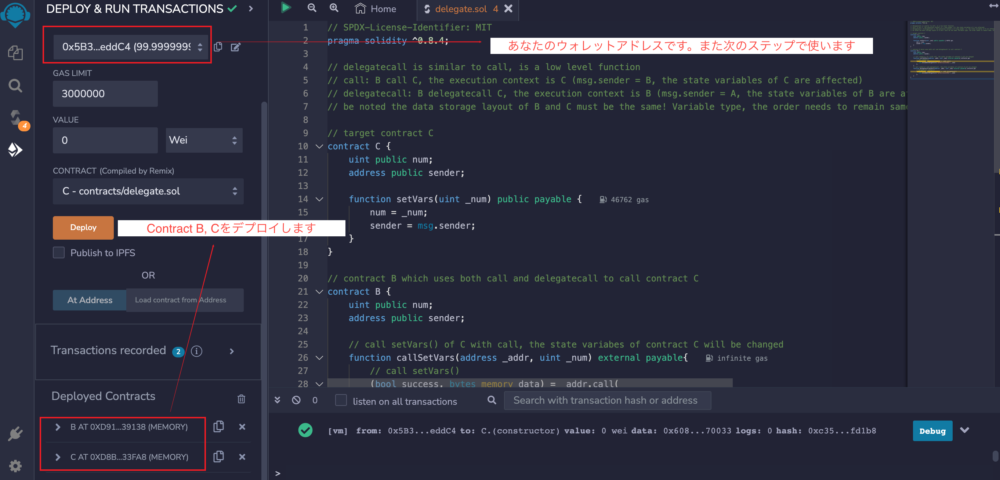
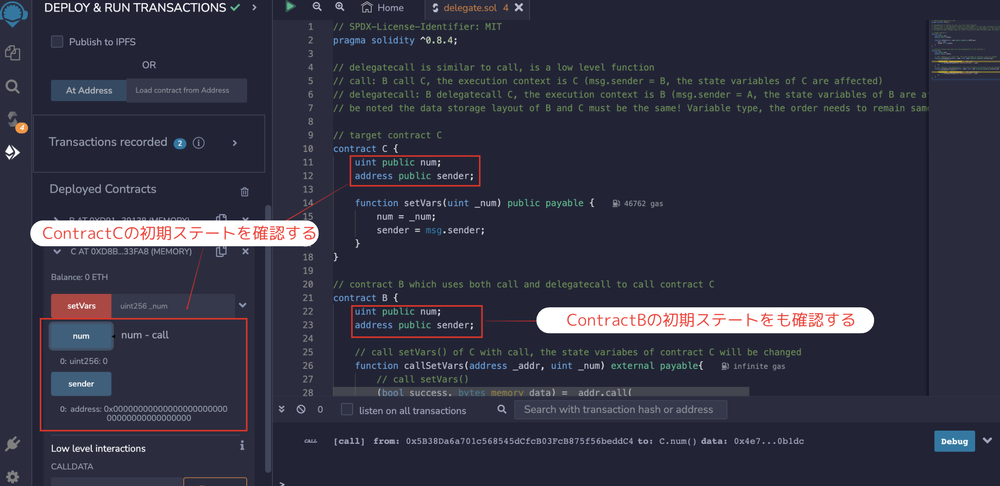
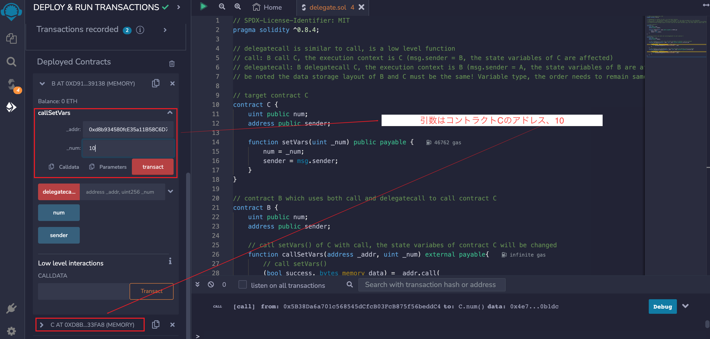
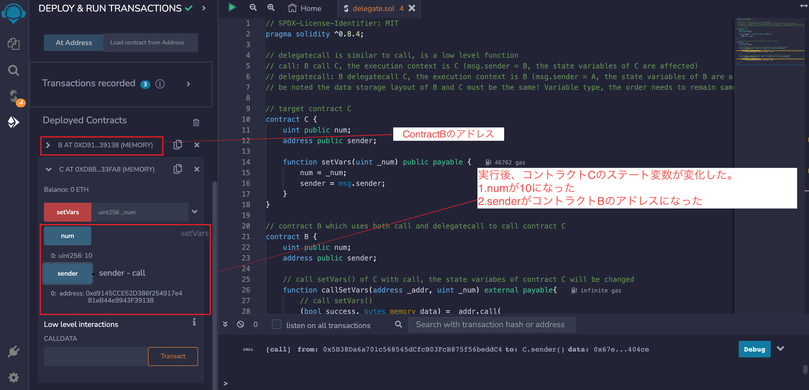

# WTF Solidity 超シンプル入門: 23. Delegate

最近、Solidity の学習を再開し、詳細を確認しながら「Solidity 超シンプル入門」を作っています。これは初心者向けのガイドで、プログラミングの達人向けの教材ではありません。毎週 1〜3 レッスンのペースで更新していきます。

僕のツイッター：[@0xAA_Science](https://twitter.com/0xAA_Science)｜[@WTFAcademy\_](https://twitter.com/WTFAcademy_)

コミュニティ：[Discord](https://discord.gg/5akcruXrsk)｜[Wechat](https://docs.google.com/forms/d/e/1FAIpQLSe4KGT8Sh6sJ7hedQRuIYirOoZK_85miz3dw7vA1-YjodgJ-A/viewform?usp=sf_link)｜[公式サイト wtf.academy](https://wtf.academy)

すべてのソースコードやレッスンは github にて公開: [github.com/AmazingAng/WTFSolidity](https://github.com/AmazingAng/WTFSolidity)

---

## `Delegatecall`

`delegatecall`は`call`と似ており、`Solidity`におけるアドレス型の低いレベルのメンバー関数です。`delegate`は「委任・プロキシ」を意味していますが、一体`delegatecall`は何を委任しているのでしょうか。

### `call`の場合

ユーザー`A`がコントラクト`B`を通してコントラクト`C`を`call`すると、コントラクト`C`の関数が実行され、`Context`(コンテキスト：状態変数のストレージ、msg.sender など)もコントラクト`C`になります。この場合、`msg.sender`は`B`のアドレスであり、関数がいくつかの状態変数を変更する場合、その効果はコントラクト`C`の変数に影響を与えます。


### `delegatecall`の場合

ユーザー`A`がコントラクト`B`を通してコントラクト`C`を`delegatecall`すると、コントラクト`C`の関数が実行されますが、`Context`(コンテキスト：状態変数のストレージ、msg.sender など)はコントラクト`B`になります。この場合、`msg.sender`は`A`のアドレスであり、関数がいくつかの状態変数を変更する場合、その効果はコントラクト`B`の変数に影響を与えます。


皆さんはこのように理解するとよいです。投資家（ユーザー`A`）は彼自身の資産（`B`コントラクトの`状態変数`）を資産管理会社（`C`コントラクト）に管理させてます。実行されるのは資産管理会社の関数（`C`）ですが、変更されるのは資産（`B`）の状態です。

`delegatecall`の文法は`call`と似ています。

このようになります：

```solidity
ターゲットコントラクト.delegatecall(バイトコード);
```

その中で、`バイトコード`は`abi.encodeWithSignature`を使って取得されます。

```solidity
abi.encodeWithSignature("関数シグネチャ", カンマ区切りの引数);
```

`関数シグネチャ`は`"関数名（カンマ区切りの引数型）"`です。例えば`abi.encodeWithSignature("f(uint256,address)", _x, _addr)`。

`call`との違いとしては、`delegatecall`は`gas`を指定できますが、`ETH`の量を指定できません。

> **_注意_**: `delegatecall`を使うにはセキュリティリスクがあります。ときにはターゲットコントラクトがコントラクトとのストレージストラクチャが同じであることが求められます。そうでない場合、資産がなくされる可能性があります。

## どのような場合に`delegatecall`を使用するのか？

現在、主に 2 つの`delegatecall`を使用する場面があります。

1. プロキシコントラクトのケース：スマートコントラクトのストレージコントラクトとロジックコントラクトを分離する。プロキシコントラクトはすべての関連する変数を保存し、ロジックコントラクトのアドレスを保存する。すべての関数はロジックコントラクト（`Logic Contract`）に存在し、`delegatecall`を使用して実行します。アップグレード時には、プロキシコントラクトを新しいロジックコントラクトに向けるだけです。

2. EIP-2535 Diamonds（ダイヤモンド）：ダイヤモンドは、生産環境で拡張可能なモジュラーなスマートコントラクトシステムを構築するための標準です。ダイヤモンドは複数の実装コントラクトを持つプロキシコントラクトです。詳細はこちら：[ダイヤモンドスタンダードの紹介](https://eip2535diamonds.substack.com/p/introduction-to-the-diamond-standard)。

## `delegatecall`のサンプルコード

呼び出し方：あなた（`A`）はコントラクト`B`を介してターゲットコントラクト`C`を呼び出します。

### 呼び出されるコントラクト`C`

私たちはまず簡単なターゲットコントラクト`C`を作成します。`num`と`sender`の 2 つの`public`変数があります。それぞれ`uint256`と`address`の型です。`setVars`関数があり、`num`を渡された`_num`に設定し、`sender`を`msg.sender`に設定します。

```solidity
// 呼び出されるコントラクトC
contract C {
    uint public num;
    address public sender;

    function setVars(uint _num) public payable {
        num = _num;
        sender = msg.sender;
    }
}
```

### 呼び出しをする側のコントラクト B

まず、コントラクト`B`は必ずターゲットコントラクト`C`と同じストレージストラクチャでなければならず、２つの状態変数は`num`、`sender`です。

```solidity
contract B {
    uint public num;
    address public sender;
}
```

次に、それらの違いを理解するために、私たちはそれぞれ`call`や`delegatecall`を使ってコントラクト`C`の`setVars`関数を呼び出します。

`callSetVars`関数は`call`を通じて`setVars`を呼び出します。２つの引数`_addr`、`_num`があり、コントラクト`C`のアドレスや`setVars`の引数を意味しています。

以下はコントラクト B の一部です。

```solidity
// callを使ってCのsetVars()関数を呼び出す。これはCコントラクトの状態変数を変更する
function callSetVars(address _addr, uint _num) external payable{
    // call setVars()
    (bool success, bytes memory data) = _addr.call(
        abi.encodeWithSignature("setVars(uint256)", _num)
    );
}
```

一方で、`delegatecallSetVars`関数は`delegatecall`を通じて`setVars`関数を呼び出します。上の`callSetVars`関数と同じように、。２つの引数`_addr`、`_num`があり、コントラクト`C`のアドレスや`setVars`の引数を意味しています。

```solidity
    // delegatecallを通じてCのsetVars()関数を呼び出し、コントラクトBの状態変数が変更される
function delegatecallSetVars(address _addr, uint _num) external payable{
    // delegatecall setVars()
    (bool success, bytes memory data) = _addr.delegatecall(
        abi.encodeWithSignature("setVars(uint256)", _num)
    );
}
```

### remix にて検証をする

1. まず、私たちはコントラクト`B`、`C`コントラクトをデプロイする。

   

2. デプロイ後、`C`コントラクトの状態変数の初期値を確認し、`B`コントラクトの状態変数と同じとなってることがわかる。

   

3. この時点で、コントラクト`B`にある`callSetVars`を呼び出し、いれる引数は`C`のアドレスと数字`10`。

   

4. 関数を呼んだ後、コントラクト`C`にある状態変数が変更される：`num`は`10`になり、`sender`はコントラクト`B`のアドレスとなる。

   

5. 続いてコントラクト`B`にある`delegatecallSetVars`関数を呼び出し、いれる引数はコントラクト`C`と数字の`100`。

   

6. `delegatecall`なので、コンテキストはコントラクト`B`である。呼んだ後、コントラクト`B`の状態変数はこのように変更された。

   1. `num`は`100`
   2. sender はあなたのウォレットアドレス
   3. コントラクト`C`の状態変数は不変

   

## まとめ

今回、私たちは`Solidity`のもう一個の低レベル関数`delegatecall`を紹介しました。

`call`と同様、他のコントラクトを呼び出すことができますが、実行されるコンテキスト(context)が異なります。`B call C`の場合、コンテキストは`C`です。`B delegatecall C`の場合、コンテキストは`B`です。

現在、`delegatecall`の最大の応用はプロキシコントラクトと`EIP-2535 Diamonds`（ダイヤモンド）です。
