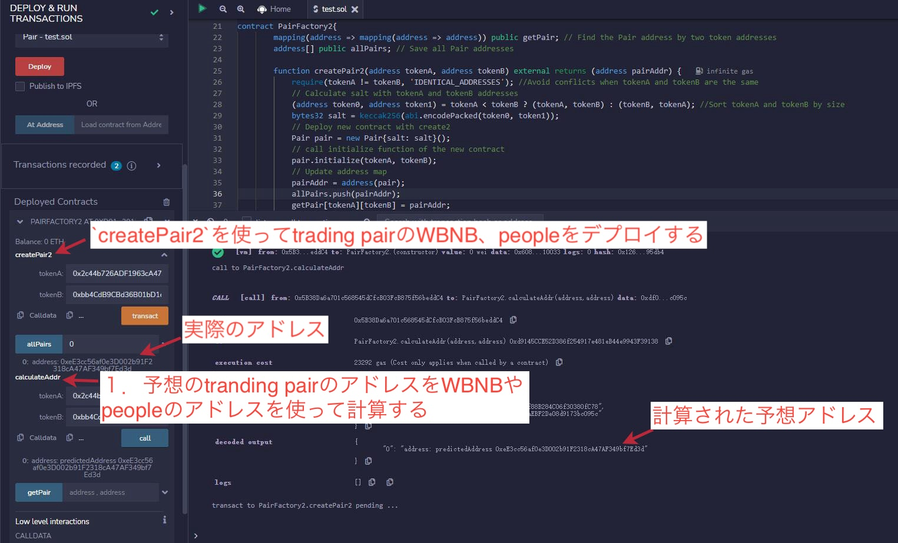

# WTF Solidity 超シンプル入門: 25. Create2

最近、Solidity の学習を再開し、詳細を確認しながら「Solidity 超シンプル入門」を作っています。これは初心者向けのガイドで、プログラミングの達人向けの教材ではありません。毎週 1〜3 レッスンのペースで更新していきます。

僕のツイッター：[@0xAA_Science](https://twitter.com/0xAA_Science)｜[@WTFAcademy\_](https://twitter.com/WTFAcademy_)

コミュニティ：[Discord](https://discord.gg/5akcruXrsk)｜[Wechat](https://docs.google.com/forms/d/e/1FAIpQLSe4KGT8Sh6sJ7hedQRuIYirOoZK_85miz3dw7vA1-YjodgJ-A/viewform?usp=sf_link)｜[公式サイト wtf.academy](https://wtf.academy)

すべてのソースコードやレッスンは github にて公開: [github.com/AmazingAng/WTFSolidity](https://github.com/AmazingAng/WTFSolidity)

---

## CREATE2

CREATE2 オペコードを使用すると、スマートコントラクトがイーサリアムネットワークにデプロイされる前に、そのアドレスを予測できます。`Uniswap`は`Pair`コントラクトを作成する際に`CREATE2`を使用しています。このレッスンでは、`CREATE2`の使い方について説明します。

### CREATE はどのようにアドレスを決めているのか

スマートコントラクトは、他のスマートコントラクトや一般アカウントによって`CREATE`オペコードを使用して作成されることがある。 これらの 2 つの場合、新しいスマートコントラクトのアドレスは同じ方法で計算されます。

- 作成者のアドレス（通常はデプロイされたウォレットアドレスまたはコントラクトアドレス）と`nonce`（そのアドレスが送信したトランザクションの合計数、コントラクトアカウントの場合は作成されたコントラクトの合計数、コントラクトを作成するたびに nonce+1）のハッシュ値。

```text
新しいアドレス = hash(作成者アドレス, nonce)
```

作成者のアドレスは不変なのに対し、`nonce`は時間とともに変化する可能性があるため、`CREATE`で作成されたコントラクトのアドレスは予測しにくいという特徴を持っています。

### CREATE2 はどのようにアドレスを決めているのか

`CREATE2`の目的は将来のイベントと分離するためにある。将来何が起ころうとも、事前に計算されたアドレスにコントラクトをデプロイできます。`CREATE2`で作成されたコントラクトのアドレスは 4 つの要素で決定されます：

- `0xFF`：定数。`CREATE`との衝突を避けるためにある
- `CreatorAddress`: `CREATE2`を呼び出す当該コントラクトのアドレス
- `salt`(塩)：作成者が指定する`bytes32`型の値で、新しいコントラクトのアドレスに一味別の影響を与えるためのもの（塩のような存在）
- `initcode`:新しいコントラクトの初期バイトコード（コントラクトの creation code とコンストラクタの引数）。

```text
新しいアドレス = hash("0xFF",作成者アドレス, salt, initcode)
```

`CREATE2`は、作成者が指定した`salt`を使用して、`initcode`をデプロイすると、そのコントラクトが`新しいアドレス`に格納されることを保証することができました。

## `CREATE2`はどう使うか

`CREATE2`の使い方は`CREATE`と似ており、新しいコントラクトを`new`するとともに、新しいコントラクトのコンストラクタに必要な引数を渡します。ただし、余計に`salt`を指定する必要があります。

```solidity
Contract x = new Contract{salt: _salt, value: _value}(params)
```

その中で`Contract`は作りたいコントラクトの名前です。`x`はコントラクトのアドレスで、`_salt`は指定した任意の値。もしコントラクトのコンストラクタが`payable`なら、作成時に`_value`量の`ETH`を送ることができます。`params`は新しいコントラクトのコンストラクタの引数です。

## 簡易版 Uniswap2

[前回](https://mirror.xyz/wtfacademy.eth/kojopp2CgDK3ehHxXc_2fkZe87uM0O5OmsEU6y83eJs)と同じように、今回私たちは`CREATE2`を使って簡易版の`Uniswap`を実装します。

### `Pair`

```solidity
contract Pair{
    address public factory; // ファクトリコントラクト
    address public token0; // トークン1
    address public token1; // トークン2

    constructor() payable {
        factory = msg.sender;
    }

    // デプロイ時に一度呼び出される
    function initialize(address _token0, address _token1) external {
        require(msg.sender == factory, 'UniswapV2: FORBIDDEN'); // sufficient check
        token0 = _token0;
        token1 = _token1;
    }
}
```

`Pair`コントラクトは非常にシンプルです。3 つの状態変数があります：`factory`、`token0`、`token1`。

`constructor`関数はデプロイ時に、`factory`をファクトリーのコントラクトアドレスにします。`initialize`関数は`Pair`コントラクトの作成時に一度だけ呼び出され、`token0`と`token1`を更新します。

### `PairFactory2`

```solidity
contract PairFactory2{
    mapping(address => mapping(address => address)) public getPair; // トークンのアドレスからペアのアドレスを参照する用
    address[] public allPairs; // すべてのペアアドレスを保存する

    function createPair2(address tokenA, address tokenB) external returns (address pairAddr) {
        require(tokenA != tokenB, "IDENTICAL_ADDRESSES"); // token Aとtoken Bが同じアドレスでないことを確認

        // token Aとtoken Bをソートして小さい方をtoken0に、大きい方をtoken1にする
        (address token0, address token1) = tokenA < tokenB ? (tokenA, tokenB) : (tokenB, tokenA);
        // token0、token1を使ってkeccak256でsaltを計算
        bytes32 salt = keccak256(abi.encodePacked(token0, token1));
        // create2をつかってコントラクトをデプロイする
        Pair pair = new Pair{salt: salt}();
        // 新しいコントラクトのinitialize関数を呼び出す
        pair.initialize(tokenA, tokenB);
        // アドレスのマップallPairsを更新
        pairAddr = address(pair);
        allPairs.push(pairAddr);
        getPair[tokenA][tokenB] = pairAddr;
        getPair[tokenB][tokenA] = pairAddr;
    }
}
```

ファクトリーコントラクトの`PairFactory2`は２つの状態変数を持っており、`getPair`は２つのトークンアドレスからペアアドレスを取得するためのマップ変数です。`allPairs`はすべてのペアアドレスを格納する配列です。

`PairFactory2`コントラクトは一つの`createPair2`関数しかありません。入力された２つのトークンアドレス`tokenA`と`tokenB`に基づいて新しい`Pair`コントラクトを作成します。

その中で、

```solidity
Pair pair = new Pair{salt: salt}();
```

は`CREATE2`を使ってコントラクトを作成しています。非常にシンプルですね。`salt`は`token1`と`token2`の`hash`値を利用しています。

```solidity
bytes32 salt = keccak256(abi.encodePacked(token0, token1));
```

### 事前に`Pair`のアドレスを計算

```solidity
// ペアのアドレスをあらかじめ計算する関数
function calculateAddr(address tokenA, address tokenB) public view returns (address predictedAddress) {
    require(tokenA != tokenB, "IDENTICAL_ADDRESSES"); // token Aとtoken Bが同じアドレスでないことを確認

    // token Aとtoken Bをソートして小さい方をtoken0に、大きい方をtoken1にする
    (address token0, address token1) = tokenA < tokenB ? (tokenA, tokenB) : (tokenB, tokenA);
    // token0、token1を使ってkeccak256でsaltを計算
    bytes32 salt = keccak256(abi.encodePacked(token0, token1));
    // hash()を使ってコントラクトアドレスを計算する
    predictedAddress = address(
        uint160(
            uint256(
                keccak256(abi.encodePacked(bytes1(0xff), address(this), salt, keccak256(type(Pair).creationCode)))
            )
        )
    );
}
```

私たちは`calculateAddr`関数を作り、事前に`tokenA`と`tokenB`によって生成される`Pair`のアドレスを計算しました。これを使って、計算したアドレスと実際のアドレスが一致するかどうかを確認できます。

皆さんはデプロイ済みの`PairFactory2`コントラクトを使って、以下のアドレスをパラメーターとして`createPair2`を呼び出し、作成されたペアのアドレスがどうなるか、事前に計算したアドレスと一致するかどうかを確認できます。

```text
WBNBアドレス: 0x2c44b726ADF1963cA47Af88B284C06f30380fC78
BSCオンチェーンのPEOPLEアドレス: 0xbb4CdB9CBd36B01bD1cBaEBF2De08d9173bc095c
```

#### もし`constructor`関数に引数がある場合

例えば、`create2`を使ってコントラクトを作成する場合：

> Pair pair = new Pair{salt: salt}(address(this));

計算時に、引数と`initcode`を一緒にパッケージにする必要があります。

> ~~keccak256(type(Pair).creationCode)~~

↓

> keccak256(abi.encodePacked(type(Pair).creationCode, abi.encode(address(this))))

```solidity
predictedAddress = address(uint160(uint(keccak256(abi.encodePacked(
                bytes1(0xff),
                address(this),
                salt,
                keccak256(abi.encodePacked(type(Pair).creationCode, abi.encode(address(this))))
            )))));
```

### remix にて検証する

1. まず、`WBNB`と`PEOPLE`のアドレスハッシュを`salt`として使って`Pair`コントラクトのアドレスを計算
2. `PairFactory2.createPair2`を呼び出し、`WBNB`と`PEOPLE`のアドレスを引数として渡します。`pair`コントラクトのアドレスを取得
3. コントラクトアドレスを比較

   

## create2 実際の活用シーン

3. 取引所が新規ユーザーのためのウォレットコントラクトアドレスを予約する。
4. `CREATE2`を使って`factory`コントラクトを作成し、`Uniswap V2`の中でペアを作成するのは`Factory`で行います。これをするメリットとしては、確定した`pair`アドレスを得ることができ、`Router`で`(tokenA, tokenB)`を使って`pair`アドレスを計算できるようになります。もう一度`Factory.getPair(tokenA, tokenB)`というコントラクトをまたぐ呼び出しを実行する必要がなくなります。

## まとめ

今回、私たちは`CREATE2`のオペコードの原理と使い方を紹介し、簡易版の`Uniswap`を作成しました。

事前にペアのコントラクトアドレスを計算しました。`CREATE2`を使うことで、コントラクトをデプロイする前にそのアドレスを予測できるようになります。

これはいくつかの`layer2`プロジェクトのベースの知識にもなります。
