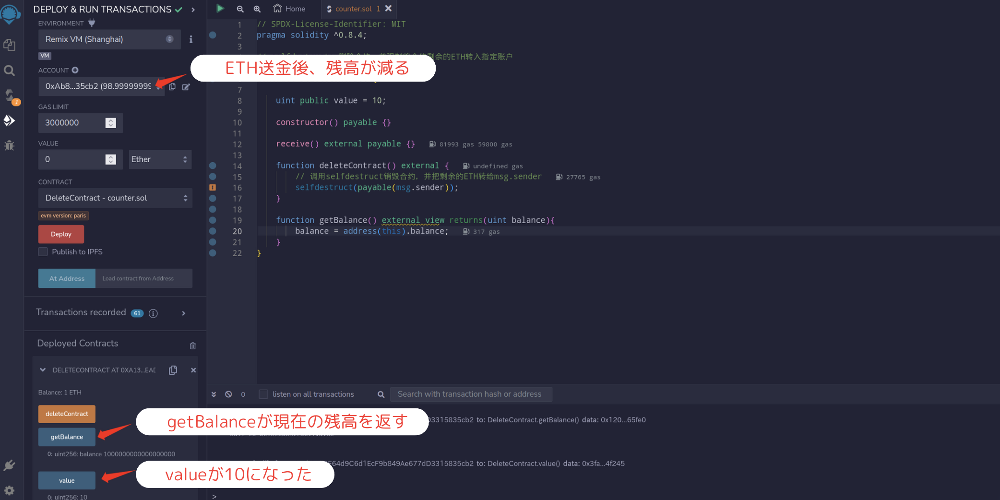
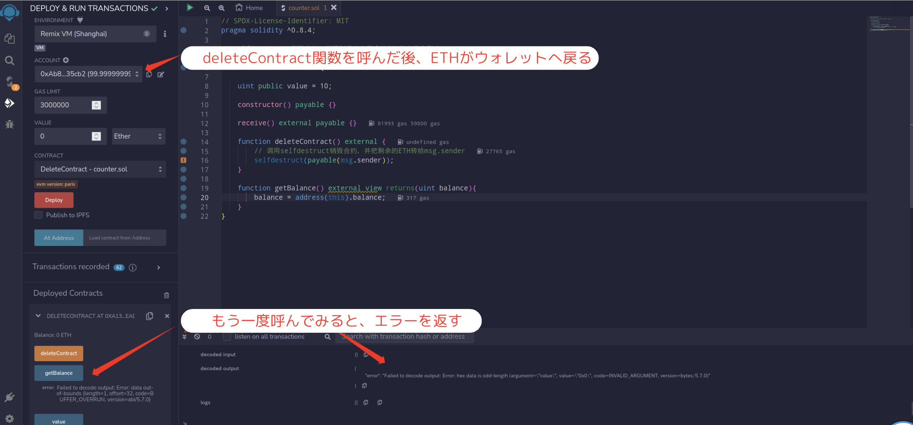
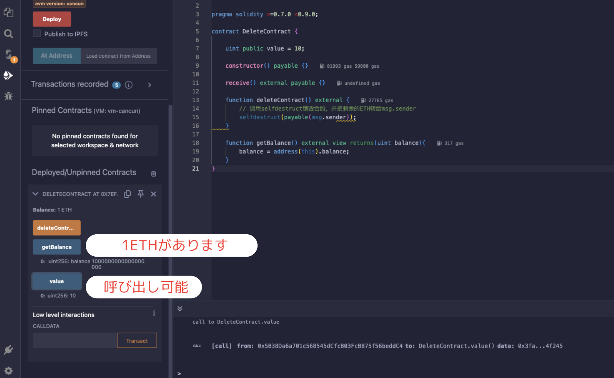
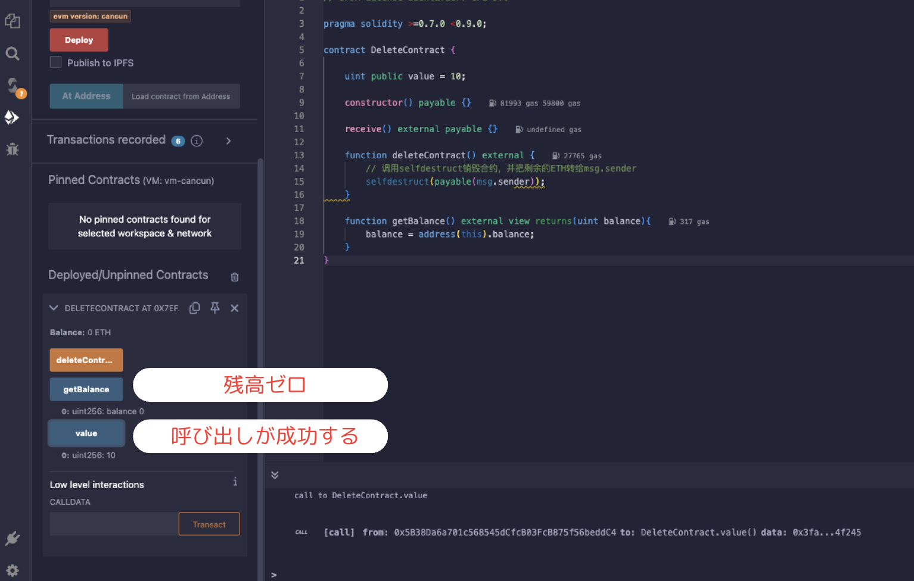
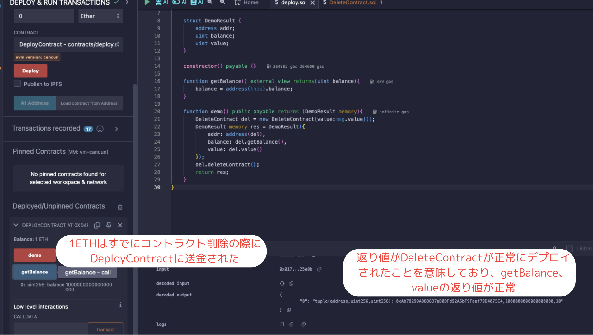
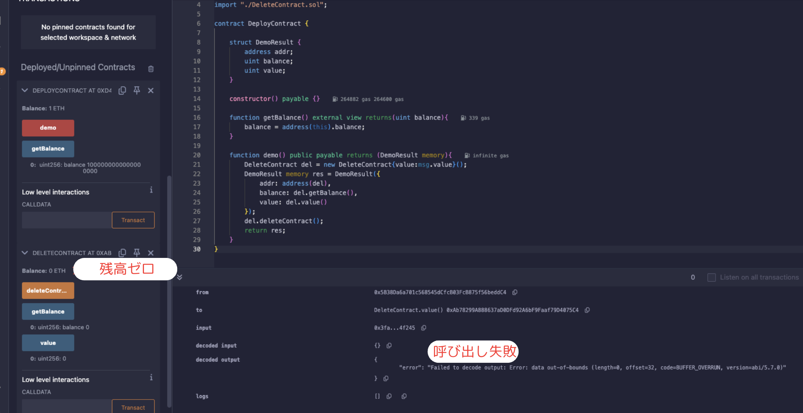

# WTF Solidity 超シンプル入門: 26. コントラクトの削除

最近、Solidity の学習を再開し、詳細を確認しながら「Solidity 超シンプル入門」を作っています。これは初心者向けのガイドで、プログラミングの達人向けの教材ではありません。毎週 1〜3 レッスンのペースで更新していきます。

僕のツイッター：[@0xAA_Science](https://twitter.com/0xAA_Science)｜[@WTFAcademy\_](https://twitter.com/WTFAcademy_)

コミュニティ：[Discord](https://discord.gg/5akcruXrsk)｜[Wechat](https://docs.google.com/forms/d/e/1FAIpQLSe4KGT8Sh6sJ7hedQRuIYirOoZK_85miz3dw7vA1-YjodgJ-A/viewform?usp=sf_link)｜[公式サイト wtf.academy](https://wtf.academy)

すべてのソースコードやレッスンは github にて公開: [github.com/AmazingAng/WTFSolidity](https://github.com/AmazingAng/WTFSolidity)

---

## `selfdestruct`

`selfdestruct`コマンドはコントラクトを削除するのに使います。同時にコントラクトに残った ETH を指定したアドレスへ送金することができます。

`selfdestruct`はコントラクトに間違いなどがおきた時のために設計されたもので、最初の頃には suicide と命名されていました。

しかし、このワードがあまりよろしくなく、ただでさえ鬱っぽいプログラマたちのために、`selfdestruct`と改名されました。[v0.8.18](https://blog.soliditylang.org/2023/02/01/solidity-0.8.18-release-announcement/) において、`selfdestruct` は「使用をおすすめしない」と決められました。

時には予期しない挙動をすることがあります。現在は代替手段がないため、開発者に対してコンパイル時の警告が出されるだけです。詳細は[EIP-6049](https://eips.ethereum.org/EIPS/eip-6049)を参照してください。

それに、イーサリアムの Cancun アップグレードにおいては、[EIP-6780](https://eips.ethereum.org/EIPS/eip-6780)はアップグレードに含まれていて、`Verkle Tree`へのサポートのために実施されました。

EIP-6780 は`SELFDESTRUCT`のオペコードの機能を減らしました。EIP の内容によると、現在`SELFDESTRUCT`は ETH を指定のアドレスへ送金することだけに対応しています。

従前の機能としてあったコントラクトを削除することはコントラクト作成及び削除が同じトランザクションにあった時にだけ機能できるとなりました。

現在の機能としては、

1. すでにデプロイ済みのコントラクトはもう`SELFDESTRUCT`して削除することができません。
2. もし`SELFDESTRUCT`機能を使いたいのなら、必ず同じトランザクションにおいて使う必要があります。

### `selfdestruct`の使い方

`selfdestruct`の使用は非常にシンプルです：

```solidity
selfdestruct(_addr)；
```

その中で`_addr`はコントラクトに残りの ETH を受け取るためのアドレスで、`_addr`には`receive()`や`fallback()`のような関数を持っていなくても受け取れる様になっています。

### 例 - ETH の送金

以下は Cancun アップグレードより前に、`selfdestruct`を使ってコントラクトを削除することができる例です。

Cancun アップグレード後は、コントラクトの削除は内部の ETH の残高の移動のみが可能です。

```solidity
contract DeleteContract {

    uint public value = 10;

    constructor() payable {}

    receive() external payable {}

    function deleteContract() external {
        // コントラクトを削除し、コントラクトの残りETHをmsg.senderに送金
        selfdestruct(payable(msg.sender));
    }

    function getBalance() external view returns(uint balance){
        balance = address(this).balance;
    }
}
```

`DeleteContract`コントラクトには`public`な`value`変数、`getBalance()`関数と`deleteContract()`関数があります。`getBalance()`関数はコントラクトの ETH 残高を返し、`deleteContract()`関数はコントラクトを削除し、コントラクトの ETH を呼び出し元に送金します。

コントラクトをデプロイした後、`DeleteContract`コントラクトに 1 ETH を送金します。`getBalance()`関数は 1 ETH を返し、`value`変数は 10 になります。

その後、`deleteContract()`関数を呼び出します。コントラクトは削除され、1 ETH は呼び出し元に送金されます。
**Cancun アップグレード後、コントラクトは削除されますが、コントラクトの ETH は指定のアドレスに移動され、コントラクトは引き続き呼び出し可能です。**

#### remix での検証

##### Before Cancun アップグレード

1.  コントラクトをデプロイし、1ETH を入金し、コントラクトのステートを確認

    

2.  コントラクトを削除し、コントラクトのステートを確認

    

    テスト中にコントラクトのステートを観察すると、コントラクトが保持していた ETH がゼロになり（指定のアドレスに返却された）、コントラクトの関数を呼び出すことができないことがわかります。

##### After Cancun アップグレード

1.  コントラクトをデプロイし、1ETH を入金し、コントラクトのステートを確認

    

2.  コントラクトを削除し、コントラクトのステートを確認

    

    テスト中、コントラクトのステートを観察すると、コントラクトが保持していた ETH がゼロになり（指定のアドレスに返却された）、コントラクトの関数を呼び出すことができることがわかります。

### 例 - 同じトランザクション内での`selfdestruct`

EIP によると、以前機能していた削除機能は、コントラクトの作成と削除が同じトランザクションにあった時にだけ機能できるとなりました。そのため、別のコントラクトを使って制御する必要があります。

```solidity
contract DeployContract {

    struct DemoResult {
        address addr;
        uint balance;
        uint value;
    }

    constructor() payable {}

    function getBalance() external view returns(uint balance){
        balance = address(this).balance;
    }

    function demo() public payable returns (DemoResult memory){
        DeleteContract del = new DeleteContract{value:msg.value}();
        DemoResult memory res = DemoResult({
            addr: address(del),
            balance: del.getBalance(),
            value: del.value()
        });
        del.deleteContract();
        return res;
    }
}
```

#### remix での検証

1. `DeployContract`コントラクトをデプロイし、1ETH を入金し、`demo()`関数を呼び出し、コントラクトのステートを確認します。`DeleteContract`が正しくデプロイされ、`selfdestruct`後に ETH が`DeployContract`に移動されていることがわかります。

   

2️. `DeleteContract`のアドレスを選択してインポートし、`DeleteContract`には ETH がないことがわかり、コントラクト関数の呼び出しも失敗します。



### 注意点

1. 外部に対してコントラクトの削除のインターフェースを提供する場合、コントラクトの所有者だけが呼び出せるようにすることが最善です。関数宣言時に`onlyOwner`修飾子を使用することができます。

2. コントラクトに`selfdestruct`機能があると、攻撃者に攻撃ベクトルを開くことになります（例えば、`selfdestruct`を使ってコントラクトに頻繁にトークンを送信する攻撃をすることで、GAS の費用を大幅に節約できます。ほとんどの人はそうしないでしょうけど）。また、この機能はコントラクトへのユーザーの信頼を低下させる可能性があります。

## まとめ

`selfdestruct`はスマートコントラクトの緊急停止ボタンのようなものです。コントラクトを削除し、残りの ETH を指定のアドレスに送金します。

当初、あの有名な`The DAO`事件が発生した際、イーサリアムの創設者たちは`selfdestruct`をコントラクトに追加してなくて、ハッカーの攻撃を停止することができなかったのを後悔しているかもしれません。

Cancun アップグレード後、`selfdestruct`の機能も変わりました。現在の業界では、何がなんでも変わることがあるので、勉強を継続していくことの大切さが思い知らされました。
