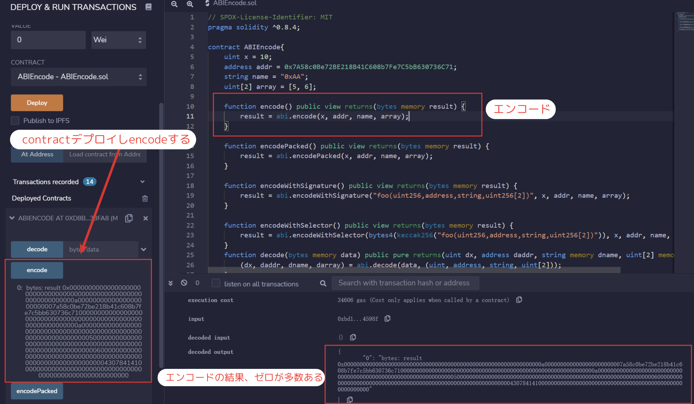
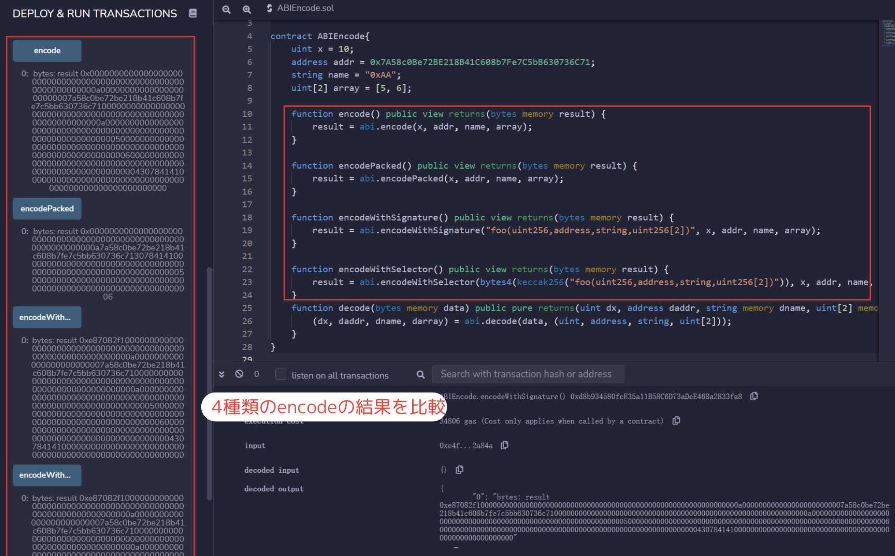
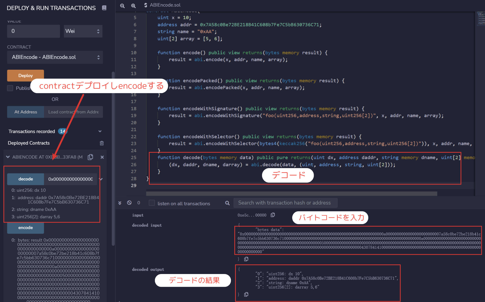
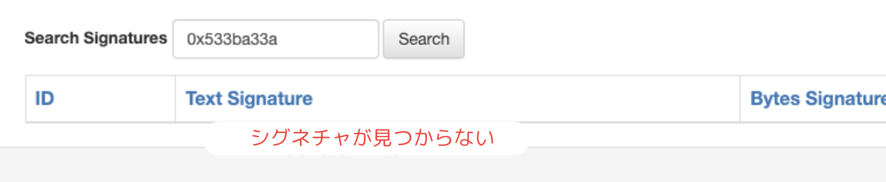

# WTF Solidity 超シンプル入門: 27. ABI のエンコード、デコード

最近、Solidity の学習を再開し、詳細を確認しながら「Solidity 超シンプル入門」を作っています。これは初心者向けのガイドで、プログラミングの達人向けの教材ではありません。毎週 1〜3 レッスンのペースで更新していきます。

僕のツイッター：[@0xAA_Science](https://twitter.com/0xAA_Science)｜[@WTFAcademy\_](https://twitter.com/WTFAcademy_)

コミュニティ：[Discord](https://discord.gg/5akcruXrsk)｜[Wechat](https://docs.google.com/forms/d/e/1FAIpQLSe4KGT8Sh6sJ7hedQRuIYirOoZK_85miz3dw7vA1-YjodgJ-A/viewform?usp=sf_link)｜[公式サイト wtf.academy](https://wtf.academy)

すべてのソースコードやレッスンは github にて公開: [github.com/AmazingAng/WTFSolidity](https://github.com/AmazingAng/WTFSolidity)

---

`ABI`（Application Binary Interface，アプリケーションの二進数のインターフェース）は、イーサリアムスマートコントラクトとのインタラクションをするためのスタンダードです。

データはその型に基づいてエンコードされ、エンコードされたデータには型情報が含まれていないため、デコード時には型を指定する必要があります。

`Solidity`には、`ABIエンコード`に関連する 4 つの関数があります：`abi.encode`、`abi.encodePacked`、`abi.encodeWithSignature`、`abi.encodeWithSelector`。また、`ABIデコード`には 1 つの関数があります：`abi.decode`。このレッスンでは、これらの関数の使い方を学びます。

## ABI エンコード

今回は 4 つの変数をエンコードします。それぞれの型は`uint256`（別名 uint）, `address`, `string`, `uint256[2]`です：

```solidity
uint x = 10;
address addr = 0x7A58c0Be72BE218B41C608b7Fe7C5bB630736C71;
string name = "0xAA";
uint[2] array = [5, 6];
```

### `abi.encode`

与えられたパラメータを[ABI ルール](https://learnblockchain.cn/docs/solidity/abi-spec.html)に従ってエンコードします。`ABI`はスマートコントラクトとのインタラクションに使用され、各パラメータを 32 バイトのデータで埋めて連結します。スマートコントラクトとのインタラクションを行う場合は、`abi.encode`を使用します。

```solidity
function encode() public view returns(bytes memory result) {
    result = abi.encode(x, addr, name, array);
}
```

エンコードの結果は`0x000000000000000000000000000000000000000000000000000000000000000a0000000000000000000000007a58c0be72be218b41c608b7fe7c5bb630736c7100000000000000000000000000000000000000000000000000000000000000a00000000000000000000000000000000000000000000000000000000000000005000000000000000000000000000000000000000000000000000000000000000600000000000000000000000000000000000000000000000000000000000000043078414100000000000000000000000000000000000000000000000000000000`，

`abi.encode`はデータごとに 32 バイトにするため、`0`が間にたくさん入っていることがわかります。

### `abi.encodePacked`

`abi.encodePacked`は、最小のスペースコーディングに従って与えられたパラメータをエンコードします。`abi.encode`と似ていますが、埋め込まれた`0`が省略されます。たとえば、`uint8`型をエンコードする場合、1 バイトだけ使用します。スペースを節約したい場合、スマートコントラクトとのインタラクションがない場合は、`abi.encodePacked`を使用できます。

```solidity
function encodePacked() public view returns(bytes memory result) {
    result = abi.encodePacked(x, addr, name, array);
}
```

エンコードの結果は`0x000000000000000000000000000000000000000000000000000000000000000a7a58c0be72be218b41c608b7fe7c5bb630736c713078414100000000000000000000000000000000000000000000000000000000000000050000000000000000000000000000000000000000000000000000000000000006`。`abi.encodePacked`で作成したコードが圧縮されるため，長さが`abi.encode`で作ったものより短くなります。

### `abi.encodeWithSignature`

`abi.encodeWithSignature`は`abi.encode`と同様ですが、最初のパラメータが`関数シグネチャ`です。たとえば以下の例では`"foo(uint256,address,string,uint256[2])"`があります。

これは他のコントラクトを呼び出す場合に使用します。

```solidity
function encodeWithSignature() public view returns(bytes memory result) {
    result = abi.encodeWithSignature("foo(uint256,address,string,uint256[2])", x, addr, name, array);
}
```

エンコードの結果は`0xe87082f1000000000000000000000000000000000000000000000000000000000000000a0000000000000000000000007a58c0be72be218b41c608b7fe7c5bb630736c7100000000000000000000000000000000000000000000000000000000000000a00000000000000000000000000000000000000000000000000000000000000005000000000000000000000000000000000000000000000000000000000000000600000000000000000000000000000000000000000000000000000000000000043078414100000000000000000000000000000000000000000000000000000000`。

`abi.encode`を下に 4 バイトの`関数セレクタ`[^说明]を追加したものとなります。

[^説明]：関数セレクタは関数名とパラメータを署名処理(Keccak–Sha3)して関数を識別するため、異なるコントラクト間での関数呼び出しに使用できます。

### `abi.encodeWithSelector`

`abi.encodeWithSelector`は`abi.encodeWithSignature`と同様ですが、最初のパラメータが`関数セレクタ`です。これは`関数署名`Keccak ハッシュの最初の 4 バイトです。

```solidity
function encodeWithSelector() public view returns(bytes memory result) {
    result = abi.encodeWithSelector(bytes4(keccak256("foo(uint256,address,string,uint256[2])")), x, addr, name, array);
}
```

エンコードの結果は`0xe87082f1000000000000000000000000000000000000000000000000000000000000000a0000000000000000000000007a58c0be72be218b41c608b7fe7c5bb630736c7100000000000000000000000000000000000000000000000000000000000000a00000000000000000000000000000000000000000000000000000000000000005000000000000000000000000000000000000000000000000000000000000000600000000000000000000000000000000000000000000000000000000000000043078414100000000000000000000000000000000000000000000000000000000`で、`abi.encodeWithSignature`の結果と同じです。

## ABI デコード

### `abi.decode`

`abi.decode`は`abi.encode`で生成されたバイナリエンコードをデコードし、元のパラメータに戻します。

```solidity
function decode(bytes memory data) public pure returns(uint dx, address daddr, string memory dname, uint[2] memory darray) {
    (dx, daddr, dname, darray) = abi.decode(data, (uint, address, string, uint[2]));
}
```

`abi.encode`のバイナリエンコードを`decode`に入力すると、元のパラメータがデコードされてわかるようになります。


## remix で確認

- コントラクトをデプロイし、`encode`関数を呼び出す

  

- 4 種類のエンコード方法の違いを比較

  

- abi.decode メソッドの結果を確認



## ABI のユースケース

1. コントラクトの開発において、ABI は call と組み合わせて、コントラクトの低レベル呼び出しを実現します。

```solidity
bytes4 selector = contract.getValue.selector;

bytes memory data = abi.encodeWithSelector(selector, _x);
(bool success, bytes memory returnedData) = address(contract).staticcall(data);
require(success);

return abi.decode(returnedData, (uint256));
```

2. ethers.js では、ABI はコントラクトのインスタンスを作成する際に使用されます。

```solidity
const wavePortalContract = new ethers.Contract(contractAddress, contractABI, signer);
/*
    * Call the getAllWaves method from your Smart Contract
    */
const waves = await wavePortalContract.getAllWaves();
```

3. ソースコードが非公開なコントラクトの場合、関数のシグネチャがわからないので、ABI を使用して関数を呼び出すことができます。

   - 0x533ba33a() はデコンパイル後に表示される関数で、関数の署名だけがあり、関数のシグネチャがわからない

   
   

   - このような場合、interface または contract を構築して呼び出すことはできません

     

   この状況では、ABI を使用して関数を呼び出すことができます。

   ```solidity
   bytes memory data = abi.encodeWithSelector(bytes4(0x533ba33a));

   (bool success, bytes memory returnedData) = address(contract).staticcall(data);
   require(success);

   return abi.decode(returnedData, (uint256));
   ```

## まとめ

イーサリアムにおいては、スマートコントラクトとのインタラクションが可能にするには、データをバイトコードにエンコードされなければなりません。

このレッスンでは、4 つの`ABIエンコード`メソッドと 1 つの`ABIデコード`メソッドを紹介しました。
