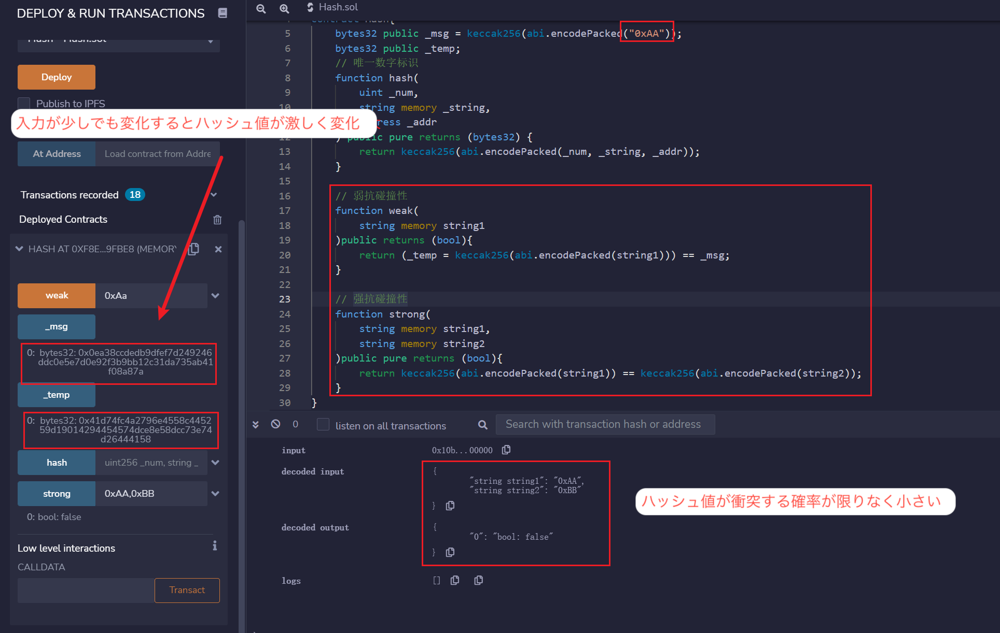

# WTF Solidity 超シンプル入門: 28. Hash

最近、Solidity の学習を再開し、詳細を確認しながら「Solidity 超シンプル入門」を作っています。これは初心者向けのガイドで、プログラミングの達人向けの教材ではありません。毎週 1〜3 レッスンのペースで更新していきます。

僕のツイッター：[@0xAA_Science](https://twitter.com/0xAA_Science)｜[@WTFAcademy\_](https://twitter.com/WTFAcademy_)

コミュニティ：[Discord](https://discord.gg/5akcruXrsk)｜[Wechat](https://docs.google.com/forms/d/e/1FAIpQLSe4KGT8Sh6sJ7hedQRuIYirOoZK_85miz3dw7vA1-YjodgJ-A/viewform?usp=sf_link)｜[公式サイト wtf.academy](https://wtf.academy)

すべてのソースコードやレッスンは github にて公開: [github.com/AmazingAng/WTFSolidity](https://github.com/AmazingAng/WTFSolidity)

---

ハッシュ関数（hash function）は暗号学の概念で、任意の長さのメッセージを固定長の値に変換することができます。この値はハッシュ値（hash）とも呼ばれます。

このレッスンでは、ハッシュ関数と`Solidity`での応用について簡単に紹介します。

## Hash の特徴

一般的によいとされるハッシュ関数は以下の特徴があります：

- 単方向性：入力からハッシュ値への計算は簡単かつ明確で、逆の計算は非常に困難であり、基本的にブルートフォース攻撃（暴力的な試行錯誤）に依存します。

- 感応性：入力が少し変わるだけで、生成されるハッシュ値は大きく変わります。

- 効率性：入力からハッシュ値への計算が高速です。

- 均一性：各ハッシュ値が取られる確率はほぼ等しくなければなりません。

- 衝突抵抗性：

  - 弱い衝突抵抗性：特定のメッセージ x に対して、同じハッシュ値を持つ異なるメッセージ x'を見つけることが困難です。
  - 強い衝突抵抗性：任意の x および x'を見つけて、hash(x) = hash(x')にすることが困難です。

## Hash の応用

- データのユニークな識別子を生成
- 署名
- セキュリティ暗号

## Keccak256

`Keccak256`函数是`Solidity`中最常用的哈希函数，用法非常简单：

```solidity
ハッシュ = keccak256(何らかのデータ);
```

### Keccak256 や sha3

これは非常に面白いことです：

1. sha3 が keccak の標準化から由来しています。多くの場合、Keccak と SHA3 は同義ですが、2015 年 8 月に SHA3 が最終的に標準化されると、NIST はパディングアルゴリズムを調整しました。**そのため、SHA3 は keccak で計算すると異なる結果を得られるようになった**、開発するときには注意してください。
2. イーサリアムの開発時、sha3 がまだ標準化されている最中でして、keccak を採用しました。そのため、Ethereum と Solidity スマートコントラクトコードの SHA3 は Keccak256 を指します。NIST-SHA3 ではありません。混乱を避けるため、コントラクトコードに直接 Keccak256 と書くのが最も明確です。

### データのユニークな識別子を生成する

私たちは`keccak256`を用いて、いくつかのデータのユニークな識別子を生成することができます。たとえば、異なる型のデータがいくつかある場合、`uint`、`string`、`address`、まず`abi.encodePacked`メソッドを使ってそれらをパックし、エンコードし、それから`keccak256`を使ってユニークな識別子を生成します：

```solidity
function hash(
    uint _num,
    string memory _string,
    address _addr
    ) public pure returns (bytes32) {
    return keccak256(abi.encodePacked(_num, _string, _addr));
}
```

### 弱い衝突抵抗性

私たちは`keccak256`を使って、先ほど説明した弱い衝突抵抗性を示す例を見てみましょう。つまり、メッセージ`x`が与えられたとき、異なるメッセージ`x'`を見つけて、`hash(x) = hash(x')`が困難であることを確認します。

私たちはメッセージ`0xAA`を与えられ、もう一つのメッセージを見つけて、それらのハッシュ値が等しくなるかどうかを確認します：

```solidity
// 弱い衝突抵抗性
function weak(
    string memory string1
    )public view returns (bool){
    return keccak256(abi.encodePacked(string1)) == _msg;
}
```

皆さんは 10 回試して、たまたま衝突するかどうかを確認してください。

### 強い衝突抵抗性

私たちは`keccak256`を使って、先ほど説明した強い衝突抵抗性を示す例を見てみましょう。つまり、任意の`x`と`x'`を見つけて、`hash(x) = hash(x')`が困難であることを確認します。

私たちは、2 つの異なる`string`パラメータ`string1`と`string2`を受け取り、それらのハッシュが同じかどうかを確認する関数`strong`を作成します：

```solidity
// 強い衝突抵抗性
function strong(
        string memory string1,
        string memory string2
    )public pure returns (bool){
    return keccak256(abi.encodePacked(string1)) == keccak256(abi.encodePacked(string2));
}
```

皆さんは 10 回試して、たまたま衝突するかどうかを確認してください。

## remix での検証

- コントラクトをデプロイし、ハッシュ関数を使って唯一の識別子を生成する結果を確認

  

- ハッシュ関数の感度を確認し、強い、弱い抗衝突性を確認

  

## まとめ

今回、私たちはハッシュ関数とは何か、そして`Solidity`で最も一般的に使用されるハッシュ関数`keccak256`について紹介しました。
