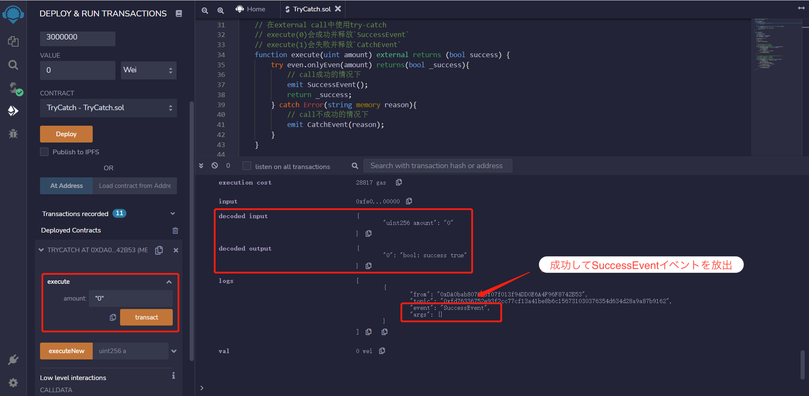
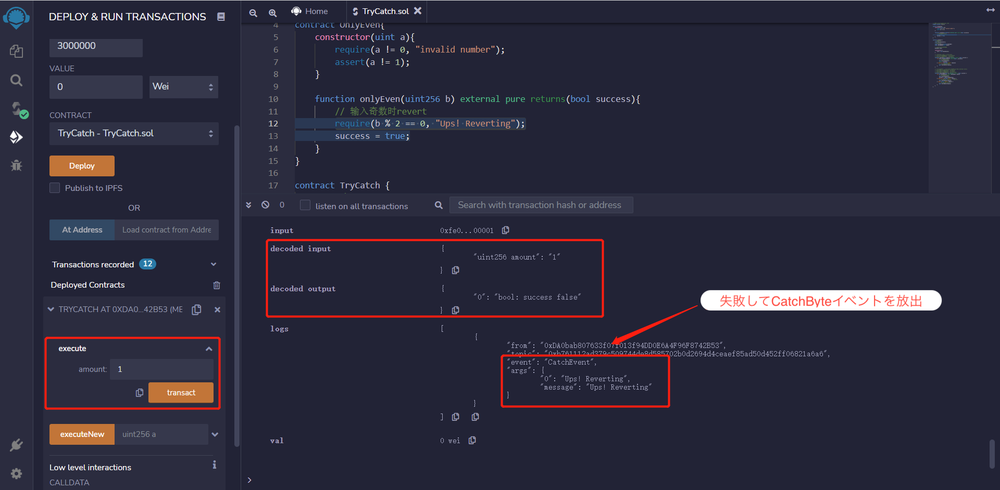
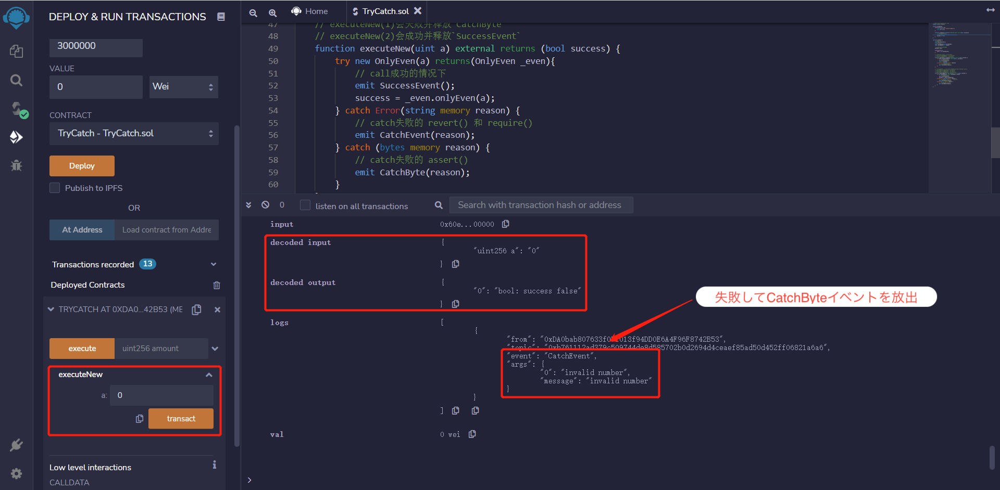
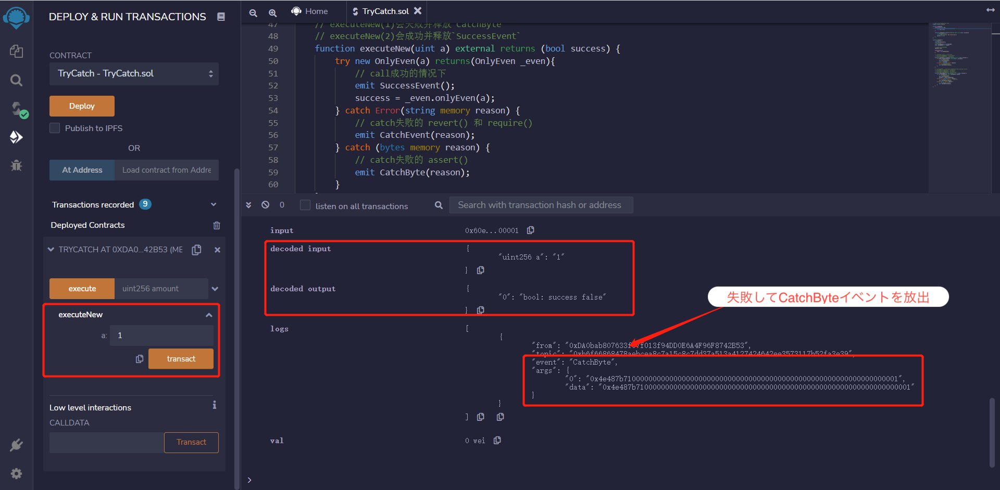
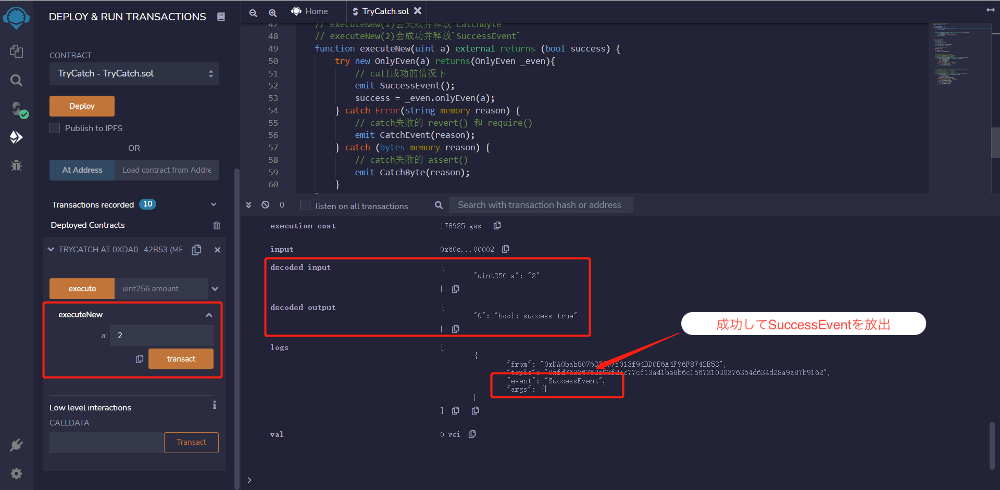

# WTF Solidity 超シンプル入門: 30. Try Catch

最近、Solidity の学習を再開し、詳細を確認しながら「Solidity 超シンプル入門」を作っています。これは初心者向けのガイドで、プログラミングの達人向けの教材ではありません。毎週 1〜3 レッスンのペースで更新していきます。

僕のツイッター：[@0xAA_Science](https://twitter.com/0xAA_Science)｜[@WTFAcademy\_](https://twitter.com/WTFAcademy_)

コミュニティ：[Discord](https://discord.gg/5akcruXrsk)｜[Wechat](https://docs.google.com/forms/d/e/1FAIpQLSe4KGT8Sh6sJ7hedQRuIYirOoZK_85miz3dw7vA1-YjodgJ-A/viewform?usp=sf_link)｜[公式サイト wtf.academy](https://wtf.academy)

すべてのソースコードやレッスンは github にて公開: [github.com/AmazingAng/WTFSolidity](https://github.com/AmazingAng/WTFSolidity)

---

`try-catch`は、現代のプログラミング言語でほぼ標準的な例外処理方法です。`Solidity`の 0.6 バージョンでも追加されました。このレッスンでは、`try-catch`を使用してスマートコントラクト内の例外を処理する方法について説明します。

## `try-catch`

`Solidity`では、`try-catch`は`external`関数またはコントラクトの`constructor`（`external`関数として扱われる）の呼び出しにのみ使用できます。基本構文は次のとおりです：

```solidity
try externalContract.f() {
    // callが成功した場合、このブロック内のコードを実行

} catch {
    // callが失敗した場合、このブロック内のコードを実行
}
```

その中で、`externalContract.f()`は外部コントラクトの関数呼び出しを指します。`try`ブロックは呼び出しが成功した場合に実行され、`catch`ブロックは呼び出しが失敗した場合に実行されます。

同様に、`this.f()`は`externalContract.f()`の代わりに使用できます。`this.f()`も外部呼び出しとして扱われますが、コンストラクタ内では使用できません。なぜなら、その時点でコントラクトがまだ作成されていないからです。

もし呼び出し関数が戻り値を持っている場合、`try`の後に`returns(returnType val)`を宣言する必要があります。そして、`try`モジュール内で戻り値を使用できます。もしコントラクトを作成する場合、戻り値は新しいコントラクト変数です。

```solidity
try externalContract.f() returns(returnType val){
    // callが成功した場合、このブロック内のコードを実行
} catch {
    // callが失敗した場合、このブロック内のコードを実行
}
```

それに、`catch`モジュールは特定の例外原因をキャッチできます：

```solidity
try externalContract.f() returns(returnType){
    // callが成功したら、コードを実行
} catch Error(string memory /*reason*/) {
    // revert("reasonString") や require(false, "reasonString")をキャッチする
} catch Panic(uint /*errorCode*/) {
    // Panicのエラーをキャッチする。例えば、assertが失敗した場合、オーバーフロー、ゼロ除算、配列アクセスの範囲外など
} catch (bytes memory /*lowLevelData*/) {
    // もしrevertされて上の二種類の例外にマッチしない場合、この分岐のcatchに入る
    // 例えば、revert() require(false) などのカスタムエラーが発生した場合
}
```

## `try-catch`実践

### `OnlyEven`

私たちは外部の`OnlyEven`コントラクトを作成し、`try-catch`を使用して例外を処理します：

```solidity
contract OnlyEven{
    constructor(uint a){
        require(a != 0, "invalid number");
        assert(a != 1);
    }

    function onlyEven(uint256 b) external pure returns(bool success){
        // 奇数の場合はrevertする
        require(b % 2 == 0, "Ups! Reverting");
        success = true;
    }
}
```

`OnlyEven`コントラクトには、コンストラクタと`onlyEven`関数が含まれています。

- コンストラクタには引数の`a`があり、`a = 0`の場合は`require`が例外をスローし、`a = 1`の場合は`assert`が例外をスローします。それ以外の場合は正常です。
- `onlyEven`関数には引数`b`があり、`b`が奇数の場合、`require`が例外をスローします。

### 外部関数呼び出し時の例外を処理する

まず、`TryCatch`コントラクトにいくつかのイベントと状態変数を定義します：

```solidity
    // 成功イベント
event SuccessEvent();

    // 失敗イベント
event CatchEvent(string message);
event CatchByte(bytes data);

// OnlyEvenのコントラクト変数を宣言
OnlyEven even;

constructor() {
    even = new OnlyEven(2);
}
```

`SuccessEvent`は呼び出しが成功した場合に発生するイベントで、`CatchEvent`と`CatchByte`は例外が発生した場合に発生するイベントで、それぞれ`require/revert`と`assert`例外に対応しています。`even`は`OnlyEven`コントラクトの状態変数です。

それで、`execute`関数で外部関数`onlyEven`の例外を処理するために`try-catch`を使用します：

```solidity
// external callにてtry-catchを使う
function execute(uint amount) external returns (bool success) {
    try even.onlyEven(amount) returns(bool _success){
        // callが成功した場合
        emit SuccessEvent();
        return _success;
    } catch Error(string memory reason) {
        // callが失敗した場合
        emit CatchEvent(reason);
    }
}
```

### remix にて検証、外部関数呼び出しの例外を処理

`execute(0)`を実行する場合、`0`は偶数であり、`require(b % 2 == 0, "Ups! Reverting");`を満たすため、例外はスローされず、呼び出しは成功し、`SuccessEvent`イベントが発生します。



`execute(1)`を実行する場合、`1`は奇数であり、`require(b % 2 == 0, "Ups! Reverting");`を満たさないため、例外がスローされ、呼び出しは失敗し、`CatchEvent`イベントが発生します。



### コントラクト作成時の例外を処理

ここでは、私たちは`try-catch`を使用してコントラクト作成時の例外を処理します。`try`モジュールを`OnlyEven`コントラクトの作成に変更するだけです：

```solidity
// コントラクト作成時にtry-catchを使用する（コントラクトの作成はexternal callとみなされる）
// executeNew(0)の場合、失敗してイベント`CatchEvent`を放出
// executeNew(1)の場合、失敗してイベント`CatchEvent`を放出
// executeNew(2)の場合、成功してイベント`SuccessEvent`を放出
function executeNew(uint a) external returns (bool success) {
    try new OnlyEven(a) returns(OnlyEven _even){
        // callが成功した場合
        emit SuccessEvent();
        success = _even.onlyEven(a);
    } catch Error(string memory reason) {
        // catchが失敗した場合のrequire()やrevert()
        emit CatchEvent(reason);
    } catch (bytes memory reason) {
        // assert()のエラーをcatchでキャッチする
        // assert()の場合、エラーのタイプは`Panic(uint256)`なので、`Error(stiing)`とは異なる。だから、このcatchに入る
        emit CatchByte(reason);
    }
}
```

### remix にて検証、コントラクト作成時の例外を処理

`executeNew(0)`を run するとき、`0`は`require(a != 0, "invalid number");`を満たさないため、例外がスローされ、`CatchEvent`イベントが発生します。



`executeNew(1)`を実行する場合、`1`は`assert(a != 1);`を満たさないため、例外がスローされ、`CatchByte`イベントが発生します。



`executeNew(2)`を実行する場合、`2`は`require(a != 0, "invalid number");`と`assert(a != 1);`を満たすため、成功し、`SuccessEvent`イベントが発生します。



## まとめ

今回は、`Solidity`で`try-catch`を使用してスマートコントラクト内の例外を処理する方法について説明しました：

- 外部コントラクトの呼び出しやコントラクトの作成にのみ使用可能
- もし`try`が成功した場合、返り値の変数を宣言しなければならず、返り値の型と一致しなければなりません。
