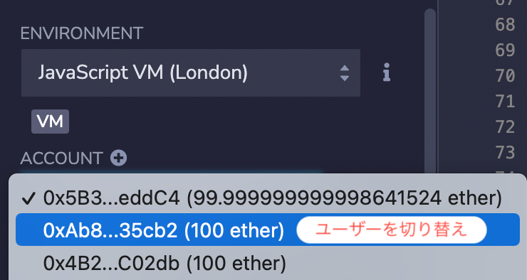
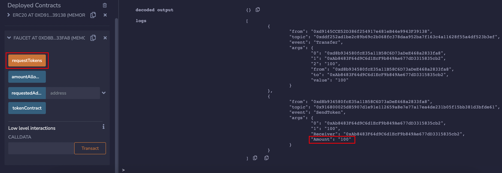
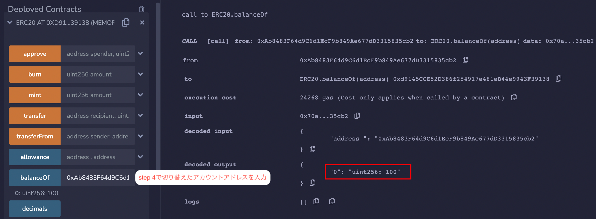

# WTF Solidity 超シンプル入門: 31. フォーセット（蛇口）

最近、Solidity の学習を再開し、詳細を確認しながら「Solidity 超シンプル入門」を作っています。これは初心者向けのガイドで、プログラミングの達人向けの教材ではありません。毎週 1〜3 レッスンのペースで更新していきます。

僕のツイッター：[@0xAA_Science](https://twitter.com/0xAA_Science)｜[@WTFAcademy\_](https://twitter.com/WTFAcademy_)

コミュニティ：[Discord](https://discord.gg/5akcruXrsk)｜[Wechat](https://docs.google.com/forms/d/e/1FAIpQLSe4KGT8Sh6sJ7hedQRuIYirOoZK_85miz3dw7vA1-YjodgJ-A/viewform?usp=sf_link)｜[公式サイト wtf.academy](https://wtf.academy)

すべてのソースコードやレッスンは github にて公開: [github.com/AmazingAng/WTFSolidity](https://github.com/AmazingAng/WTFSolidity)

---

31 レッスンでは、私たちは`ERC20`トークンスタンダードを学びました。このレッスンでは、`ERC20`フォーセットのスマートコントラクトを学びます。

フォーセットとは、ユーザーが無料でトークンを受け取ることができるサイト/アプリケーションのことです。

今回はこのフォーセットコントラクトを作成します。

## フォーセット

人間が喉を乾いたときに、蛇口から水を取って飲むように、人は無料のトークンが欲しいときには、フォーセットに行って受け取ることができます。トークンのフォーセットとは、ユーザーが無料でトークンを受け取ることができるウェブサイト/アプリケーションです。

一番最初のトークンフォーセットはビットコイン（以下 BTC と呼ぶ）のフォーセットです。BTC からの価格は現在 3 万ドルを超えておりますが、2010 年には 0.1 ドル未満であり、保有者も少なかったです。BTC の影響力を拡大するため、BTC コミュニティの Gavin Andresen は BTC フォーセットを開発し、他の人が無料で BTC を受け取ることができるようにしました。

人々はフォーセットを利用して BTC を受け取りました。ただで貰えるものはみんな好きなんです。一部の人達は BTC の信者となりました。

フォーセットは 1 万 9700 BTC 以上を送り出し、現在の価値だと約 6 億ドルです！

## ERC20 フォーセット

ここでは、私たちはシンプルな`ERC20`フォーセットを実装します。ロジックは非常にシンプルです：`ERC20`トークンをフォーセットコントラクトに送り、ユーザーはコントラクトの`requestToken()`関数を呼び出して`100`単位のトークンを受け取ることができます。各アドレスは 1 回だけ受け取ることができます。

### 状态变量

フォーセットのコントラクトでは 3 つの状态変数を定義します。

- `amountAllowed`は 1 回に受け取れるトークンの量を設定します（デフォルトは`100`ですが、100 枚ではなく、トークンは小数点以下を持つため）。
- `tokenContract`は配布される`ERC20`トークンのアドレスを記録します。
- `requestedAddress`はトークンを受け取ったアドレスを記録します。

```solidity
uint256 public amountAllowed = 100; // 一回受け取る量は100とする
address public tokenContract;   // tokenコントラクトアドレス
mapping(address => bool) public requestedAddress;   // トークンを受け取ったアドレス
```

### イベント

フォーセットコントラクトでは`SendToken`イベントを定義しています。このイベントは、トークンを受け取るたびに、受け取ったアドレスと数量を記録します。

```solidity
// SendTokenイベント
event SendToken(address indexed Receiver, uint256 indexed Amount);
```

### 関数

コントラクトには 2 つの関数があります。

- コンストラクタ：`tokenContract`ステート変数を初期化し、配布される`ERC20`トークンのアドレスを設定します。

  ```solidity
  // デプロイ時にtokenコントラクトを設定する
  constructor(address _tokenContract) {
    tokenContract = _tokenContract; // set token contract
  }
  ```

- `requestTokens()`函数，用户调用它可以领取`ERC20`代币。

  ```solidity
   // ユーザーがトークンをリクエストする関数
   function requestTokens() external {
      require(!requestedAddress[msg.sender], "Can't Request Multiple Times!"); // アドレスごとに一回だけリクエスト可能
      IERC20 token = IERC20(tokenContract); // 创建IERC20合约对象
      require(token.balanceOf(address(this)) >= amountAllowed, "Faucet Empty!"); // フォーセットの残高が足りない

      token.transfer(msg.sender, amountAllowed); // tokenを送る
      requestedAddress[msg.sender] = true; // 受け取ったアドレスを記録

      emit SendToken(msg.sender, amountAllowed); // SendTokenイベントを放出
   }
  ```

## Remix でフォーセットをテスト

1. まず、`ERC20`トークンコントラクトをデプロイし、`WTF`という名前とシンボルを持つトークンを作成し、自分に`10000`単位のトークンを`mint`します。
   

2. `Faucet`フォーセットコントラクトをデプロイし、初期化パラメータに上記`ERC20`トークンのコントラクトアドレスを入力します。
   

3. `ERC20`トークンコントラクトに`Faucet`コントラクトに`10000`単位のトークンを送金します。
   

4. 新しいアカウントから、`Faucet`コントラクトの`requestTokens()`関数を呼び出し、トークンを受け取ります。ターミナルにて`SendToken`イベントが放出されたのを確認できます。
   
   

5. `ERC20`トークンコントラクト上で`balanceOf`を使って、フォーセットにトークンを受け取ったアカウントの残高を確認します。残高が`100`に変わっていることを確認できます。
   

## まとめ

今回は、フォーセットの歴史と`ERC20`フォーセットコントラクトを紹介しました。歴史において現れたような BTC フォーセットのようなフォーセットは今度どこに現れると思いますか？
