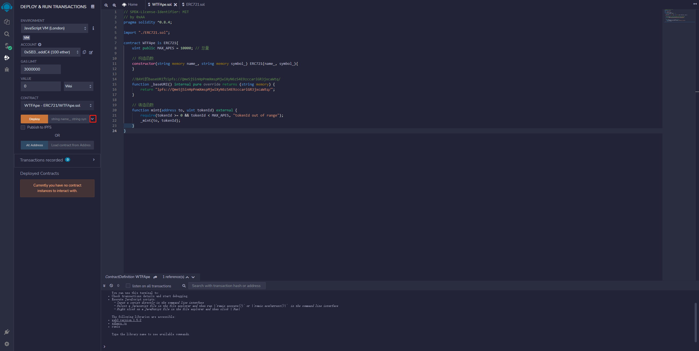
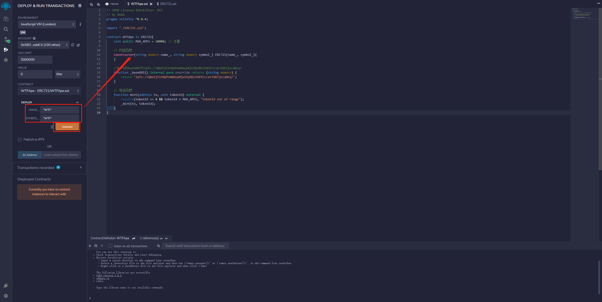
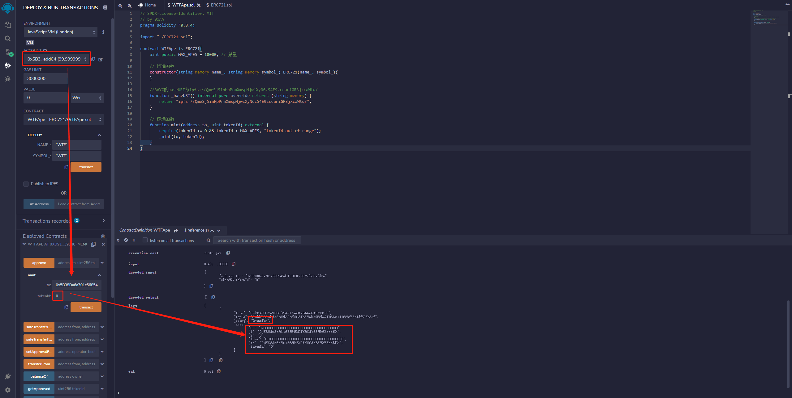
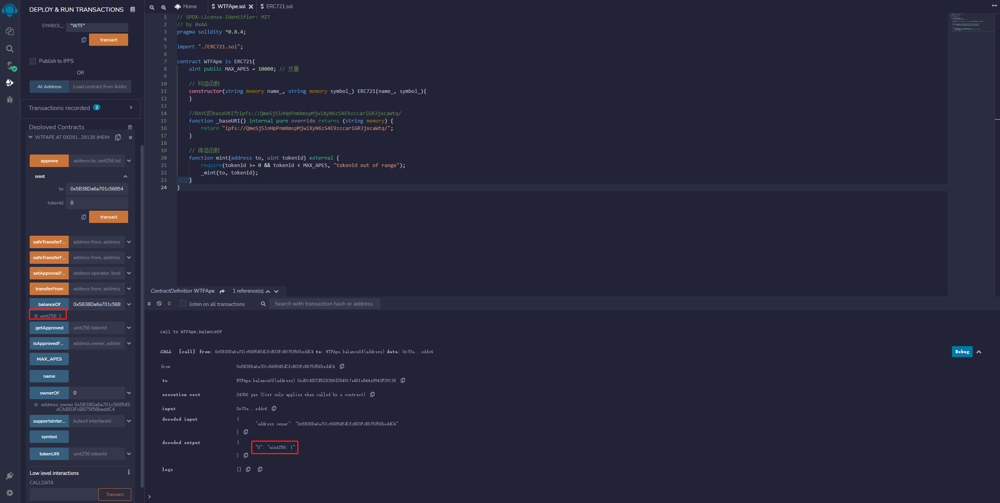
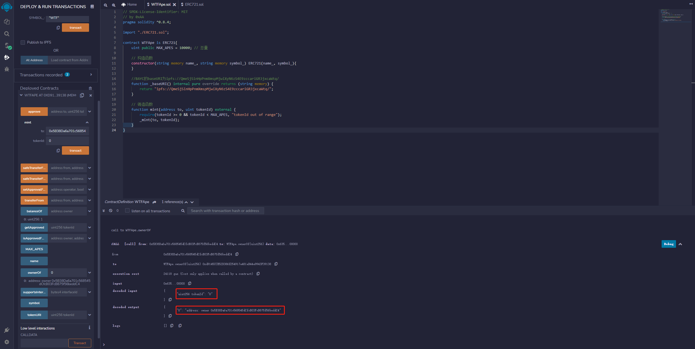

# WTF Solidity極簡入門: 34. ERC721

私は最近Solidityを再学習し、詳細を固めながら「WTF Solidity極簡入門」を書いています。これは初心者向けです（プログラミング上級者は他のチュートリアルを参照してください）。毎週1-3講を更新します。

Twitter：[@0xAA_Science](https://twitter.com/0xAA_Science)｜[@WTFAcademy_](https://twitter.com/WTFAcademy_)

コミュニティ：[Discord](https://discord.gg/5akcruXrsk)｜[WeChatグループ](https://docs.google.com/forms/d/e/1FAIpQLSe4KGT8Sh6sJ7hedQRuIYirOoZK_85miz3dw7vA1-YjodgJ-A/viewform?usp=sf_link)｜[公式サイト wtf.academy](https://wtf.academy)

すべてのコードとチュートリアルはgithubでオープンソース化されています：[github.com/AmazingAng/WTF-Solidity](https://github.com/AmazingAng/WTF-Solidity)

---

`BTC`や`ETH`などのトークンは同質化トークンに属し、マイナーが採掘した第`1`枚目の`BTC`と第`10000`枚目の`BTC`には違いがなく、等価です。しかし、世界には多くの非同質なアイテムがあり、不動産、骨董品、バーチャルアート作品などが含まれ、これらのアイテムは同質化トークンで抽象化することができません。そこで、[イーサリアムEIP721](https://eips.ethereum.org/EIPS/eip-721)が`ERC721`標準を提案し、非同質なアイテムを抽象化しました。この講義では、`ERC721`標準を紹介し、それを基にして`NFT`を発行します。

## EIPとERC

ここで理解すべき点があります。本節のタイトルは`ERC721`ですが、ここで`EIP721`についても言及しています。この二つの関係は何でしょうか？

`EIP`は`Ethereum Improvement Proposals`（イーサリアム改善提案）の略で、イーサリアム開発者コミュニティが提案する改善提案であり、番号で整理された一連の文書で、インターネット上のIETFのRFCに似ています。

`EIP`は`Ethereum`エコシステムの任意の領域の改善であり、新機能、ERC、プロトコル改善、プログラミングツールなどが含まれます。

`ERC`は`Ethereum Request For Comment`（イーサリアム意見征求稿）の略で、イーサリアム上のアプリケーションレベルの各種開発標準とプロトコルを記録するために使用されます。典型的なトークン標準（`ERC20`、`ERC721`）、名前登録（`ERC26`、`ERC13`）、URI範式（`ERC67`）、Library/Package形式（`EIP82`）、ウォレット形式（`EIP75`、`EIP85`）などがあります。

ERCプロトコル標準はイーサリアムの発展に影響を与える重要な要因であり、`ERC20`、`ERC223`、`ERC721`、`ERC777`などは、すべてイーサリアムエコシステムに大きな影響を与えました。

したがって最終的な結論：`EIP`には`ERC`が含まれます。

**この節の学習完了後に、なぜ最初に`ERC165`について学び、`ERC721`ではないのかが理解できます。結論を見たい場合は最下部に直接移動してください**

## ERC165

[ERC165標準](https://eips.ethereum.org/EIPS/eip-165)を通じて、スマートコントラクトは自身がサポートするインターフェースを宣言し、他のコントラクトが確認できるようにします。簡単に言うと、ERC165はスマートコントラクトが`ERC721`、`ERC1155`のインターフェースをサポートしているかどうかをチェックする仕組みです。

`IERC165`インターフェースコントラクトは`supportsInterface`関数のみを宣言し、クエリしたい`interfaceId`インターフェースidを入力し、コントラクトがそのインターフェースidを実装している場合は`true`を返します：

```solidity
interface IERC165 {
    /**
     * @dev コントラクトがクエリされた`interfaceId`を実装している場合はtrueを返します
     * ルールの詳細：https://eips.ethereum.org/EIPS/eip-165#how-interfaces-are-identified[EIP section]
     *
     */
    function supportsInterface(bytes4 interfaceId) external view returns (bool);
}
```

`ERC721`が`supportsInterface()`関数をどのように実装しているかを見てみましょう：

```solidity
    function supportsInterface(bytes4 interfaceId) external pure override returns (bool)
    {
        return
            interfaceId == type(IERC721).interfaceId ||
            interfaceId == type(IERC165).interfaceId;
    }
```

クエリが`IERC721`または`IERC165`のインターフェースidの場合、`true`を返し、そうでない場合は`false`を返します。

## IERC721

`IERC721`は`ERC721`標準のインターフェースコントラクトで、`ERC721`が実装すべき基本機能を規定しています。`tokenId`を使用して特定の非同質化トークンを表現し、承認や転送には`tokenId`を明確にする必要があります。一方、`ERC20`は転送額を明確にするだけで済みます。

```solidity
/**
 * @dev ERC721標準インターフェース.
 */
interface IERC721 is IERC165 {
    event Transfer(address indexed from, address indexed to, uint256 indexed tokenId);
    event Approval(address indexed owner, address indexed approved, uint256 indexed tokenId);
    event ApprovalForAll(address indexed owner, address indexed operator, bool approved);

    function balanceOf(address owner) external view returns (uint256 balance);

    function ownerOf(uint256 tokenId) external view returns (address owner);

    function safeTransferFrom(
        address from,
        address to,
        uint256 tokenId,
        bytes calldata data
    ) external;

    function safeTransferFrom(
        address from,
        address to,
        uint256 tokenId
    ) external;

    function transferFrom(
        address from,
        address to,
        uint256 tokenId
    ) external;

    function approve(address to, uint256 tokenId) external;

    function setApprovalForAll(address operator, bool _approved) external;

    function getApproved(uint256 tokenId) external view returns (address operator);

    function isApprovedForAll(address owner, address operator) external view returns (bool);
}
```

### IERC721イベント
`IERC721`には3つのイベントが含まれており、その中の`Transfer`と`Approval`イベントは`ERC20`にもあります。
- `Transfer`イベント：転送時に発行され、トークンの送信元アドレス`from`、受信アドレス`to`、`tokenId`を記録します。
- `Approval`イベント：承認時に発行され、承認アドレス`owner`、被承認アドレス`approved`、`tokenId`を記録します。
- `ApprovalForAll`イベント：一括承認時に発行され、一括承認の送信元アドレス`owner`、被承認アドレス`operator`、承認の有無`approved`を記録します。

### IERC721関数
- `balanceOf`：あるアドレスのNFT保有量`balance`を返します。
- `ownerOf`：ある`tokenId`の所有者`owner`を返します。
- `transferFrom`：通常の転送で、転送元アドレス`from`、受信アドレス`to`、`tokenId`をパラメータとします。
- `safeTransferFrom`：安全転送（受信者がコントラクトアドレスの場合、`ERC721Receiver`インターフェースの実装が必要）。転送元アドレス`from`、受信アドレス`to`、`tokenId`をパラメータとします。
- `approve`：別のアドレスにあなたのNFTの使用を承認します。被承認アドレス`to`と`tokenId`をパラメータとします。
- `getApproved`：`tokenId`がどのアドレスに承認されているかをクエリします。
- `setApprovalForAll`：自身が保有するそのシリーズのNFTを特定のアドレス`operator`に一括承認します。
- `isApprovedForAll`：あるアドレスのNFTが別の`operator`アドレスに一括承認されているかをクエリします。
- `safeTransferFrom`：安全転送のオーバーロード関数で、パラメータに`data`が含まれます。

## IERC721Receiver

コントラクトが`ERC721`の関連関数を実装していない場合、転送された`NFT`はブラックホールに入り、永遠に転送できなくなります。誤転送を防ぐため、`ERC721`は`safeTransferFrom()`安全転送関数を実装し、対象コントラクトが`IERC721Receiver`インターフェースを実装している必要があり、そうでなければ`revert`します。`IERC721Receiver`インターフェースには`onERC721Received()`関数のみが含まれます。

```solidity
// ERC721受信者インターフェース：コントラクトはこのインターフェースを実装して安全転送でERC721を受信する必要があります
interface IERC721Receiver {
    function onERC721Received(
        address operator,
        address from,
        uint tokenId,
        bytes calldata data
    ) external returns (bytes4);
}
```

`ERC721`が`_checkOnERC721Received`を使用して対象コントラクトが`onERC721Received()`関数を実装していることを確認する方法（`onERC721Received`の`selector`を返す）を見てみましょう：
```solidity
function _checkOnERC721Received(
    address operator,
    address from,
    address to,
    uint256 tokenId,
    bytes memory data
) internal {
    if (to.code.length > 0) {
        try IERC721Receiver(to).onERC721Received(operator, from, tokenId, data) returns (bytes4 retval) {
            if (retval != IERC721Receiver.onERC721Received.selector) {
                // トークンが拒否されました
                revert IERC721Errors.ERC721InvalidReceiver(to);
            }
        } catch (bytes memory reason) {
            if (reason.length == 0) {
                // IERC721Receiver実装者ではありません
                revert IERC721Errors.ERC721InvalidReceiver(to);
            } else {
                /// @solidity memory-safe-assembly
                assembly {
                    revert(add(32, reason), mload(reason))
                }
            }
        }
    }
}
```

## IERC721Metadata
`IERC721Metadata`は`ERC721`の拡張インターフェースで、`metadata`メタデータをクエリする3つの一般的な関数を実装しています：

- `name()`：トークン名を返します。
- `symbol()`：トークンシンボルを返します。
- `tokenURI()`：`tokenId`を通じて`metadata`のリンク`url`をクエリします。`ERC721`特有の関数です。

```solidity
interface IERC721Metadata is IERC721 {
    function name() external view returns (string memory);

    function symbol() external view returns (string memory);

    function tokenURI(uint256 tokenId) external view returns (string memory);
}
```

## ERC721メインコントラクト
`ERC721`メインコントラクトは`IERC721`、`IERC165`、`IERC721Metadata`で定義されたすべての機能を実装し、`4`つの状態変数と`17`の関数を含みます。実装は比較的シンプルで、各関数の機能はコードコメントを参照してください：

```solidity
// SPDX-License-Identifier: MIT
// by 0xAA
pragma solidity ^0.8.21;

import "./IERC165.sol";
import "./IERC721.sol";
import "./IERC721Receiver.sol";
import "./IERC721Metadata.sol";
import "./String.sol";

contract ERC721 is IERC721, IERC721Metadata{
    using Strings for uint256; // Stringsライブラリを使用

    // トークン名
    string public override name;
    // トークンシンボル
    string public override symbol;
    // tokenId から owner address への所有者マッピング
    mapping(uint => address) private _owners;
    // address から保有数量への保有量マッピング
    mapping(address => uint) private _balances;
    // tokenID から承認アドレスへの承認マッピング
    mapping(uint => address) private _tokenApprovals;
    // ownerアドレス から operatorアドレスへの一括承認マッピング
    mapping(address => mapping(address => bool)) private _operatorApprovals;

    // エラー 無効な受信者
    error ERC721InvalidReceiver(address receiver);

    /**
     * コンストラクタ、`name` と`symbol` を初期化 .
     */
    constructor(string memory name_, string memory symbol_) {
        name = name_;
        symbol = symbol_;
    }

    // IERC165インターフェースsupportsInterfaceを実装
    function supportsInterface(bytes4 interfaceId)
        external
        pure
        override
        returns (bool)
    {
        return
            interfaceId == type(IERC721).interfaceId ||
            interfaceId == type(IERC165).interfaceId ||
            interfaceId == type(IERC721Metadata).interfaceId;
    }

    // IERC721のbalanceOfを実装、_balances変数を使用してownerアドレスのbalanceをクエリ。
    function balanceOf(address owner) external view override returns (uint) {
        require(owner != address(0), "owner = zero address");
        return _balances[owner];
    }

    // IERC721のownerOfを実装、_owners変数を使用してtokenIdのownerをクエリ。
    function ownerOf(uint tokenId) public view override returns (address owner) {
        owner = _owners[tokenId];
        require(owner != address(0), "token doesn't exist");
    }

    // IERC721のisApprovedForAllを実装、_operatorApprovals変数を使用してownerアドレスが保有するNFTをoperatorアドレスに一括承認しているかをクエリ。
    function isApprovedForAll(address owner, address operator)
        external
        view
        override
        returns (bool)
    {
        return _operatorApprovals[owner][operator];
    }

    // IERC721のsetApprovalForAllを実装、保有トークンを全てoperatorアドレスに承認。_setApprovalForAll関数を呼び出し。
    function setApprovalForAll(address operator, bool approved) external override {
        _operatorApprovals[msg.sender][operator] = approved;
        emit ApprovalForAll(msg.sender, operator, approved);
    }

    // IERC721のgetApprovedを実装、_tokenApprovals変数を使用してtokenIdの承認アドレスをクエリ。
    function getApproved(uint tokenId) external view override returns (address) {
        require(_owners[tokenId] != address(0), "token doesn't exist");
        return _tokenApprovals[tokenId];
    }

    // 承認関数。_tokenApprovalsを調整して、to アドレスに tokenId の操作を承認し、同時にApprovalイベントを発行。
    function _approve(
        address owner,
        address to,
        uint tokenId
    ) private {
        _tokenApprovals[tokenId] = to;
        emit Approval(owner, to, tokenId);
    }

    // IERC721のapproveを実装、tokenIdを to アドレスに承認。条件：toはownerではなく、msg.senderはownerまたは承認アドレス。_approve関数を呼び出し。
    function approve(address to, uint tokenId) external override {
        address owner = _owners[tokenId];
        require(
            msg.sender == owner || _operatorApprovals[owner][msg.sender],
            "not owner nor approved for all"
        );
        _approve(owner, to, tokenId);
    }

    // spenderアドレスがtokenIdを使用できるかをクエリ（ownerまたは承認アドレスである必要がある）
    function _isApprovedOrOwner(
        address owner,
        address spender,
        uint tokenId
    ) private view returns (bool) {
        return (spender == owner ||
            _tokenApprovals[tokenId] == spender ||
            _operatorApprovals[owner][spender]);
    }

    /*
     * 転送関数。_balancesと_owner変数を調整して tokenId を from から to に転送し、同時にTransferイベントを発行。
     * 条件:
     * 1. tokenId が from によって所有されている
     * 2. to が0アドレスではない
     */
    function _transfer(
        address owner,
        address from,
        address to,
        uint tokenId
    ) private {
        require(from == owner, "not owner");
        require(to != address(0), "transfer to the zero address");

        _approve(owner, address(0), tokenId);

        _balances[from] -= 1;
        _balances[to] += 1;
        _owners[tokenId] = to;

        emit Transfer(from, to, tokenId);
    }

    // IERC721のtransferFromを実装、非安全転送、推奨されません。_transfer関数を呼び出し
    function transferFrom(
        address from,
        address to,
        uint tokenId
    ) external override {
        address owner = ownerOf(tokenId);
        require(
            _isApprovedOrOwner(owner, msg.sender, tokenId),
            "not owner nor approved"
        );
        _transfer(owner, from, to, tokenId);
    }

    /**
     * 安全転送、tokenId トークンを from から to に安全に転送し、コントラクト受信者がERC721プロトコルを理解しているかをチェックしてトークンが永続的にロックされることを防止。_transfer関数と_checkOnERC721Received関数を呼び出し。条件：
     * from は0アドレスではない.
     * to は0アドレスではない.
     * tokenId トークンが存在し、from によって所有されている.
     * to がスマートコントラクトの場合、IERC721Receiver-onERC721Receivedをサポートする必要がある.
     */
    function _safeTransfer(
        address owner,
        address from,
        address to,
        uint tokenId,
        bytes memory _data
    ) private {
        _transfer(owner, from, to, tokenId);
        _checkOnERC721Received(from, to, tokenId, _data);
    }

    /**
     * IERC721のsafeTransferFromを実装、安全転送、_safeTransfer関数を呼び出し。
     */
    function safeTransferFrom(
        address from,
        address to,
        uint tokenId,
        bytes memory _data
    ) public override {
        address owner = ownerOf(tokenId);
        require(
            _isApprovedOrOwner(owner, msg.sender, tokenId),
            "not owner nor approved"
        );
        _safeTransfer(owner, from, to, tokenId, _data);
    }

    // safeTransferFromオーバーロード関数
    function safeTransferFrom(
        address from,
        address to,
        uint tokenId
    ) external override {
        safeTransferFrom(from, to, tokenId, "");
    }

    /**
     * ミント関数。_balancesと_owners変数を調整してtokenIdをミントし、to に転送、同時にTransferイベントを発行。ミント関数。_balancesと_owners変数を調整してtokenIdをミントし、to に転送、同時にTransferイベントを発行。
     * このmint関数は誰でも呼び出すことができ、実際の使用では開発者が書き直して条件を追加する必要があります。
     * 条件:
     * 1. tokenIdがまだ存在しない。
     * 2. toが0アドレスではない.
     */
    function _mint(address to, uint tokenId) internal virtual {
        require(to != address(0), "mint to zero address");
        require(_owners[tokenId] == address(0), "token already minted");

        _balances[to] += 1;
        _owners[tokenId] = to;

        emit Transfer(address(0), to, tokenId);
    }

    // バーン関数、_balancesと_owners変数を調整してtokenIdを破棄し、同時にTransferイベントを発行。条件：tokenIdが存在する。
    function _burn(uint tokenId) internal virtual {
        address owner = ownerOf(tokenId);
        require(msg.sender == owner, "not owner of token");

        _approve(owner, address(0), tokenId);

        _balances[owner] -= 1;
        delete _owners[tokenId];

        emit Transfer(owner, address(0), tokenId);
    }

    // _checkOnERC721Received：関数、to がコントラクトの場合にIERC721Receiver-onERC721Receivedを呼び出し、tokenId が誤ってブラックホールに転送されることを防ぐ。
    function _checkOnERC721Received(address from, address to, uint256 tokenId, bytes memory data) private {
        if (to.code.length > 0) {
            try IERC721Receiver(to).onERC721Received(msg.sender, from, tokenId, data) returns (bytes4 retval) {
                if (retval != IERC721Receiver.onERC721Received.selector) {
                    revert ERC721InvalidReceiver(to);
                }
            } catch (bytes memory reason) {
                if (reason.length == 0) {
                    revert ERC721InvalidReceiver(to);
                } else {
                    /// @solidity memory-safe-assembly
                    assembly {
                        revert(add(32, reason), mload(reason))
                    }
                }
            }
        }
    }

    /**
     * IERC721MetadataのtokenURI関数を実装、metadataをクエリ。
     */
    function tokenURI(uint256 tokenId) public view virtual override returns (string memory) {
        require(_owners[tokenId] != address(0), "Token Not Exist");

        string memory baseURI = _baseURI();
        return bytes(baseURI).length > 0 ? string(abi.encodePacked(baseURI, tokenId.toString())) : "";
    }

    /**
     * {tokenURI}のBaseURIを計算、tokenURIはbaseURIとtokenIdを連結したもので、開発者が書き直す必要がある。
     * BAYCのbaseURIは ipfs://QmeSjSinHpPnmXmspMjwiXyN6zS4E9zccariGR3jxcaWtq/
     */
    function _baseURI() internal view virtual returns (string memory) {
        return "";
    }
}

```

## 無料ミントのAPEを書く
`ERC721`を使用して無料ミントの`WTF APE`を作成し、総量を`10000`に設定します。`mint()`と`baseURI()`関数を書き直すだけです。`baseURI()`は`BAYC`と同じに設定されているため、メタデータは直接Bored Apeのものを取得し、[RRBAYC](https://rrbayc.com/)に似ています：

```solidity
// SPDX-License-Identifier: MIT
// by 0xAA
pragma solidity ^0.8.21;

import "./ERC721.sol";

contract WTFApe is ERC721{
    uint public MAX_APES = 10000; // 総量

    // コンストラクタ
    constructor(string memory name_, string memory symbol_) ERC721(name_, symbol_){
    }

    //BAYCのbaseURIは ipfs://QmeSjSinHpPnmXmspMjwiXyN6zS4E9zccariGR3jxcaWtq/
    function _baseURI() internal pure override returns (string memory) {
        return "ipfs://QmeSjSinHpPnmXmspMjwiXyN6zS4E9zccariGR3jxcaWtq/";
    }

    // ミント関数
    function mint(address to, uint tokenId) external {
        require(tokenId >= 0 && tokenId < MAX_APES, "tokenId out of range");
        _mint(to, tokenId);
    }
}
```
## `ERC721`NFTの発行

`ERC721`標準があることで、`ETH`チェーン上でのNFT発行が非常に簡単になりました。今、私たち自身のNFTを発行してみましょう。

`Remix`で`ERC721`コントラクトと`WTFApe`コントラクトをコンパイルし（順序に従って）、デプロイ欄の下ボタンをクリックし、コンストラクタのパラメータを入力します。`name_`と`symbol_`の両方を`WTF`に設定し、`transact`キーをクリックしてデプロイします。




これで、`WTF`NFTを作成しました。`mint()`関数を実行して自分自身にいくつかのトークンをミントする必要があります。`mint`関数の欄で右側の下ボタンを開き、アカウントアドレスとtokenidを入力し、`mint`ボタンをクリックして自分自身に`0`番の`WTF`NFTをミントします。

右側のDebugボタンをクリックして、下記のlogsの詳細を確認できます。

その中には4つの重要な情報が含まれています：
- イベント`Transfer`
- ミントアドレス`0x0000000000000000000000000000000000000000`
- 受信アドレス`0x5B38Da6a701c568545dCfcB03FcB875f56beddC4`
- tokenid`0`



`balanceOf()`関数を使用してアカウント残高をクエリします。現在のアカウントを入力すると、`NFT`が1つあることがわかり、ミントが成功しました。

アカウント情報は図の左側、右側は関数実行の詳細情報です。



`ownerOf()`関数を使用してNFTがどのアカウントに属するかをクエリすることもできます。`tokenid`を入力すると、私たちのアドレスが表示され、クエリに間違いありません。



## ERC165とERC721の詳細解説
上記で述べたように、NFTが NFT を操作する能力を持たないコントラクトに転送されることを防ぐため、対象は正しくERC721TokenReceiverインターフェースを実装する必要があります：
```solidity
interface ERC721TokenReceiver {
    function onERC721Received(address _operator, address _from, uint256 _tokenId, bytes _data) external returns(bytes4);
}
```
プログラミング言語の世界に拡張すると、JavaのinterfaceでもRustのTrait（もちろんsolidity中ではtraitにより近いのはlibrary）でも、インターフェースに関連するものはすべて、ある意味を透露しています：インターフェースは特定の行動の集合であり（solidityではさらに、インターフェースは完全に関数セレクタの集合と等価）、ある型がインターフェースを実装している限り、その型がそのような機能を持っていることを示します。したがって、あるcontract型が上述の`ERC721TokenReceiver`インターフェース（より具体的には`onERC721Received`関数を実装）を実装している限り、そのcontract型は外部に対してNFTを管理する能力を持っていることを表明します。もちろん、NFTの操作ロジックはそのコントラクトの他の関数に実装されています。
ERC721標準は`safeTransferFrom`を実行する際に、対象コントラクトが`onERC721Received`関数を実装しているかをチェックしますが、これはERC165の思想を利用した操作です。
**それでは究極的にERC165とは何でしょうか？**
ERC165は、自身が実装したインターフェースを外部に表明する技術標準です。上記で述べたように、インターフェースを実装することはコントラクトが特別な能力を持っていることを示します。一部のコントラクトが他のコントラクトと相互作用する際、対象コントラクトが特定の機能を持っていることを期待し、コントラクト間はERC165標準を通じて相手をクエリして相手が対応する能力を持っているかをチェックできます。
ERC721コントラクトを例に、外部があるコントラクトがERC721かどうかをチェックする場合、[どうやって行うか？](https://eips.ethereum.org/EIPS/eip-165#how-to-detect-if-a-contract-implements-erc-165) 。この説明によると、チェック手順はまずそのコントラクトがERC165を実装しているかをチェックし、その後そのコントラクトが実装している他の特定インターフェースをチェックすることです。この時、その特定インターフェースはIERC721です。IERC721はERC721の基本インターフェースです（なぜ基本と言うかというと、`ERC721Metadata` `ERC721Enumerable` などの拡張もあるためです）：

```solidity
/// 注意この**0x80ac58cd**
///  **⚠⚠⚠ Note: the ERC-165 identifier for this interface is 0x80ac58cd. ⚠⚠⚠**
interface ERC721 /* is ERC165 */ {
    event Transfer(address indexed _from, address indexed _to, uint256 indexed _tokenId);

    event Approval(address indexed _owner, address indexed _approved, uint256 indexed _tokenId);

    event ApprovalForAll(address indexed _owner, address indexed _operator, bool _approved);

    function balanceOf(address _owner) external view returns (uint256);

    function ownerOf(uint256 _tokenId) external view returns (address);

    function safeTransferFrom(address _from, address _to, uint256 _tokenId, bytes data) external payable;

    function safeTransferFrom(address _from, address _to, uint256 _tokenId) external payable;

    function transferFrom(address _from, address _to, uint256 _tokenId) external payable;

    function approve(address _approved, uint256 _tokenId) external payable;

    function setApprovalForAll(address _operator, bool _approved) external;

    function getApproved(uint256 _tokenId) external view returns (address);

    function isApprovedForAll(address _owner, address _operator) external view returns (bool);
}
```
**0x80ac58cd**=
`bytes4(keccak256(ERC721.Transfer.selector) ^ keccak256(ERC721.Approval.selector) ^ ··· ^keccak256(ERC721.isApprovedForAll.selector))`、これはERC165で規定された計算方式です。

同様に、ERC165自体のインターフェースを計算することができます（そのインターフェースには
`function supportsInterface(bytes4 interfaceID) external view returns (bool);` 関数のみがあり、これに対して`bytes4(keccak256(supportsInterface.selector))` を実行すると**0x01ffc9a7**が得られます。さらに、ERC721には`ERC721Metadata` などの拡張インターフェースも定義されています：

```solidity
///  Note: the ERC-165 identifier for this interface is 0x5b5e139f.
interface ERC721Metadata /* is ERC721 */ {
    function name() external view returns (string _name);
    function symbol() external view returns (string _symbol);
    function tokenURI(uint256 _tokenId) external view returns (string); // これは非常に重要で、フロントエンドで表示される小画像のリンクはすべてこの関数が返すものです
}
```

この**0x5b5e139f** の計算は：

```solidity
IERC721Metadata.name.selector ^ IERC721Metadata.symbol.selector ^ IERC721Metadata.tokenURI.selector
```

solmateが実装した[ERC721.sol](https://github.com/transmissions11/solmate/blob/main/src/tokens/ERC721.sol)はどのようにしてこれらのERC165要求の特性を完成させているのでしょうか？

```solidity
function supportsInterface(bytes4 interfaceId) public view virtual returns (bool) {
        return
            interfaceId == 0x01ffc9a7 || // ERC165 Interface ID for ERC165
            interfaceId == 0x80ac58cd || // ERC165 Interface ID for ERC721
            interfaceId == 0x5b5e139f; // ERC165 Interface ID for ERC721Metadata
}
```

そう、これほどシンプルです。外部が[link1](https://eips.ethereum.org/EIPS/eip-165#how-to-detect-if-a-contract-implements-erc-165) の手順に従ってチェックを行う場合、外部がこのコントラクトが165を実装しているかをチェックしたい場合、supportsInterface関数の入力パラメータが`0x01ffc9a7`の時にtrueを返し、入力パラメータが`0xffffffff`の時に返り値がfalseである必要があります。上述の実装は完璧に要求を満たしています。

外部がこのコントラクトがERC721かどうかをチェックしたい場合、入力パラメータが**0x80ac58cd** の時に外部がこのチェックを行いたいことを示します。trueを返します。

外部がこのコントラクトがERC721の拡張ERC721Metadataインターフェースを実装しているかをチェックしたい場合、入力パラメータは0x5b5e139fです。trueを返しました。

そして、この関数がvirtualであるため、このコントラクトの使用者はこのコントラクトを継承し、その後`ERC721Enumerable` インターフェースを実装することができます。その中の`totalSupply` などの関数を実装した後、継承した`supportsInterface`を再実装して

```solidity
function supportsInterface(bytes4 interfaceId) public view virtual returns (bool) {
        return
            interfaceId == 0x01ffc9a7 || // ERC165 Interface ID for ERC165
            interfaceId == 0x80ac58cd || // ERC165 Interface ID for ERC721
            interfaceId == 0x5b5e139f || // ERC165 Interface ID for ERC721Metadata
            interfaceId == 0x780e9d63;   // ERC165 Interface ID for ERC721Enumerable
}
```

**エレガントで、簡潔で、拡張性が最大限です。**

## まとめ
この講義では、`ERC721`標準、インターフェース、およびその実装を紹介し、コントラクトコードに日本語注釈を追加しました。また、`ERC721`を使用して無料ミントの`WTF APE` NFTを作成し、メタデータを直接`BAYC`から呼び出しました。`ERC721`標準は現在も継続的に発展しており、現在人気のバージョンは`ERC721Enumerable`（NFTのアクセシビリティを向上）と`ERC721A`（ミント`gas`を節約）です。