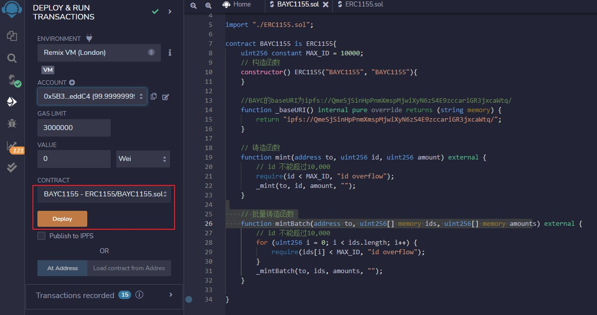
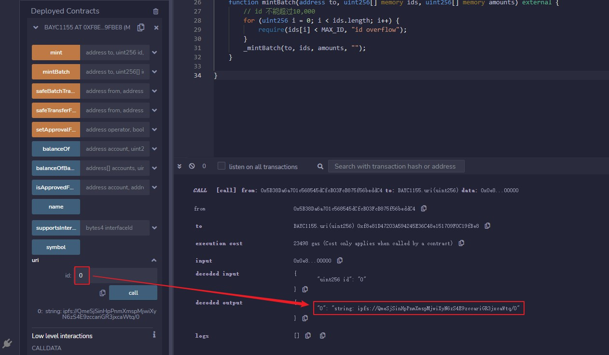
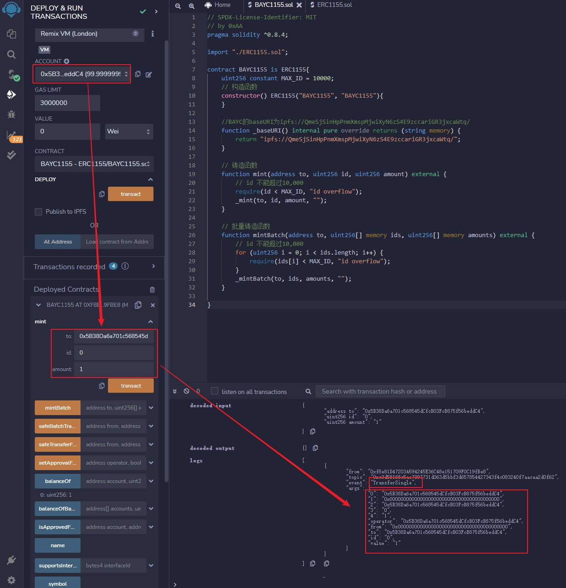
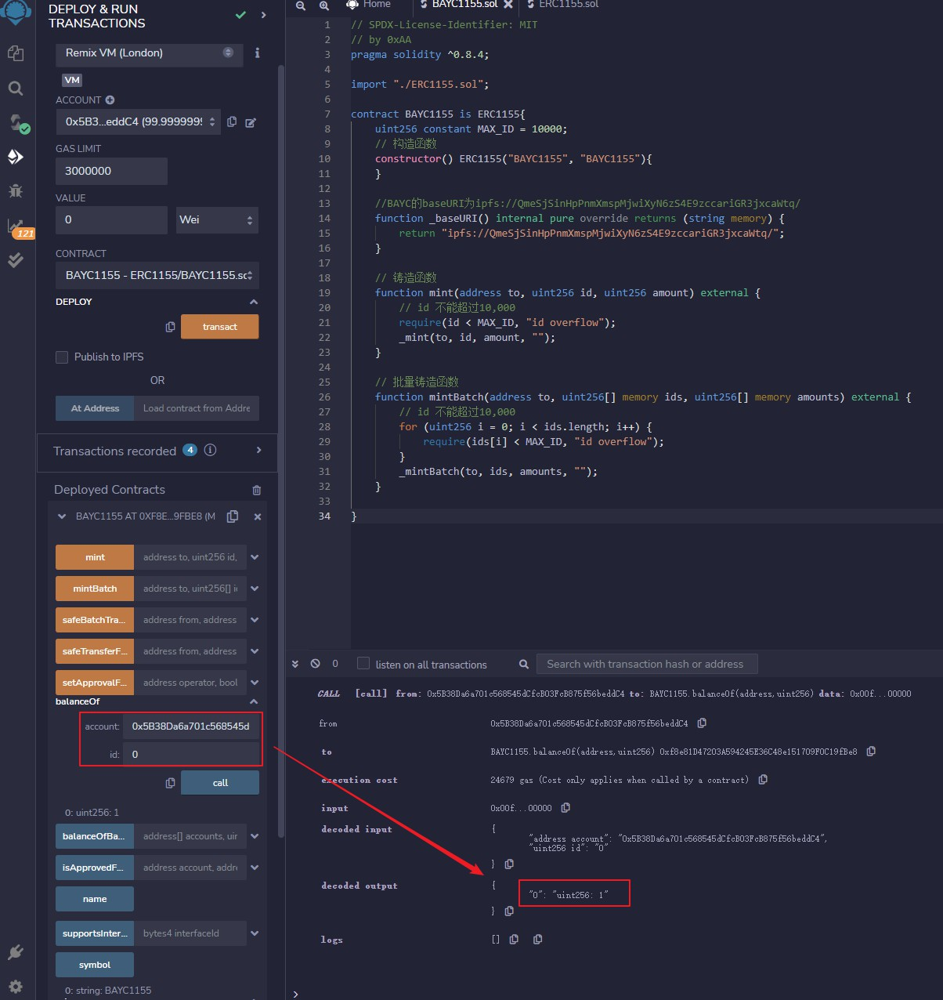
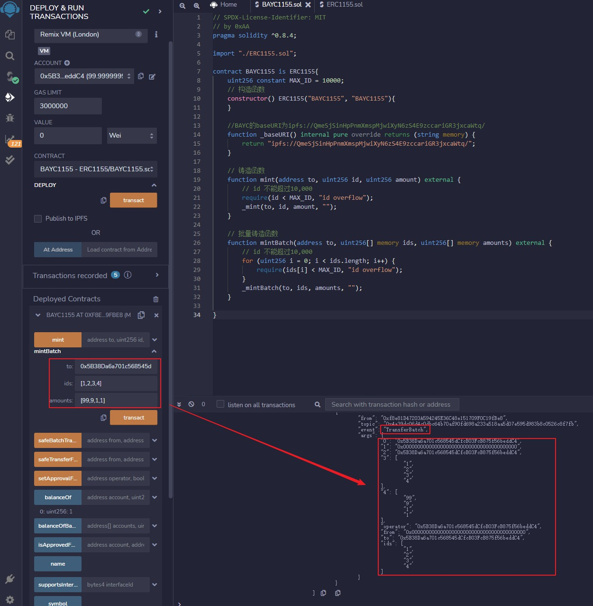
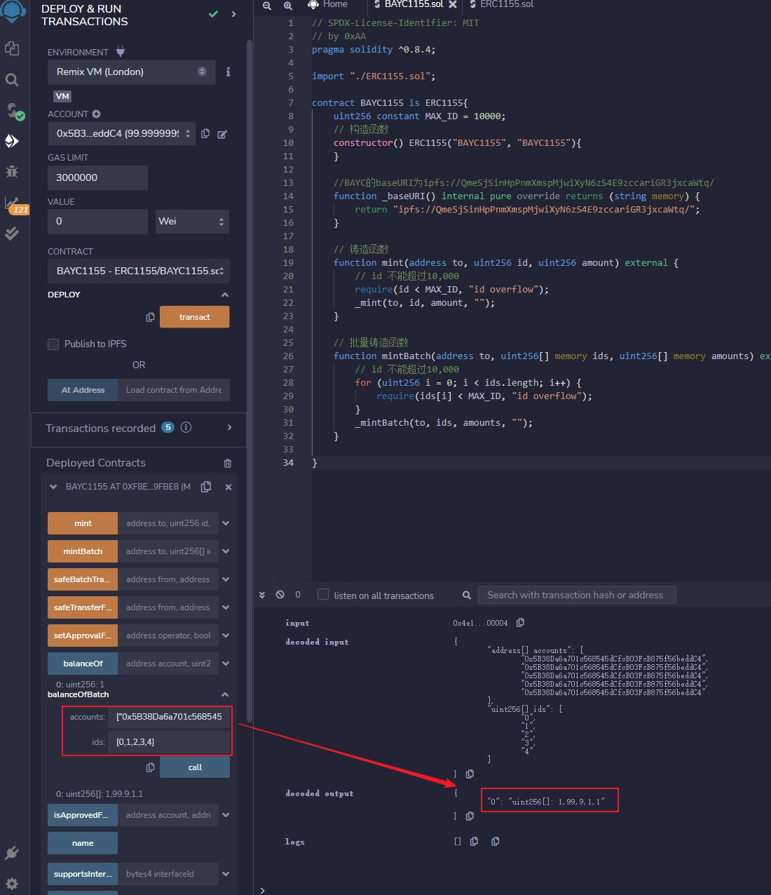
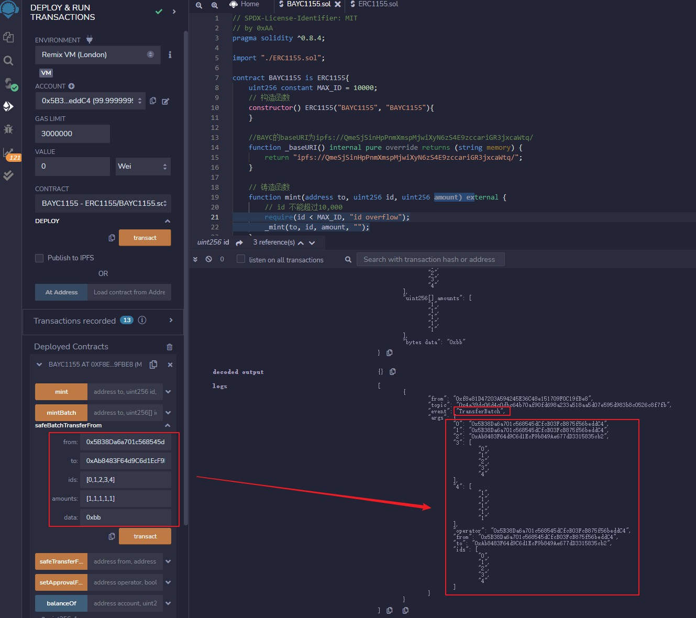
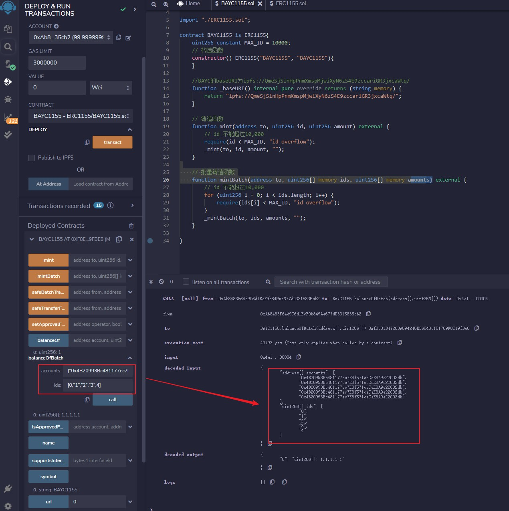

# WTF Solidity 超シンプル入門: 40. ERC1155

最近、Solidityを再学習し、詳細を確認しながら「WTF Solidity超シンプル入門」を作成しています。これは初心者向けのガイドです（プログラミング上級者は他のチュートリアルをご利用ください）。毎週1〜3レッスンを更新していきます。

Twitter: [@0xAA_Science](https://twitter.com/0xAA_Science) | [@WTFAcademy_](https://twitter.com/WTFAcademy_)

コミュニティ: [Discord](https://discord.gg/5akcruXrsk) | [Wechat](https://docs.google.com/forms/d/e/1FAIpQLSe4KGT8Sh6sJ7hedQRuIYirOoZK_85miz3dw7vA1-YjodgJ-A/viewform?usp=sf_link) | [公式サイト wtf.academy](https://wtf.academy)

すべてのコードとチュートリアルはgithubでオープンソース化しています: [github.com/AmazingAng/WTF-Solidity](https://github.com/AmazingAng/WTF-Solidity)

---

今回は、一つのコントラクトが複数のトークンをサポートする`ERC1155`標準について学習します。そして、改造された退屈な猿 - `BAYC1155`を発行します。これは`10,000`種類のトークンを含み、メタデータは`BAYC`と一致します。

## `EIP1155`
`ERC20`や`ERC721`標準のいずれにおいても、各コントラクトは独立したトークンに対応しています。イーサリアム上で『World of Warcraft』のような大規模なゲームを構築すると仮定すると、各装備に対してコントラクトをデプロイする必要があります。数千の装備があれば数千のコントラクトをデプロイして管理する必要があり、これは非常に面倒です。そのため、[イーサリアムEIP1155](https://eips.ethereum.org/EIPS/eip-1155)は、一つのコントラクトが複数の同質化トークンと非同質化トークンを含むことができるマルチトークン標準`ERC1155`を提案しました。`ERC1155`はGameFiアプリケーションで最も多く使用されており、DecentralandやSandboxなどの有名なブロックチェーンゲームでも使用されています。

簡単に言うと、`ERC1155`は以前に紹介した非同質化トークン標準[ERC721](https://github.com/AmazingAng/WTF-Solidity/tree/main/34_ERC721)と似ています。`ERC721`では、各トークンに固有の識別子としての`tokenId`があり、各`tokenId`は一つのトークンにのみ対応します。一方、`ERC1155`では、各トークンタイプに固有の識別子としての`id`があり、各`id`は一種類のトークンに対応します。このように、トークンの種類を非同質的に同じコントラクト内で管理でき、各トークンタイプにはメタデータを格納するURL `uri`があり、これは`ERC721`の`tokenURI`に似ています。以下は`ERC1155`のメタデータインターフェースコントラクト`IERC1155MetadataURI`です：

```solidity
/**
 * @dev ERC1155のオプションインターフェース、uri()関数でメタデータを照会
 */
interface IERC1155MetadataURI is IERC1155 {
    /**
     * @dev 第`id`種類トークンのURIを返す
     */
    function uri(uint256 id) external view returns (string memory);
}
```

では、`ERC1155`の特定のトークンが同質化トークンか非同質化トークンかはどのように区別するのでしょうか？実は非常に簡単です。特定の`id`に対応するトークンの総供給量が`1`の場合、それは非同質化トークンで、`ERC721`と似ています。特定の`id`に対応するトークンの総供給量が`1`より大きい場合、それは同質化トークンです。これらのトークンは同じ`id`を共有するため、`ERC20`と似ています。

## `IERC1155`インターフェースコントラクト

`IERC1155`インターフェースコントラクトは`EIP1155`で実装する必要がある機能を抽象化しており、`4`つのイベントと`6`つの関数を含んでいます。`ERC721`とは異なり、`ERC1155`は複数種類のトークンを含むため、バッチ転送とバッチ残高照会を実装し、一度の操作で複数種類のトークンを処理できます。

```solidity
// SPDX-License-Identifier: MIT
pragma solidity ^0.8.0;

import "https://github.com/AmazingAng/WTF-Solidity/blob/main/34_ERC721/IERC165.sol";

/**
 * @dev ERC1155標準のインターフェースコントラクト、EIP1155の機能を実装
 * 詳細: https://eips.ethereum.org/EIPS/eip-1155[EIP].
 */
interface IERC1155 is IERC165 {
    /**
     * @dev 単一種類トークン転送イベント
     * `value`個の`id`種類のトークンが`operator`によって`from`から`to`に転送されたときに発行
     */
    event TransferSingle(address indexed operator, address indexed from, address indexed to, uint256 id, uint256 value);

    /**
     * @dev バッチトークン転送イベント
     * idsとvaluesは転送されるトークン種類と数量の配列
     */
    event TransferBatch(
        address indexed operator,
        address indexed from,
        address indexed to,
        uint256[] ids,
        uint256[] values
    );

    /**
     * @dev バッチ承認イベント
     * `account`がすべてのトークンを`operator`に承認したときに発行
     */
    event ApprovalForAll(address indexed account, address indexed operator, bool approved);

    /**
     * @dev `id`種類のトークンのURIが変更されたときに発行、`value`は新しいURI
     */
    event URI(string value, uint256 indexed id);

    /**
     * @dev 残高照会、`account`が所有する`id`種類のトークンの残高を返す
     */
    function balanceOf(address account, uint256 id) external view returns (uint256);

    /**
     * @dev バッチ残高照会、`accounts`と`ids`配列の長さは等しくなければならない
     */
    function balanceOfBatch(address[] calldata accounts, uint256[] calldata ids)
        external
        view
        returns (uint256[] memory);

    /**
     * @dev バッチ承認、呼び出し元のトークンを`operator`アドレスに承認
     * {ApprovalForAll}イベントを発行
     */
    function setApprovalForAll(address operator, bool approved) external;

    /**
     * @dev バッチ承認照会、承認アドレス`operator`が`account`によって承認されている場合`true`を返す
     * {setApprovalForAll}関数を参照
     */
    function isApprovedForAll(address account, address operator) external view returns (bool);

    /**
     * @dev 安全転送、`amount`単位の`id`種類のトークンを`from`から`to`に転送
     * {TransferSingle}イベントを発行
     * 要件:
     * - 呼び出し元が`from`アドレスでない場合、`from`の承認が必要
     * - `from`アドレスは十分な残高を持つ必要がある
     * - 受信者がコントラクトの場合、`IERC1155Receiver`の`onERC1155Received`メソッドを実装し、対応する値を返す必要がある
     */
    function safeTransferFrom(
        address from,
        address to,
        uint256 id,
        uint256 amount,
        bytes calldata data
    ) external;

    /**
     * @dev バッチ安全転送
     * {TransferBatch}イベントを発行
     * 要件：
     * - `ids`と`amounts`の長さが等しい
     * - 受信者がコントラクトの場合、`IERC1155Receiver`の`onERC1155BatchReceived`メソッドを実装し、対応する値を返す必要がある
     */
    function safeBatchTransferFrom(
        address from,
        address to,
        uint256[] calldata ids,
        uint256[] calldata amounts,
        bytes calldata data
    ) external;
}
```

### `IERC1155`イベント
- `TransferSingle`イベント：単一種類トークン転送イベント、単一トークン種類転送時に発行されます。
- `TransferBatch`イベント：バッチトークン転送イベント、複数トークン種類転送時に発行されます。
- `ApprovalForAll`イベント：バッチ承認イベント、バッチ承認時に発行されます。
- `URI`イベント：メタデータアドレス変更イベント、`uri`変更時に発行されます。

### `IERC1155`関数
- `balanceOf()`：単一トークン種類残高照会、`account`が所有する`id`種類のトークンの残高を返します。
- `balanceOfBatch()`：複数トークン種類残高照会、照会するアドレス`accounts`配列とトークン種類`ids`配列の長さは等しくなければなりません。
- `setApprovalForAll()`：バッチ承認、呼び出し元のトークンを`operator`アドレスに承認します。
- `isApprovedForAll()`：バッチ承認情報照会、承認アドレス`operator`が`account`によって承認されている場合`true`を返します。
- `safeTransferFrom()`：安全単一トークン転送、`amount`単位の`id`種類のトークンを`from`アドレスから`to`アドレスに転送します。`to`アドレスがコントラクトの場合、`onERC1155Received()`受信関数が実装されているかを検証します。
- `safeBatchTransferFrom()`：安全マルチトークン転送、単一トークン転送と似ていますが、転送数量`amounts`とトークン種類`ids`が配列になり、長さが等しくなければなりません。`to`アドレスがコントラクトの場合、`onERC1155BatchReceived()`受信関数が実装されているかを検証します。

## `ERC1155`受信コントラクト

`ERC721`標準と同様に、トークンがブラックホールコントラクトに転送されることを避けるため、`ERC1155`ではトークン受信コントラクトが`IERC1155Receiver`を継承し、2つの受信関数を実装する必要があります：

- `onERC1155Received()`：単一トークン転送受信関数、ERC1155安全転送`safeTransferFrom`を受け入れるために実装し、自身のセレクタ`0xf23a6e61`を返す必要があります。

- `onERC1155BatchReceived()`：マルチトークン転送受信関数、ERC1155安全マルチトークン転送`safeBatchTransferFrom`を受け入れるために実装し、自身のセレクタ`0xbc197c81`を返す必要があります。

```solidity
// SPDX-License-Identifier: MIT
pragma solidity ^0.8.0;

import "https://github.com/AmazingAng/WTF-Solidity/blob/main/34_ERC721/IERC165.sol";

/**
 * @dev ERC1155受信コントラクト、ERC1155の安全転送を受け入れるためにはこのコントラクトを実装する必要がある
 */
interface IERC1155Receiver is IERC165 {
    /**
     * @dev ERC1155安全転送`safeTransferFrom`を受け入れる
     * 0xf23a6e61 または `bytes4(keccak256("onERC1155Received(address,address,uint256,uint256,bytes)"))`を返す必要がある
     */
    function onERC1155Received(
        address operator,
        address from,
        uint256 id,
        uint256 value,
        bytes calldata data
    ) external returns (bytes4);

    /**
     * @dev ERC1155バッチ安全転送`safeBatchTransferFrom`を受け入れる
     * 0xbc197c81 または `bytes4(keccak256("onERC1155BatchReceived(address,address,uint256[],uint256[],bytes)"))`を返す必要がある
     */
    function onERC1155BatchReceived(
        address operator,
        address from,
        uint256[] calldata ids,
        uint256[] calldata values,
        bytes calldata data
    ) external returns (bytes4);
}
```

## `ERC1155`メインコントラクト

`ERC1155`メインコントラクトは`IERC1155`インターフェースコントラクトで規定された関数を実装し、単一トークン/マルチトークンのミントとバーン関数も含みます。

### `ERC1155`変数

`ERC1155`メインコントラクトには`4`つの状態変数が含まれます：

- `name`：トークン名
- `symbol`：トークンシンボル
- `_balances`：トークン残高マッピング、トークン種類`id`下での特定アドレス`account`の残高`balances`を記録します。
- `_operatorApprovals`：バッチ承認マッピング、所有アドレスが別のアドレスに与えた承認状況を記録します。

### `ERC1155`関数

`ERC1155`メインコントラクトには`16`の関数が含まれます：

- コンストラクタ：状態変数`name`と`symbol`を初期化します。
- `supportsInterface()`：`ERC165`標準を実装し、サポートするインターフェースを宣言して他のコントラクトがチェックできるようにします。
- `balanceOf()`：`IERC1155`の`balanceOf()`を実装し、残高を照会します。`ERC721`標準とは異なり、ここでは照会する残高アドレス`account`とトークン種類`id`を入力する必要があります。
- `balanceOfBatch()`：`IERC1155`の`balanceOfBatch()`を実装し、バッチ残高照会を行います。
- `setApprovalForAll()`：`IERC1155`の`setApprovalForAll()`を実装し、バッチ承認を行い、`ApprovalForAll`イベントを発行します。
- `isApprovedForAll()`：`IERC1155`の`isApprovedForAll()`を実装し、バッチ承認情報を照会します。
- `safeTransferFrom()`：`IERC1155`の`safeTransferFrom()`を実装し、単一トークン種類安全転送を行い、`TransferSingle`イベントを発行します。`ERC721`と異なり、ここでは送信者`from`、受信者`to`、トークン種類`id`だけでなく、転送数量`amount`も入力する必要があります。
- `safeBatchTransferFrom()`：`IERC1155`の`safeBatchTransferFrom()`を実装し、マルチトークン種類安全転送を行い、`TransferBatch`イベントを発行します。
- `_mint()`：単一トークン種類ミント関数。
- `_mintBatch()`：マルチトークン種類ミント関数。
- `_burn()`：単一トークン種類バーン関数。
- `_burnBatch()`：マルチトークン種類バーン関数。
- `_doSafeTransferAcceptanceCheck`：単一トークン種類転送の安全チェック、`safeTransferFrom()`によって呼び出され、受信者がコントラクトの場合、`onERC1155Received()`関数が実装されていることを確認します。
- `_doSafeBatchTransferAcceptanceCheck`：マルチトークン種類転送の安全チェック、`safeBatchTransferFrom`によって呼び出され、受信者がコントラクトの場合、`onERC1155BatchReceived()`関数が実装されていることを確認します。
- `uri()`：`ERC1155`の第`id`種類トークンのメタデータを格納するURLを返し、`ERC721`の`tokenURI`に似ています。
- `baseURI()`：`baseURI`を返し、`uri`は`baseURI`と`id`を連結したもので、開発者が再実装する必要があります。

```solidity
// SPDX-License-Identifier: MIT
pragma solidity ^0.8.0;

import "./IERC1155.sol";
import "./IERC1155Receiver.sol";
import "./IERC1155MetadataURI.sol";
import "https://github.com/AmazingAng/WTF-Solidity/blob/main/34_ERC721/String.sol";
import "https://github.com/AmazingAng/WTF-Solidity/blob/main/34_ERC721/IERC165.sol";

/**
 * @dev ERC1155マルチトークン標準
 * 詳細 https://eips.ethereum.org/EIPS/eip-1155
 */
contract ERC1155 is IERC165, IERC1155, IERC1155MetadataURI {

    using Strings for uint256; // Stringライブラリを使用
    // トークン名
    string public name;
    // トークンシンボル
    string public symbol;
    // トークン種類id から アカウントaccount から 残高balances へのマッピング
    mapping(uint256 => mapping(address => uint256)) private _balances;
    // address から 承認アドレス へのバッチ承認マッピング
    mapping(address => mapping(address => bool)) private _operatorApprovals;

    /**
     * コンストラクタ、`name` と `symbol`を初期化
     */
    constructor(string memory name_, string memory symbol_) {
        name = name_;
        symbol = symbol_;
    }

    /**
     * @dev {IERC165-supportsInterface}を参照
     */
    function supportsInterface(bytes4 interfaceId) public view virtual override returns (bool) {
        return
            interfaceId == type(IERC1155).interfaceId ||
            interfaceId == type(IERC1155MetadataURI).interfaceId ||
            interfaceId == type(IERC165).interfaceId;
    }

    /**
     * @dev 残高照会 IERC1155のbalanceOfを実装、accountアドレスのid種類トークン残高を返す
     */
    function balanceOf(address account, uint256 id) public view virtual override returns (uint256) {
        require(account != address(0), "ERC1155: address zero is not a valid owner");
        return _balances[id][account];
    }

    /**
     * @dev バッチ残高照会
     * 要件:
     * - `accounts` と `ids` 配列の長さが等しい
     */
    function balanceOfBatch(address[] memory accounts, uint256[] memory ids)
        public view virtual override
        returns (uint256[] memory)
    {
        require(accounts.length == ids.length, "ERC1155: accounts and ids length mismatch");
        uint256[] memory batchBalances = new uint256[](accounts.length);
        for (uint256 i = 0; i < accounts.length; ++i) {
            batchBalances[i] = balanceOf(accounts[i], ids[i]);
        }
        return batchBalances;
    }

    /**
     * @dev バッチ承認、呼び出し元がoperatorにすべてのトークンの使用を承認
     * {ApprovalForAll}イベントを発行
     * 条件：msg.sender != operator
     */
    function setApprovalForAll(address operator, bool approved) public virtual override {
        require(msg.sender != operator, "ERC1155: setting approval status for self");
        _operatorApprovals[msg.sender][operator] = approved;
        emit ApprovalForAll(msg.sender, operator, approved);
    }

    /**
     * @dev バッチ承認照会
     */
    function isApprovedForAll(address account, address operator) public view virtual override returns (bool) {
        return _operatorApprovals[account][operator];
    }

    /**
     * @dev 安全転送、`amount`単位の`id`種類トークンを`from`から`to`に転送
     * {TransferSingle}イベントを発行
     * 要件:
     * - to はゼロアドレスではない
     * - from は十分な残高を持ち、呼び出し元は承認を持つ
     * - to がスマートコントラクトの場合、IERC1155Receiver-onERC1155Receivedをサポートする必要がある
     */
    function safeTransferFrom(
        address from,
        address to,
        uint256 id,
        uint256 amount,
        bytes memory data
    ) public virtual override {
        address operator = msg.sender;
        // 呼び出し元は所有者または承認されている
        require(
            from == operator || isApprovedForAll(from, operator),
            "ERC1155: caller is not token owner nor approved"
        );
        require(to != address(0), "ERC1155: transfer to the zero address");
        // fromアドレスは十分な残高を持つ
        uint256 fromBalance = _balances[id][from];
        require(fromBalance >= amount, "ERC1155: insufficient balance for transfer");
        // 残高を更新
        unchecked {
            _balances[id][from] = fromBalance - amount;
        }
        _balances[id][to] += amount;
        // イベントを発行
        emit TransferSingle(operator, from, to, id, amount);
        // 安全チェック
        _doSafeTransferAcceptanceCheck(operator, from, to, id, amount, data);
    }

    /**
     * @dev バッチ安全転送、`amounts`配列単位の`ids`配列種類トークンを`from`から`to`に転送
     * {TransferBatch}イベントを発行
     * 要件:
     * - to はゼロアドレスではない
     * - from は十分な残高を持ち、呼び出し元は承認を持つ
     * - to がスマートコントラクトの場合、IERC1155Receiver-onERC1155BatchReceivedをサポートする必要がある
     * - ids と amounts 配列の長さが等しい
     */
    function safeBatchTransferFrom(
        address from,
        address to,
        uint256[] memory ids,
        uint256[] memory amounts,
        bytes memory data
    ) public virtual override {
        address operator = msg.sender;
        // 呼び出し元は所有者または承認されている
        require(
            from == operator || isApprovedForAll(from, operator),
            "ERC1155: caller is not token owner nor approved"
        );
        require(ids.length == amounts.length, "ERC1155: ids and amounts length mismatch");
        require(to != address(0), "ERC1155: transfer to the zero address");

        // forループで残高を更新
        for (uint256 i = 0; i < ids.length; ++i) {
            uint256 id = ids[i];
            uint256 amount = amounts[i];

            uint256 fromBalance = _balances[id][from];
            require(fromBalance >= amount, "ERC1155: insufficient balance for transfer");
            unchecked {
                _balances[id][from] = fromBalance - amount;
            }
            _balances[id][to] += amount;
        }

        emit TransferBatch(operator, from, to, ids, amounts);
        // 安全チェック
        _doSafeBatchTransferAcceptanceCheck(operator, from, to, ids, amounts, data);
    }

    /**
     * @dev ミント
     * {TransferSingle}イベントを発行
     */
    function _mint(
        address to,
        uint256 id,
        uint256 amount,
        bytes memory data
    ) internal virtual {
        require(to != address(0), "ERC1155: mint to the zero address");

        address operator = msg.sender;

        _balances[id][to] += amount;
        emit TransferSingle(operator, address(0), to, id, amount);

        _doSafeTransferAcceptanceCheck(operator, address(0), to, id, amount, data);
    }

    /**
     * @dev バッチミント
     * {TransferBatch}イベントを発行
     */
    function _mintBatch(
        address to,
        uint256[] memory ids,
        uint256[] memory amounts,
        bytes memory data
    ) internal virtual {
        require(to != address(0), "ERC1155: mint to the zero address");
        require(ids.length == amounts.length, "ERC1155: ids and amounts length mismatch");

        address operator = msg.sender;

        for (uint256 i = 0; i < ids.length; i++) {
            _balances[ids[i]][to] += amounts[i];
        }

        emit TransferBatch(operator, address(0), to, ids, amounts);

        _doSafeBatchTransferAcceptanceCheck(operator, address(0), to, ids, amounts, data);
    }

    /**
     * @dev バーン
     */
    function _burn(
        address from,
        uint256 id,
        uint256 amount
    ) internal virtual {
        require(from != address(0), "ERC1155: burn from the zero address");

        address operator = msg.sender;

        uint256 fromBalance = _balances[id][from];
        require(fromBalance >= amount, "ERC1155: burn amount exceeds balance");
        unchecked {
            _balances[id][from] = fromBalance - amount;
        }

        emit TransferSingle(operator, from, address(0), id, amount);
    }

    /**
     * @dev バッチバーン
     */
    function _burnBatch(
        address from,
        uint256[] memory ids,
        uint256[] memory amounts
    ) internal virtual {
        require(from != address(0), "ERC1155: burn from the zero address");
        require(ids.length == amounts.length, "ERC1155: ids and amounts length mismatch");

        address operator = msg.sender;

        for (uint256 i = 0; i < ids.length; i++) {
            uint256 id = ids[i];
            uint256 amount = amounts[i];

            uint256 fromBalance = _balances[id][from];
            require(fromBalance >= amount, "ERC1155: burn amount exceeds balance");
            unchecked {
                _balances[id][from] = fromBalance - amount;
            }
        }

        emit TransferBatch(operator, from, address(0), ids, amounts);
    }

    // エラー 無効な受信者
    error ERC1155InvalidReceiver(address receiver);

    // @dev ERC1155の安全転送チェック
    function _doSafeTransferAcceptanceCheck(
        address operator,
        address from,
        address to,
        uint256 id,
        uint256 amount,
        bytes memory data
    ) private {
        if (to.code.length > 0) {
            try IERC1155Receiver(to).onERC1155Received(operator, from, id, amount, data) returns (bytes4 response) {
                if (response != IERC1155Receiver.onERC1155Received.selector) {
                    revert ERC1155InvalidReceiver(to);
                }
            } catch (bytes memory reason) {
                if (reason.length == 0) {
                    revert ERC1155InvalidReceiver(to);
                } else {
                    /// @solidity memory-safe-assembly
                    assembly {
                        revert(add(32, reason), mload(reason))
                    }
                }
            }
        }
    }

    // @dev ERC1155のバッチ安全転送チェック
    function _doSafeBatchTransferAcceptanceCheck(
        address operator,
        address from,
        address to,
        uint256[] memory ids,
        uint256[] memory amounts,
        bytes memory data
    ) private {
        if (to.code.length > 0) {
            try IERC1155Receiver(to).onERC1155BatchReceived(operator, from, ids, amounts, data) returns (
                bytes4 response
            ) {
                if (response != IERC1155Receiver.onERC1155BatchReceived.selector) {
                    revert ERC1155InvalidReceiver(to);
                }
            } catch (bytes memory reason) {
                if (reason.length == 0) {
                    revert ERC1155InvalidReceiver(to);
                } else {
                    /// @solidity memory-safe-assembly
                    assembly {
                        revert(add(32, reason), mload(reason))
                    }
                }
            }
        }
    }

    /**
     * @dev ERC1155のid種類トークンのuriを返し、metadata を格納、ERC721のtokenURIに似ている
     */
    function uri(uint256 id) public view virtual override returns (string memory) {
        string memory baseURI = _baseURI();
        return bytes(baseURI).length > 0 ? string(abi.encodePacked(baseURI, id.toString())) : "";
    }

    /**
     * {uri}のBaseURIを計算、uriはbaseURIとtokenIdを連結したもので、開発者が再実装する必要がある
     */
    function _baseURI() internal view virtual returns (string memory) {
        return "";
    }
}
```

## `BAYC`だが`ERC1155`

`ERC721`標準の退屈な猿`BAYC`を改造して、無料ミントの`BAYC1155`を作成しましょう。`_baseURI()`関数を修正して、`BAYC1155`の`uri`が`BAYC`の`tokenURI`と同じになるようにします。これにより、`BAYC1155`のメタデータは退屈な猿と同じになります：

```solidity
// SPDX-License-Identifier: MIT
// by 0xAA
pragma solidity ^0.8.21;

import "./ERC1155.sol";

contract BAYC1155 is ERC1155{
    uint256 constant MAX_ID = 10000;
    // コンストラクタ
    constructor() ERC1155("BAYC1155", "BAYC1155"){
    }

    //BAYCのbaseURIは ipfs://QmeSjSinHpPnmXmspMjwiXyN6zS4E9zccariGR3jxcaWtq/
    function _baseURI() internal pure override returns (string memory) {
        return "ipfs://QmeSjSinHpPnmXmspMjwiXyN6zS4E9zccariGR3jxcaWtq/";
    }

    // ミント関数
    function mint(address to, uint256 id, uint256 amount) external {
        // id は 10,000 を超えることはできない
        require(id < MAX_ID, "id overflow");
        _mint(to, id, amount, "");
    }

    // バッチミント関数
    function mintBatch(address to, uint256[] memory ids, uint256[] memory amounts) external {
        // id は 10,000 を超えることはできない
        for (uint256 i = 0; i < ids.length; i++) {
            require(ids[i] < MAX_ID, "id overflow");
        }
        _mintBatch(to, ids, amounts, "");
    }
}
```

## Remixデモンストレーション

### 1. `BAYC1155`コントラクトをデプロイ


### 2. メタデータ`uri`を確認


### 3. `mint`して残高変化を確認
`mint`欄にアカウントアドレス、`id`、数量を入力し、`mint`ボタンをクリックしてミントします。数量が`1`の場合は非同質化トークン、数量が`1`より大きい場合は同質化トークンになります。



`balanceOf`欄にアカウントアドレスと`id`を入力して対応する残高を確認



### 4. バッチ`mint`して残高変化を確認
`mintBatch`欄にミントする`ids`配列と対応する数量を入力、2つの配列の長さは等しくなければなりません



ミントしたトークン`id`配列を入力すると確認できます



### 5. バッチ転送して残高変化を確認

ミントと同様ですが、今回は対応するトークンを持つアドレスから新しいアドレスに転送します。このアドレスは通常のアドレスでもコントラクトアドレスでも構いません。コントラクトアドレスの場合、`onERC1155Received()`受信関数が実装されているかを検証します。

ここでは通常のアドレスに転送し、`ids`と`amounts`配列を入力します。



転送先アドレスの残高変化を確認します。



## まとめ

今回はイーサリアム`EIP1155`で提案された`ERC1155`マルチトークン標準について学習しました。これは一つのコントラクトに複数の同質化または非同質化トークンを含むことを可能にします。そして、改造版退屈な猿 - `BAYC1155`を作成しました：`10,000`種類のトークンを含み、メタデータが`BAYC`と同じ`ERC1155`トークンです。現在、`ERC1155`は主に`GameFi`で応用されています。しかし、メタバース技術が発展し続けるにつれて、この標準はますます人気になると信じています。