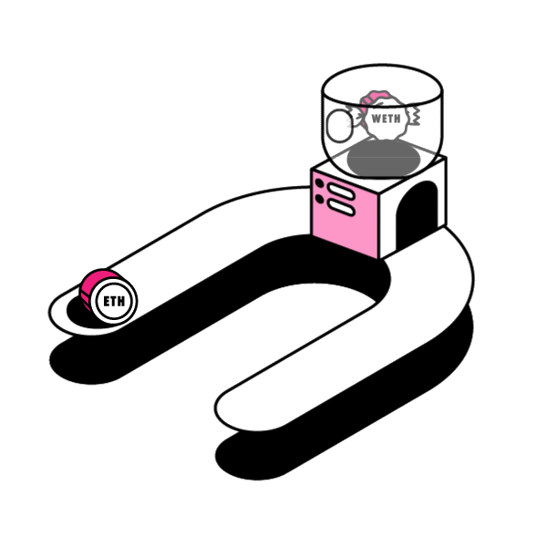
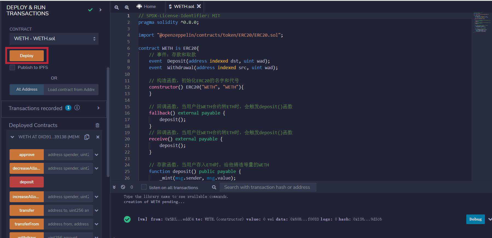
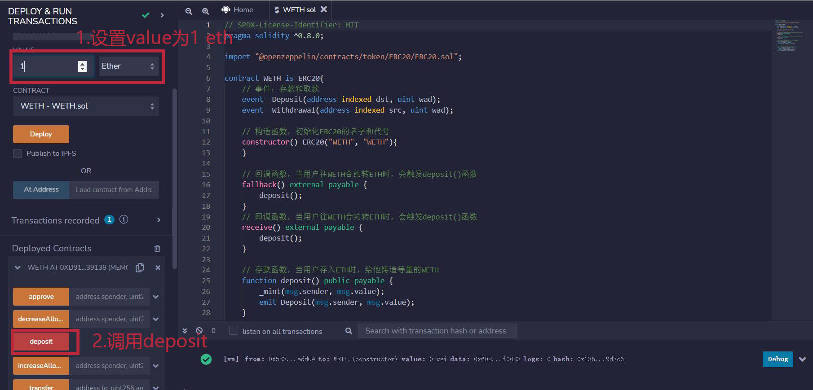
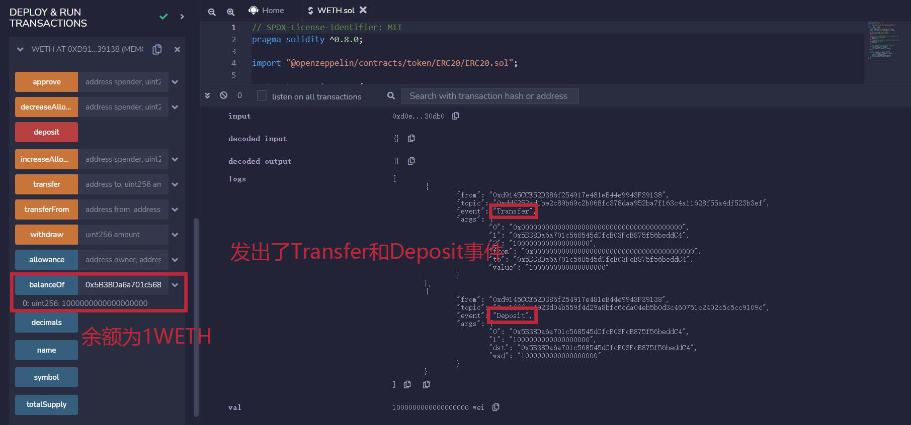
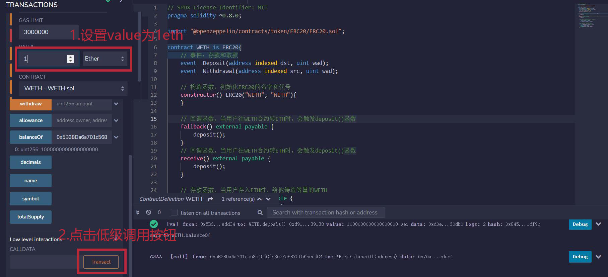
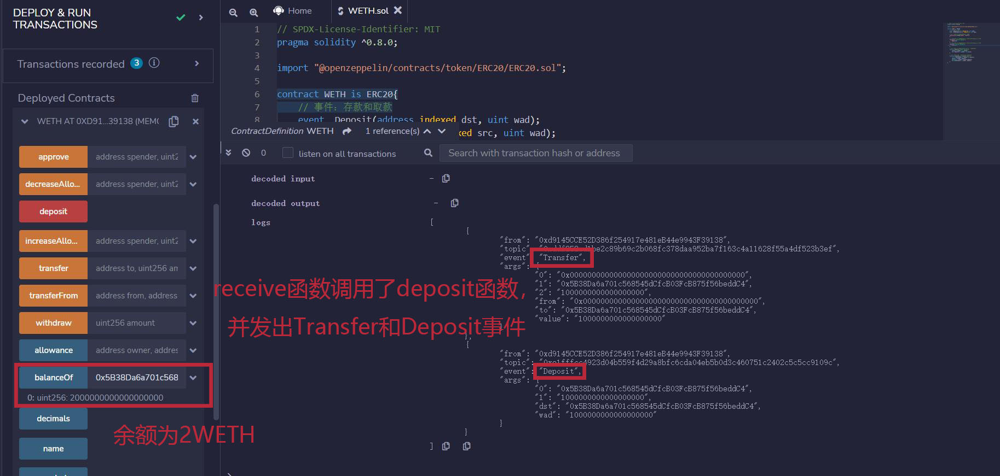
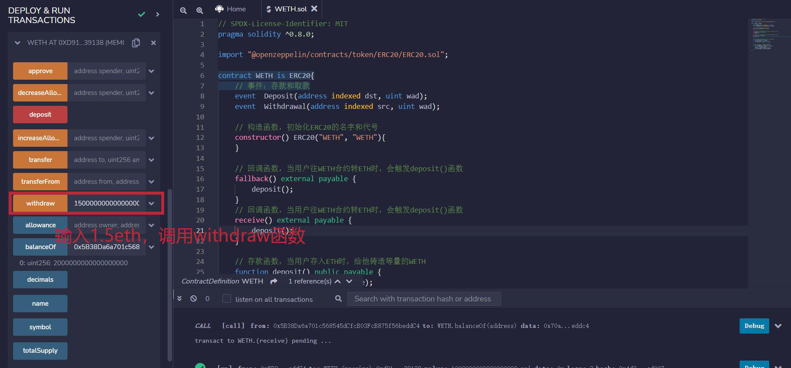
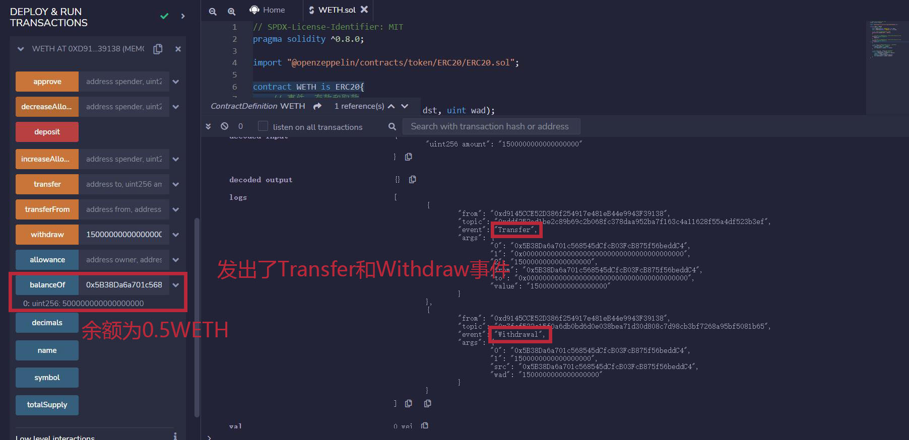

# WTF Solidity 超簡単な入門: 41. WETH

最近、私はSolidityを学び直し、詳細を固めるとともに、初心者向けの「WTF Solidity 超簡単な入門」を書いています（プログラミングの上級者は他のチュートリアルを探してください）。毎週1-3レッスンを更新しています。

Twitter: [@0xAA_Science](https://twitter.com/0xAA_Science)｜[@WTFAcademy_](https://twitter.com/WTFAcademy_)

コミュニティ: [Discord](https://discord.gg/5akcruXrsk)｜[WeChat群](https://docs.google.com/forms/d/e/1FAIpQLSe4KGT8Sh6sJ7hedQRuIYirOoZK_85miz3dw7vA1-YjodgJ-A/viewform?usp=sf_link)｜[公式サイト wtf.academy](https://wtf.academy)

すべてのコードとチュートリアルはGitHubでオープンソース化されています: [github.com/AmazingAng/WTF-Solidity](https://github.com/AmazingAng/WTF-Solidity)

---

今回のレッスンでは、`WETH`（Wrapped ETH：ラップドETH）について学習します。

## `WETH`とは何ですか？



`WETH`（Wrapped ETH）は`ETH`のラップ版です。一般的に見かける`WETH`、`WBTC`、`WBNB`は、すべてラップされたネイティブトークンです。なぜこれらをラップする必要があるのでしょうか？

2015年に[ERC20](https://github.com/AmazingAng/WTF-Solidity/blob/main/20_SendETH/readme.md)標準が登場しました。このトークン標準は、イーサリアム上のトークンに標準化されたルールセットを確立することを目的としており、新しいトークンの発行を簡素化し、ブロックチェーン上のすべてのトークンを相互に比較可能にしました。残念ながら、イーサ（ETH）自体は`ERC20`標準に準拠していません。`WETH`の開発は、ブロックチェーン間の相互運用性を向上させ、`ETH`を分散型アプリケーション（dApps）で使用できるようにするために行われました。これは、ネイティブトークンにスマートコントラクトで作られた服を着せるようなものです：服を着ているときは`WETH`となり、`ERC20`同質化トークン標準に準拠し、クロスチェーンやdAppで使用できます；服を脱ぐと、1:1で`ETH`に交換できます。

## `WETH`コントラクト

現在使用されている[メインネットWETHコントラクト](https://rinkeby.etherscan.io/token/0xc778417e063141139fce010982780140aa0cd5ab?a=0xe16c1623c1aa7d919cd2241d8b36d9e79c1be2a2)は2015年に書かれ、非常に古く、その時のSolidityは0.4版でした。私たちは0.8版で`WETH`を書き直します。

`WETH`は`ERC20`標準に準拠しており、通常の`ERC20`よりも2つの追加機能があります：

1. 預金（deposit）：ラッピング。ユーザーが`ETH`を`WETH`コントラクトに預け、等量の`WETH`を取得します。

2. 引出（withdraw）：アンラッピング。ユーザーが`WETH`を破棄し、等量の`ETH`を取得します。

```solidity
// SPDX-License-Identifier: MIT
pragma solidity ^0.8.0;

import "@openzeppelin/contracts/token/ERC20/ERC20.sol";

contract WETH is ERC20{
    // イベント：預金と引出
    event  Deposit(address indexed dst, uint wad);
    event  Withdrawal(address indexed src, uint wad);

    // コンストラクタ、ERC20の名前とシンボルを初期化
    constructor() ERC20("WETH", "WETH"){
    }

    // フォールバック関数、ユーザーがWETHコントラクトにETHを送金すると、deposit()関数がトリガーされる
    fallback() external payable {
        deposit();
    }
    // リシーブ関数、ユーザーがWETHコントラクトにETHを送金すると、deposit()関数がトリガーされる
    receive() external payable {
        deposit();
    }

    // 預金関数、ユーザーがETHを預けると、等量のWETHをミントする
    function deposit() public payable {
        _mint(msg.sender, msg.value);
        emit Deposit(msg.sender, msg.value);
    }

    // 引出関数、ユーザーがWETHを破棄し、等量のETHを取り戻す
    function withdraw(uint amount) public {
        require(balanceOf(msg.sender) >= amount);
        _burn(msg.sender, amount);
        payable(msg.sender).transfer(amount);
        emit Withdrawal(msg.sender, amount);
    }
}
```

### 継承

`WETH`は`ERC20`トークン標準に準拠しているため、`WETH`コントラクトは`ERC20`コントラクトを継承しています。

### イベント

`WETH`コントラクトには`2`つのイベントがあります：

1. `Deposit`：預金イベント、預金時に発行されます。
2. `Withdrawal`：引出イベント、引出時に発行されます。

### 関数

`ERC20`標準の関数に加えて、`WETH`コントラクトには`5`つの関数があります：

- コンストラクタ：`WETH`の名前とシンボルを初期化します。
- フォールバック関数：`fallback()`と`receive()`。ユーザーが`WETH`コントラクトに`ETH`を送金すると、自動的に`deposit()`預金関数がトリガーされ、等量の`WETH`を取得します。
- `deposit()`：預金関数。ユーザーが`ETH`を預けると、等量の`WETH`をミントします。
- `withdraw()`：引出関数。ユーザーが`WETH`を破棄し、等量の`ETH`を返却します。

## `Remix`デモンストレーション

### 1. `WETH`コントラクトをデプロイ



### 2. `deposit`を呼び出し、`1 ETH`を預けて、`WETH`残高を確認



この時点で`WETH`残高は`1 WETH`です。



### 3. `WETH`コントラクトに直接`1 ETH`を送金し、`WETH`残高を確認



この時点で`WETH`残高は`2 WETH`です。



### 4. `withdraw`を呼び出し、`1.5 ETH`を引き出して、`WETH`残高を確認



この時点で`WETH`残高は`0.5 WETH`です。



## まとめ

今回のレッスンでは、`WETH`を紹介し、`WETH`コントラクトを実装しました。これは、ネイティブ`ETH`にスマートコントラクトで作られた服を着せるようなものです：服を着ているときは`WETH`となり、`ERC20`同質化トークン標準に準拠し、クロスチェーンや`dApp`で使用できます；服を脱ぐと、1:1で`ETH`に交換できます。