# WTF Solidity極簡入門: 56. 分散型取引所

私は最近Solidityを学び直して、細かい部分を固めており、「WTF Solidity極簡入門」を書いて初心者の皆さんに提供しています（プログラミング上級者は他のチュートリアルを探してください）。毎週1-3講ずつ更新しています。

Twitter：[@0xAA_Science](https://twitter.com/0xAA_Science)｜[@WTFAcademy_](https://twitter.com/WTFAcademy_)

コミュニティ：[Discord](https://discord.gg/5akcruXrsk)｜[微信群](https://docs.google.com/forms/d/e/1FAIpQLSe4KGT8Sh6sJ7hedQRuIYirOoZK_85miz3dw7vA1-YjodgJ-A/viewform?usp=sf_link)｜[公式サイト wtf.academy](https://wtf.academy)

すべてのコードとチュートリアルはgithubでオープンソース化されています：[github.com/AmazingAng/WTF-Solidity](https://github.com/AmazingAng/WTF-Solidity)

---

この講義では、恒定積自動マーケットメーカー（Constant Product Automated Market Maker, CPAMM）について説明します。これは分散型取引所の核心メカニズムであり、Uniswap、PancakeSwapなど一連のDEXで採用されています。教育用コントラクトは[Uniswap-v2](https://github.com/Uniswap/v2-core)コントラクトを簡素化したもので、CPAMMの最も核心的な機能を含んでいます。

## 自動マーケットメーカー

自動マーケットメーカー（Automated Market Maker、略してAMM）は、ブロックチェーン上で動作するアルゴリズム、またはスマートコントラクトの一種であり、デジタル資産間の分散型取引を可能にします。AMMの導入により、従来の買い手と売り手によるオーダーマッチングを必要とせず、予め設定された数学的公式（例：恒定積公式）によって流動性プール（りゅうどうせいプール）を作成し、ユーザーがいつでも取引できる全く新しい取引方法が開拓されました。

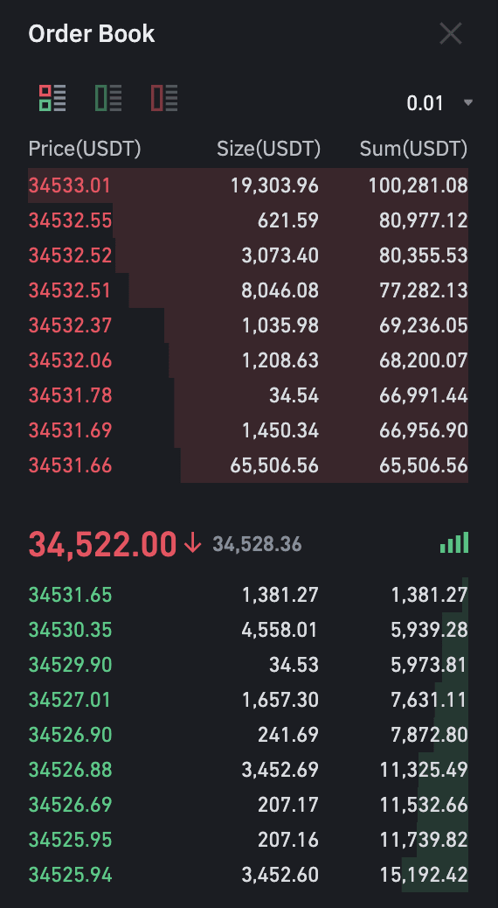

次に、コーラ（$COLA）と米ドル（$USD）の市場を例に、AMMについて説明します。便宜上、記号を定義します：$x$ と $y$ はそれぞれ市場のコーラと米ドルの総量を表し、$\Delta x$ と $\Delta y$ は一回の取引におけるコーラと米ドルの変化量を表し、$L$ と $\Delta L$ は総流動性と流動性の変化量を表します。

### 恒定和自動マーケットメーカー

恒定和自動マーケットメーカー（Constant Sum Automated Market Maker, CSAMM）は最もシンプルな自動マーケットメーカーモデルで、ここから始めます。取引時の制約は以下の通りです：

$$k=x+y$$

ここで $k$ は定数です。つまり、取引前後で市場のコーラと米ドル数量の合計が不変に保たれます。例として、市場の流動性が10本のコーラと10ドルの場合、この時 $k=20$ で、コーラの価格は1ドル/本です。私がとても喉が渇いて、2ドルでコーラを交換したいとします。取引後、市場の米ドル総量は12となり、制約 $k=20$ により、取引後市場には8本のコーラがあり、価格は1ドル/本です。私の取引では2本のコーラを得て、価格は1ドル/本でした。

CSAMMの利点は、トークンの相対価格を不変に保てることで、これはステーブルコイン交換において重要です。誰もが1 USDTで常に1 USDCと交換できることを望みます。しかし欠点も明白で、流動性が容易に枯渇してしまうことです：私が10ドルあれば、市場のコーラの流動性を完全に枯渇させ、他のコーラを飲みたいユーザーが取引できなくなってしまいます。

次に、「無限」の流動性を持つ恒定積自動マーケットメーカーを紹介します。

### 恒定積自動マーケットメーカー

恒定積自動マーケットメーカー（CPAMM）は最も人気のある自動マーケットメーカーモデルで、最初にUniswapで採用されました。取引時の制約は以下の通りです：

$$k=x*y$$

ここで $k$ は定数です。つまり、取引前後で市場のコーラと米ドル数量の積が不変に保たれます。同じ例で、市場の流動性が10本のコーラと10ドルの場合、この時 $k=100$ で、コーラの価格は1ドル/本です。私がとても喉が渇いて、10ドルでコーラを交換したいとします。CSAMMの場合、私の取引は10本のコーラと交換され、市場のコーラ流動性を枯渇させます。しかしCPAMMでは、取引後市場の米ドル総量は20となり、制約 $k=100$ により、取引後市場には5本のコーラがあり、価格は $20/5 = 4$ ドル/本です。私の取引では5本のコーラを得て、価格は $10/5 = 2$ ドル/本でした。

CPAMMの利点は「無限」の流動性を持つことです：トークンの相対価格は売買に応じて変化し、より希少なトークンの相対価格はより高くなり、流動性の枯渇を回避します。上の例では、取引によってコーラが1ドル/本から4ドル/本に上昇し、市場のコーラが買い占められることを防ぎました。

以下、CPAMMベースの極簡分散型取引所を構築してみましょう。

## 分散型取引所

以下、スマートコントラクトで分散型取引所 `SimpleSwap` を作成し、ユーザーが一対のトークンを取引できるようにします。

`SimpleSwap` はERC20トークン標準を継承し、流動性プロバイダーが提供した流動性を記録しやすくしています。コンストラクタで、一対のトークンアドレス `token0` と `token1` を指定し、取引所はこのトークンペアのみをサポートします。`reserve0` と `reserve1` はコントラクト内のトークン準備量を記録します。

```solidity
contract SimpleSwap is ERC20 {
    // トークンコントラクト
    IERC20 public token0;
    IERC20 public token1;

    // トークン準備金
    uint public reserve0;
    uint public reserve1;

    // コンストラクタ、トークンアドレスを初期化
    constructor(IERC20 _token0, IERC20 _token1) ERC20("SimpleSwap", "SS") {
        token0 = _token0;
        token1 = _token1;
    }
}
```

取引所には主に2種類の参加者がいます：流動性プロバイダー（Liquidity Provider, LP）とトレーダー（Trader）です。以下、これら2つの部分の機能をそれぞれ実装します。

### 流動性提供

流動性プロバイダーは市場に流動性を提供し、トレーダーがより良い価格と流動性を得られるようにし、一定の手数料を受け取ります。

まず、流動性追加機能を実装する必要があります。ユーザーがトークンプールに流動性を追加する際、コントラクトは追加されたLP持分を記録する必要があります。Uniswap V2によると、LP持分は以下のように計算されます：

1. トークンプールに初回流動性追加時、LP持分 $\Delta{L}$ は追加トークン数量積の平方根で決定されます：

    $$\Delta{L}=\sqrt{\Delta{x} *\Delta{y}}$$

2. 初回以外の流動性追加時、LP持分は追加トークン数量がプールトークン準備量に占める比率で決定されます（2つのトークンの比率のうち小さい方を取る）：

    $$\Delta{L}=L*\min{(\frac{\Delta{x}}{x}, \frac{\Delta{y}}{y})}$$

`SimpleSwap` コントラクトはERC20トークン標準を継承しているため、LP持分を計算後、持分をトークン形式でユーザーにミントできます。

以下の `addLiquidity()` 関数は流動性追加機能を実装し、主な手順は以下の通りです：

1. ユーザーが追加したトークンをコントラクトに転送します。ユーザーは事前にコントラクトに承認を与える必要があります。
2. 公式に基づいて追加された流動性持分を計算し、ミントされるLP数量をチェックします。
3. コントラクトのトークン準備量を更新します。
4. 流動性プロバイダーにLPトークンをミントします。
5. `Mint` イベントを発行します。

```solidity
event Mint(address indexed sender, uint amount0, uint amount1);

// 流動性を追加、トークンを転送、LPをミント
// @param amount0Desired 追加するtoken0数量
// @param amount1Desired 追加するtoken1数量
function addLiquidity(uint amount0Desired, uint amount1Desired) public returns(uint liquidity){
    // 追加する流動性をSwapコントラクトに転送、事前にSwapコントラクトに承認が必要
    token0.transferFrom(msg.sender, address(this), amount0Desired);
    token1.transferFrom(msg.sender, address(this), amount1Desired);
    // 追加する流動性を計算
    uint _totalSupply = totalSupply();
    if (_totalSupply == 0) {
        // 初回流動性追加の場合、L = sqrt(x * y) 単位のLP（流動性プロバイダー）トークンをミント
        liquidity = sqrt(amount0Desired * amount1Desired);
    } else {
        // 初回以外の場合、追加するトークン数量の比率でLPをミント、2つのトークンのうち小さい方の比率を取る
        liquidity = min(amount0Desired * _totalSupply / reserve0, amount1Desired * _totalSupply /reserve1);
    }

    // ミントされるLP数量をチェック
    require(liquidity > 0, 'INSUFFICIENT_LIQUIDITY_MINTED');

    // 準備金を更新
    reserve0 = token0.balanceOf(address(this));
    reserve1 = token1.balanceOf(address(this));

    // 流動性プロバイダーにLPトークンをミント、提供した流動性を表す
    _mint(msg.sender, liquidity);

    emit Mint(msg.sender, amount0Desired, amount1Desired);
}
```

次に、流動性除去機能を実装する必要があります。ユーザーがプールから流動性 $\Delta{L}$ を除去する際、コントラクトはLP持分トークンを焼却し、比率に応じてトークンをユーザーに返還する必要があります。返還トークンの計算公式は以下の通りです：

$$\Delta{x}={\frac{\Delta{L}}{L} * x}$$

$$\Delta{y}={\frac{\Delta{L}}{L} * y}$$

以下の `removeLiquidity()` 関数は流動性除去機能を実装し、主な手順は以下の通りです：

1. コントラクト内のトークン残高を取得します。
2. LPの比率に応じて転送するトークン数量を計算します。
3. トークン数量をチェックします。
4. LP持分を焼却します。
5. 対応するトークンをユーザーに転送します。
6. 準備量を更新します。
7. `Burn` イベントを発行します。

```solidity
// 流動性を除去、LPを焼却、トークンを転送
// 転送数量 = (liquidity / totalSupply_LP) * reserve
// @param liquidity 除去する流動性数量
function removeLiquidity(uint liquidity) external returns (uint amount0, uint amount1) {
    // 残高を取得
    uint balance0 = token0.balanceOf(address(this));
    uint balance1 = token1.balanceOf(address(this));
    // LPの比率に応じて転送するトークン数量を計算
    uint _totalSupply = totalSupply();
    amount0 = liquidity * balance0 / _totalSupply;
    amount1 = liquidity * balance1 / _totalSupply;
    // トークン数量をチェック
    require(amount0 > 0 && amount1 > 0, 'INSUFFICIENT_LIQUIDITY_BURNED');
    // LPを焼却
    _burn(msg.sender, liquidity);
    // トークンを転送
    token0.transfer(msg.sender, amount0);
    token1.transfer(msg.sender, amount1);
    // 準備金を更新
    reserve0 = token0.balanceOf(address(this));
    reserve1 = token1.balanceOf(address(this));

    emit Burn(msg.sender, amount0, amount1);
}
```

ここまでで、コントラクト内の流動性プロバイダー関連機能が完成しました。次は取引の部分です。

### 取引

Swapコントラクトでは、ユーザーは一種のトークンで他の種類を取引できます。では、$\Delta{x}$ 単位のtoken0で、何単位のtoken1と交換できるでしょうか？以下で簡単に導出してみましょう。

恒定積公式により、取引前：

$$k=x*y$$

取引後：

$$k=(x+\Delta{x})*(y+\Delta{y})$$

取引前後で $k$ 値は不変なので、上記等式を連立すると：

$$\Delta{y}=-\frac{\Delta{x}*y}{x+\Delta{x}}$$

したがって、交換できるトークン数量 $\Delta{y}$ は $\Delta{x}$、$x$、および $y$ によって決定されます。注意すべきは、$\Delta{x}$ と $\Delta{y}$ の符号が逆であることです。これは、転入がトークン準備量を増加させ、転出が減少させるためです。

以下の `getAmountOut()` は、アセットの数量とトークンペアの準備金が与えられた場合、交換する他のトークンの数量を計算する実装です。

```solidity
// アセットの数量とトークンペアの準備金が与えられた場合、交換する他のトークンの数量を計算
function getAmountOut(uint amountIn, uint reserveIn, uint reserveOut) public pure returns (uint amountOut) {
    require(amountIn > 0, 'INSUFFICIENT_AMOUNT');
    require(reserveIn > 0 && reserveOut > 0, 'INSUFFICIENT_LIQUIDITY');
    amountOut = amountIn * reserveOut / (reserveIn + amountIn);
}
```

この核心公式により、取引機能の実装に着手できます。以下の `swap()` 関数はトークン取引機能を実装し、主な手順は以下の通りです：

1. ユーザーは関数呼び出し時に交換に使用するトークン数量、交換するトークンアドレス、および交換により得られる他のトークンの最小数量を指定します。
2. token0をtoken1に交換するか、token1をtoken0に交換するかを判断します。
3. 上記公式を利用して、交換により得られるトークンの数量を計算します。
4. 交換により得られるトークンがユーザー指定の最小数量に達しているかを判断します。これは取引のスリッページに類似しています。
5. ユーザーのトークンをコントラクトに転送します。
6. 交換されたトークンをコントラクトからユーザーに転送します。
7. コントラクトのトークン準備量を更新します。
8. `Swap` イベントを発行します。

```solidity
// トークンをswap
// @param amountIn 交換に使用するトークン数量
// @param tokenIn 交換に使用するトークンコントラクトアドレス
// @param amountOutMin 交換して得られる他のトークンの最小数量
function swap(uint amountIn, IERC20 tokenIn, uint amountOutMin) external returns (uint amountOut, IERC20 tokenOut){
    require(amountIn > 0, 'INSUFFICIENT_OUTPUT_AMOUNT');
    require(tokenIn == token0 || tokenIn == token1, 'INVALID_TOKEN');

    uint balance0 = token0.balanceOf(address(this));
    uint balance1 = token1.balanceOf(address(this));

    if(tokenIn == token0){
        // token0をtoken1に交換する場合
        tokenOut = token1;
        // 交換できるtoken1数量を計算
        amountOut = getAmountOut(amountIn, balance0, balance1);
        require(amountOut > amountOutMin, 'INSUFFICIENT_OUTPUT_AMOUNT');
        // 交換を実行
        tokenIn.transferFrom(msg.sender, address(this), amountIn);
        tokenOut.transfer(msg.sender, amountOut);
    }else{
        // token1をtoken0に交換する場合
        tokenOut = token0;
        // 交換できるtoken1数量を計算
        amountOut = getAmountOut(amountIn, balance1, balance0);
        require(amountOut > amountOutMin, 'INSUFFICIENT_OUTPUT_AMOUNT');
        // 交換を実行
        tokenIn.transferFrom(msg.sender, address(this), amountIn);
        tokenOut.transfer(msg.sender, amountOut);
    }

    // 準備金を更新
    reserve0 = token0.balanceOf(address(this));
    reserve1 = token1.balanceOf(address(this));

    emit Swap(msg.sender, amountIn, address(tokenIn), amountOut, address(tokenOut));
}
```

## Swapコントラクト

`SimpleSwap` の完全なコードは以下の通りです：

```solidity
// SPDX-License-Identifier: MIT
pragma solidity ^0.8.19;

import "@openzeppelin/contracts/token/ERC20/ERC20.sol";

contract SimpleSwap is ERC20 {
    // トークンコントラクト
    IERC20 public token0;
    IERC20 public token1;

    // トークン準備金
    uint public reserve0;
    uint public reserve1;

    // イベント
    event Mint(address indexed sender, uint amount0, uint amount1);
    event Burn(address indexed sender, uint amount0, uint amount1);
    event Swap(
        address indexed sender,
        uint amountIn,
        address tokenIn,
        uint amountOut,
        address tokenOut
        );

    // コンストラクタ、トークンアドレスを初期化
    constructor(IERC20 _token0, IERC20 _token1) ERC20("SimpleSwap", "SS") {
        token0 = _token0;
        token1 = _token1;
    }

    // 2つの数の最小値を取得
    function min(uint x, uint y) internal pure returns (uint z) {
        z = x < y ? x : y;
    }

    // 平方根を計算 babylonian method (https://en.wikipedia.org/wiki/Methods_of_computing_square_roots#Babylonian_method)
    function sqrt(uint y) internal pure returns (uint z) {
        if (y > 3) {
            z = y;
            uint x = y / 2 + 1;
            while (x < z) {
                z = x;
                x = (y / x + x) / 2;
            }
        } else if (y != 0) {
            z = 1;
        }
    }

    // 流動性を追加、トークンを転送、LPをミント
    // 初回追加の場合、ミントされるLP数量 = sqrt(amount0 * amount1)
    // 初回以外の場合、ミントされるLP数量 = min(amount0/reserve0, amount1/reserve1)* totalSupply_LP
    // @param amount0Desired 追加するtoken0数量
    // @param amount1Desired 追加するtoken1数量
    function addLiquidity(uint amount0Desired, uint amount1Desired) public returns(uint liquidity){
        // 追加する流動性をSwapコントラクトに転送、事前にSwapコントラクトに承認が必要
        token0.transferFrom(msg.sender, address(this), amount0Desired);
        token1.transferFrom(msg.sender, address(this), amount1Desired);
        // 追加する流動性を計算
        uint _totalSupply = totalSupply();
        if (_totalSupply == 0) {
            // 初回流動性追加の場合、L = sqrt(x * y) 単位のLP（流動性プロバイダー）トークンをミント
            liquidity = sqrt(amount0Desired * amount1Desired);
        } else {
            // 初回以外の場合、追加するトークン数量の比率でLPをミント、2つのトークンのうち小さい方の比率を取る
            liquidity = min(amount0Desired * _totalSupply / reserve0, amount1Desired * _totalSupply /reserve1);
        }

        // ミントされるLP数量をチェック
        require(liquidity > 0, 'INSUFFICIENT_LIQUIDITY_MINTED');

        // 準備金を更新
        reserve0 = token0.balanceOf(address(this));
        reserve1 = token1.balanceOf(address(this));

        // 流動性プロバイダーにLPトークンをミント、提供した流動性を表す
        _mint(msg.sender, liquidity);

        emit Mint(msg.sender, amount0Desired, amount1Desired);
    }

    // 流動性を除去、LPを焼却、トークンを転送
    // 転送数量 = (liquidity / totalSupply_LP) * reserve
    // @param liquidity 除去する流動性数量
    function removeLiquidity(uint liquidity) external returns (uint amount0, uint amount1) {
        // 残高を取得
        uint balance0 = token0.balanceOf(address(this));
        uint balance1 = token1.balanceOf(address(this));
        // LPの比率に応じて転送するトークン数量を計算
        uint _totalSupply = totalSupply();
        amount0 = liquidity * balance0 / _totalSupply;
        amount1 = liquidity * balance1 / _totalSupply;
        // トークン数量をチェック
        require(amount0 > 0 && amount1 > 0, 'INSUFFICIENT_LIQUIDITY_BURNED');
        // LPを焼却
        _burn(msg.sender, liquidity);
        // トークンを転送
        token0.transfer(msg.sender, amount0);
        token1.transfer(msg.sender, amount1);
        // 準備金を更新
        reserve0 = token0.balanceOf(address(this));
        reserve1 = token1.balanceOf(address(this));

        emit Burn(msg.sender, amount0, amount1);
    }

    // アセットの数量とトークンペアの準備金が与えられた場合、交換する他のトークンの数量を計算
    // 積が一定のため
    // 交換前: k = x * y
    // 交換後: k = (x + delta_x) * (y + delta_y)
    // delta_y = - delta_x * y / (x + delta_x) が得られる
    // 正/負号は転入/転出を表す
    function getAmountOut(uint amountIn, uint reserveIn, uint reserveOut) public pure returns (uint amountOut) {
        require(amountIn > 0, 'INSUFFICIENT_AMOUNT');
        require(reserveIn > 0 && reserveOut > 0, 'INSUFFICIENT_LIQUIDITY');
        amountOut = amountIn * reserveOut / (reserveIn + amountIn);
    }

    // トークンをswap
    // @param amountIn 交換に使用するトークン数量
    // @param tokenIn 交換に使用するトークンコントラクトアドレス
    // @param amountOutMin 交換して得られる他のトークンの最小数量
    function swap(uint amountIn, IERC20 tokenIn, uint amountOutMin) external returns (uint amountOut, IERC20 tokenOut){
        require(amountIn > 0, 'INSUFFICIENT_OUTPUT_AMOUNT');
        require(tokenIn == token0 || tokenIn == token1, 'INVALID_TOKEN');

        uint balance0 = token0.balanceOf(address(this));
        uint balance1 = token1.balanceOf(address(this));

        if(tokenIn == token0){
            // token0をtoken1に交換する場合
            tokenOut = token1;
            // 交換できるtoken1数量を計算
            amountOut = getAmountOut(amountIn, balance0, balance1);
            require(amountOut > amountOutMin, 'INSUFFICIENT_OUTPUT_AMOUNT');
            // 交換を実行
            tokenIn.transferFrom(msg.sender, address(this), amountIn);
            tokenOut.transfer(msg.sender, amountOut);
        }else{
            // token1をtoken0に交換する場合
            tokenOut = token0;
            // 交換できるtoken1数量を計算
            amountOut = getAmountOut(amountIn, balance1, balance0);
            require(amountOut > amountOutMin, 'INSUFFICIENT_OUTPUT_AMOUNT');
            // 交換を実行
            tokenIn.transferFrom(msg.sender, address(this), amountIn);
            tokenOut.transfer(msg.sender, amountOut);
        }

        // 準備金を更新
        reserve0 = token0.balanceOf(address(this));
        reserve1 = token1.balanceOf(address(this));

        emit Swap(msg.sender, amountIn, address(tokenIn), amountOut, address(tokenOut));
    }
}
```

## Remix復現

1. 2つのERC20トークンコントラクト（token0とtoken1）をデプロイし、そのコントラクトアドレスを記録します。

   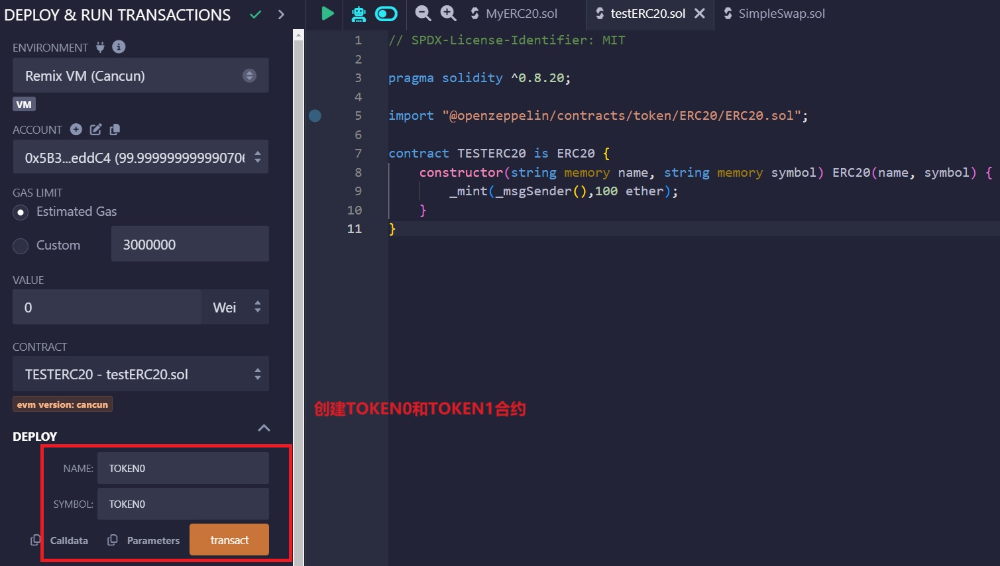

2. `SimpleSwap` コントラクトをデプロイし、上記のトークンアドレスを入力します。

   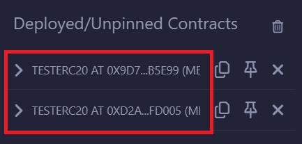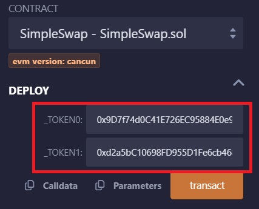

3. 2つのERC20トークンの `approve()` 関数を呼び出し、それぞれ `SimpleSwap` コントラクトに1000単位のトークンを承認します。

   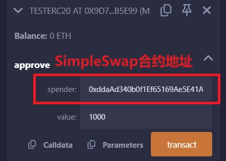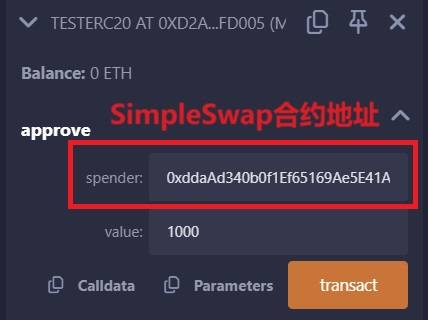

4. `SimpleSwap` コントラクトの `addLiquidity()` 関数を呼び出して取引所に流動性を追加し、token0とtoken1をそれぞれ100単位追加します。

   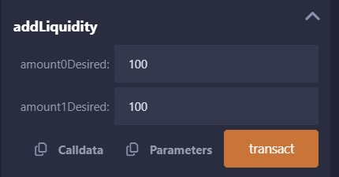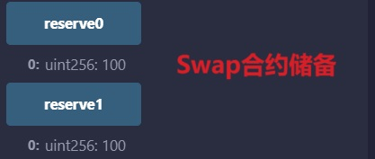

5. `SimpleSwap` コントラクトの `balanceOf()` 関数を呼び出してユーザーのLP持分を確認します。これは100になるはずです。（$\sqrt{100*100}=100$）

   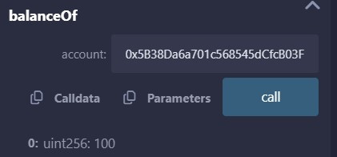

6. `SimpleSwap` コントラクトの `swap()` 関数を呼び出してトークン取引を行い、100単位のtoken0を使用します。

   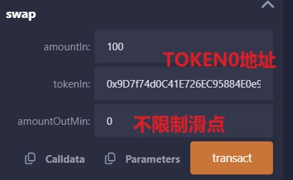

7. `SimpleSwap` コントラクトの `reserve0` と `reserve1` 関数を呼び出してコントラクト内のトークン準備量を確認します。200と50になるはずです。前のステップで100単位のtoken0を使用して50単位のtoken1と交換しました（$\frac{100*100}{100+100}=50$）。

   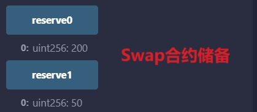

## まとめ

この講義では、恒定積自動マーケットメーカーについて説明し、極簡分散型取引所を作成しました。極簡Swapコントラクトでは、取引手数料やガバナンス部分など、考慮していない部分が多くあります。分散型取引所に興味がある場合は、[Programming DeFi: Uniswap V2](https://jeiwan.net/posts/programming-defi-uniswapv2-1/)と[Uniswap v3 book](https://y1cunhui.github.io/uniswapV3-book-zh-cn/)の閲読をお勧めします。また、[WTF-Dapp](https://github.com/WTFAcademy/WTF-Dapp)コースの学習を続けることもできます。これには分散型取引所の実戦内容が含まれており、より深い学習ができます。

## 重要な概念の補足説明

### インパーマネントロス（無常損失）
流動性プロバイダーが知っておくべき重要なリスクとして、インパーマネントロス（無常損失）があります。これは、流動性プールに預けたトークンの価格比率が変化した際に発生する損失です。例えば、1:1の比率でトークンを預けた後、片方のトークンの価格が大幅に上昇した場合、単純にトークンを保有していた場合と比較して損失が発生します。

### LPトークン
LPトークン（流動性プロバイダートークン）は、ユーザーが流動性プールに提供した流動性の持分を表すトークンです。このトークンは：
- 流動性除去時に必要
- 流動性プールでの持分比率を表現
- 取引手数料の分配基準となる（本実装では省略）

### スリッページ
スリッページは、期待した価格と実際の取引価格の差です。大きな取引や流動性が少ないプールでは、スリッページが大きくなる傾向があります。本コントラクトの `amountOutMin` パラメータは、このスリッページ制御のための機能です。