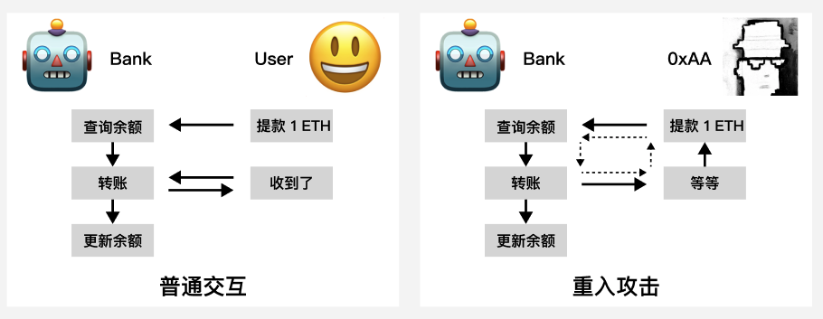

# WTF Solidity 合約セキュリティ: S01. リエントランシー攻撃

私は最近Solidityを学び直して詳細を固めており、「WTF Solidity 合約セキュリティ」を書いています。初心者向けの内容で（プログラミング上級者は他のチュートリアルをお探しください）、毎週1-3講座を更新しています。

Twitter：[@0xAA_Science](https://twitter.com/0xAA_Science)｜[@WTFAcademy_](https://twitter.com/WTFAcademy_)

コミュニティ：[Discord](https://discord.gg/5akcruXrsk)｜[微信群](https://docs.google.com/forms/d/e/1FAIpQLSe4KGT8Sh6sJ7hedQRuIYirOoZK_85miz3dw7vA1-YjodgJ-A/viewform?usp=sf_link)｜[公式サイト wtf.academy](https://wtf.academy)

すべてのコードとチュートリアルはgithubでオープンソース化されています：[github.com/AmazingAng/WTF-Solidity](https://github.com/AmazingAng/WTF-Solidity)

---

今回は、最も一般的なスマートコントラクト攻撃の一つである**リエントランシー攻撃**について紹介します。この攻撃は、イーサリアムをETHとETC（イーサリアムクラシック）に分岐させる原因となったもので、その防止方法についても説明します。

## リエントランシー攻撃

リエントランシー攻撃は、スマートコントラクトで最も一般的な攻撃の一つです。攻撃者はコントラクトの脆弱性（例：フォールバック関数）を利用してコントラクトを循環的に呼び出し、コントラクト内の資産を奪取したり、大量のトークンを鋳造したりします。

有名なリエントランシー攻撃事件：

- 2016年、The DAOコントラクトがリエントランシー攻撃を受け、ハッカーがコントラクトから3,600,000枚の`ETH`を盗み、イーサリアムが`ETH`チェーンと`ETC`（イーサリアムクラシック）チェーンに分岐する原因となりました。
- 2019年、合成資産プラットフォームSynthetixがリエントランシー攻撃を受け、3,700,000枚の`sETH`が盗まれました。
- 2020年、貸付プラットフォームLendf.meがリエントランシー攻撃を受け、$25,000,000が盗まれました。
- 2021年、貸付プラットフォームCREAM FINANCEがリエントランシー攻撃を受け、$18,800,000が盗まれました。
- 2022年、アルゴリズム安定コインプロジェクトFeiがリエントランシー攻撃を受け、$80,000,000が盗まれました。

The DAOがリエントランシー攻撃を受けてから6年が経ちましたが、毎年数回、リエントランシー脆弱性によって数千万ドルの損失を出すプロジェクトが後を絶ちません。そのため、この脆弱性を理解することは非常に重要です。

## `0xAA`の銀行強盗の物語

皆さんの理解を深めるために、「ハッカー`0xAA`の銀行強盗」の物語をお話しします。

イーサリアム銀行の窓口係員はすべてロボット（Robot）で、スマートコントラクトによって制御されています。通常のユーザー（User）が銀行にお金を引き出しに来た時のサービスフロー：

1. ユーザーの`ETH`残高を照会し、0より大きい場合は次のステップに進む。
2. ユーザーの`ETH`残高を銀行からユーザーに送金し、ユーザーに受け取ったかどうかを確認する。
3. ユーザー名義の残高を`0`に更新する。

ある日、ハッカー`0xAA`が銀行にやってきました。これは彼とロボット窓口係員の会話です：

- 0xAA : お金を引き出したい、`1 ETH`。
- Robot: あなたの残高を照会中：`1 ETH`。あなたのアカウントに`1 ETH`を送金中です。お金を受け取りましたか？
- 0xAA : ちょっと待って、お金を引き出したい、`1 ETH`。
- Robot: あなたの残高を照会中：`1 ETH`。あなたのアカウントに`1 ETH`を送金中です。お金を受け取りましたか？
- 0xAA : ちょっと待って、お金を引き出したい、`1 ETH`。
- Robot: あなたの残高を照会中：`1 ETH`。あなたのアカウントに`1 ETH`を送金中です。お金を受け取りましたか？
- 0xAA : ちょっと待って、お金を引き出したい、`1 ETH`。
- ...

最終的に、`0xAA`はリエントランシー攻撃の脆弱性を利用して、銀行の資産をすべて奪い取りました。銀行は破綻しました。



## 脆弱性コントラクトの例

### 銀行コントラクト

銀行コントラクトは非常にシンプルで、すべてのユーザーのイーサリアム残高を記録する1つの状態変数`balanceOf`と、3つの関数を含んでいます：

- `deposit()`：預金関数。`ETH`を銀行コントラクトに預け、ユーザーの残高を更新します。
- `withdraw()`：出金関数。呼び出し者の残高を彼らに送金します。具体的なステップは上記の物語と同じです：残高照会、送金、残高更新。**注意：この関数にはリエントランシー脆弱性があります！**
- `getBalance()`：銀行コントラクト内の`ETH`残高を取得します。

```solidity
contract Bank {
    mapping (address => uint256) public balanceOf;    // 残高mapping

    // etherを預け、残高を更新
    function deposit() external payable {
        balanceOf[msg.sender] += msg.value;
    }

    // msg.senderの全てのetherを引き出し
    function withdraw() external {
        uint256 balance = balanceOf[msg.sender]; // 残高を取得
        require(balance > 0, "Insufficient balance");
        // ether送金 !!! 悪意のあるコントラクトのfallback/receive関数を起動する可能性があり、リエントランシーリスクがある！
        (bool success, ) = msg.sender.call{value: balance}("");
        require(success, "Failed to send Ether");
        // 残高を更新
        balanceOf[msg.sender] = 0;
    }

    // 銀行コントラクトの残高を取得
    function getBalance() external view returns (uint256) {
        return address(this).balance;
    }
}
```

### 攻撃コントラクト

リエントランシー攻撃の攻撃ポイントの一つは、コントラクトが`ETH`を送金する箇所です：送金先アドレスがコントラクトの場合、相手コントラクトの`fallback`（フォールバック）関数がトリガーされ、循環呼び出しの可能性が生まれます。フォールバック関数について詳しく知らない場合は、[WTF Solidity 極簡チュートリアル第19講：ETHの受け取り](https://github.com/AmazingAng/WTF-Solidity/blob/main/19_Fallback/readme.md)をお読みください。`Bank`コントラクトの`withdraw()`関数には`ETH`送金があります：

```
(bool success, ) = msg.sender.call{value: balance}("");
```

もしハッカーが攻撃コントラクトの`fallback()`または`receive()`関数内で`Bank`コントラクトの`withdraw()`関数を再度呼び出した場合、`0xAA`の銀行強盗の物語のような循環呼び出しが発生し、`Bank`コントラクトが攻撃者に継続的に送金し、最終的にコントラクトの`ETH`を空にしてしまいます。

```solidity
    receive() external payable {
        bank.withdraw();
    }
```

以下は攻撃コントラクトです。ロジックは非常にシンプルで、`receive()`フォールバック関数を通じて`Bank`コントラクトの`withdraw()`関数を循環呼び出しします。1つの状態変数`bank`で`Bank`コントラクトのアドレスを記録します。4つの関数を含んでいます：

- コンストラクタ: `Bank`コントラクトのアドレスを初期化します。
- `receive()`: コールバック関数。`ETH`を受け取る時にトリガーされ、再度`Bank`コントラクトの`withdraw()`関数を呼び出し、循環的に出金します。
- `attack()`：攻撃関数。まず`Bank`コントラクトの`deposit()`関数で預金し、その後`withdraw()`を呼び出して最初の出金を開始します。その後、`Bank`コントラクトの`withdraw()`関数と攻撃コントラクトの`receive()`関数が循環呼び出しされ、`Bank`コントラクトの`ETH`を空にします。
- `getBalance()`：攻撃コントラクト内の`ETH`残高を取得します。

```solidity
contract Attack {
    Bank public bank; // Bankコントラクトアドレス

    // Bankコントラクトアドレスを初期化
    constructor(Bank _bank) {
        bank = _bank;
    }

    // コールバック関数、Bankコントラクトへのリエントランシー攻撃に使用、対象のwithdraw関数を繰り返し呼び出す
    receive() external payable {
        if (bank.getBalance() >= 1 ether) {
            bank.withdraw();
        }
    }

    // 攻撃関数、呼び出し時msg.valueを1 etherに設定
    function attack() external payable {
        require(msg.value == 1 ether, "Require 1 Ether to attack");
        bank.deposit{value: 1 ether}();
        bank.withdraw();
    }

    // このコントラクトの残高を取得
    function getBalance() external view returns (uint256) {
        return address(this).balance;
    }
}
```

## `Remix`デモ

1. `Bank`コントラクトをデプロイし、`deposit()`関数を呼び出して`20 ETH`を送金します。
2. 攻撃者のウォレットに切り替えて、`Attack`コントラクトをデプロイします。
3. `Attack`コントラクトの`attack()`関数を呼び出して攻撃を開始します。呼び出し時に`1 ETH`を送金する必要があります。
4. `Bank`コントラクトの`getBalance()`関数を呼び出すと、残高が空になっていることがわかります。
5. `Attack`コントラクトの`getBalance()`関数を呼び出すと、残高が`21 ETH`になっており、リエントランシー攻撃が成功したことがわかります。

もちろん、`ETH`送金だけでなく、`ERC721`と`ERC1155`の`safeTransfer()`と`safeTransferFrom()`安全送金関数、さらに`ERC777`の`callback`関数も、リエントランシー攻撃を引き起こす可能性があります。これは主にマクロ的な設計問題であり、ETH送金自体に限定されるものではありません。

## 予防方法

現在、リエントランシー攻撃脆弱性を予防する主な方法は2つあります：チェック-エフェクト-インタラクションパターン（checks-effect-interaction）とリエントランシーロックです。

### チェック-エフェクト-インタラクションパターン

チェック-エフェクト-インタラクションパターンは、関数を書く際に、まず状態変数が要件を満たしているかチェックし、続いて状態変数（例：残高）を更新し、最後に他のコントラクトとのインタラクションを行うことを強調しています。`Bank`コントラクトの`withdraw()`関数で残高更新を`ETH`送金の前に移動すれば、脆弱性を修正できます：

```solidity
function withdraw() external {
    uint256 balance = balanceOf[msg.sender];
    require(balance > 0, "Insufficient balance");
    // チェック-エフェクト-インタラクションパターン（checks-effect-interaction）：先に残高変化を更新し、その後ETHを送信
    // リエントランシー攻撃の時、balanceOf[msg.sender]は既に0に更新されており、上記のチェックを通過できない。
    balanceOf[msg.sender] = 0;
    (bool success, ) = msg.sender.call{value: balance}("");
    require(success, "Failed to send Ether");
}
```

### リエントランシーロック

リエントランシーロックは、リエントランシー関数を防ぐためのモディファイア（modifier）で、デフォルトで`0`の状態変数`_status`を含んでいます。`nonReentrant`リエントランシーロックで修飾された関数は、最初の呼び出し時に`_status`が`0`かどうかをチェックし、続いて`_status`の値を`1`に変更し、呼び出し終了後に再び`0`に戻します。これにより、攻撃コントラクトが呼び出し終了前に2回目の呼び出しを行うとエラーが発生し、リエントランシー攻撃は失敗します。モディファイアについて詳しく知らない場合は、[WTF Solidity 極簡チュートリアル第11講：モディファイア](https://github.com/AmazingAng/WTF-Solidity/blob/main/11_Modifier/readme.md)をお読みください。

```solidity
uint256 private _status; // リエントランシーロック

// リエントランシーロック
modifier nonReentrant() {
    // 最初のnonReentrant呼び出し時、_statusは0になる
    require(_status == 0, "ReentrancyGuard: reentrant call");
    // この後のnonReentrantへの呼び出しはすべて失敗する
    _status = 1;
    _;
    // 呼び出し終了、_statusを0に復元
    _status = 0;
}
```

`nonReentrant`リエントランシーロックで`withdraw()`関数を修飾するだけで、リエントランシー攻撃を予防できます。

```solidity
// リエントランシーロックで脆弱性のある関数を保護
function withdraw() external nonReentrant{
    uint256 balance = balanceOf[msg.sender];
    require(balance > 0, "Insufficient balance");

    (bool success, ) = msg.sender.call{value: balance}("");
    require(success, "Failed to send Ether");

    balanceOf[msg.sender] = 0;
}
```

さらに、OpenZeppelinもPullPayment（プル支払い）パターンに従うことを推奨し、潜在的なリエントランシー攻撃を回避しています。その原理は、第三者（escrow）を導入することで、従来の「能動的送金」を「送金者による送金開始」と「受取者による能動的プル」に分解することです。送金を開始したい場合、`_asyncTransfer(address dest, uint256 amount)`を通じて送金予定金額を第三者コントラクトに保存し、リエントランシーによる自身の資産損失を回避します。受取者が送金を受け取りたい場合、`withdrawPayments(address payable payee)`を能動的に呼び出して資産を取得する必要があります。

## まとめ

今回は、イーサリアムで最も一般的な攻撃の一つ──リエントランシー攻撃について紹介し、理解を深めるために`0xAA`の銀行強盗の小話を作りました。最後に、リエントランシー攻撃を予防する2つの方法を紹介しました：チェック-エフェクト-インタラクションパターン（checks-effect-interaction）とリエントランシーロックです。例では、ハッカーが対象コントラクトの`ETH`送金時にフォールバック関数を利用してリエントランシー攻撃を行いました。実際のビジネスでは、`ERC721`と`ERC1155`の`safeTransfer()`と`safeTransferFrom()`安全送金関数、さらに`ERC777`のフォールバック関数も、リエントランシー攻撃を引き起こす可能性があります。初心者の方には、リエントランシーロックでコントラクト状態を変更する可能性のあるすべての`external`関数を保護することをお勧めします。より多くの`gas`を消費する可能性がありますが、より大きな損失を予防できます。