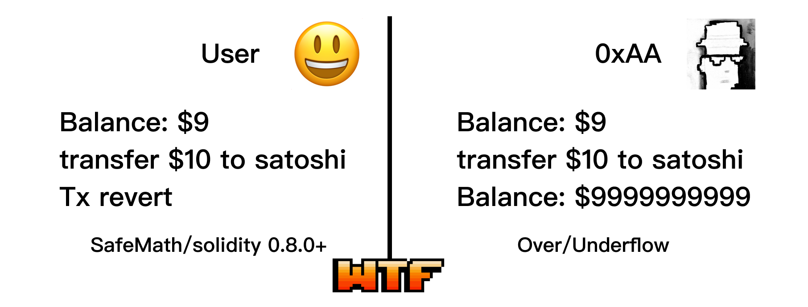

# WTF Solidity コントラクトセキュリティ: S05. 整数オーバーフロー

最近、私はSolidityを再学習し、詳細を固めながら、初心者向けの「WTF Solidityコントラクトセキュリティ」を執筆しています（プログラミング上級者は他のチュートリアルを探してください）。毎週1-3回更新予定です。

Twitter: [@0xAA_Science](https://twitter.com/0xAA_Science) | [@WTFAcademy_](https://twitter.com/WTFAcademy_)

コミュニティ: [Discord](https://discord.gg/5akcruXrsk) | [Wechatグループ](https://docs.google.com/forms/d/e/1FAIpQLSe4KGT8Sh6sJ7hedQRuIYirOoZK_85miz3dw7vA1-YjodgJ-A/viewform?usp=sf_link) | [公式サイト wtf.academy](https://wtf.academy)

すべてのコードとチュートリアルはgithubでオープンソース化されています: [github.com/AmazingAng/WTF-Solidity](https://github.com/AmazingAng/WTF-Solidity)

---

今回のレッスンでは、整数オーバーフロー脆弱性（Arithmetic Over/Under Flows）について説明します。これは比較的古典的な脆弱性で、Solidity 0.8版以降ではSafemathライブラリが内蔵されているため、現在はほとんど発生しません。

## 整数オーバーフロー

イーサリアム仮想マシン（EVM）は整数型に固定サイズを設定しているため、特定の範囲の数値しか表現できません。例えば、`uint8`は[0,255]の範囲の数値しか表現できません。`uint8`型の変数に`257`を代入すると、オーバーフロー（overflow）が発生して`1`になります。`-1`を代入すると、アンダーフロー（underflow）が発生して`255`になります。

攻撃者はこの脆弱性を利用して攻撃を行うことができます：残高が`0`のハッカーが突然`$1`を支出した後、残高が`$2^256-1`になることを想像してください。2018年の土狗プロジェクト`PoWHC`は、この脆弱性により`866 ETH`を盗まれました。



## 脆弱なコントラクトの例

以下の例は、`Ethernaut`のコントラクトを参考にしたシンプルなトークンコントラクトです。`2`つの状態変数があります：`balances`は各アドレスの残高を記録し、`totalSupply`はトークンの総供給量を記録します。

`3`つの関数があります：

- コンストラクタ：トークンの総供給量を初期化
- `transfer()`：送金関数
- `balanceOf()`：残高照会関数

solidity `0.8.0`版以降では整数オーバーフローエラーが自動的にチェックされ、オーバーフロー時にはエラーが発生します。この脆弱性を再現するには、`unchecked`キーワードを使用してコードブロック内で一時的にオーバーフローチェックを無効にする必要があります。これは`transfer()`関数で行っているとおりです。

この例の脆弱性は`transfer()`関数の`require(balances[msg.sender] - _value >= 0);`のチェックにあります。整数オーバーフローにより、このチェックは常に通過してしまいます。そのため、ユーザーは無制限に送金できてしまいます。

```solidity
// SPDX-License-Identifier: MIT
pragma solidity ^0.8.21;

contract Token {
  mapping(address => uint) balances;
  uint public totalSupply;

  constructor(uint _initialSupply) {
    balances[msg.sender] = totalSupply = _initialSupply;
  }

  function transfer(address _to, uint _value) public returns (bool) {
    unchecked{
        require(balances[msg.sender] - _value >= 0);
        balances[msg.sender] -= _value;
        balances[_to] += _value;
    }
    return true;
  }
  function balanceOf(address _owner) public view returns (uint balance) {
    return balances[_owner];
  }
}
```

## `Remix`での再現

1. `Token`コントラクトをデプロイし、総供給量を`100`に設定する。
2. 別のアカウントに`1000`トークンを送金する。送金は成功する。
3. 自分のアカウントの残高を照会すると、非常に大きな数値（約`2^256`）になっていることがわかる。

## 予防方法

1. Solidity `0.8.0`以前のバージョンでは、コントラクト内で[Safemathライブラリ](https://github.com/OpenZeppelin/openzeppelin-contracts/blob/release-v4.9/contracts/utils/math/SafeMath.sol)を参照し、整数オーバーフロー時にエラーを発生させる。

2. Solidity `0.8.0`以降のバージョンでは`Safemath`が内蔵されているため、この種の問題はほとんど存在しません。開発者がガス節約のために`unchecked`キーワードを使用してコードブロック内で一時的に整数オーバーフローチェックを無効にする場合は、整数オーバーフロー脆弱性が存在しないことを確認する必要があります。

## まとめ

今回のレッスンでは、古典的な整数オーバーフロー脆弱性について紹介しました。solidity 0.8.0版以降で`Safemath`の整数オーバーフローチェックが内蔵されたため、この種の脆弱性は既に非常に稀になっています。