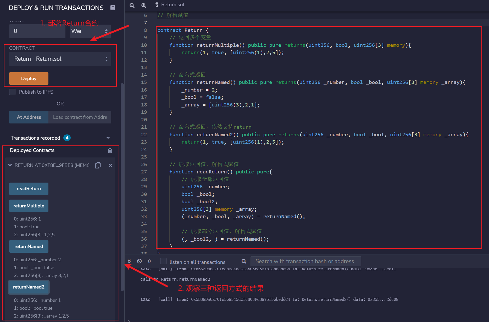

# WTF Introdução básica ao Solidity: 4. Saída de funções

Recentemente, tenho revisado Solidity para consolidar alguns detalhes e criar um "WTF Introdução básica ao Solidity" para iniciantes (programadores experientes podem procurar outros tutoriais). Atualizações semanais de 1 a 3 aulas.

Twitter: [@0xAA_Science](https://twitter.com/0xAA_Science)

Comunidade: [Discord](https://discord.gg/5akcruXrsk) | [Grupo do WeChat](https://docs.google.com/forms/d/e/1FAIpQLSe4KGT8Sh6sJ7hedQRuIYirOoZK_85miz3dw7vA1-YjodgJ-A/viewform?usp=sf_link) | [Site oficial wtf.academy](https://wtf.academy)

Todo o código e tutoriais estão disponíveis no Github: [github.com/AmazingAng/WTFSolidity](https://github.com/AmazingAng/WTF-Solidity)

---

Nesta aula, vamos discutir a saída de funções em Solidity, incluindo: retorno de múltiplas variáveis, retorno nomeado e o uso da atribuição por destruturação para ler todos ou parte dos valores de retorno.

## Valores de retorno: return e returns

Em Solidity, existem duas palavras-chave relacionadas à saída de funções: `return` e `returns`. A diferença entre elas é a seguinte:

- `returns`: segue o nome da função e é usado para declarar os tipos e nomes das variáveis de retorno.
- `return`: utilizado no corpo da função para retornar variáveis específicas.

```solidity
// Retornando múltiplas variáveis
function returnMultiple() public pure returns(uint256, bool, uint256[3] memory){
    return(1, true, [uint256(1),2,5]);
}
```

No código acima, usamos a palavra-chave `returns` para declarar a função `returnMultiple()` que retorna várias variáveis, e então usamos `return(1, true, [uint256(1),2,5])` no corpo da função para determinar os valores de retorno.

No exemplo acima, `uint256[3]` declara um array de comprimento `3` e tipo `uint256` como retorno. Como `[1,2,3]` é interpretado como `uint8(3)` por padrão, o primeiro elemento em `[uint256(1),2,5]` deve ser convertido em `uint256` para declarar que todos os elementos do array são desse tipo. Arrays como valores de retorno devem ser declarados como `memory`, como veremos em mais detalhes no próximo capítulo sobre [armazenamento e escopo de variáveis](../05_DataStorage/readme.md).

## Retorno nomeado

Podemos especificar os nomes das variáveis de retorno dentro de `returns`. Dessa forma, o Solidity inicializa essas variáveis e automaticamente as retorna sem a necessidade de utilizar `return`.

```solidity
// Retorno nomeado
function returnNamed() public pure returns(uint256 _number, bool _bool, uint256[3] memory _array){
    _number = 2;
    _bool = false;
    _array = [uint256(3),2,1];
}
```

No código acima, utilizamos `returns(uint256 _number, bool _bool, uint256[3] memory _array)` para declarar os tipos e nomes das variáveis de retorno. Em seguida, no corpo da função, simplesmente atribuímos valores às variáveis `_number`, `_bool` e `_array`, que serão retornadas automaticamente.

É possível utilizar o `return` mesmo no retorno nomeado:

```solidity
// Retorno nomeado, ainda é possível usar return
function returnNamed2() public pure returns(uint256 _number, bool _bool, uint256[3] memory _array){
    return(1, true, [uint256(1),2,5]);
}
```

## Atribuição por destruturação

Solidity suporta a atribuição por destruturação para ler todos ou parte dos valores de retorno de uma função.

- Ler todos os valores de retorno: declara-se as variáveis e as variáveis a serem atribuídas são separadas por `,` e listadas em ordem.

    ```solidity
    uint256 _number;
    bool _bool;
    uint256[3] memory _array;
    (_number, _bool, _array) = returnNamed();
    ```

- Ler parte dos valores de retorno: declara-se as variáveis correspondentes aos valores a serem lidos e deixa-se em branco as que não serão utilizadas. No exemplo abaixo, estamos lendo apenas `_bool` e não os valores `_number` e `_array` retornados:

    ```solidity
    (, _bool2, ) = returnNamed();
    ```

## Executando no Remix

- Deploy o contrato e veja os resultados dos três métodos de retorno.

    

## Conclusão

Nesta aula, abordamos a saída de funções em Solidity, incluindo: retorno de múltiplas variáveis, retorno nomeado e o uso da atribuição por destruturação para ler todos ou parte dos valores de retorno. Esses conceitos nos ajudam a lidar de forma mais flexível com os valores de retorno ao escrever contratos inteligentes.

