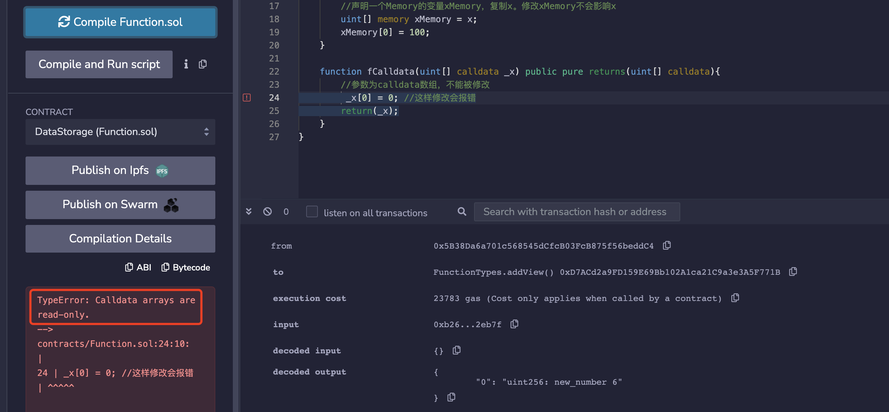
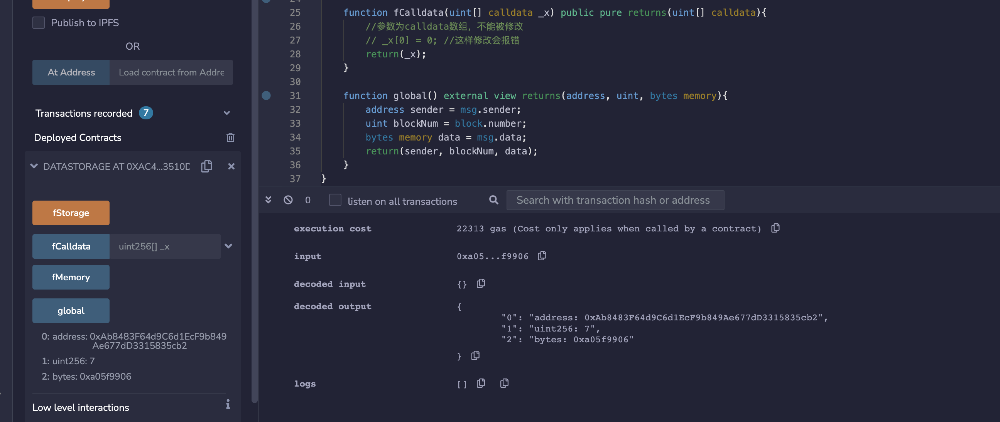

# WTF Introdução Simples ao Solidity: 5. Armazenamento de Dados de Variáveis e Escopo

Recentemente, tenho revisitado o Solidity para consolidar alguns detalhes e estou escrevendo uma "Introdução Simples ao Solidity" para ajudar os iniciantes (os especialistas em programação podem procurar outros tutoriais). A atualização será feita semanalmente com 1-3 aulas.

Twitter: [@0xAA_Science](https://twitter.com/0xAA_Science)

Comunidade: [Discord](https://discord.gg/5akcruXrsk) | [Grupo do WeChat](https://docs.google.com/forms/d/e/1FAIpQLSe4KGT8Sh6sJ7hedQRuIYirOoZK_85miz3dw7vA1-YjodgJ-A/viewform?usp=sf_link) | [Website wtf.academy](https://wtf.academy)

Todo o código e tutoriais estão disponíveis no GitHub: [github.com/AmazingAng/WTFSolidity](https://github.com/AmazingAng/WTF-Solidity)

---

## Tipos de Referência no Solidity

Os tipos de referência (Reference Type) no Solidity incluem arrays (matrizes) e structs (estruturas). Como esses tipos de variáveis são mais complexos e ocupam mais espaço de armazenamento, é necessário especificar a localização de armazenamento dos dados ao usá-los.

## Localização de Dados

No Solidity, existem três tipos de localização de dados: `storage`, `memory` e `calldata`. Cada tipo de armazenamento possui um custo de `gas` diferente. Os dados do tipo `storage` são armazenados on-chain, semelhante a um disco rígido em um computador, e consomem mais `gas`. Os dados do tipo `memory` e `calldata` são temporariamente armazenados na memória, com um consumo de `gas` menor. Em linhas gerais:

1. `storage`: As variáveis de estado do contrato são por padrão do tipo `storage` e são armazenadas na cadeia.

2. `memory`: Parâmetros de função e variáveis temporárias dentro de funções normalmente utilizam o tipo `memory` e são armazenadas na memória, fora da cadeia. Especialmente quando o tipo de retorno da função é variável (de comprimento variável), é necessário utilizar o modificador `memory`, por exemplo: string, bytes, array e estruturas personalizadas.

3. `calldata`: Semelhante ao `memory`, os dados são armazenados na memória e fora da cadeia. A diferença em relação ao `memory` é que as variáveis em `calldata` são somente leitura (imutáveis) e são normalmente utilizadas para parâmetros de função. Exemplo:

```solidity
function fCalldata(uint[] calldata _x) public pure returns(uint[] calldata){
    // O parâmetro é um array calldata, não pode ser modificado
    // _x[0] = 0 // Esta modificação causará um erro
    return(_x);
}
```

**Exemplo:**



### Regras de Atribuição da Localização de Dados

Ao atribuir entre diferentes tipos de armazenamento, às vezes é criada uma cópia independente (modificar a nova variável não afeta a variável original), e outras vezes é criada uma referência (modificar a nova variável afeta a original). As regras são as seguintes:

- Atribuir essencialmente cria uma referência ao corpo, portanto, a alteração do corpo ou da referência pode ser sincronizada:

  - Atribuir de `storage` (variáveis de estado do contrato) para `storage` local (dentro de funções) cria uma referência, e alterar a nova variável afetará a original. Exemplo:
  
    ```solidity
    uint[] x = [1,2,3]; // Variável de estado: array x

    function fStorage() public{
        // Declaração de uma variável storage xStorage, que aponta para x. Alterar xStorage afetará x
        uint[] storage xStorage = x;
        xStorage[0] = 100;
    }
    ```

    **Exemplo:**

    
  - `memory` atribuído a `memory` cria uma referência, e alterar a nova variável afetará a original.

- Em outras situações, a atribuição cria uma cópia do corpo, ou seja, a modificação em um não será refletida no outro.

## Escopo de Variáveis

As variáveis no Solidity são divididas em três tipos de escopo: variáveis de estado (state variable), variáveis locais (local variable) e variáveis globais (global variable).

### 1. Variáveis de Estado

As variáveis de estado são aquelas cujos dados são armazenados na cadeia e podem ser acessadas por todas as funções dentro do contrato. Essas variáveis são declaradas dentro do contrato, fora das funções:

```solidity
contract Variaveis {
    uint public x = 1;
    uint public y;
    string public z;
}
```

Podemos alterar o valor das variáveis de estado dentro das funções:

```solidity
function foo() external{
    // Podemos alterar o valor das variáveis de estado dentro da função
    x = 5;
    y = 2;
    z = "0xAA";
}
```

### 2. Variáveis Locais

As variáveis locais são aquelas válidas apenas durante a execução de uma função e se tornam inválidas após a saída da função. Os dados das variáveis locais são armazenados na memória, fora da cadeia, e consomem menos `gas`. As variáveis locais são declaradas dentro de funções:

```solidity
function bar() external pure returns(uint){
    uint xx = 1;
    uint yy = 3;
    uint zz = xx + yy;
    return(zz);
}
```

### 3. Variáveis Globais

As variáveis globais possuem um escopo global de funcionamento e são palavras-chave reservadas do Solidity. Elas podem ser utilizadas diretamente dentro das funções sem precisar serem declaradas:

```solidity
function global() external view returns(address, uint, bytes memory){
    address remetente = msg.sender;
    uint numeroBloco = block.number;
    bytes memory dados = msg.data;
    return(remetente, numeroBloco, dados);
}
```

No exemplo acima, utilizamos três variáveis globais comuns: `msg.sender`, `block.number` e `msg.data`, que representam o endereço do remetente da mensagem, a altura do bloco atual e os dados da mensagem, respectivamente. Abaixo seguem algumas variáveis globais comuns. Para uma lista completa, consulte este [link](https://learnblockchain.cn/docs/solidity/units-and-global-variables.html#special-variables-and-functions):

- `blockhash(uint blockNumber)`: (`bytes32`) Hash de um bloco específico - apenas válido para aproximadamente os últimos 256 blocos, excluindo o bloco atual.
- `block.coinbase`: (`address payable`) Endereço do minerador do bloco atual.
- `block.gaslimit`: (`uint`) Limite de gas do bloco atual.
- `block.number`: (`uint`) Número do bloco atual.
- `block.timestamp`: (`uint`) Timestamp do bloco atual, em segundos desde a "unix epoch".
- `gasleft()`: (`uint256`) Gas restante.
- `msg.data`: (`bytes calldata`) Dados completos da chamada.
- `msg.sender`: (`address payable`) Remetente da mensagem (caller atual).
- `msg.sig`: (`bytes4`) Primeiros quatro bytes dos dados da chamada (identificador da função).
- `msg.value`: (`uint`) Valor em wei enviado na transação atual.

**Exemplo:**



### 4. Variáveis Globais - Unidades de Ether e Unidades de Tempo

#### Unidades de Ether

Não existem pontos flutuantes no Solidity, e o ponto é representado como `0`, para garantir a precisão das transações e evitar perdas de precisão. O uso das unidades de Ether ajuda a evitar erros de cálculo e facilita o manuseio de transações de criptomoedas no contrato.

- `wei`: 1
- `gwei`: 1e9 = 1000000000
- `ether`: 1e18 = 1000000000000000000

```solidity
function weiUnit() external pure returns(uint) {
    assert(1 wei == 1e0);
    assert(1 wei == 1);
    return 1 wei;
}

function gweiUnit() external pure returns(uint) {
    assert(1 gwei == 1e9);
    assert(1 gwei == 1000000000);
    return 1 gwei;
}

function etherUnit() external pure returns(uint) {
    assert(1 ether == 1e18);
    assert(1 ether == 1000000000000000000);
    return 1 ether;
}
```

**Exemplo:**


#### Unidades de Tempo

É comum definir uma operação que deve ser concluída em uma semana dentro de um contrato, ou que um evento ocorrerá um mês após. Isso garante a precisão da execução do contrato, independentemente de possíveis erros técnicos. Portanto, as unidades de tempo são um conceito importante no Solidity, melhorando a legibilidade e manutenção do contrato.

- `seconds`: 1
- `minutes`: 60 segundos = 60
- `hours`: 60 minutos = 3600
- `days`: 24 horas = 86400
- `weeks`: 7 dias = 604800

```solidity
function secondsUnit() external pure returns(uint) {
    assert(1 seconds == 1);
    return 1 seconds;
}

function minutesUnit() external pure returns(uint) {
    assert(1 minutes == 60);
    assert(1 minutes == 60 seconds);
    return 1 minutes;
}

function hoursUnit() external pure returns(uint) {
    assert(1 hours == 3600);
    assert(1 hours == 60 minutes);
    return 1 hours;
}

function daysUnit() external pure returns(uint) {
    assert(1 days == 86400);
    assert(1 days == 24 hours);
    return 1 days;
}

function weeksUnit() external pure returns(uint) {
    assert(1 weeks == 604800);
    assert(1 weeks == 7 days);
    return 1 weeks;
}
```

**Exemplo:**


## Conclusão

Nesta aula, apresentamos os tipos de referência, a localização dos dados e o escopo das variáveis no Solidity. O foco principal foi nos termos `storage`, `memory` e `calldata` e suas aplicações. Esses termos foram introduzidos para economizar espaço de armazenamento limitado on-chain e reduzir o consumo de `gas`. Na próxima aula, abordaremos arrays nos tipos de referência.

