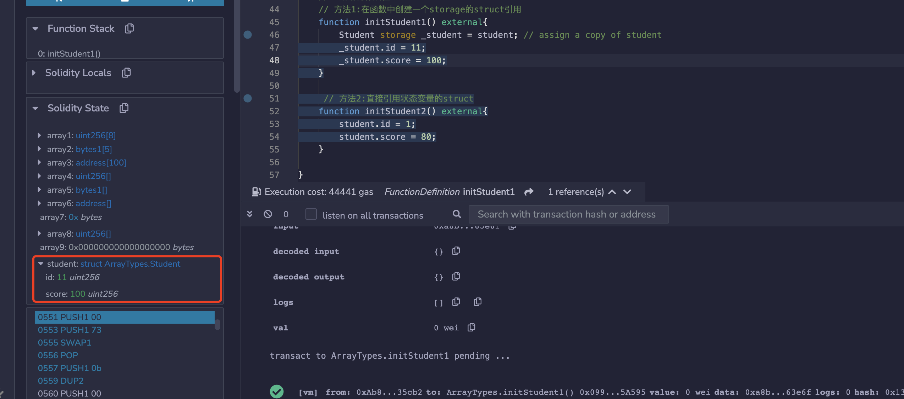
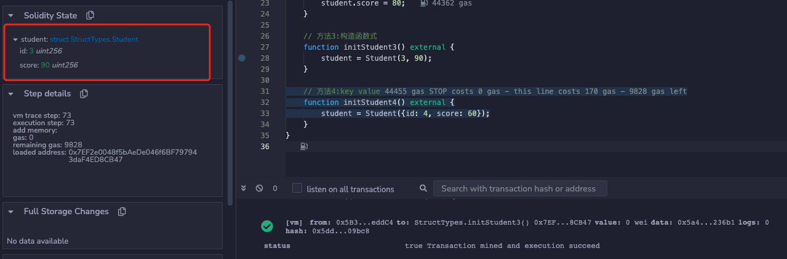
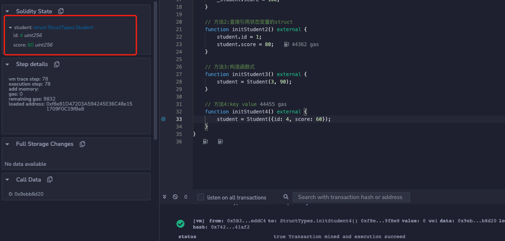

# WTF Solidity Introduction: 6. Tipos de Referência, arrays, structs

Recentemente tenho revisitado o Solidity para reforçar os detalhes e estou escrevendo uma "Introdução Super Simples ao Solidity" para ajudar os iniciantes (os experts em programação podem procurar outros tutoriais), com atualizações semanais de 1 a 3 palestras.

Twitter: [@0xAA_Science](https://twitter.com/0xAA_Science)

Comunidade: [Discord](https://discord.gg/5akcruXrsk) | [Grupo no WeChat](https://docs.google.com/forms/d/e/1FAIpQLSe4KGT8Sh6sJ7hedQRuIYirOoZK_85miz3dw7vA1-YjodgJ-A/viewform?usp=sf_link) | [Site oficial wtf.academy](https://wtf.academy)

Todo o código e tutoriais são open source no GitHub: [github.com/AmazingAng/WTFSolidity](https://github.com/AmazingAng/WTF-Solidity)

---

Nesta palestra, vamos apresentar dois tipos de variáveis importantes em Solidity: arrays (arrays) e structs (estruturas).

## Arrays (arrays)

Arrays (arrays) são um tipo de variável comum no Solidity, usada para armazenar um conjunto de dados (números inteiros, bytes, endereços, etc.). Os arrays podem ser de comprimento fixo ou de comprimento variável:

- Arrays de comprimento fixo: o comprimento do array é especificado ao declarar. Declarados no formato `T[k]`, onde `T` é o tipo dos elementos e `k` é o comprimento, por exemplo:

    ```solidity
    // Array de comprimento fixo
    uint[8] array1;
    bytes1[5] array2;
    address[100] array3;
    ```

- Arrays de comprimento variável (arrays dinâmicos): o comprimento do array não é especificado ao declarar. Declarados no formato `T[]`, onde `T` é o tipo dos elementos, por exemplo:

    ```solidity
    // Array de comprimento variável
    uint[] array4;
    bytes1[] array5;
    address[] array6;
    bytes array7;
    ```

    **Nota**: `bytes` é um caso especial, é um array, mas não utiliza `[ ]`. Além disso, não é possível declarar um array de um único byte usando `byte[]`, você pode usar `bytes` ou `bytes1[]` em vez disso. `bytes` é mais econômico em termos de gas do que `bytes1[]`.

### Regras para criar arrays

Existem algumas regras a serem seguidas ao criar arrays no Solidity:

- Para `arrays dinâmicos` com modificadores `memory`, você pode usar o operador `new` para criar, mas é necessário declarar o comprimento e uma vez declarado, o comprimento não pode ser alterado. Por exemplo:

    ```solidity
    // Arrays dinâmicos de memória
    uint[] memory array8 = new uint[](5);
    bytes memory array9 = new bytes(9);
    ```

- Arrays literais são expressões de array escritas entre colchetes para inicializar o array, e o tipo de cada elemento é determinado pelo tipo do primeiro elemento. Por exemplo, em `[1,2,3]`, todos os elementos são do tipo `uint8`, porque no Solidity, se um valor não tem um tipo especificado, o tipo padrão é o tipo mínimo desse tipo, e o tipo mínimo para `uint` é `uint8`. Enquanto em `[uint(1),2,3]`, todos os elementos são do tipo `uint`, porque o primeiro elemento definiu o tipo como `uint`.

    No exemplo abaixo, se a conversão para `uint` não for feita no array passado para a função `g()`, um erro será gerado.

    ```solidity
    // SPDX-License-Identifier: GPL-3.0
    pragma solidity >=0.4.16 <0.9.0;

    contract C {
        function f() public pure {
            g([uint(1), 2, 3]);
        }
        function g(uint[3] memory _data) public pure {
            // ...
        }
    }
    ```

- Se você está criando um array dinâmico, você precisa atribuir os elementos um por um.

    ```solidity
    uint[] memory x = new uint[](3);
    x[0] = 1;
    x[1] = 3;
    x[2] = 4;
    ```

### Membros de um array

- `length`: Um array possui um membro `length` que indica o número de elementos. O comprimento de um array em memória é fixo após a criação.
- `push()`: Arrays dinâmicos têm o membro `push()`, que permite adicionar um novo elemento `0` ao final do array e retorna uma referência para o novo elemento.
- `push(x)`: Arrays dinâmicos possuem o membro `push(x)`, que permite adicionar o elemento `x` ao final do array.
- `pop()`: Arrays dinâmicos possuem o membro `pop()`, que remove o último elemento do array.

**Exemplo:**


## Structs (estruturas)

O Solidity suporta a definição de novos tipos através da construção de structs. Os elementos de uma struct podem ser de tipos primitivos ou de tipos de referência; structs podem ser elementos de arrays ou mapeamentos. A criação de uma struct é feita da seguinte forma:

```solidity
// Struct
struct Student {
    uint256 id;
    uint256 score;
}

Student student; // Inicialização de uma struct Student
```

Há quatro maneiras de atribuir valores a uma struct:

```solidity
// Atribuir valores a uma struct
// Método 1: Criar uma referência struct storage dentro da função
function initStudent1() external {
    Student storage _student = student; // atribuir uma cópia da struct student
    _student.id = 11;
    _student.score = 100;
}
```

**Exemplo:**



```solidity
// Método 2: Atribuir diretamente a struct de variável de estado
function initStudent2() external {
    student.id = 1;
    student.score = 80;
}
```

**Exemplo:**


```solidity
// Método 3: Construtor
function initStudent3() external {
    student = Student(3, 90);
}
```

**Exemplo:**



```solidity
// Método 4: Chave-valor
function initStudent4() external {
    student = Student({id: 4, score: 60});
}
```

**Exemplo:**



## Conclusão

Nesta palestra, apresentamos os conceitos básicos de arrays (arrays) e structs (estruturas) em Solidity. Na próxima palestra, abordaremos mapas (mappings) em Solidity.

