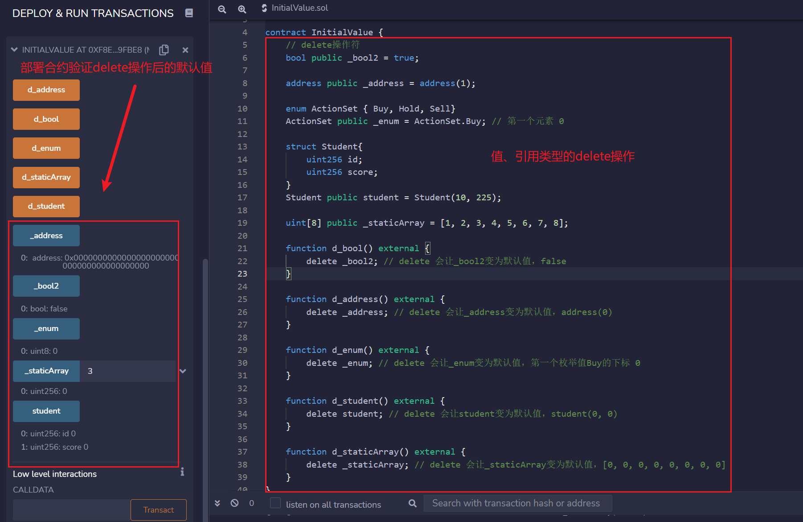

# WTF Introdução Básica ao Solidity: 8. Valores Iniciais de Variáveis

Recentemente, tenho revisado meus conhecimentos de Solidity para reforçar detalhes e também escrever um "WTF Introdução Básica ao Solidity", para ser usado por iniciantes (os programadores experientes podem buscar outro tutorial). Atualizo de 1 a 3 lições por semana.

Twitter: [@0xAA_Science](https://twitter.com/0xAA_Science)

Comunidade: [Discord](https://discord.gg/5akcruXrsk) | [Grupo no WeChat](https://docs.google.com/forms/d/e/1FAIpQLSe4KGT8Sh6sJ7hedQRuIYirOoZK_85miz3dw7vA1-YjodgJ-A/viewform?usp=sf_link) | [Site oficial wtf.academy](https://wtf.academy)

Todo o código e tutorial estão disponíveis no GitHub: [github.com/AmazingAng/WTFSolidity](https://github.com/AmazingAng/WTF-Solidity)

---

## Valores Iniciais de Variáveis

No Solidity, as variáveis declaradas mas não atribuídas têm seu valor inicial ou padrão. Nesta lição, vamos abordar os valores iniciais das variáveis mais comuns.

### Valores Iniciais de Tipos de Dados

- `boolean`: `false`
- `string`: `""`
- `int`: `0`
- `uint`: `0`
- `enum`: o primeiro elemento do enum
- `address`: `0x0000000000000000000000000000000000000000` (ou `address(0)`)
- `function`
  - `internal`: função vazia
  - `external`: função vazia

Podemos verificar se os valores iniciais acima estão corretos usando a função `getter` de variáveis `public`:

```solidity
bool public _bool; // false
string public _string; // ""
int public _int; // 0
uint public _uint; // 0
address public _address; // 0x0000000000000000000000000000000000000000

enum ActionSet { Buy, Hold, Sell}
ActionSet public _enum; // o índice 0 corresponde ao primeiro elemento Buy

function fi() internal{} // função interna vazia
function fe() external{} // função externa vazia
```

### Valores Iniciais de Tipos de Referência

- Mapeamento `mapping`: todos os elementos são os valores padrão do `mapping`
- Estrutura `struct`: a estrutura com todos os membros definidos como valores padrão
- Array `array`
  - Array dinâmico: `[]`
  - Array estático (de comprimento fixo): a array estática com todos os membros definidos como valores padrão

Podemos usar a função `getter` de variáveis `public` para verificar se os valores iniciais acima estão corretos:

```solidity
// Tipos de Referência
uint[8] public _staticArray; // array estática com todos os membros definidos como valores padrão [0,0,0,0,0,0,0,0]
uint[] public _dynamicArray; // `[]`
mapping(uint => address) public _mapping; // todos os elementos são os valores padrão do mapping
// Estrutura com todos os membros definidos como valores padrão 0, 0
struct Student{
    uint256 id;
    uint256 score; 
}
Student public student;
```

### Operador `delete`

`delete a` redefine o valor da variável `a` para seu valor inicial.

```solidity
// Operador delete
bool public _bool2 = true; 
function d() external {
    delete _bool2; // delete redefine o valor de _bool2 para o padrão, false
}
```

## Verificação no remix

- Implante o contrato e verifique os valores iniciais dos tipos de dados e de referência
    

- Valores padrão após a operação `delete` para tipos de dados e de referência

    

## Conclusão

Nesta lição, abordamos os valores iniciais das variáveis no Solidity. Quando uma variável é declarada sem atribuição, seu valor padrão é atribuído. Os valores iniciais variam de acordo com o tipo de variável, e o operador `delete` pode ser usado para redefinir o valor de uma variável para o padrão.

