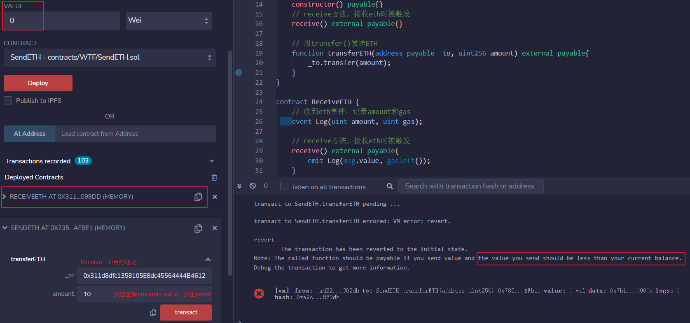
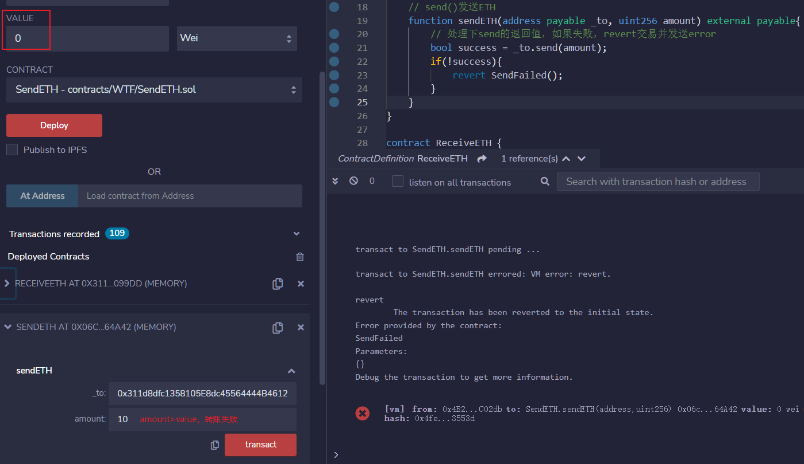

# 20. Enviando ETH

Recentemente, tenho revisitado o estudo de Solidity para consolidar os detalhes e escrever um "WTF Solidity Guia Básico" para iniciantes (os especialistas em programação podem procurar outra fonte). Atualizarei este guia semanalmente com 1-3 lições.

Twitter: [@0xAA_Science](https://twitter.com/0xAA_Science)

Comunidade: [Discord](https://discord.gg/5akcruXrsk) | [Grupo do WhatsApp](https://docs.google.com/forms/d/e/1FAIpQLSe4KGT8Sh6sJ7hedQRuIYirOoZK_85miz3dw7vA1-YjodgJ-A/viewform?usp=sf_link) | [Site oficial wtf.academy](https://wtf.academy)

Todo o código e tutoriais estão disponíveis no GitHub: [github.com/AmazingAng/WTFSolidity](https://github.com/AmazingAng/WTF-Solidity)

-----

Solidity possui três métodos para enviar ETH para outros contratos, que são: `transfer()`, `send()` e `call()`, sendo `call()` o método mais recomendado.

## Contrato Recebedor de ETH

Primeiramente, vamos implantar um contrato que recebe ETH, o `ReceiveETH`. Este contrato possui um evento `Log` que registra a quantidade de ETH recebida e o gás restante. Além disso, possui duas funções: a função `receive()` é acionada quando o contrato recebe ETH e emite o evento `Log`, e a função `getBalance()` retorna o saldo de ETH do contrato.

```solidity
contract ReceiveETH {
    // Evento acionado ao receber ETH, registrando o valor e o gás
    event Log(uint amount, uint gas);
    
    // Função receive() acionada ao receber ETH
    receive() external payable {
        emit Log(msg.value, gasleft());
    }
    
    // Retorna o saldo de ETH do contrato
    function getBalance() view public returns(uint) {
        return address(this).balance;
    }
}
```

Após implantar o contrato `ReceiveETH`, ao chamar a função `getBalance() podemos ver que o saldo de ETH do contrato é 0.


## Contrato Emissor de ETH

Agora vamos implementar os três métodos para enviar ETH para o contrato `ReceiveETH`. Primeiramente, na função `SendETH`, vamos implementar o construtor `payable` e a função `receive()` para que seja possível enviar ETH no momento da implantação e depois.

```solidity
contract SendETH {
    // Construtor, permite enviar ETH durante a implantação
    constructor() payable {}
    
    // Função receive() acionada ao receber ETH
    receive() external payable {}
}
```

### transfer

- A sintaxe para utilizar o método `transfer` é `endereçoDestino.transfer(valor)`.
- O método `transfer()` tem um limite de `gas` de `2300`, suficiente para a transferência, mas o contrato receptor não pode ter funções `fallback()` ou `receive()` muito complexas.
- Se a transferência falhar, ela reverte automaticamente.

Exemplo de código, onde o endereço `_to` é o endereço do contrato `ReceiveETH` e `amount` é o valor de ETH a ser enviado:

```solidity
// Função para enviar ETH usando transfer()
function transferirETH(address payable _to, uint256 amount) external payable {
    _to.transfer(amount);
}
```

Após implantar o contrato `SendETH`, ao enviar ETH para o contrato `ReceiveETH`, com `amount` como 10 e `value` como 0, a transferência falha, pois `amount` é maior que `value` e ocorre uma reversão.



Quando `amount` é 10 e `value` é 10, a transferência é bem-sucedida.


Ao chamar a função `getBalance()` no contrato `ReceiveETH`, podemos ver que o saldo de ETH no contrato é 10.


### send

- A sintaxe para utilizar o método `send` é `endereçoDestino.send(valor)`.
- O método `send()` tem um limite de `gas` de `2300`, suficiente para a transferência, mas o contrato receptor não pode ter funções `fallback()` ou `receive()` muito complexas.
- Se a transferência falhar, não haverá reversão.
- O retorno do método `send()` é um `booleano` indicando se a transferência foi bem-sucedida e requer tratamento adicional no código.

Exemplo de código:

```solidity
error EnvioFalhou(); // Erro para falha na transferência usando send

// Função para enviar ETH usando send()
function enviarETH(address payable _to, uint256 amount) external payable {
    // Verifica se a transferência ocorreu com sucesso
    bool sucesso = _to.send(amount);
    if (!sucesso) {
        revert EnvioFalhou();
    }
}
```

Ao enviar ETH para o contrato `ReceiveETH` com `amount` como 10 e `value` como 0, a transferência falha e ocorre uma reversão devido ao tratamento feito.



Quando `amount` é 10 e `value` é 11, a transferência é bem-sucedida.


### call

- A sintaxe para utilizar o método `call` é `endereçoDestino.call{value: valor}("")`.
- O método `call()` não tem limite de `gas` e pode ser utilizado em contratos receptores com funções `fallback()` ou `receive()` mais complexas.
- Se a transferência falhar, não há reversão.
- O retorno do método `call()` é uma tupla `(boolean, bytes)` indicando se a transferência foi bem-sucedida e requer tratamento adicional no código.

Exemplo de código:

```solidity
error ChamadaFalhou(); // Erro para falha na transferência usando call

// Função para enviar ETH usando call()
function chamarETH(address payable _to, uint256 amount) external payable {
    // Verifica se a transferência ocorreu com sucesso
    (bool sucesso, ) = _to.call{value: amount}("");
    if (!sucesso) {
        revert ChamadaFalhou();
    }
}
```

Ao enviar ETH para o contrato `ReceiveETH` com `amount` como 10 e `value` como 0, a transferência falha devido ao tratamento feito.


Quando `amount` é 10 e `value` é 11, a transferência é bem-sucedida.


Ao utilizar os três métodos, é possível enviar ETH com sucesso para o contrato `ReceiveETH`.

## Conclusão

Nesta lição, apresentamos os três métodos de envio de ETH em Solidity: `transfer`, `send` e `call`.

- `call` não possui limite de `gas` e é o método mais flexível, sendo o mais recomendado.
- `transfer` possui um limite de `2300 gas`, mas reverte a transação automaticamente em caso de falha, sendo uma escolha secundária.
- `send` possui um limite de `2300 gas` e, se a transferência falhar, não reverte a transação, sendo raramente utilizado.

