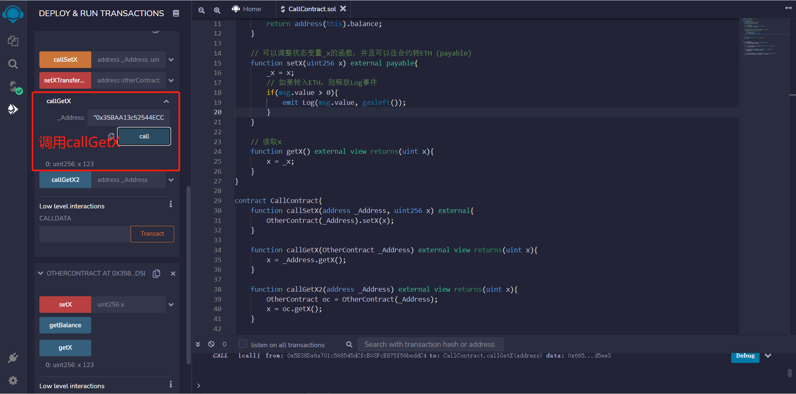

# WTF Solidity Introdução Simples: 21. Chamando Contratos Externos

Recentemente, tenho estudado Solidity novamente para revisar os detalhes e escrever um "WTF Solidity Introdução Simples" para iniciantes (programadores experientes podem procurar outros tutoriais). Serão lançadas de 1 a 3 aulas por semana.

Twitter: [@0xAA_Science](https://twitter.com/0xAA_Science)

Comunidade: [Discord](https://discord.gg/5akcruXrsk) | [Grupo do WeChat](https://docs.google.com/forms/d/e/1FAIpQLSe4KGT8Sh6sJ7hedQRuIYirOoZK_85miz3dw7vA1-YjodgJ-A/viewform?usp=sf_link) | [Site oficial wtf.academy](https://wtf.academy)

Todo o código e tutoriais estão disponíveis no GitHub: [github.com/AmazingAng/WTFSolidity](https://github.com/AmazingAng/WTFSolidity)

-----

## Chamando Contratos Externos

Em Solidity, um contrato pode chamar uma função de outro contrato, o que é muito útil ao construir DApps complexos. Este tutorial irá mostrar como chamar um contrato externo quando você conhece o código (ou interface) e o endereço do contrato.

## Contrato Alvo

Primeiro, vamos escrever um contrato simples chamado `OtherContract` que será chamado por outros contratos.

```solidity
contract OtherContract {
    uint256 private _x = 0; // variável de estado _x
    // evento para registrar o valor e o gás recebidos em ETH
    event Log(uint amount, uint gas);
    
    // retorna o saldo ETH do contrato
    function getBalance() view public returns(uint) {
        return address(this).balance;
    }

    // função que pode alterar o valor da variável de estado _x e receber ETH (payable)
    function setX(uint256 x) external payable{
        _x = x;
        // se ETH for enviado, dispara o evento Log
        if(msg.value > 0){
            emit Log(msg.value, gasleft());
        }
    }

    // lê o valor de _x
    function getX() external view returns(uint x){
        x = _x;
    }
}
```

Este contrato possui uma variável de estado `_x`, um evento `Log` que é disparado quando ETH é recebido e três funções:

- `getBalance()`: retorna o saldo ETH do contrato.
- `setX()`: função `external payable` que define o valor de `_x` e envia ETH para o contrato.
- `getX()`: retorna o valor de `_x`.

## Chamando o Contrato `OtherContract`

Podemos criar uma referência para um contrato usando o endereço e o código (ou interface) do contrato: `_Nome(_Endereço)`, onde `_Nome` é o nome do contrato conforme definido no código (ou interface) do contrato e `_Endereço` é o endereço do contrato. Em seguida, podemos chamar as funções do contrato usando a referência do contrato: `_Nome(_Endereço).f()`, onde `f()` é a função que queremos chamar.

A seguir, apresentamos quatro exemplos de chamadas de contrato. Após compilar os contratos no Remix, implante os contratos `OtherContract` e `CallContract`:


### 1. Passando o Endereço do Contrato

Podemos passar o endereço do contrato como um parâmetro para uma função, criar uma referência para o contrato alvo e, em seguida, chamar a função desejada. Por exemplo, para chamar a função `setX` do contrato `OtherContract`, podemos escrever uma função `callSetX` em um novo contrato, passando o endereço do contrato `OtherContract` implantado como `_Endereço` e o parâmetro `x` para a função `setX`:

```solidity
function callSetX(address _Endereço, uint256 x) external{
    OtherContract(_Endereço).setX(x);
}
```

Copie o endereço do contrato `OtherContract` e insira-o como argumento da função `callSetX`. Após a chamada bem-sucedida, chame a função `getX` do contrato `OtherContract` para verificar se o valor de `x` foi alterado para 123.


### 2. Passando a Variável do Contrato

Podemos passar diretamente a referência do contrato como um parâmetro para uma função, apenas alterando o tipo do parâmetro de `address` para o nome do contrato alvo, como `OtherContract`. O exemplo a seguir mostra como chamar a função `getX()` do contrato alvo.

**Observação**: O tipo do parâmetro `OtherContract _Endereço` ainda é `address`, tanto no código gerado pela ABI quanto ao chamar a função `callGetX`.

```solidity
function callGetX(OtherContract _Endereço) external view returns(uint x){
    x = _Endereço.getX();
}
```

Copie o endereço do contrato `OtherContract` e insira-o como argumento da função `callGetX`. Após a chamada bem-sucedida, você obterá o valor de `x`.



### 3. Criando uma Variável de Contrato

Podemos criar uma variável de contrato e, em seguida, usar essa variável para chamar a função desejada. No exemplo a seguir, armazenamos a referência do contrato `OtherContract` na variável `oc`:

```solidity
function callGetX2(address _Endereço) external view returns(uint x){
    OtherContract oc = OtherContract(_Endereço);
    x = oc.getX();
}
```

Copie o endereço do contrato `OtherContract` e insira-o como argumento da função `callGetX2`. Após a chamada bem-sucedida, você obterá o valor de `x`.


### 4. Chamando um Contrato e Enviando ETH

Se a função do contrato alvo for `payable`, podemos enviar ETH para o contrato chamando essa função: `_Nome(_Endereço).f{value: _Valor}()`, onde `_Nome` é o nome do contrato, `_Endereço` é o endereço do contrato, `f` é o nome da função alvo e `_Valor` é a quantidade de ETH a ser enviada (em wei).

A função `setX` do contrato `OtherContract` é `payable`. No exemplo a seguir, chamamos a função `setX` para enviar ETH para o contrato alvo.

```solidity
function setXTransferETH(address otherContract, uint256 x) payable external{
    OtherContract(otherContract).setX{value: msg.value}(x);
}
```

Copie o endereço do contrato `OtherContract` e insira-o como argumento da função `setXTransferETH`. Em seguida, envie 10 ETH.


Após o envio, você pode observar as alterações no saldo ETH do contrato alvo usando o evento `Log` e a função `getBalance()`.


## Conclusão

Nesta aula, aprendemos como criar uma referência para um contrato externo usando o código (ou interface) e o endereço do contrato, e como chamar as funções desse contrato.

<!-- This file was translated using AI by repo_ai_translate. For more information, visit https://github.com/marcelojsilva/repo_ai_translate -->