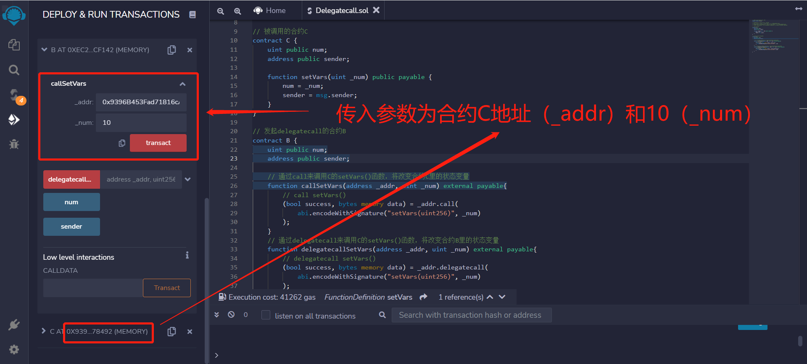

## 23. Delegatecall

Recentemente, tenho revisitado o Solidity para consolidar alguns detalhes e escrever um "Guia de Introdução ao Solidity" para iniciantes (os mestres em programação podem procurar por outro tutorial), com atualizações semanais de 1 a 3 artigos.

Twitter: [@0xAA_Science](https://twitter.com/0xAA_Science)

Comunidade: [Discord](https://discord.gg/5akcruXrsk) | [Grupo no WhatsApp](https://docs.google.com/forms/d/e/1FAIpQLSe4KGT8Sh6sJ7hedQRuIYirOoZK_85miz3dw7vA1-YjodgJ-A/viewform?usp=sf_link) | [Site oficial wtf.academy](https://wtf.academy)

Todo o código e tutorial estão disponíveis no GitHub: [github.com/AmazingAng/WTFSolidity](https://github.com/AmazingAng/WTF-Solidity)

---

## `Delegatecall`

O `delegatecall` é uma função de baixo nível do tipo `address` em Solidity, semelhante ao `call`. Se `delegate` significa delegação/representação, então o que o `delegatecall` está delegando?

Quando o usuário `A` chama o contrato `B` para chamar o contrato `C`, a função executada é a do contrato `C`, e o `contexto` é do contrato `C`: `msg.sender` é o endereço de `B`, e se a função alterar variáveis de estado, os efeitos serão aplicados às variáveis do contrato `C`.

Enquanto, ao usar o `delegatecall` do usuário `A` no contrato `B` para chamar o contrato `C`, a função executada ainda é a do contrato `C`, mas o `contexto` continua sendo do contrato `B`: `msg.sender` é o endereço de `A`, e as alterações nas variáveis de estado serão aplicadas ao contrato `B`.

Podemos entender da seguinte maneira: um investidor (usuário `A`) confia seus ativos (variáveis de estado do contrato `B`) a um agente de investimento de risco (contrato `C`) para administrar. A função executada é do agente de investimento de risco, mas as alterações afetam os ativos.

A sintaxe do `delegatecall` é semelhante à do `call`:

```solidity
enderecoDoContratoAlvo.delegatecall(códigoBinário);
```

O `códigoBinário` é obtido utilizando a função de codificação estruturada `abi.encodeWithSignature`:

```solidity
abi.encodeWithSignature("assinaturaDaFunção", parâmetrosSeparadosPorVírgulas)
```

A `assinaturaDaFunção` é `"nomeDaFunção(tiposDeParâmetrosSeparadosPorVírgulas)"`, por exemplo, `abi.encodeWithSignature("f(uint256,address)", _x, _addr)`.

Diferentemente do `call`, o `delegatecall` pode definir a quantidade de `gas` a ser enviado na transação, mas não pode definir a quantidade de ETH.

> **Atenção**: O `delegatecall` possui riscos de segurança. Deve-se garantir que a estrutura de armazenamento de variáveis de estado dos contratos atual e de destino seja a mesma, e que o contrato de destino seja seguro, caso contrário, pode resultar em perda de ativos.

## Quando usar o `delegatecall`?

Atualmente, o `delegatecall` é principalmente utilizado em dois cenários:

1. Contrato de Procuração (`Proxy Contract`): separa o armazenamento de variáveis e a lógica do contrato. O contrato de Procuração (`Proxy Contract`) armazena todas as variáveis pertinentes e mantém o endereço da lógica do contrato; todas as funções estão dentro do contrato de lógica (`Logic Contract`), sendo executadas por meio de `delegatecall`. Para atualizar, basta direcionar o contrato de Procuração para o novo contrato de lógica.

2. Diamantes EIP-2535: Diamantes são contratos de procuração com múltiplos contratos de implementação. Para mais informações, consulte: [Introdução ao Padrão Diamante](https://eip2535diamonds.substack.com/p/introduction-to-the-diamond-standard).

## Exemplo do `delegatecall`

Chamada: Você (`A`) chama o contrato `B` para chamar o contrato de destino `C`.

### Contrato de Destino C

Primeiramente, vamos escrever um contrato de destino `C` simples: com duas variáveis públicas `num` e `sender', sendo `uint256` e `address`, respectivamente; uma função que define `num` como o valor recebido em `_num` e define `sender` como `msg.sender`.

```solidity
// Contrato de Destino C
contract C {
    uint public num;
    address public sender;

    function setVars(uint _num) public payable {
        num = _num;
        sender = msg.sender;
    }
}
```

### Contrato Chamar B

Em seguida, o contrato `B` deve ter a mesma estrutura de armazenamento de variáveis do contrato de destino `C`, com duas variáveis e na mesma ordem: `num` e `sender`.

```solidity
contract B {
    uint public num;
    address public sender;
}
```

Agora, vamos chamar a função `setVars` do contrato `C` usando `call` e `delegatecall` para entender melhor as diferenças.

A função `callSetVars` chama o `setVars` usando `call`. Ela recebe dois parâmetros, `_addr` e `_num`, correspondentes ao endereço do contrato `C` e ao parâmetro do `setVars`.

```solidity
// Chama o setVars() do contrato C usando a função call, modificando as variáveis de estado do contrato C
function callSetVars(address _addr, uint _num) external payable {
    // chamar setVars()
    (bool success, bytes memory data) = _addr.call(
        abi.encodeWithSignature("setVars(uint256)", _num)
    );
}
```

Já a função `delegatecallSetVars` chama o `setVars` usando `delegatecall`. Assim como a função `callSetVars`, ela recebe dois parâmetros, `_addr` e `_num`, correspondentes ao endereço do contrato `C` e ao parâmetro do `setVars`.

```solidity
// Chama o setVars() do contrato C usando delegatecall, modificando as variáveis de estado do contrato B
function delegatecallSetVars(address _addr, uint _num) external payable {
    // delegatecall setVars()
    (bool success, bytes memory data) = _addr.delegatecall(
        abi.encodeWithSignature("setVars(uint256)", _num)
    );
}
```

### Verificação no Remix

1. Primeiro, implantamos os contratos `B` e `C`.

    
2. Após a implantação, verificamos os valores iniciais das variáveis de estado do contrato `C`, que também são os mesmos para o contrato `B`.

    
3. Em seguida, executamos a função `callSetVars` do contrato `B`, passando o endereço do contrato `C` e `10`.

    
4. Após a execução, as variáveis de estado do contrato `C` são alteradas: `num` é definido como `10` e `sender` é o endereço do contrato `B`.

    
5. Agora, executamos a função `delegatecallSetVars` do contrato `B`, passando o endereço do contrato `C` e `100`.

    
6. Devido ao `delegatecall`, o contexto é do contrato `B`. Após a execução, as variáveis de estado do contrato `B` serão alteradas: `num` é definido como `100` e `sender` é o endereço da sua carteira. As variáveis de estado do contrato `C` não serão modificadas.

    

## Conclusão

Neste artigo, exploramos a função `delegatecall`, mais um recurso de baixo nível em Solidity. Semelhante ao `call`, o `delegatecall` é usado para chamar outros contratos, com a diferença sendo o contexto de execução: `B chama C`, o contexto é `C`; enquanto `B delegatecall C`, o contexto é `B`. Atualmente, a principal aplicação do `delegatecall` é em contratos de procuração e nos Diamantes EIP-2535.

<!-- This file was translated using AI by repo_ai_translate. For more information, visit https://github.com/marcelojsilva/repo_ai_translate -->