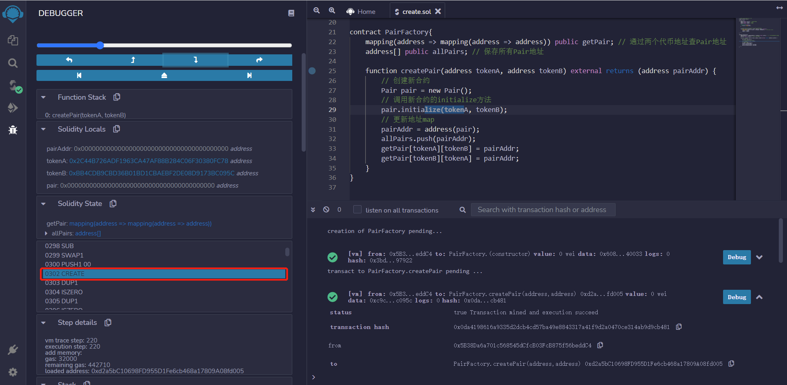

# WTF Introdução Simplificada ao Solidity: 24. Criando Novos Contratos em um Contrato

Recentemente, tenho revisado meus conhecimentos em Solidity para consolidar os detalhes e escrever um "Guia de Introdução Simplificado ao Solidity" para iniciantes (os especialistas podem procurar outros tutoriais). Estarei publicando de 1 a 3 sessões por semana.

Twitter: [@0xAA_Science](https://twitter.com/0xAA_Science)

Comunidade: [Discord](https://discord.gg/5akcruXrsk) | [Grupo do WeChat](https://docs.google.com/forms/d/e/1FAIpQLSe4KGT8Sh6sJ7hedQRuIYirOoZK_85miz3dw7vA1-YjodgJ-A/viewform?usp=sf_link) | [Site Oficial wtf.academy](https://wtf.academy)

Todo o código e tutoriais estão disponíveis no GitHub: [github.com/AmazingAng/WTFSolidity](https://github.com/AmazingAng/WTF-Solidity)

---

Na cadeia de blocos Ethereum, os usuários (contas externas, `EOA`) podem criar contratos inteligentes, e os contratos inteligentes também podem criar novos contratos. A exchange descentralizada `Uniswap` utiliza um contrato de fábrica (`PairFactory`) para criar inúmeros contratos de par (`Pair`). Nesta sessão, vou explicar como criar contratos dentro de um contrato usando o método `create`.

## Método `create`

Existem duas formas de criar novos contratos dentro de um contrato, `create` e `create2`. Neste caso, falarei sobre o `create`, e na próxima sessão abordaremos o `create2`.

O uso do `create` é simples, basta usar `new` em um contrato e passar os parâmetros necessários para o construtor do novo contrato:

```solidity
Contract x = new Contract{value: _value}(params)
```

Onde `Contract` é o nome do contrato a ser criado, `x` é o objeto do contrato (endereço), e caso o construtor seja `payable`, é possível enviar uma quantidade `_value` de `ETH` durante a criação, e `params` são os parâmetros necessários para o construtor do novo contrato.

## Uniswap Simplificado

O core do contrato do `Uniswap V2` contém dois contratos:

1. UniswapV2Pair: contrato de par, usado para gerenciar endereços de pares, liquidez, compras e vendas.
2. UniswapV2Factory: contrato de fábrica, utilizado para criar novos pares e gerenciar seus endereços.

Abaixo, vou mostrar como criar uma versão simplificada do `Uniswap`: o contrato `Pair` gerencia os endereços dos pares, e o contrato `PairFactory` cria novos pares e gerencia seus endereços.

### Contrato `Pair`

```solidity
contract Pair{
    address public factory; 
    address public token0; 
    address public token1; 

    constructor() payable {
        factory = msg.sender;
    }

    function initialize(address _token0, address _token1) external {
        require(msg.sender == factory, 'UniswapV2: FORBIDDEN'); 
        token0 = _token0;
        token1 = _token1;
    }
}
```

O contrato `Pair` é simples, contendo 3 variáveis de estado: `factory`, `token0` e `token1`.

O construtor `constructor` define o endereço da fábrica quando o contrato é implantado. A função `initialize` é chamada manualmente pela fábrica após a implantação para inicializar os endereços dos tokens, atualizando `token0` e `token1`.

### Contrato `PairFactory`

```solidity
contract PairFactory{
    mapping(address => mapping(address => address)) public getPair;
    address[] public allPairs;

    function createPair(address tokenA, address tokenB) external returns (address pairAddr) {
        Pair pair = new Pair(); 
        pair.initialize(tokenA, tokenB);
        pairAddr = address(pair);
        allPairs.push(pairAddr);
        getPair[tokenA][tokenB] = pairAddr;
        getPair[tokenB][tokenA] = pairAddr;
    }
}
```

O contrato de fábrica `PairFactory` possui duas variáveis de estado: `getPair`, um mapeamento de dois endereços de tokens para o endereço do par, e `allPairs`, um array dos endereços dos pares.

O contrato `PairFactory` tem apenas uma função, `createPair`, que cria um novo par com base nos endereços dos tokens `tokenA` e `tokenB`. Na linha

```solidity
Pair pair = new Pair(); 
```

o novo contrato é criado de forma simples. Você pode implantar o contrato `PairFactory` e usá-lo com os dois endereços abaixo para ver qual é o endereço do par criado:

```text
Endereço do WBNB: 0x2c44b726ADF1963cA47Af88B284C06f30380fC78
Endereço do PEOPLE na BSC: 0xbb4CdB9CBd36B01bD1cBaEBF2De08d9173bc095c
```

### Verificação no Remix

1. Chame a função `createPair` com os endereços do `WBNB` e do `PEOPLE` como parâmetros para obter o endereço do `Pair`: 0xD3e2008b4Da2cD6DEAF73471590fF30C86778A48

    
2. Verifique as variáveis do contrato `Pair`

    
3. Debugue o código de `create`

    

## Conclusão

Nesta sessão, explicamos como usar o método `create` para criar contratos dentro de um contrato, usando um exemplo simplificado do `Uniswap`. Na próxima sessão, abordaremos o método `create2` para implementar uma versão simplificada do `Uniswap`.

