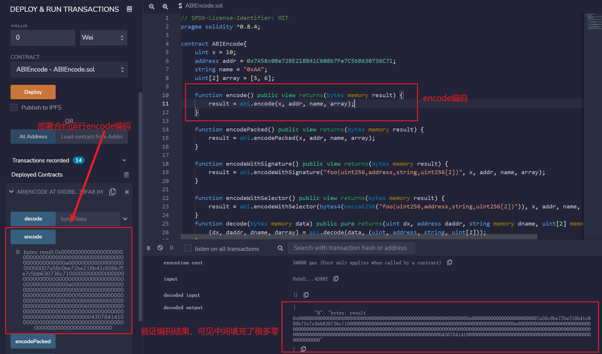
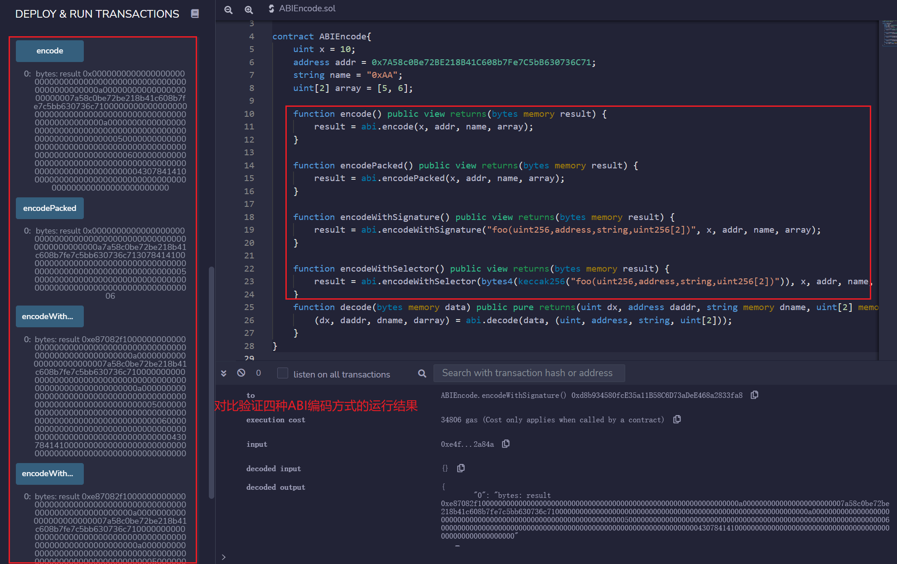
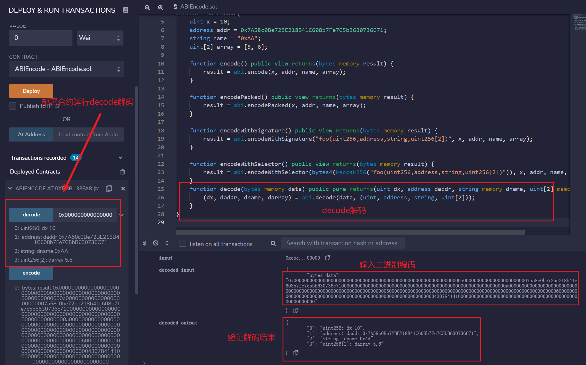
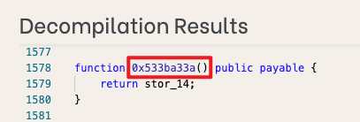
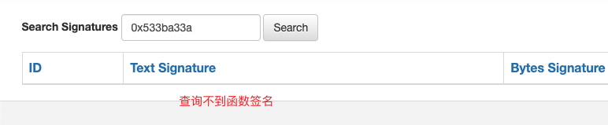
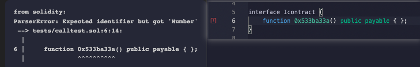

# WTF Solidity Tutorial Básico: 27. Codificação e Decodificação ABI

Recentemente, comecei a reestudar Solidity para reforçar os detalhes e também escrever um "Tutorial Básico de Solidity WTF" para iniciantes (programadores experientes podem procurar outros tutoriais), com atualizações de 1 a 3 vezes por semana.

Twitter: [@0xAA_Science](https://twitter.com/0xAA_Science)

Comunidade: [Discord](https://discord.gg/5akcruXrsk)｜[Grupo WeChat](https://docs.google.com/forms/d/e/1FAIpQLSe4KGT8Sh6sJ7hedQRuIYirOoZK_85miz3dw7vA1-YjodgJ-A/viewform?usp=sf_link)｜[Site oficial wtf.academy](https://wtf.academy)

Todo o código e tutoriais são de código aberto no GitHub: [github.com/AmazingAng/WTF-Solidity](https://github.com/AmazingAng/WTF-Solidity)

-----

`ABI` (Interface Binária de Aplicação) é o padrão para interagir com contratos inteligentes no Ethereum. Os dados são codificados com base em seus tipos; e como a codificação não inclui informações de tipo, a decodificação precisa especificar seus tipos.

Em `Solidity`, a `codificação ABI` possui 5 funções: `abi.encode`, `abi.encodePacked`, `abi.encodeWithSignature`, `abi.encodeWithSelector`, `abi.encodeCall`. E a `decodificação ABI` tem 1 função: `abi.decode`, usada para decodificar dados codificados por `abi.encode`. Nesta lição, aprenderemos como usar essas funções.

## Codificação ABI

Vamos codificar 4 variáveis, cujos tipos são `uint256` (alias uint), `address`, `string`, `uint256[2]`:

```solidity
uint x = 10;
address addr = 0x7A58c0Be72BE218B41C608b7Fe7C5bB630736C71;
string name = "0xAA";
uint[2] array = [5, 6]; 
```

### `abi.encode`

Codifica os parâmetros dados usando as [regras ABI](https://learnblockchain.cn/docs/solidity/abi-spec.html). O `ABI` é projetado para interagir com contratos inteligentes, preenchendo cada parâmetro com 32 bytes de dados e concatenando-os. Se você estiver interagindo com um contrato, você usará `abi.encode`.

```solidity
function encode() public view returns(bytes memory result) {
    result = abi.encode(x, addr, name, array);
}
```

O resultado da codificação é `0x000000000000000000000000000000000000000000000000000000000000000a0000000000000000000000007a58c0be72be218b41c608b7fe7c5bb630736c7100000000000000000000000000000000000000000000000000000000000000a00000000000000000000000000000000000000000000000000000000000000005000000000000000000000000000000000000000000000000000000000000000600000000000000000000000000000000000000000000000000000000000000043078414100000000000000000000000000000000000000000000000000000000`, porque `abi.encode` preenche cada dado com 32 bytes, resultando em muitos `0`s.

### `abi.encodePacked`

Codifica os parâmetros dados de acordo com o espaço mínimo necessário. É semelhante a `abi.encode`, mas omite muitos dos `0`s preenchidos. Por exemplo, usa apenas 1 byte para codificar o tipo `uint8`. Quando você deseja economizar espaço e não está interagindo com contratos, pode usar `abi.encodePacked`, por exemplo, para calcular o `hash` de alguns dados.

```solidity
function encodePacked() public view returns(bytes memory result) {
    result = abi.encodePacked(x, addr, name, array);
}
```

O resultado da codificação é `0x000000000000000000000000000000000000000000000000000000000000000a7a58c0be72be218b41c608b7fe7c5bb630736c713078414100000000000000000000000000000000000000000000000000000000000000050000000000000000000000000000000000000000000000000000000000000006`, porque `abi.encodePacked` comprime a codificação, tornando-a muito mais curta do que `abi.encode`.

### `abi.encodeWithSignature`

Funciona de forma semelhante a `abi.encode`, mas o primeiro parâmetro é uma `assinatura de função`, como `"foo(uint256,address,string,uint256[2])"`. Pode ser usado ao chamar outros contratos.

```solidity
function encodeWithSignature() public view returns(bytes memory result) {
    result = abi.encodeWithSignature("foo(uint256,address,string,uint256[2])", x, addr, name, array);
}
```

O resultado da codificação é `0xe87082f1000000000000000000000000000000000000000000000000000000000000000a0000000000000000000000007a58c0be72be218b41c608b7fe7c5bb630736c7100000000000000000000000000000000000000000000000000000000000000a00000000000000000000000000000000000000000000000000000000000000005000000000000000000000000000000000000000000000000000000000000000600000000000000000000000000000000000000000000000000000000000000043078414100000000000000000000000000000000000000000000000000000000`, o que é equivalente a adicionar um `seletor de função` de 4 bytes ao resultado da codificação `abi.encode`.

### `abi.encodeWithSelector`

Funciona de forma semelhante a `abi.encodeWithSignature`, mas o primeiro parâmetro é um `seletor de função`, que são os primeiros 4 bytes do hash Keccak da `assinatura da função`.

```solidity
function encodeWithSelector() public view returns(bytes memory result) {
    result = abi.encodeWithSelector(bytes4(keccak256("foo(uint256,address,string,uint256[2])")), x, addr, name, array);
}
```

O resultado da codificação é `0xe87082f1000000000000000000000000000000000000000000000000000000000000000a0000000000000000000000007a58c0be72be218b41c608b7fe7c5bb630736c7100000000000000000000000000000000000000000000000000000000000000a00000000000000000000000000000000000000000000000000000000000000005000000000000000000000000000000000000000000000000000000000000000600000000000000000000000000000000000000000000000000000000000000043078414100000000000000000000000000000000000000000000000000000000`, igual ao resultado de `abi.encodeWithSignature`.

### `abi.encodeCall`

`abi.encodeCall` recebe um ponteiro de função como primeiro parâmetro e os argumentos da função em uma tupla como segundo parâmetro. Diferentemente de escrever manualmente uma assinatura de função ou um seletor, ele verifica a assinatura e os tipos dos argumentos em tempo de compilação; por isso é mais seguro quando a função de destino é conhecida.

```solidity
function foo(uint256, address, string memory, uint256[2] memory) external pure {}

function encodeCall() public view returns(bytes memory result) {
    result = abi.encodeCall(this.foo, (x, addr, name, array));
}
```

Os dados de chamada codificados são iguais aos de `abi.encodeWithSignature("foo(uint256,address,string,uint256[2])", ...)`, mas não exigem escrever manualmente a assinatura da função.

## Decodificação ABI

### `abi.decode`

`abi.decode` é usado para decodificar a codificação binária gerada por `abi.encode`, revertendo-a para os parâmetros originais.

```solidity
function decode(bytes memory data) public pure returns(uint dx, address daddr, string memory dname, uint[2] memory darray) {
    (dx, daddr, dname, darray) = abi.decode(data, (uint, address, string, uint[2]));
}
```

Nós fornecemos a codificação binária de `abi.encode` para `decode`, que decodifica os parâmetros originais:


## Verificação no Remix

- Implante o contrato para ver o resultado da codificação do método abi.encode

    
- Compare e verifique as diferenças entre os quatro métodos de codificação

    
- Veja o resultado da decodificação do método abi.decode

    

## Cenários de Uso do ABI

1. No desenvolvimento de contratos, o ABI é frequentemente usado em conjunto com chamadas para realizar chamadas de baixo nível a contratos.

    ```solidity  
    bytes4 selector = contract.getValue.selector;

    bytes memory data = abi.encodeWithSelector(selector, _x);
    (bool success, bytes memory returnedData) = address(contract).staticcall(data);
    require(success);

    return abi.decode(returnedData, (uint256));
    ```

2. Em ethers.js, o ABI é comumente usado para importar contratos e realizar chamadas de função.

    ```solidity
    const wavePortalContract = new ethers.Contract(contractAddress, contractABI, signer);
    /*
        * Chame o método getAllWaves do seu Contrato Inteligente
        */
    const waves = await wavePortalContract.getAllWaves();
    ```

3. Para contratos não abertos ao público, após a descompilação, algumas assinaturas de função podem não ser encontradas, mas podem ser chamadas através do ABI.
   - 0x533ba33a() é uma função mostrada após a descompilação, apenas com o resultado codificado da função, e a assinatura da função não pode ser encontrada

    
    

   - Nesse caso, não é possível fazer a chamada através da construção de uma interface ou contrato
    

    Nesse caso, a chamada pode ser feita através do seletor de função ABI

    ```solidity
    bytes memory data = abi.encodeWithSelector(bytes4(0x533ba33a));

    (bool success, bytes memory returnedData) = address(contract).staticcall(data);
    require(success);

    return abi.decode(returnedData, (uint256));
    ```

## Conclusão

No Ethereum, os dados devem ser codificados em bytecode para interagir com contratos inteligentes. Nesta lição, introduzimos 4 métodos de `codificação ABI` e 1 método de `decodificação ABI`.

