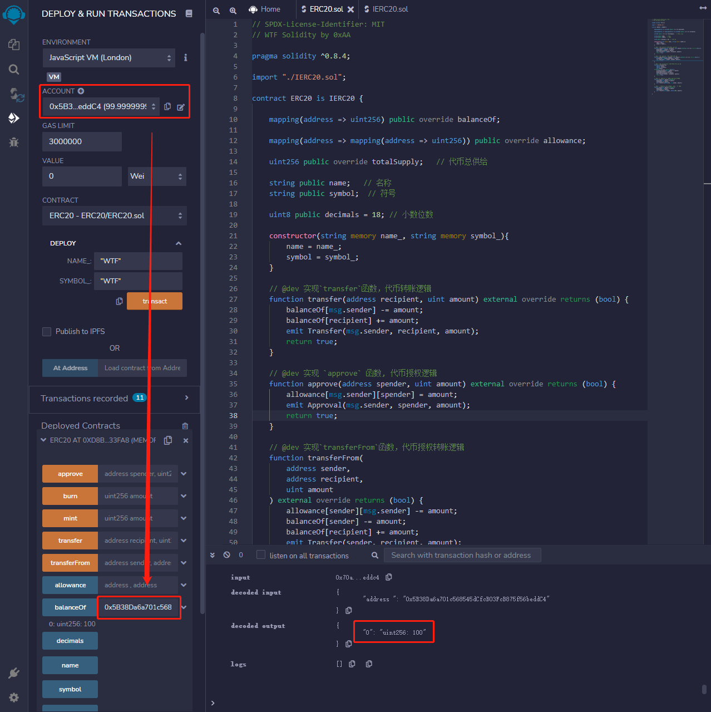

# 31. ERC20

Eu recentemente comecei a estudar novamente Solidity para consolidar conhecimentos e criar um guia "WTF Solidity para Iniciantes", para ser usado por novatos (programadores experientes podem buscar outros tutoriais), com atualizações semanais de 1 a 3 aulas.

Siga-me no Twitter: [@0xAA_Science](https://twitter.com/0xAA_Science)

Junte-se à comunidade de cientistas da WTF, onde você pode encontrar o método para se juntar ao grupo no Discord: [link](https://discord.gg/5akcruXrsk)

Todo código e tutorial estão disponíveis no meu GitHub (1024 stars para obter a certificação do curso, 2048 stars para receber o NFT do grupo): [github.com/AmazingAng/WTFSolidity](https://github.com/AmazingAng/WTF-Solidity)

---

Nesta aula, vamos apresentar o padrão de token ERC20 na Ethereum e emitir nosso próprio token de teste.

## ERC20

O `ERC20` é o padrão de token na Ethereum, criado por V em novembro de 2015, com base no [`EIP20`](https://eips.ethereum.org/EIPS/eip-20). Ele implementa a lógica básica de transferência de tokens:

- Saldo da conta
- Transferência
- Autorização de transferência
- Oferta total de tokens
- Informações do token (opcional): nome, símbolo, casas decimais

## IERC20

`IERC20` é o contrato de interface do padrão `ERC20`, que especifica as funções e eventos que um token ERC20 precisa implementar. A necessidade de definir uma interface está no fato de que, ao ter um padrão, todos os tokens ERC20 compartilham nomes de função, parâmetros de entrada e saída.

Em uma função de interface, precisamos apenas definir o nome da função, os parâmetros de entrada e saída, sem se importar com a implementação interna da função. Assim, as funções são divididas em duas partes: implementação e interface externa, que acordam sobre os dados comuns. Por isso, precisamos dos arquivos `ERC20.sol` e `IERC20.sol` para implementar um contrato.

### Eventos

`IERC20` define dois eventos: evento de `Transferência` e evento de `Autorização`, que são acionados durante transferências e autorizações de tokens.

```solidity
    /**
     * @dev Disparado quando `value` unidades de moeda são transferidas da conta (`from`) para outra (`to`).
     */
    event Transfer(address indexed from, address indexed to, uint256 value);

    /**
     * @dev Disparado quando `value` unidades de moeda são autorizadas da conta do proprietário (`owner`) para outra conta (`spender`).
     */
    event Approval(address indexed owner, address indexed spender, uint256 value);
```

### Funções

`IERC20` define seis funções, fornecendo funcionalidades básicas de transferência de tokens e permitindo que terceiros na blockchain usem tokens autorizados.

- `totalSupply()` retorna a oferta total de tokens
```solidity
    /**
     * @dev Retorna a oferta total de tokens.
     */
    function totalSupply() external view returns (uint256);
```

- `balanceOf()` retorna o saldo da conta
```solidity
    /**
     * @dev Retorna a quantidade de tokens que a conta `account` possui.
     */
    function balanceOf(address account) external view returns (uint256);
```

- `transfer()` transferência
```solidity
    /**
     * @dev Transfere `amount` unidades de token da conta do chamador para outra conta `to`.
     *
     * Se bem-sucedido, retorna `true`.
     *
     * Emite o evento {Transfer}.
     */
    function transfer(address to, uint256 amount) external returns (bool);
```

- `allowance()` retorna a quantidade autorizada
```solidity
    /**
     * @dev Retorna a quantidade de tokens que o proprietário `owner` autorizou o `spender` a usar, sendo o padrão 0.
     *
     * Isso muda quando {approve} ou {transferFrom} são chamados.
     */
    function allowance(address owner, address spender) external view returns (uint256);
```

- `approve()` autorização
```solidity
    /**
     * @dev O proprietário da conta aprova o `spender` a usar uma quantidade `amount` de tokens.
     *
     * Se bem-sucedido, retorna `true`.
     *
     * Emite o evento {Approval}.
     */
    function approve(address spender, uint256 amount) external returns (bool);
```

- `transferFrom()` transferência autorizada
```solidity
    /**
     * @dev Por meio de mecanismos de autorização, transfere `amount` unidades de token da conta `from` para a conta `to`. A parte da transferência é deduzida da autorização do chamador.
     *
     * Se bem-sucedido, retorna `true`.
     *
     * Emite o evento {Transfer}.
     */
    function transferFrom(
        address from,
        address to,
        uint256 amount
    ) external returns (bool);
```

## Implementando ERC20

Agora escreveremos um contrato `ERC20` e implementaremos simplesmente as funções definidas em `IERC20`.

### Variáveis de estado

Precisamos de variáveis de estado para registrar o saldo da conta, a quantidade autorizada e as informações do token. `balanceOf`, `allowance` e `totalSupply` são do tipo `public`, gerando automaticamente uma função `getter` com o mesmo nome, implementando assim as funções `balanceOf()`, `allowance()` e `totalSupply()` definidas em `IERC20`. `name`, `symbol` e `decimals` são os dados correspondentes ao nome do token, símbolo e casas decimais.

**Atenção**: `override` é usado para substituir a função `getter` com o mesmo nome da função herdada do contrato pai, como no caso do `balanceOf()` em `IERC20`.

```solidity
    mapping(address => uint256) public override balanceOf;

    mapping(address => mapping(address => uint256)) public override allowance;

    uint256 public override totalSupply;   // Oferta total de tokens

    string public name;   // Nome
    string public symbol;  // Símbolo
    
    uint8 public decimals = 18; // Casas decimais
```

### Funções

- Construtor: inicializa o nome e símbolo do token.
```solidity
    constructor(string memory name_, string memory symbol_){
        name = name_;
        symbol = symbol_;
    }
```

- Função `transfer()`: implementa a função `transfer` definida em `IERC20`, com a lógica de transferência de tokens. Alguns tokens podem modificar esta função para incluir lógicas como impostos, dividendos, sorteios, etc.
```solidity
    function transfer(address recipient, uint amount) external override returns (bool) {
        balanceOf[msg.sender] -= amount;
        balanceOf[recipient] += amount;
        emit Transfer(msg.sender, recipient, amount);
        return true;
    }
```

- Função `approve()`: implementa a função `approve` definida em `IERC20`, com a lógica de autorização de tokens. O `spender` autorizado pode usar a quantidade especificada de tokens do `owner`. O `spender` pode ser uma conta EOA (externally owned account) ou um contrato, como no caso de usar o `uniswap` para negociar tokens.
```solidity
    function approve(address spender, uint amount) external override returns (bool) {
        allowance[msg.sender][spender] = amount;
        emit Approval(msg.sender, spender, amount);
        return true;
    }
```

- Função `transferFrom()`: implementa a função `transferFrom` definida em `IERC20`, com a lógica de transferência autorizada. O `spender` autorizado transfere a quantidade de tokens do `sender` para o destinatário `recipient`.
```solidity
    function transferFrom(
        address sender,
        address recipient,
        uint amount
    ) external override returns (bool) {
        allowance[sender][msg.sender] -= amount;
        balanceOf[sender] -= amount;
        balanceOf[recipient] += amount;
        emit Transfer(sender, recipient, amount);
        return true;
    }
```

- Função `mint()`: função de criação de tokens, não presente no padrão `IERC20`. Aqui, qualquer pessoa pode criar uma quantidade arbitrária de tokens, mas na prática seria necessário ter um controle de permissão, onde somente o `owner` pode criar tokens.
```solidity
    function mint(uint amount) external {
        balanceOf[msg.sender] += amount;
        totalSupply += amount;
        emit Transfer(address(0), msg.sender, amount);
    }
```

- Função `burn()`: função de queima de tokens, não presente no padrão `IERC20`.
```solidity
    function burn(uint amount) external {
        balanceOf[msg.sender] -= amount;
        totalSupply -= amount;
        emit Transfer(msg.sender, address(0), amount);
    }
```

## Emissão de tokens ERC20

Com o padrão `ERC20`, a emissão de tokens na rede Ethereum se torna muito simples. Agora vamos emitir o nosso primeiro token.

Compile o contrato `ERC20` no Remix e insira os parâmetros do construtor, definindo `name_` e `symbol_` como `WTF`, e clique no botão `transact` para implantar o contrato.


Dessa forma, o token `WTF` foi criado. Agora, precisamos executar a função `mint()` para criar alguns tokens para nós mesmos. No contrato `ERC20` na seção `Deployed Contract`, na entrada da função `mint`, insira `100` e clique no botão `mint` para criar `100` tokens `WTF` para você.

Você pode clicar no botão `Debug` para ver mais detalhes nos logs da execução.

Os logs contêm quatro informações importantes:
- Evento `Transfer`
- Endereço de criação dos tokens: `0x0000000000000000000000000000000000000000`
- Endereço de recebimento: `0x5B38Da6a701c568545dCfcB03FcB875f56beddC4`
- Quantidade de tokens: `100`


Usando a função `balanceOf()`, podemos verificar nosso saldo. Insira o seu endereço atual e você verá que o saldo agora é `100`, indicando que a criação de tokens foi bem-sucedida.

As informações da conta estão na metade esquerda da imagem, e os detalhes da execução da função estão marcados à direita.



## Conclusão

Nesta aula, aprendemos sobre o padrão ERC20 na Ethereum e como implementá-lo, além de termos emitido nosso próprio token de teste. O padrão ERC20, proposto no final de 2015, reduziu significativamente a barreira de entrada para a emissão de tokens na Ethereum e deu início à grande era dos ICOs. Ao investir em tokens, é fundamental examinar atentamente o contrato do token para evitar problemas e aumentar a chance de sucesso nos investimentos.

<!-- This file was translated using AI by repo_ai_translate. For more information, visit https://github.com/marcelojsilva/repo_ai_translate -->