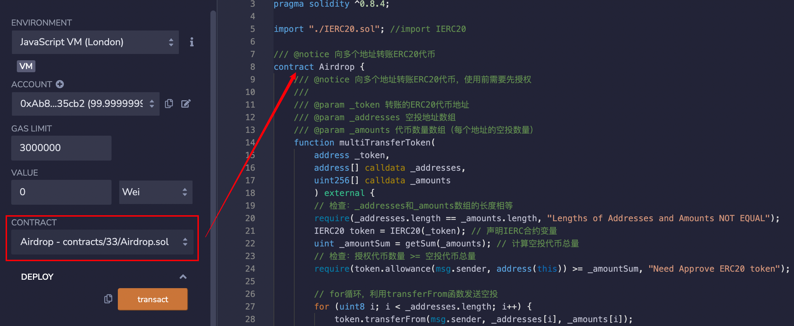
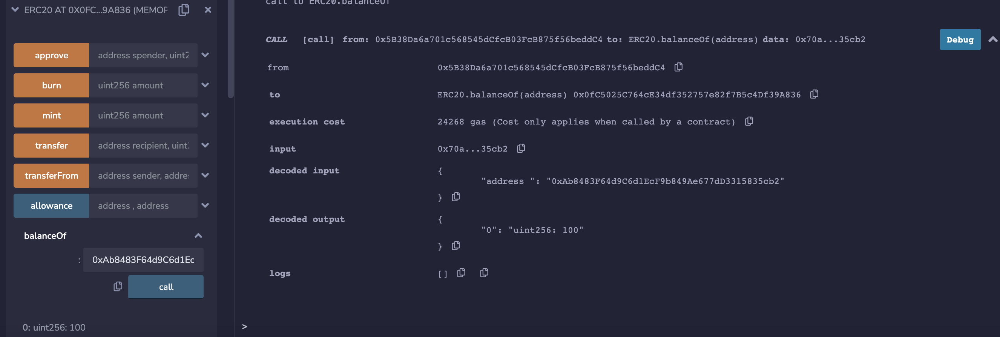

# 33. Contrato de Airdrop

Eu recentemente tenho revisado e aprendido Solidity novamente, reforçando os detalhes e escrevendo um "Guia de Iniciação Rápida ao Solidity" para iniciantes (programadores experientes podem procurar outros tutoriais), com atualizações semanais de 1 a 3 aulas.

Siga-me no Twitter: [@0xAA_Science](https://twitter.com/0xAA_Science)

Junte-se à comunidade de Cientistas do WTF, com métodos para ingressar no grupo do WhatsApp: [Link](https://discord.gg/5akcruXrsk)

Todo o código e tutorial estão disponíveis no Github (Certificação do curso com 1024 estrelas, Comunidade NFT com 2048 estrelas): [github.com/AmazingAng/WTFSolidity](https://github.com/AmazingAng/WTF-Solidity)

---

No mundo das criptomoedas, uma das coisas mais emocionantes é receber um airdrop, uma espécie de "presente" surpresa. Nesta aula, aprenderemos como usar um contrato inteligente para enviar airdrops de tokens ERC20.

## Airdrop

O airdrop é uma estratégia de marketing comum no mundo cripto, onde o projeto distribui tokens gratuitamente para um grupo específico de usuários. Para se qualificar para um airdrop, os usuários geralmente precisam concluir algumas tarefas simples, como testar um produto, compartilhar notícias ou indicar amigos. As empresas podem conseguir usuários engajados com os airdrops, enquanto os usuários recebem uma recompensa. Uma situação vantajosa para ambos os lados.

Como seria inviável para o projeto transferir tokens individualmente para cada usuário que recebe um airdrop, utilizar um contrato inteligente para realizar a distribuição em massa pode aumentar significativamente a eficiência dos airdrops.

### Contrato de Airdrop

A lógica por trás de um contrato de airdrop é bastante simples: através de um loop, é possível enviar tokens ERC20 para múltiplos endereços em uma única transação. O contrato inclui duas funções:

- Função `getSum()`: Retorna a soma de um array de números uint.

```solidity
// Função para calcular a soma de um array
function getSum(uint256[] calldata _arr) public pure returns(uint sum) {
    for(uint i = 0; i < _arr.length; i++)
        sum = sum + _arr[i];
}
```

- Função `multiTransferToken()`: Envia airdrops de tokens ERC20 e possui 3 parâmetros:

  - `_token`: Endereço do contrato do token (tipo `address`)
  - `_addresses`: Array de endereços dos destinatários dos airdrops (`address[]`)
  - `_amounts`: Array com as quantidades dos airdrops para cada endereço (`uint[]`)

  Esta função possui duas verificações: a primeira `require` verifica se os arrays `_addresses` e `_amounts` têm o mesmo comprimento; a segunda `require` verifica se a quantidade de tokens a serem distribuídos é menor ou igual à autorização concedida ao contrato de airdrop.

  ```solidity
  /// @notice Transfere tokens ERC20 para vários endereços, requer autorização prévia
  ///
  /// @param _token Endereço do token ERC20
  /// @param _addresses Array de endereços
  /// @param _amounts Array de quantidades de tokens (para cada endereço)
  function multiTransferToken(
      address _token,
      address[] calldata _addresses,
      uint256[] calldata _amounts
      ) external {
      require(_addresses.length == _amounts.length, "Comprimentos de Endereços e Quantidades Diferentes");
      IERC20 token = IERC20(_token);
      uint _amountSum = getSum(_amounts);
      require(token.allowance(msg.sender, address(this)) >= _amountSum, "Precisa Autorizar o Token ERC20");

      for (uint8 i; i < _addresses.length; i++) {
          token.transferFrom(msg.sender, _addresses[i], _amounts[i]);
      }
  }
  ```

- Função `multiTransferETH()`: Envia airdrops de ETH e possui 2 parâmetros:

  - `_addresses`: Array de endereços dos destinatários dos airdrops (`address[]`)
  - `_amounts`: Array com as quantidades dos airdrops para cada endereço (`uint[]`)

  ```solidity
  /// Transfere ETH para vários endereços
  function multiTransferETH(
      address payable[] calldata _addresses,
      uint256[] calldata _amounts
  ) public payable {
      require(_addresses.length == _amounts.length, "Comprimentos de Endereços e Quantidades Diferentes");
      uint _amountSum = getSum(_amounts);
      require(msg.value == _amountSum, "Erro no valor transferido");

      for (uint256 i = 0; i < _addresses.length; i++) {
          (bool success, ) = _addresses[i].call{value: _amounts[i]}("");
          if (!success) {
              failTransferList[_addresses[i]] = _amounts[i];
          }
      }
  }
  ```

### Prática do Airdrop

1. Deploy de um contrato de token ERC20 e mint de 10000 unidades de token.


2. Deploy do contrato de airdrop.



3. Usar a função `approve()` do contrato ERC20 para autorizar o contrato de airdrop a transferir 10000 unidades do token.


4. Executar a função `multiTransferToken()` do contrato de airdrop para realizar o airdrop. Preencha os parâmetros `_token`, `_addresses` e `_amounts` como indicado abaixo:

```
// Preencher _addresses
["0xAb8483F64d9C6d1EcF9b849Ae677dD3315835cb2", "0x5B38Da6a701c568545dCfcB03FcB875f56beddC4"]

// Preencher _amounts
[100, 200]
```


5. Usar a função `balanceOf()` do contrato ERC20 para verificar o saldo dos usuários que receberam o airdrop. Os saldos deverão ser atualizados para `100` e `200`, indicando o sucesso do airdrop.



## Conclusão

Nesta aula, aprendemos como criar um contrato de airdrop de tokens ERC20 usando Solidity, aumentando significativamente a eficiência na distribuição de airdrops. Qual foi o maior airdrop que você já recebeu?

